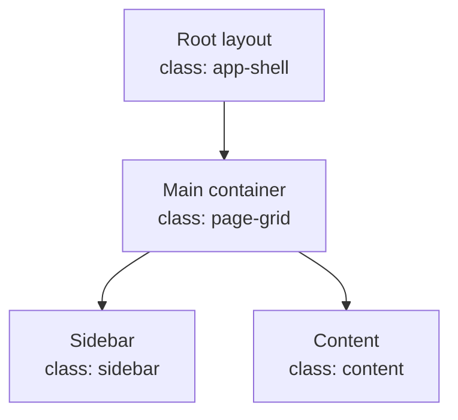

# FractalAgentic Flow Mapper

Produce a pure, evidence-based representation of the requested application's structure and architecture.

## Objective

When the user points to a component, page, layout, route, feature, or entire app:

1. Trace the complete container hierarchy and layout flow.
2. Identify parent containers, child containers, siblings, slots, wrappers, and repeated structures.
3. Trace the relevant data, state, props, events, navigation, and responsive branches that affect the structure.
4. Report the findings as a Mermaid diagram.
5. Deliver a beautiful interactive HTML-on-canvas representation with draggable nodes.

Do not redesign the UI. Do not invent missing relationships. Do not treat a CSS class as a semantic container unless the code establishes that role.

## Scope discovery

Start by determining the target scope:

- Component: inspect the component and its direct parents, consumers, slots/snippets, styles, and state.
- Page/route: inspect the route file, layout chain, page data/load, child components, styles, and route-specific states.
- Layout: inspect the layout hierarchy, navigation shell, slot/snippet flow, responsive variants, and shared providers.
- App: inspect routing, root layouts, major feature shells, shared components, state/data boundaries, server/client boundaries, and deployment/runtime entry points.

For Svelte/SvelteKit projects, inspect as applicable:

- `+layout.svelte`, `+layout.ts`, `+layout.server.ts`
- `+page.svelte`, `+page.ts`, `+page.server.ts`
- `+server.ts`, `hooks.server.ts`, `hooks.client.ts`
- `$lib` components, stores, runes state, context, snippets, slots, actions, and styles
- route groups, dynamic segments, error/loading pages, and form actions

For other stacks, follow the equivalent routing, layout, component, state, and data files.

## Required analysis

Create a structure inventory with:

- node ID
- human label
- file path and line range
- node kind: route, layout, container, component, slot, state boundary, data boundary, or external dependency
- CSS class names or styling selectors actually applied to the container
- parent and child relationships
- sibling relationships when relevant
- rendered condition/state
- responsive behavior
- data/props/events crossing the boundary
- confidence: observed, inferred, or unresolved

Always cite codebase locations with clickable file links in the user-facing report.

## Container tracing rules

Trace from the outside inward:

1. Application/root shell.
2. Route/layout hierarchy.
3. Major visual regions.
4. Nested layout containers.
5. Component containers.
6. Content and control elements.
7. State, data, and interaction boundaries.

For every container, record:

- semantic role
- DOM element or framework component
- class attribute or styling source
- layout behavior: flex, grid, block, absolute, sticky, fixed, overflow, or unknown
- width/height constraints
- spacing: margin, padding, gap
- visual treatment: background, border, radius, shadow
- responsive changes
- visibility conditions

Do not collapse multiple nesting levels into one node when the distinction affects layout flow.

## State and flow analysis

Represent relevant states and transitions, including:

- loading, error, empty, populated
- open/closed, expanded/collapsed
- active/inactive/selected
- hover/focus/pressed when implemented behaviorally
- mobile/tablet/desktop branches
- authenticated/unauthenticated branches
- server/client rendering boundaries
- data loading and mutation paths

Use separate nodes or annotations for state boundaries when they change layout or rendered children.

## Deliverable location

Save all flow-mapper deliverables — the HTML canvas and the Mermaid `.md` document — in the `vendors/` folder inside the monorepo root (`<repo-root>/vendors/`), one subfolder per mapped target, e.g. `vendors/flow-maps/<target-slug>/fa-flow-map.html`. If the `vendors/` folder does not exist at the monorepo root, create it first. Never write flow-mapper artifacts into the target app's source tree.

## Mermaid deliverable

Return a Mermaid diagram that represents both containment and important flow, and persist it as a markdown document `fa-flow-map.md` in the `vendors/flow-maps/<target-slug>/` folder (per the Deliverable location section). The `.md` file wraps the diagram in a fenced ` ```mermaid ` block (renders natively in Obsidian, GitHub, VS Code, mermaid.live) and includes a short header: title, mapping date, scope, and an edge-key line (solid = containment, dashed = data/state/event).

Use:

- `flowchart TD` for hierarchy and rendering flow.
- `subgraph` for major regions or layouts.
- Solid arrows for parent-child containment.
- Dashed arrows for data, state, event, or navigation flow.
- Node labels containing the human label and primary CSS class, for example:



The Mermaid diagram must be readable, deterministic, and consistent with the HTML canvas node set.

## Interactive HTML-on-canvas deliverable

Create a self-contained HTML artifact named `fa-flow-map.html` unless the user specifies another path. Save it in the `vendors/flow-maps/<target-slug>/` folder (per the Deliverable location section).

The artifact must:

- Render a styled canvas/workspace with a clear title and legend.
- Represent every major analyzed container as a draggable node.
- Label each node with:
  - human-readable name
  - node kind
  - file path
  - relevant CSS class or selector
- Draw containment edges and distinguish data/state/event edges visually.
- Support pointer dragging without external dependencies.
- Support pan and zoom, or at minimum smooth dragging across a large workspace.
- Include a reset-layout control.
- Include a search/filter control for node labels and classes.
- Use accessible controls and visible focus states.
- Include a small evidence panel that shows the selected node's file and line reference.
- Avoid fake placeholder nodes. If a relationship is uncertain, mark it as unresolved rather than inventing it.
- Keep the artifact usable offline.

Use SVG or positioned HTML nodes with an SVG edge layer. Prefer SVG for edges and HTML/SVG foreign objects only when necessary. Use deterministic initial positions so repeated runs are comparable.

The HTML should include a machine-readable data block with the analyzed nodes and edges, for example:

```html
<script type="application/json" id="fa-flow-data">
{
  "nodes": [],
  "edges": [],
  "evidence": []
}
</script>
```

## Verification

Before reporting completion:

1. Re-read the analyzed files and confirm all major container nodes have evidence.
2. Check every Mermaid node has a corresponding canvas node.
3. Check every containment edge is represented in both outputs.
4. Open the generated HTML in a browser or use the available browser-testing tool.
5. Drag at least two nodes and verify their positions change.
6. Test search/filter and reset-layout.
7. Check browser console/runtime errors.
8. Confirm that paths and line references resolve.

Do not claim the interactive canvas works based only on file creation or static inspection. If browser verification is unavailable, state that explicitly and provide the exact manual verification steps.

## Output format

Return:

1. Scope and assumptions.
2. Structural report with clickable file references.
3. Mermaid diagram.
4. Path to `fa-flow-map.html` and `fa-flow-map.md` (under `vendors/flow-maps/<target-slug>/`).
5. Verification evidence, including browser interaction results.
6. Unresolved relationships and confidence notes.

Keep the report structural and evidence-based. Do not propose visual redesigns unless the user separately asks for design recommendations.

All deliverables are saved under `vendors/` inside the monorepo root; if `vendors/` does not exist there, create it.
