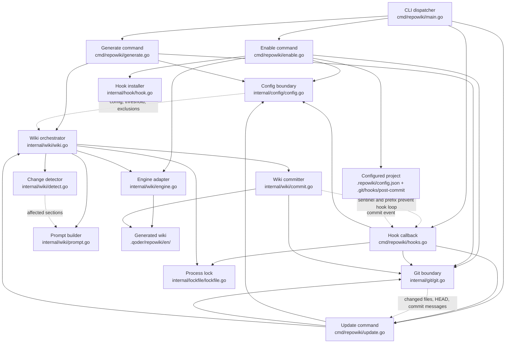

# repowiki-main structure map

- Mapping date: 2026-08-05
- Scope: CLI, project enablement, post-commit update, AI engine execution, wiki persistence
- Edge key: solid = containment/control flow; dashed = data/state/event flow

## Evidence

- [README.md](file:///Users/amrit/mandala/repowiki-main/README.md)
- [CLAUDE.md](file:///Users/amrit/mandala/repowiki-main/CLAUDE.md)
- [main.go](file:///Users/amrit/mandala/repowiki-main/cmd/repowiki/main.go#L10-L39)
- [enable.go](file:///Users/amrit/mandala/repowiki-main/cmd/repowiki/enable.go#L25-L112)
- [update.go](file:///Users/amrit/mandala/repowiki-main/cmd/repowiki/update.go#L87-L120)
- [hooks.go](file:///Users/amrit/mandala/repowiki-main/cmd/repowiki/hooks.go#L16-L60)
- [wiki.go](file:///Users/amrit/mandala/repowiki-main/internal/wiki/wiki.go#L13-L77)
- [detect.go](file:///Users/amrit/mandala/repowiki-main/internal/wiki/detect.go#L22-L49)
- [engine.go](file:///Users/amrit/mandala/repowiki-main/internal/wiki/engine.go#L14-L39)
- [commit.go](file:///Users/amrit/mandala/repowiki-main/internal/wiki/commit.go#L25-L59)
