# Fracta — UI Flow Map

Mapped with `flow-mapper` on 2026-08-04. Scope: full `apps/fracta` SvelteKit 5 app (SPA in a Tauri 2 shell) — live app route (`+page.svelte`), the workspace shell, and the standalone `design/+page.svelte` prototype. Solid arrows = containment; dashed arrows = data/state/event flow.

```mermaid
flowchart TD
  ROOT["Root layout<br/>+layout.svelte:24"]
  HOME["Home route shell<br/>.fracta-app — +page.svelte:51"]
  GL["Loading gate<br/>.gate — :53"]
  GS["Vault setup gate<br/>.gate — :55"]
  SHELL["Workspace shell<br/>.actual-area--workspace — :61"]
  HDR["App header + nav<br/>.appheader > .app-nav"]
  RUL["Rules modal<br/>RulesPanel — :67"]
  SET["Settings modal<br/>AppSettings — :68"]
  AGT["Agent modal<br/>AgentSettings — :69"]
  WS["Workspace<br/>.workspace — Workspace.svelte:616"]
  NAV["Navigator<br/>.workspace__nav — :617"]
  NH["Nav head<br/>.workspace__navhead — :618"]
  RES["Search results<br/>.workspace__results — :636"]
  TREE["File tree<br/>.workspace__tree — :638"]
  CAN["Canvas column<br/>.workspace__canvas — :660"]
  WH["Doc header/actions<br/>.workspace__header — :668"]
  WL["Backlinks strip<br/>.workspace__links — :705"]
  WD["Read-only preview<br/>.workspace__document — :713"]
  WG["CSV grid<br/>.workspace__gridwrap — :748"]
  WJ["JSON tree<br/>JsonTreeEditor — :751"]
  WP["Print preview<br/>.workspace__print-preview — :754"]
  WR["Richtext editor<br/>WorkspaceMarkdownEditor — :756"]
  WSO["Text/JSON source<br/>.workspace__source — :757"]
  WB["Empty state<br/>.workspace__blank — :769"]
  WASK["Ask panel<br/>.workspace__ask > AskPanel — :772"]
  WTERM["Terminal sheet<br/>.workspace-terminal — :773"]
  WINSP["Inspector<br/>.workspace__inspector — :776"]
  WGR["Vault graph<br/>KnowledgeGraph — :785"]
  UI["UI state<br/>ui.svelte.ts"]
  EN["Entries store<br/>entries.svelte.ts"]
  WST["Workspace store<br/>workspace.svelte.ts"]
  PREFS["Prefs store<br/>prefs.svelte.ts"]
  IPC["Tauri IPC<br/>lib/ipc.ts"]
  DEZ["Design prototype<br/>.design-workbench — design/+page.svelte:302"]
  DTB["Topbar<br/>WorkbenchTopbar — :305"]
  DBD["Body<br/>.workbench-body — :308"]
  DN["Navigator pane<br/>.prototype-navigator — :321"]
  DL["Ledger<br/>.prototype-ledger — :427"]
  DC["Canvas<br/>.prototype-canvas — :465"]
  DBAR["Canvas bar<br/>.canvas-bar — :466"]
  DV["Mode views<br/>prototype-* — :512"]
  DI["Inspector pane<br/>.prototype-inspector — :728"]
  DA["Ask pane<br/>.prototype-ask-pane — :869"]
  DS["Status footer<br/>.workbench-status — :960"]
  DSS["Settings dialog<br/>.prototype-settings — :979"]

  ROOT --> HOME
  HOME --> GL & GS & SHELL
  SHELL --> HDR & WS
  HOME --> RUL & SET & AGT
  WS --> NAV & CAN & WINSP & WASK & WTERM
  NAV --> NH & RES & TREE
  CAN --> WH & WL & WD & WG & WJ & WP & WR & WSO & WB
  WINSP --> WGR
  DEZ --> DTB & DBD & DS & DSS
  DBD --> DN & DL & DC & DI & DA
  DC --> DBAR & DV

  ROOT -. theme .-> PREFS
  ROOT -. isMobile .-> UI
  HOME -. init/chooseVault .-> EN
  HOME -. setMode/Esc .-> UI
  HDR -. toggle .-> UI
  WS -. reads/writes .-> WST
  WST -. commands .-> IPC
  EN -. commands .-> IPC
```

Interactive canvas: `fa-flow-map.html` in this folder.
