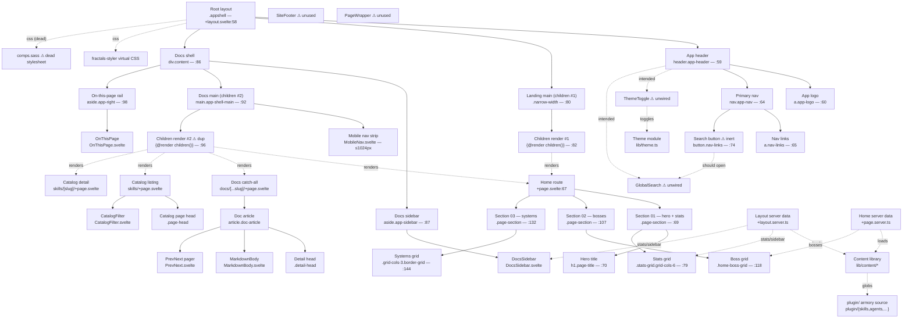

# fractal-agentic explorer — Site Flow Map

Mapped with `flow-mapper` on 2026-08-04. Scope: complete `packages/fractal-agentic/site` explorer (SvelteKit 5, prerender) rendering the plugin armory (skills/agents/commands/bosses/docs). Solid arrows = containment; dashed arrows = data/state/event flow. ⚠ marks evidence-based anomalies (duplicate children render, unwired search/theme).

Interactive canvas: `fa-flow-map.html` in this folder.
