# fractalagentic (docs site) — UI Flow Map

Mapped with `flow-mapper` on 2026-08-04. Scope: complete `sites/fractalagentic` Svocs docs template (SvelteKit 5, static adapter, mdsvex content) — root layout, shared header, docs layout (sidebar + content + TOC rail), home page, doc pages, data boundaries. Solid arrows = containment; dashed arrows = data/state/event flow.

```mermaid
flowchart TD
  ROOT["Root layout<br/>.app-shell — +layout.svelte:47"]
  HDR["Site header<br/>header sticky — :48"]
  BRAND["Brand lockup<br/>a.brand — :50"]
  ACT["Header actions<br/>.actions — :55"]
  SBX["Search trigger<br/>.search-trigger — SearchBox.svelte"]
  THEME["Theme toggle<br/>ThemeToggle.svelte"]
  REPO["GitHub repo button<br/>a.repo — :60"]
  SDL["Search dialog<br/>dialog.search-dialog"]
  FOOT["Site footer<br/>footer > .footer-wrap — :85"]
  DIS["Theme-switch dissolve<br/>#svocs-dissolve — :93"]
  HOME["Home route<br/>+page.svelte:47"]
  HERO["Hero section<br/>.hero — :47"]
  S1["Section 01 — stats<br/>.stats-grid — :57"]
  S2["Section 02 — bosses<br/>.home-boss-grid — :94"]
  S3["Section 03 — continuity<br/>.border-grid — :106"]
  ERR["Error page<br/>.error-page — +error.svelte"]
  DL["Docs layout<br/>.docs-layout — docs/+layout.svelte:88"]
  MT["Mobile menu toggle<br/>.mobile-toggle — :90"]
  SB["Sidebar column<br/>aside sticky — :98"]
  SN["Sidebar scroll nav<br/>nav — :99"]
  ST["Sidebar tree<br/>SidebarTree.svelte"]
  SI["Sidebar item<br/>SidebarItem.svelte"]
  RT["Collapse rail toggle<br/>.rail-toggle — :103"]
  DC["Content column<br/>.doc-col — :130"]
  BC["Breadcrumbs<br/>.breadcrumbs — :132"]
  PR["Prose container<br/>.prose — :150"]
  PG["Prev / next pager<br/>.pager — :155"]
  TR["TOC rail<br/>.toc-rail — :174"]
  TOC["TOC component<br/>Toc.svelte"]
  DI2["/docs landing<br/>docs/+page.svelte"]
  DS2["Catch-all doc page<br/>docs/[...slug]/+page.svelte"]
  RAW["Raw markdown endpoint<br/>[...slug].md/+server.ts"]
  DA["Doc article<br/>article — :9"]
  PA["Page actions<br/>PageActions.svelte"]
  PI["Page icon<br/>PageIcon.svelte"]
  CFG["Site config<br/>lib/site.ts"]
  PM["Docs page-map<br/>core/page-map.ts"]
  CL["Content loader<br/>core/content.ts"]
  SCH["Search resolver<br/>search/resolver.ts"]
  BLD["mdsvex / build pipeline<br/>vite.config.ts"]
  SRV["Static endpoints<br/>llms.txt · sitemap · index"]

  ROOT --> HDR & SDL & HOME & FOOT & ERR & DL & DIS
  HDR --> BRAND & ACT
  ACT --> SBX & THEME & REPO
  SBX -. opens .-> SDL
  HOME --> HERO & S1 & S2 & S3
  DL --> MT & SB & DC & TR
  SB --> SN & RT
  SN --> ST
  ST --> SI
  DC --> BC & PR & PG
  TR --> TOC
  DI2 --> DA
  DS2 --> DA
  DA --> PA & PI

  ROOT -. reads .-> CFG
  HDR -. reads .-> CFG
  SDL -. queries .-> SCH
  DL -. pageMap .-> PM
  DL -. load .-> CL
  DI2 -. load .-> CL
  DS2 -. load .-> CL
  DS2 -. raw .-> RAW
  PM -. builds from .-> CL
  CL -. rendered from .-> BLD
  SCH -. indexed by .-> BLD
  SCH -. endpoints .-> SRV
  CFG -. editHref .-> PA
  THEME -. filter .-> DIS
```

Interactive canvas: `fa-flow-map.html` in this folder.
