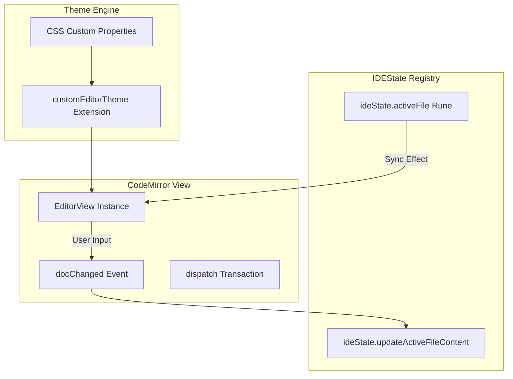

> **Historical superpowers specification — kept as reference.**

# CodeMirror Editor Integration & Dynamic Themes Spec

This document details the specifications, design decisions, and execution walkthrough of the CodeMirror 6 editor engine integration in **FractalEngine Studio**.

---

## 1. Technical Architecture & Runes Lifecycle



### 1.1. Reactive Cursor Preservation
To avoid cursor jumps or selection resets when typing (which triggers global state updates), we check if the document content is different before dispatching a Svelte-driven document replacement transaction:
```typescript
const currentDoc = editorView.state.doc.toString();
if (currentDoc !== activeFile.content) {
    editorView.dispatch({
        changes: { from: 0, to: currentDoc.length, insert: activeFile.content },
        effects: languageCompartment.reconfigure(getLanguageExtension(activeFile.name))
    });
}
```

---

## 2. Dynamic Token-Based Highlighting

Instead of hardcoding theme color values inside CodeMirror's Javascript files, we bind all syntax highlighting tags directly to **Fractals design token CSS variables**:
- **Editor Background**: `var(--background10)`
- **Line Numbers Gutter**: `var(--background20)` with border `var(--border-primary)` and text `var(--text-tertiary)`
- **Active Line**: `var(--background40)`
- **Selection Highlight**: `var(--background50)`
- **Keywords**: `var(--theme-color)` (bold)
- **Strings / Numbers**: `var(--theme-color-alt)`
- **Comments**: `var(--text-tertiary)` (italic)

When the user modifies the visual template theme in the footer, Svelte re-resolves the CSS variables on the document element, causing CodeMirror to instantly repaint with matching highlights.

---

## 3. Verification Walkthrough

### 3.1. Language Parsing
1. Open a TypeScript file (`.ts`). Verify keywords (`const`, `import`), classes, functions, strings, and operators are colorized correctly.
2. Open a SASS file (`.sass`). Verify class names, parameters, and indents highlight properly.
3. Open a Markdown file (`.md`). Verify titles, lists, and code blocks highlight.

### 3.2. Saving & Tab Swapping
1. Modify a file. Verify that:
   - The unsaved dot appears on the tab.
   - Pressing `Cmd+S` (or `Ctrl+S`) saves the file, updates the sidebar, and clears the unsaved dot.
2. Switch tabs. Verify the editor view successfully destroys, rebuilds with the new file contents, and loads the corresponding language parser.
