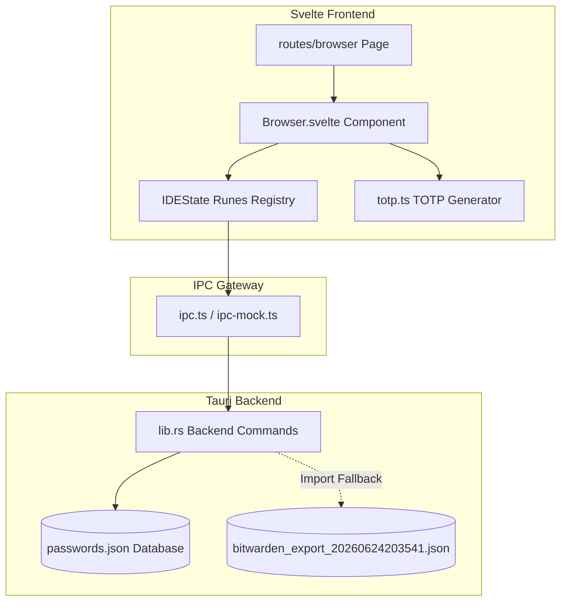

> **Historical superpowers specification — kept as reference.**

# In-App Browser, Password Vault & TOTP Keypass Spec

This document details the specifications, architecture, and manual verification walkthrough of the in-app browser panel, integrated Bitwarden-style password vault database, and TOTP dynamic keypass generator.

---

## 1. System Architecture

---

## 2. Component Specifications

### 2.1. In-App Browser Viewport
- **Panel Container**: Situates next to the main editor and right sidebar in a collapsible column.
- **Draggable Header**: Configured with `data-tauri-drag-region`. Includes custom double-click bindings:
  - Double-clicking the standalone window title bar toggles maximization state.
- **Navigation Row**: Back, Forward, Reload, address bar input, password manager popover trigger, "Open in new window", and "Open in system OS browser".
- **Dynamic Iframe**: Loads the active website URL with active loading/fallback banners.

### 2.2. Password Vault Popup Database
- **Automatic Setup**: On first execution, the Tauri backend scans for `passwords.json` in the root of the workspace. If not found, it parses `vendor/bitwarden_export_20260624203541.json`, imports all logins, folders, and settings, and persists it as `passwords.json`.
- **Popover Sections**:
  - **Matching**: Automatically extracts the domain from the current website and lists corresponding vault credentials. Clicking an entry expands it to expose username (copyable), password (toggled eye, copyable), and TOTP 2FA keypass.
  - **All Logins**: Full database list with search filters.
  - **Add/Edit Form**: Create or modify login names, website URLs, usernames, passwords, and TOTP secret seeds.
  - **CRUD Operations**: Handled via class action triggers updating state and executing atomic writes to the JSON file.

### 2.3. TOTP Keypass Generator
- **Base32 & HMAC-SHA1**: Custom encoder/decoder in `totp.ts` calculates standard RFC 6238 6-digit codes.
- **Dynamic Recalculations**: An interval runs once a second to update code outputs and display remaining cycle seconds (0–30s progress ring).

---

## 3. Walkthrough Verification

### 3.1. Database Verification
1. Ensure the exported file is present at `vendor/bitwarden_export_20260624203541.json`.
2. Launch the application. Verify that a new file `passwords.json` is created in the project root directory containing the parsed login items.

### 3.2. Browser & Password Vault Check
1. Open the browser panel using the lock/globe icon in the header toolbar.
2. Enter `https://3.basecamp.com/5450358/welcome/loading` in the address input field and press `Enter`.
3. Verify that the shield button displays a matching count badge.
4. Click the shield button. Confirm `amrit.pandey@brhat.in` appears under "Matching".
5. Click the matching login to expand it. Verify copy buttons and the "Fill" action behave correctly.
6. Open the "All Vault" tab, search for `live`, and click `account.live.com`. Verify the 2FA dynamic keypass generates a 6-digit code changing every 30 seconds.
