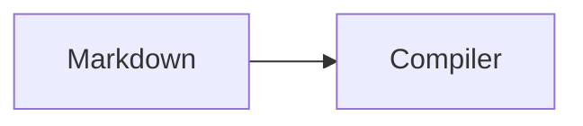

# docs-kit

The installable pnpm workspace for the SvelteKit documentation framework.

## Prerequisites

- Node.js 22.13.0 or later
- pnpm 11.0.4 or later

## Setup

```sh
pnpm install
```

## Workspace layout

- `packages/core` — framework-neutral content discovery, page metadata, navigation, manifest, routing, source, and config contracts
- `packages/mdsvex` — the Markdown pipeline: directives, heading anchors, and Shiki code rendering
- `packages/components` — Svelte 5 content components (Callout, Tabs, Steps, Cards, Columns, Frame, Diff, ImageZoom, Mermaid, …)
- `packages/theme-default` — the default documentation theme and layout primitives
- `packages/search` — the search-provider contract with FlexSearch, Orama, and Pagefind adapters
- `packages/seo` — sitemap, robots, and JSON-LD generation
- `packages/og` — Open Graph card generation with incremental caching
- `packages/vite` — Vite discovery, virtual manifests, and development refreshes
- `packages/sources` — local, remote, GitHub, GitHub Releases, Notion, and Sanity content sources
- `packages/export` — printable documents, EPUB packaging, and export link rewriting
- `packages/ai` — document chunking, retrieval, and the Ask AI provider contract
- `packages/mcp` — an MCP server over the same documents the website renders
- `packages/migration` — migrators from eight documentation frameworks
- `packages/registry` — the component/integration registry behind `docs add`
- `packages/create` — the standalone application generator
- `packages/cli` — the `docs` command (`sync`, `migrate`, `add`, `create`, `dev`)
- `apps/playground-basic` — a host SvelteKit app proving `/docs/[...slug]` coexists with `/`
- `apps/playground-i18n` — a versioned, multilingual host app proving dimension routing and switchers
- `apps/playground-standalone` — generated by `packages/create`, proving standalone mode builds statically

## Commands

```sh
pnpm run build
pnpm run check
pnpm run test
pnpm run clean
```

Each command is delegated to Turborepo across the current packages and playground.
For an individual package or app, run its script through a workspace filter:

```sh
pnpm --filter @docs-kit/core run test
pnpm --filter @docs-kit/vite run test
pnpm --filter @docs-kit/playground-basic run check
pnpm --filter @docs-kit/playground-basic run dev
```

## Phase 11 dimensions

The core package now supports versioned and multilingual manifests without coupling
the compiler to a UI. Configure the Vite plugin with version sources and locale roots:

```ts
docs({
	content: 'src/lib/docs',
	basePath: '/docs',
	versions: {
		current: 'v2',
		versions: [
			{ id: 'v2', label: 'Latest', source: 'src/lib/docs-v2' },
			{ id: 'v1', label: 'Version 1', source: 'src/lib/docs-v1' }
		]
	},
	i18n: {
		defaultLocale: 'en',
		locales: ['en', 'de']
	}
});
```

Version and locale folders are resolved below each configured source (`en/`, `de/`,
and so on). The core exports route generation/parsing, equivalent-page resolution,
switcher data, translation diagnostics, and canonical/alternate metadata helpers.

Pass the manifest to `DocsPage` and the header renders the switchers itself:

```svelte
<DocsPage data={{ page, navigation, site, basePath: '/docs' }} manifest={data.manifest}>
	<Content />
</DocsPage>
```

Each switcher points at the *same page* in the destination dimension whenever it exists.
When it does not, the entry is marked and links to the closest real page — the destination
version's index, or the default-locale page — rather than a dead URL. A dimension with no
reachable page at all is disabled. Both controls disappear when documentation has a single
version or locale, so an ordinary site never sees them.

`apps/playground-i18n` proves this end to end: `/docs`, `/docs/de`, `/docs/v1`, and
`/docs/v1/de` all prerender, the sitemap carries `hreflang` alternates with `x-default`,
and switching from `/docs/de/getting-started` to Version 1 lands on the German v1 index.

## Content model

Discovery reads each document, so the manifest carries everything the UI needs — no second
pass over the filesystem:

```ts
const page = findManifestPage(manifest, 'guides/deployment');
page.title;        // frontmatter title, first H1, or the slug
page.headings;     // table-of-contents entries with stable anchors
page.next;         // pagination, from the flattened navigation order
getDocsNavigation(manifest, { locale: 'de' }); // one tree per version/locale
```

Folder metadata is `meta.json` beside the documents it orders — JSON rather than a module,
so the compiler never executes code from a content directory:

```json
{ "label": "Guides", "order": ["deployment", "styling"], "collapsed": false }
```

Frontmatter understands `title`, `description`, `label`, `icon`, `badge`, `order`,
`hidden`, and `draft`; unknown keys are preserved for the host to read.

## Markdown pipeline

`svelte.config.js` wires two pieces — a preprocessor that runs before mdsvex, and the
mdsvex options:

```js
import { docsMarkdown, docsMdsvex } from '@docs-kit/mdsvex';

const docsPipeline = docsMdsvex();

export default {
	extensions: ['.svelte', '.md', '.svx'],
	preprocess: [
		vitePreprocess(),
		docsMarkdown(),
		mdsvex({
			extensions: ['.md', '.svx'],
			remarkPlugins: docsPipeline.remarkPlugins,
			rehypePlugins: docsPipeline.rehypePlugins,
			highlight: docsPipeline.highlight
		})
	]
};
```

`docsMarkdown()` rewrites the directive grammar into components and imports exactly the
components a document uses. It is fence-aware, so directive-looking text inside a code
block is never touched, and unknown or unterminated directives are left as written.

````md
:::warning{title="Plugin order"}
The documentation plugin must come before `sveltekit()`.
:::

:::tabs

@tab pnpm

```bash
pnpm add @docs-kit/core
```

@tab npm

```bash
npm install @docs-kit/core
```

:::
````

### Math, diagrams, and diffs

`$…$` and `$$…$$` are rendered by KaTeX **at build time**, so a page with math ships no math
library — only `katex/dist/katex.min.css`. The transform skips fenced blocks and inline code,
so `$PATH` in a shell snippet and a price in prose are never mistaken for math.

````md

````

A ```mermaid fence becomes a component that imports the Mermaid runtime dynamically, so the
library is fetched only by pages that contain a diagram — verified in the playground build,
where the diagram page preloads 123 kB and the 646 kB Mermaid chunk loads on demand. The
server-rendered fallback keeps the diagram source visible until then.

A ```diff fence marks added and removed lines structurally, so the `+`/`-` markers survive
copying and colour is never the only signal.

Code blocks are rendered by Shiki at build time with both colour schemes emitted as CSS
variables, so switching light/dark is a CSS change with no re-render. Fence metadata
supports `title="src/app.ts"`, line ranges (`{1,3-5}`), and `showLineNumbers`. The only
client-side behaviour a code block needs is the copy button.

Override any directive's component with `docsMarkdown({ components: { note: 'MyCallout' } })`,
or point every import at your own module with `componentsModule`.

## Default theme

```svelte
<script lang="ts">
	import { DocsPage } from '@docs-kit/theme-default';

	let { data } = $props();
	const Content = $derived(data.content);
</script>

<DocsPage data={{ page: data.page, navigation: data.navigation, site: data.site }}>
	<Content />
</DocsPage>
```

Three integration levels, as the roadmap requires: `DocsPage` for the full shell,
`DocsPage shell={false}` (or `DocsLayout`) when the host supplies its own chrome, and the
individual primitives — `Sidebar`, `Toc`, `Breadcrumbs`, `Pagination`, `DocsHead` — for a
fully custom theme.

Everything is token-driven, so a host inherits its own design system by redefining
properties rather than forking components:

```css
:root {
	--docs-accent: var(--brand);
	--docs-content-width: 52rem;
}
```

Accessibility is part of the components, not a later pass: a skip link, `aria-current` on
the active page, keyboard-operable collapsible sections and tabs, a native `<dialog>`
mobile drawer with focus trapping, permalinked headings, and reduced-motion support. The
theme renders its own `<h1>` only when the document does not have one, so a page never
shows two.

Colour-scheme choice is stored in `localStorage` and applied before first paint by the
inline `themeScript` the theme exports, so there is no flash of the wrong theme.

## Search

Search records come from the manifest plus the raw sources, so results always describe real
pages. The Vite plugin exposes them as a virtual module:

```ts
import { createDocsSearch } from '@docs-kit/search';
import { searchRecords } from 'virtual:docs-kit/search';

const client = await createDocsSearch({ provider: 'flexsearch', records: searchRecords });
const results = await client.search('deploy', { limit: 8, filter: { locale: 'en' } });
```

`flexsearch`, `orama`, and `pagefind` all satisfy the same contract and pass one shared
behaviour suite, so switching provider is a configuration change. Records are indexed per
page *and* per heading, which is why a result can link straight to
`/docs/guides/deployment#install-an-adapter`. Drafts are never indexed.

The same records merge into a host-wide index:

```ts
const allRecords = [...blogRecords, ...projectRecords, ...searchRecords];
```

The theme ships the UI — `SearchTrigger` (⌘K) and `SearchDialog`, a modal listbox with
arrow-key navigation and a live-region status. The provider loads on first search, so it
stays out of the initial bundle.

Results are **grouped by page**, so a page and its matching sections read as one entry, and
matched terms are highlighted. `highlightMatches` returns segments rather than HTML, so a
query can never inject markup. Recent searches are remembered in `localStorage` and can be
cleared; a private window or a full store degrades to no history rather than an error.

Scale is covered by a test rather than a claim: 2,000 records index and search well inside
the budget on both client-side providers.

## SEO and social cards

```ts
docs({
	content: 'src/lib/docs',
	basePath: '/docs',
	seo: { siteUrl: 'https://acme.com', siteName: 'Acme' }
});
```

That writes `static/sitemap.xml`, `static/robots.txt`, and `static/og/*.svg` before the
build, so the adapter copies them like any other static file. The sitemap excludes drafts,
canonicalizes to the current version, and emits `hreflang` alternates with `x-default`.

Open Graph cards are dependency-free 1200×630 SVG, wrapped with a glyph-width estimator.
A card is rewritten only when its inputs change — title, description, theme, logo, or the
template version — and cards for deleted pages are removed, so no stale image survives a
rebuild. Pass `rasterize` to emit PNG through your own renderer, or `template` to design
your own card.

`DocsHead` emits the canonical URL, Open Graph and Twitter tags, locale alternates,
`noindex` for drafts, and `TechArticle` + `BreadcrumbList` JSON-LD.

## AI-facing output

```ts
import { createLlmsFullTxtParts, createLlmsTxt, createRawMarkdown } from '@docs-kit/ai';
import { rawSources } from 'virtual:docs-kit/raw'; // server only

export const GET = () => new Response(createLlmsTxt(documents, { site }));
```

`llms.txt` is a link-first index grouped by section; `llms-full.txt` carries every page with
its canonical source URL, and partitions into numbered parts for large sites **without
splitting a page**. Raw Markdown is served per page at `/docs/<slug>.md`. Hidden and draft
pages are excluded from all three, and ordering is deterministic.

## Validation and diagnostics

```sh
docs validate            # slugs, links, anchors, assets, metadata
docs validate --strict   # warnings fail too, for CI
docs validate --json     # machine-readable diagnostics
docs doctor              # versions, plugin order, routes, project wiring
```

`validate` reports a file and line for every finding and suggests the page you probably
meant:

```text
ERROR BROKEN_INTERNAL_LINK getting-started.md:9
  Broken internal link: /docs/guides/deploymnt
  Did you mean: /docs/guides/deployment, /docs/guides/styling
```

External links are never fetched, so validation is offline and deterministic. `doctor`
checks Svelte, SvelteKit, Vite, and mdsvex versions, plugin ordering, the mdsvex pipeline,
the catch-all route, the ignore rule for generated artifacts, and whether configured
sources have been synced — each with the fix.

## Phase 12 content sources

Sources are adapters that produce documents; the compiler treats every one of them the same.

```ts
// docs.config.js
export default {
	site: { title: 'Acme' },
	sources: {
		onConflict: 'namespace',
		entries: [
			{ id: 'local', type: 'local', root: 'src/lib/docs' },
			{
				id: 'handbook',
				type: 'github',
				repository: 'acme/handbook',
				directory: 'docs',
				tokenEnv: 'GITHUB_TOKEN'
			}
		]
	}
};
```

```sh
pnpm --filter @docs-kit/cli exec node bin/docs.js sync
```

`docs sync` materializes every source into `.docs-kit/cache/sources`, rewriting only
changed documents and pruning removed ones. Point the Vite plugin at that directory to
compile remote content alongside local pages:

```ts
docs({ content: 'src/lib/docs', sourceCacheDir: '.docs-kit/cache/sources' });
```

Credentials are read from the environment through `tokenEnv` and never written to the
cache. Remote Markdown is sanitized — scripts, Svelte elements, and expression braces
outside code are neutralized — so a remote document is content, never an application
module. When a source is unreachable, its previously cached documents are reused and the
run is reported as `degraded` rather than losing pages.

## Phase 13 exports

`@docs-kit/export` turns rendered pages into a printable document or an EPUB:

```ts
import { createEpub, createPrintableDocument, splitExportBatches } from '@docs-kit/export';

const html = createPrintableDocument(pages, { title: 'Acme Documentation' });
const epub = createEpub(pages, { title: 'Acme Documentation', author: 'Acme' });
```

Printing the generated HTML produces the PDF, so no headless browser is required. Links
between exported pages become in-document anchors, everything else is absolutized against
the site origin, and `splitExportBatches` keeps whole-site exports small enough to lay out.
EPUB output is deterministic: the same input produces byte-identical archives.

## Phase 14 agents

`@docs-kit/ai` chunks pages on heading boundaries so every answer can cite an exact anchor:

```ts
const documents = pages.map((page) => createDocsAiDocument({ ...page, siteUrl }));
const retriever = createLexicalRetriever(chunkDocsDocuments(filterDocsAiDocuments(documents)));
const pipeline = createDocsAskPipeline({ retriever, provider, authorize: canRead });
```

Providers are swappable, embeddings are optional, and hosts that never build a pipeline
ship no Ask AI code. `@docs-kit/mcp` serves the same documents over MCP
(`list_pages`, `search_docs`, `read_page`, `read_section`, `list_versions`, `list_locales`)
with the same access filters, so the website and an agent can never disagree about what is
visible.

## Phase 15 migration

```sh
docs migrate --from docusaurus            # dry run
docs migrate --write --out docs-kit-app   # write the plan
```

Migrators exist for Svocs, Blume, Fumadocs, Starlight, Docusaurus, VitePress, MkDocs, and
mdBook. Configuration is converted where it is literal, frontmatter is remapped, known
components become directives, and navigation is recovered from `SUMMARY.md`, `mkdocs.yml`,
or `meta.json`. Nothing is executed from the source project and nothing is discarded
silently: every unconverted construct appears in `MIGRATION-REPORT.md` with its file and
line. The source project is never modified.

## Phase 16 registry

```sh
docs add                # list available items
docs add feedback       # copy the widget and its endpoint into this project
```

Items declare the framework versions they support and are copied into the host project as
source you own. Dependency resolution is deterministic, existing files are never
overwritten without `--force`, and required npm packages are reported rather than
installed. Pass `--registry <file>` to install from a community registry.

## Phase 17 standalone mode

```sh
docs create my-docs        # generate a standalone application
docs dev ./content         # serve a content directory through a generated app
docs dev ./content --eject # keep the generated app instead of a temporary one
```

Standalone mode generates an ordinary SvelteKit application that wires the same Vite
plugin, mdsvex pipeline, and catch-all route an embedded project writes by hand — there is
no second framework and no hidden application to eject from. `apps/playground-standalone`
is a generated app checked into the workspace; `pnpm --filter playground-standalone run
build` prerenders `/` and `/docs` through `adapter-static`.

## Shared TypeScript configuration

Packages should extend `tsconfig.base.json`, which supplies strict, framework-agnostic
defaults. Svelte packages can extend this base and add their SvelteKit-generated
configuration when they are introduced.

## Tests

Every package supplies its own Vitest configuration. The root `pnpm run test` command runs
them through Turborepo; the playgrounds are validated with SvelteKit's check and
production-build commands.

`@docs-kit/components` and `@docs-kit/theme-default` ship Svelte sources and are validated
with `svelte-check` and Testing Library against jsdom.

`@docs-kit/mdsvex` and `@docs-kit/vite` are consumed by `svelte.config.js` and
`vite.config.ts`, which Node loads directly, so they publish compiled output from `dist`.
Run `pnpm run build` before starting a playground dev server. The `check` task depends on
`^build` for the same reason.
