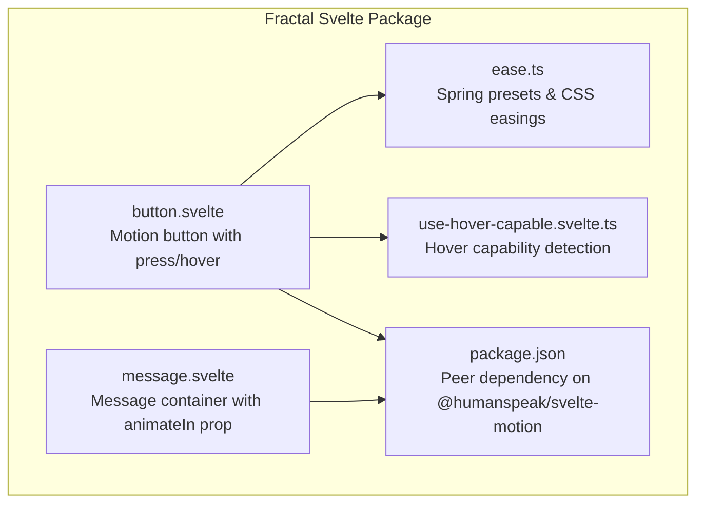
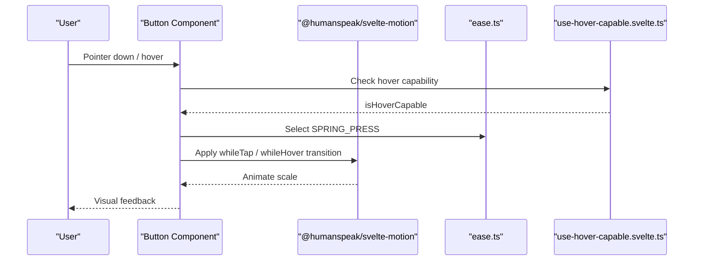
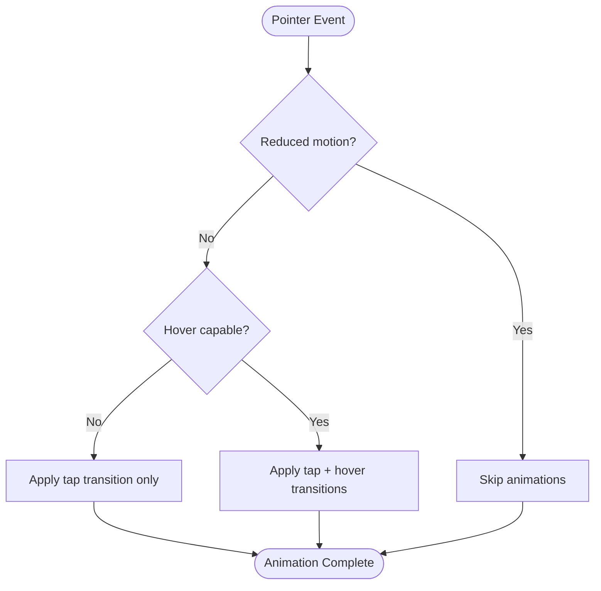
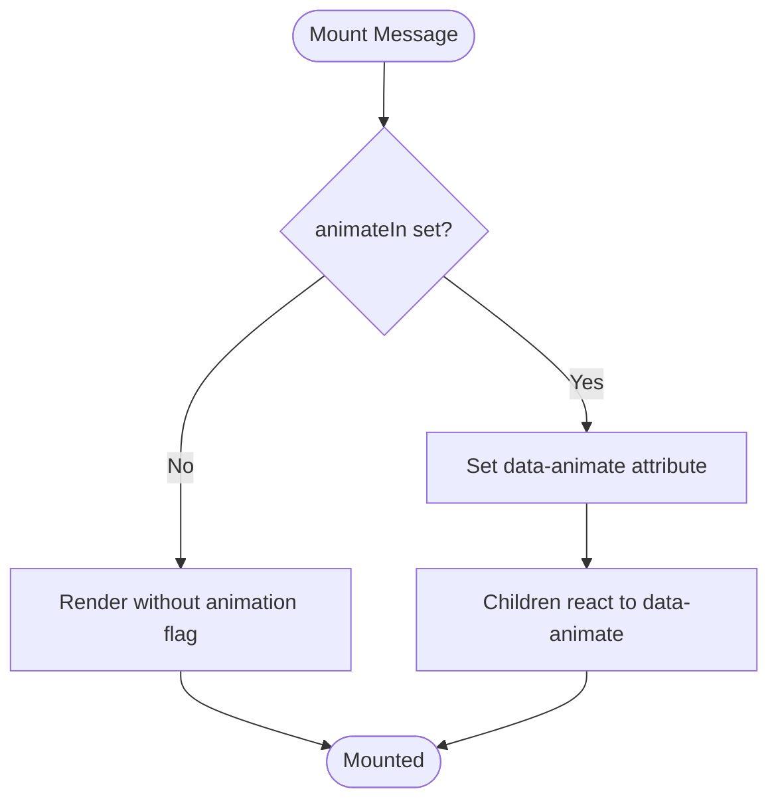
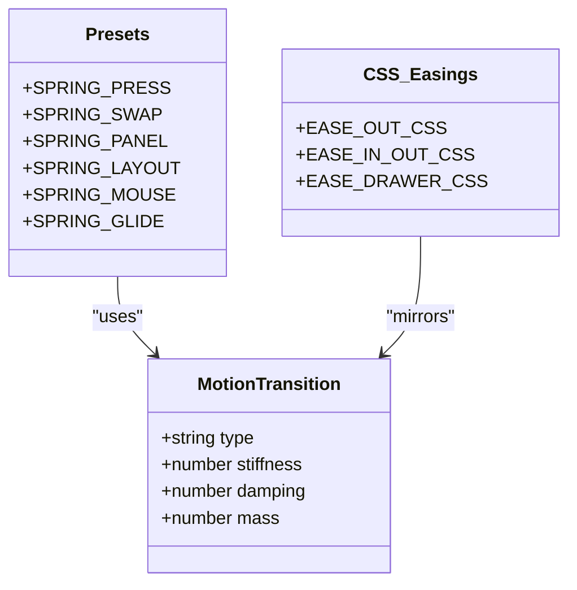
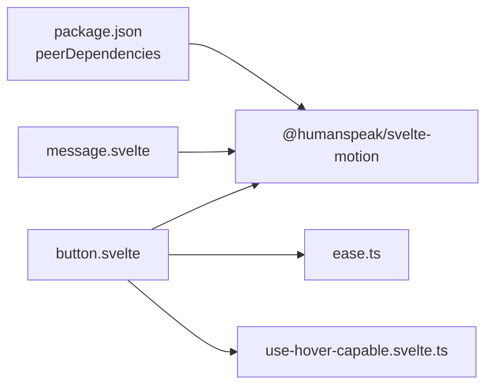

<cite>
**Referenced Files in This Document**
- `packages/fractal-svelte/package.json`
- `packages/fractal-svelte/src/lib/ease.ts`
- `packages/fractal-svelte/src/lib/motion/use-hover-capable.svelte.ts`
- `packages/fractal-svelte/src/lib/components/motion/button/button.svelte`
- `packages/fractal-svelte/src/lib/components/agents/message/message.svelte`
</cite>

## Table of Contents
1. [Introduction](#introduction)
2. [Project Structure](#project-structure)
3. [Core Components](#core-components)
4. [Architecture Overview](#architecture-overview)
5. [Detailed Component Analysis](#detailed-component-analysis)
6. [Dependency Analysis](#dependency-analysis)
7. [Performance Considerations](#performance-considerations)
8. [Troubleshooting Guide](#troubleshooting-guide)
9. [Conclusion](#conclusion)
10. [Appendices](#appendices)

## Introduction
This document explains how to customize animations in Fractal components using spring physics and motion patterns. It covers configuring spring parameters (stiffness, damping, mass), creating custom easing functions, integrating with the @humanspeak/svelte-motion library, composing animations, applying conditional logic based on state, and optimizing performance. Practical examples include extending Button hover effects, implementing Message slide animations, and building custom motion behaviors. Accessibility considerations such as reduced motion preferences are addressed throughout.

## Project Structure
The animation system is centered around a shared motion configuration and reusable utilities:
- Motion transitions and easings are defined in a dedicated module and consumed by components.
- A small utility detects hover-capable devices to gate pointer-driven animations.
- Components integrate with @humanspeak/svelte-motion for declarative transitions and gestures.
- The package declares @humanspeak/svelte-motion as a peer dependency, ensuring consistent integration across projects.

**Diagram sources**
- `packages/fractal-svelte/src/lib/ease.ts#L1-L23`
- `packages/fractal-svelte/src/lib/motion/use-hover-capable.svelte.ts#L1-L15`
- `packages/fractal-svelte/src/lib/components/motion/button/button.svelte#L1-L45`
- `packages/fractal-svelte/src/lib/components/agents/message/message.svelte#L1-L24`
- `packages/fractal-svelte/package.json#L215-L218`

**Section sources**
- `packages/fractal-svelte/package.json#L215-L218`
- `packages/fractal-svelte/src/lib/ease.ts#L1-L23`
- `packages/fractal-svelte/src/lib/motion/use-hover-capable.svelte.ts#L1-L15`
- `packages/fractal-svelte/src/lib/components/motion/button/button.svelte#L1-L45`
- `packages/fractal-svelte/src/lib/components/agents/message/message.svelte#L1-L24`

## Core Components
- Spring presets and easings: Centralized definitions for common motion profiles and CSS cubic-bezier values.
- Hover capability detector: A lightweight hook that exposes whether the device supports hover interactions.
- Motion-enabled Button: Demonstrates whileTap and whileHover transitions gated by reduced motion and hover capability.
- Message component: Provides an animateIn prop to coordinate entrance animations via data attributes.

Key responsibilities:
- ease.ts: Exposes MotionTransition objects for springs and CSS easings for styling systems.
- use-hover-capable.svelte.ts: Returns a reactive signal indicating hover capability.
- button.svelte: Integrates motion transitions, ripple effect, and accessibility-aware behavior.
- message.svelte: Accepts props to control animation entry and sets context for child elements.

**Section sources**
- `packages/fractal-svelte/src/lib/ease.ts#L1-L23`
- `packages/fractal-svelte/src/lib/motion/use-hover-capable.svelte.ts#L1-L15`
- `packages/fractal-svelte/src/lib/components/motion/button/button.svelte#L1-L45`
- `packages/fractal-svelte/src/lib/components/agents/message/message.svelte#L1-L24`

## Architecture Overview
The animation architecture combines declarative motion primitives from @humanspeak/svelte-motion with local state and utilities:
- Motion transitions are selected from centralized presets or custom configurations.
- Conditional logic gates animations based on user preferences and device capabilities.
- Components expose simple props to enable or tune animations without exposing internal complexity.

**Diagram sources**
- `packages/fractal-svelte/src/lib/components/motion/button/button.svelte#L1-L45`
- `packages/fractal-svelte/src/lib/ease.ts#L1-L23`
- `packages/fractal-svelte/src/lib/motion/use-hover-capable.svelte.ts#L1-L15`

## Detailed Component Analysis

### Button Motion Behavior
The Button integrates motion transitions for press and hover states:
- Uses a spring preset for press feedback.
- Applies hover scaling only when the device supports hover and reduced motion is not preferred.
- Optionally renders ripples triggered on pointer down, respecting reduced motion.

**Diagram sources**
- `packages/fractal-svelte/src/lib/components/motion/button/button.svelte#L1-L45`
- `packages/fractal-svelte/src/lib/motion/use-hover-capable.svelte.ts#L1-L15`

**Section sources**
- `packages/fractal-svelte/src/lib/components/motion/button/button.svelte#L1-L45`
- `packages/fractal-svelte/src/lib/motion/use-hover-capable.svelte.ts#L1-L15`

### Message Slide Animations
The Message component accepts an animateIn prop to coordinate entrance animations:
- When enabled, it sets a data attribute to signal child components or styles to trigger slide-in effects.
- This approach keeps the component minimal and composable, allowing consumers to implement specific slide behaviors.

**Diagram sources**
- `packages/fractal-svelte/src/lib/components/agents/message/message.svelte#L1-L24`

**Section sources**
- `packages/fractal-svelte/src/lib/components/agents/message/message.svelte#L1-L24`

### Spring Configuration and Custom Easing
Centralized motion presets provide consistent spring behavior across components:
- Each preset defines type, stiffness, damping, and mass for realistic motion.
- CSS cubic-bezier equivalents are provided for styling systems that require them.
- Consumers can create new presets by adjusting these parameters to match design intent.

**Diagram sources**
- `packages/fractal-svelte/src/lib/ease.ts#L1-L23`

**Section sources**
- `packages/fractal-svelte/src/lib/ease.ts#L1-L23`

## Dependency Analysis
- @humanspeak/svelte-motion is declared as a peer dependency, ensuring applications explicitly install and manage the motion library version.
- Components import motion primitives and hooks from this library to apply transitions and respect reduced motion preferences.
- Local utilities (e.g., hover capability detection) are encapsulated and imported where needed, minimizing coupling.

**Diagram sources**
- `packages/fractal-svelte/package.json#L215-L218`
- `packages/fractal-svelte/src/lib/components/motion/button/button.svelte#L1-L45`
- `packages/fractal-svelte/src/lib/components/agents/message/message.svelte#L1-L24`
- `packages/fractal-svelte/src/lib/ease.ts#L1-L23`
- `packages/fractal-svelte/src/lib/motion/use-hover-capable.svelte.ts#L1-L15`

**Section sources**
- `packages/fractal-svelte/package.json#L215-L218`

## Performance Considerations
- Prefer GPU-accelerated properties (transform, opacity) for smooth animations.
- Use short durations and appropriate spring parameters to avoid jank.
- Gate pointer-driven animations behind hover capability checks to reduce unnecessary work on touch-only devices.
- Respect reduced motion preferences to minimize CPU/GPU usage and improve accessibility.
- Avoid heavy computations inside animation callbacks; keep logic minimal and efficient.

[No sources needed since this section provides general guidance]

## Troubleshooting Guide
Common issues and resolutions:
- Animations not playing on mobile: Ensure hover capability check does not block necessary interactions; consider alternative triggers like focus or click.
- Choppy animations: Reduce stiffness or increase damping slightly; prefer transform-based properties.
- Reduced motion conflicts: Verify that reduced motion preference is respected and fallbacks are applied.
- Missing motion library: Confirm @humanspeak/svelte-motion is installed at the application level due to peer dependency requirements.

**Section sources**
- `packages/fractal-svelte/src/lib/motion/use-hover-capable.svelte.ts#L1-L15`
- `packages/fractal-svelte/src/lib/components/motion/button/button.svelte#L1-L45`
- `packages/fractal-svelte/package.json#L215-L218`

## Conclusion
Fractal’s animation system leverages centralized spring presets, lightweight utilities, and @humanspeak/svelte-motion to deliver consistent, accessible, and performant motion experiences. By configuring spring parameters thoughtfully, gating animations based on user preferences and device capabilities, and composing transitions carefully, you can extend components like Button and Message with rich, responsive interactions.

[No sources needed since this section summarizes without analyzing specific files]

## Appendices

### Extending Button Hover Effects
- Adjust pressScale to change the intensity of press feedback.
- Add custom transitions by importing additional presets or defining new ones in the easing module.
- Combine with ripple effects for tactile feedback while respecting reduced motion.

**Section sources**
- `packages/fractal-svelte/src/lib/components/motion/button/button.svelte#L1-L45`
- `packages/fractal-svelte/src/lib/ease.ts#L1-L23`

### Implementing Message Slide Animations
- Enable animateIn to signal children to respond with slide-in effects.
- Use CSS transforms driven by data-animate to achieve smooth sliding.
- Coordinate timing with parent containers for staggered entrances if needed.

**Section sources**
- `packages/fractal-svelte/src/lib/components/agents/message/message.svelte#L1-L24`

### Creating Custom Motion Behaviors
- Define new MotionTransition presets with tailored stiffness, damping, and mass.
- Compose multiple transitions for complex sequences (e.g., fade + slide).
- Integrate with gesture APIs for drag or magnetic effects using the same motion primitives.

**Section sources**
- `packages/fractal-svelte/src/lib/ease.ts#L1-L23`