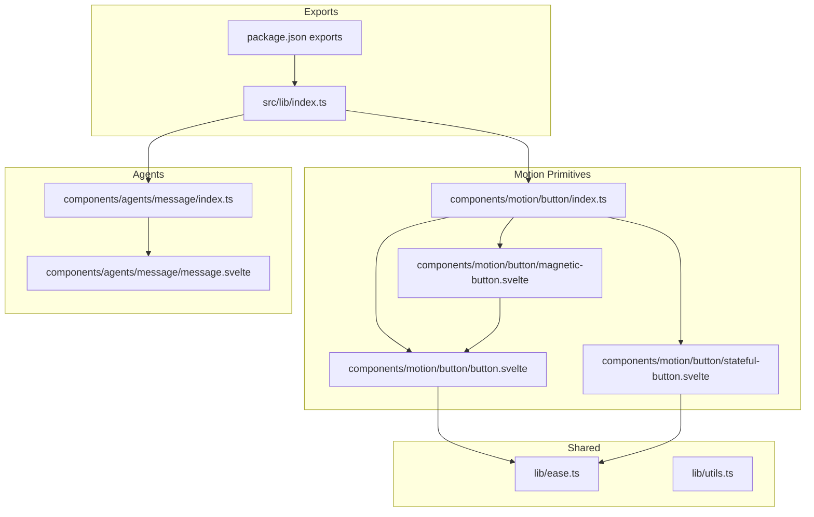
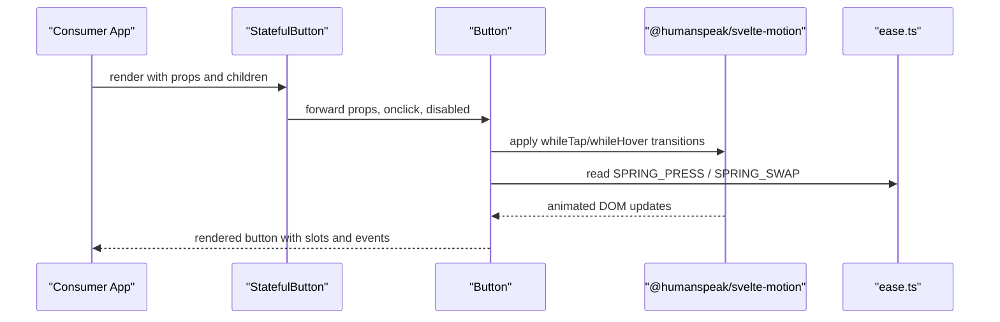
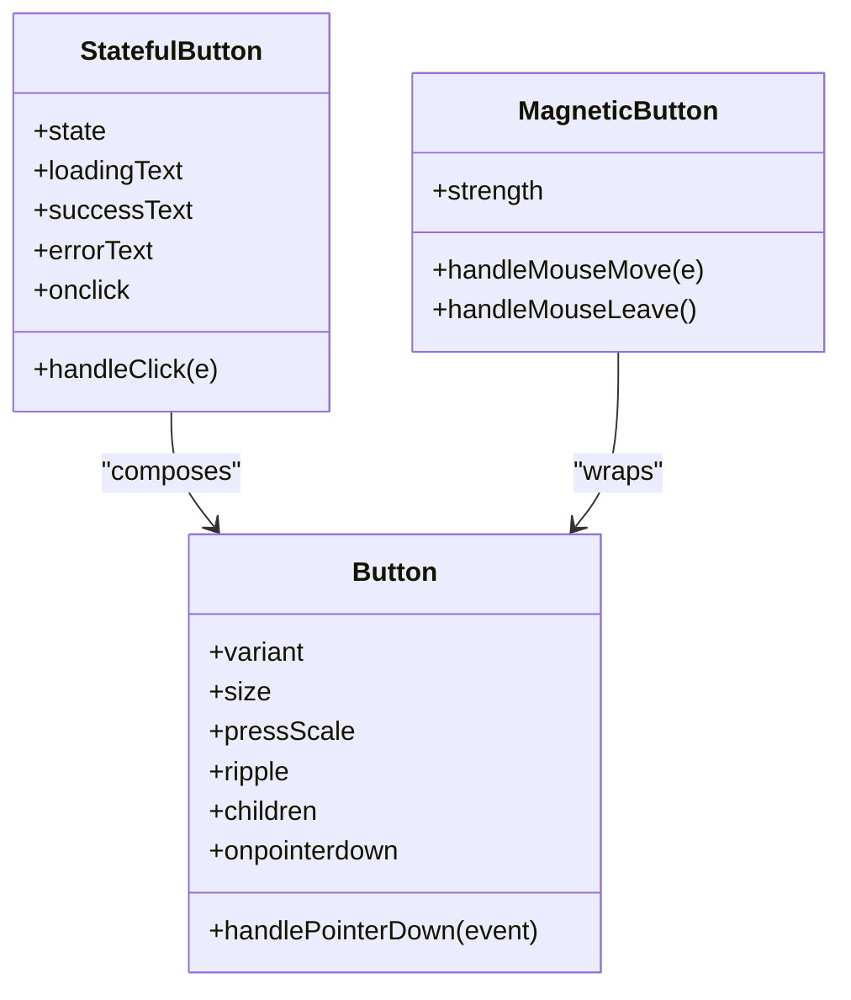
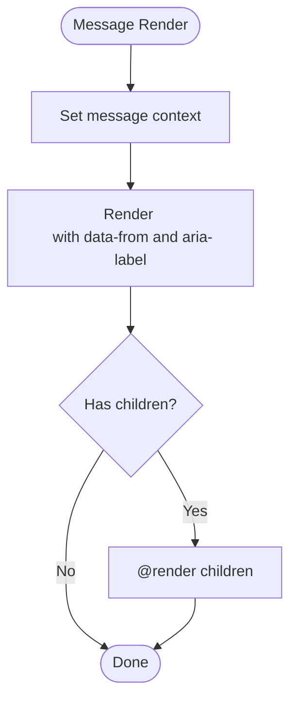
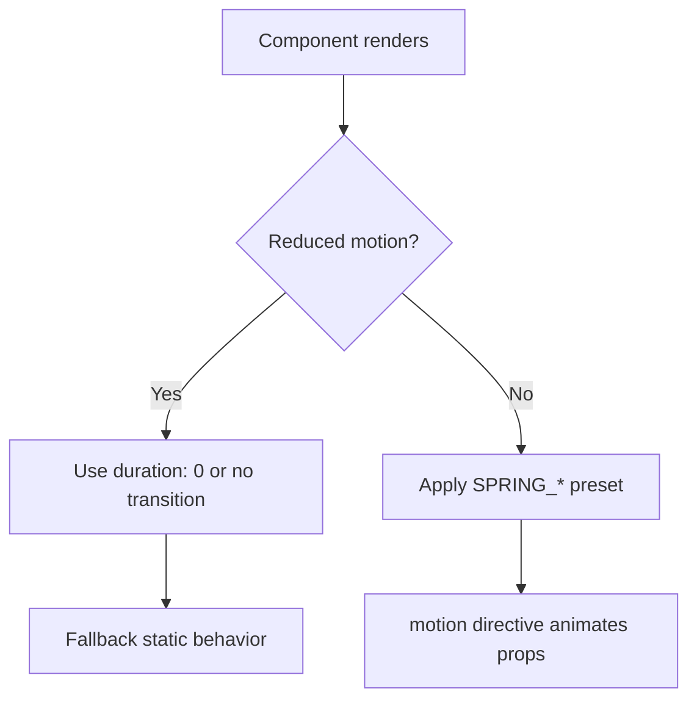
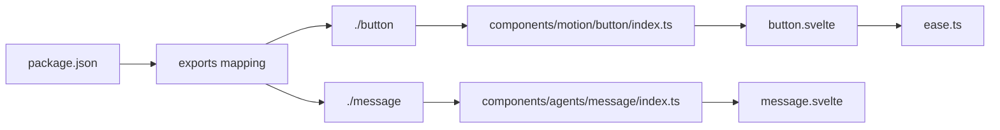

<cite>
**Referenced Files in This Document**
- `packages/fractal-svelte/package.json`
- `packages/fractal-svelte/src/lib/index.ts`
- `packages/fractal-svelte/src/lib/ease.ts`
- `packages/fractal-svelte/src/lib/utils.ts`
- `packages/fractal-svelte/src/lib/components/motion/button/button.svelte`
- `packages/fractal-svelte/src/lib/components/motion/button/stateful-button.svelte`
- `packages/fractal-svelte/src/lib/components/motion/button/magnetic-button.svelte`
- `packages/fractal-svelte/src/lib/components/motion/button/index.ts`
- `packages/fractal-svelte/src/lib/components/agents/message/message.svelte`
- `packages/fractal-svelte/src/lib/components/agents/message/index.ts`
</cite>

## Table of Contents
1. [Introduction](#introduction)
2. [Project Structure](#project-structure)
3. [Core Components](#core-components)
4. [Architecture Overview](#architecture-overview)
5. [Detailed Component Analysis](#detailed-component-analysis)
6. [Dependency Analysis](#dependency-analysis)
7. [Performance Considerations](#performance-considerations)
8. [Troubleshooting Guide](#troubleshooting-guide)
9. [Conclusion](#conclusion)
10. [Appendices](#appendices)

## Introduction
This document explains how to extend Svelte components in the Fractal UI library using Svelte 5 runes and the motion system. It covers prop extension, event handling, animation customization, composition patterns, slot usage, accessibility, theme consistency, and responsive design. Practical examples focus on extending Button and Message components while maintaining design-system consistency.

## Project Structure
Fractal UI is organized into:
- Motion primitives (e.g., Button, Input, Tabs) with spring-based animations
- Agent components (e.g., Message, AI Sidebar) for conversational UIs
- Blocks (higher-level compositions like Notification Stack)
- Shared utilities for easing and types

The package exposes individual component entry points and shared modules such as ease presets and utilities.

**Diagram sources**
- `packages/fractal-svelte/src/lib/index.ts#L1-L6`
- `packages/fractal-svelte/package.json#L54-L214`
- `packages/fractal-svelte/src/lib/components/motion/button/index.ts#L1-L4`
- `packages/fractal-svelte/src/lib/components/motion/button/button.svelte#L1-L45`
- `packages/fractal-svelte/src/lib/components/motion/button/stateful-button.svelte#L1-L129`
- `packages/fractal-svelte/src/lib/components/motion/button/magnetic-button.svelte#L1-L50`
- `packages/fractal-svelte/src/lib/components/agents/message/index.ts#L1-L17`
- `packages/fractal-svelte/src/lib/components/agents/message/message.svelte#L1-L24`
- `packages/fractal-svelte/src/lib/ease.ts#L1-L23`
- `packages/fractal-svelte/src/lib/utils.ts#L1-L4`

**Section sources**
- `packages/fractal-svelte/src/lib/index.ts#L1-L6`
- `packages/fractal-svelte/package.json#L54-L214`

## Core Components
- Button family:
  - Base Button provides variants, sizes, ripple, press/hover transitions, and slots.
  - StatefulButton composes Button with state-driven content and AnimatePresence transitions.
  - MagneticButton wraps Button with cursor-follow physics.
- Message:
  - Provides context propagation and accessible markup for chat-like messages.

Key extension patterns:
- Prop extension via $props() and HTML attribute forwarding
- Event forwarding and augmentation
- Slot rendering with @render children?.()
- Animation configuration through shared spring presets

**Section sources**
- `packages/fractal-svelte/src/lib/components/motion/button/button.svelte#L1-L45`
- `packages/fractal-svelte/src/lib/components/motion/button/stateful-button.svelte#L1-L129`
- `packages/fractal-svelte/src/lib/components/motion/button/magnetic-button.svelte#L1-L50`
- `packages/fractal-svelte/src/lib/components/agents/message/message.svelte#L1-L24`

## Architecture Overview
The motion system integrates with Svelte 5 runes and a motion library to deliver spring-based transitions. Shared easing presets centralize animation behavior across components.

**Diagram sources**
- `packages/fractal-svelte/src/lib/components/motion/button/stateful-button.svelte#L1-L129`
- `packages/fractal-svelte/src/lib/components/motion/button/button.svelte#L1-L45`
- `packages/fractal-svelte/src/lib/ease.ts#L1-L23`

## Detailed Component Analysis

### Button Family: Prop Extension, Events, and Animation
- Props:
  - Variant and size control styling tokens
  - pressScale controls tap scale
  - ripple toggles ripple effect
  - children is a Snippet for flexible content
- Events:
  - onpointerdown forwarded and augmented for ripple logic
  - onClick can be composed by wrappers
- Animation:
  - Uses motion whileTap and whileHover with reduced-motion check
  - Applies shared SPRING_PRESS preset
- Slots:
  - Content wrapped in a span with data-slot for consistent styling hooks

**Diagram sources**
- `packages/fractal-svelte/src/lib/components/motion/button/button.svelte#L1-L45`
- `packages/fractal-svelte/src/lib/components/motion/button/stateful-button.svelte#L1-L129`
- `packages/fractal-svelte/src/lib/components/motion/button/magnetic-button.svelte#L1-L50`

**Section sources**
- `packages/fractal-svelte/src/lib/components/motion/button/button.svelte#L1-L45`
- `packages/fractal-svelte/src/lib/components/motion/button/stateful-button.svelte#L1-L129`
- `packages/fractal-svelte/src/lib/components/motion/button/magnetic-button.svelte#L1-L50`

### Message: Context and Composition
- Props:
  - from sets message origin and aria-label semantics
  - animateIn toggles entrance animation
  - children are slotted into an article element
- Context:
  - Sets message context for child components (e.g., avatar, content)
- Accessibility:
  - Semantic article role and aria-label based on from

**Diagram sources**
- `packages/fractal-svelte/src/lib/components/agents/message/message.svelte#L1-L24`

**Section sources**
- `packages/fractal-svelte/src/lib/components/agents/message/message.svelte#L1-L24`
- `packages/fractal-svelte/src/lib/components/agents/message/index.ts#L1-L17`

### Animation System Integration and Spring Physics
- Shared presets define spring parameters for different interaction patterns:
  - Press feedback, slot swaps, panels, layout glides, mouse-follow, sliders
- Reduced motion support ensures accessibility-friendly behavior
- Motion directives apply transitions conditionally based on user preferences

**Diagram sources**
- `packages/fractal-svelte/src/lib/ease.ts#L1-L23`
- `packages/fractal-svelte/src/lib/components/motion/button/button.svelte#L1-L45`

**Section sources**
- `packages/fractal-svelte/src/lib/ease.ts#L1-L23`

## Dependency Analysis
- Package exports map to component entry points for clean imports
- Motion primitives depend on shared easing presets and motion library
- Agent components compose primitives and share contexts

**Diagram sources**
- `packages/fractal-svelte/package.json#L54-L214`
- `packages/fractal-svelte/src/lib/components/motion/button/index.ts#L1-L4`
- `packages/fractal-svelte/src/lib/components/agents/message/index.ts#L1-L17`
- `packages/fractal-svelte/src/lib/components/motion/button/button.svelte#L1-L45`
- `packages/fractal-svelte/src/lib/components/agents/message/message.svelte#L1-L24`
- `packages/fractal-svelte/src/lib/ease.ts#L1-L23`

**Section sources**
- `packages/fractal-svelte/package.json#L54-L214`

## Performance Considerations
- Prefer derived state ($derived) for computed flags to avoid unnecessary re-renders
- Use $effect for side effects like timers; always return cleanup functions
- Respect reduced motion to avoid heavy animations on constrained devices
- Keep ripple arrays small and prune entries promptly to prevent memory growth
- Compose lightweight wrappers around base components to minimize overhead

[No sources needed since this section provides general guidance]

## Troubleshooting Guide
- Animations not playing:
  - Verify reduced motion preference and ensure conditional transitions are applied
  - Confirm motion library peer dependency is installed
- Ripple not appearing:
  - Ensure ripple prop is enabled and pointer events reach the button
- StatefulButton not resetting:
  - Check that success/error states have timers and that onclick does not block state changes
- Message context issues:
  - Ensure parent Message sets context before child components consume it

**Section sources**
- `packages/fractal-svelte/src/lib/components/motion/button/button.svelte#L1-L45`
- `packages/fractal-svelte/src/lib/components/motion/button/stateful-button.svelte#L1-L129`
- `packages/fractal-svelte/src/lib/components/agents/message/message.svelte#L1-L24`

## Conclusion
Extending Fractal UI components leverages Svelte 5 runes, shared motion presets, and composition patterns. By following prop extension, event forwarding, and slot usage guidelines, you can create consistent, accessible, and performant variants of core components while preserving design-system integrity.

[No sources needed since this section summarizes without analyzing specific files]

## Appendices

### Practical Extension Patterns

- Extend Button with custom variant and color:
  - Add new variant values and corresponding CSS classes
  - Forward all props and events to the base Button
  - Use shared easing presets for consistent motion

- Create a loading-aware Button:
  - Wrap Button with a stateful wrapper similar to StatefulButton
  - Manage state transitions and auto-reset timers
  - Provide accessible attributes like aria-busy

- Customize Message layout:
  - Compose Message with custom header/footer slots
  - Maintain context usage for child components
  - Ensure semantic roles and labels remain intact

- Apply motion customization:
  - Swap default SPRING_* presets per component if needed
  - Respect reduced motion and provide fallbacks
  - Use AnimatePresence for slot/content transitions

[No sources needed since this section provides general guidance]