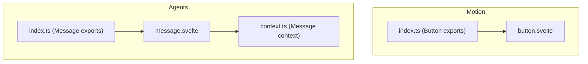
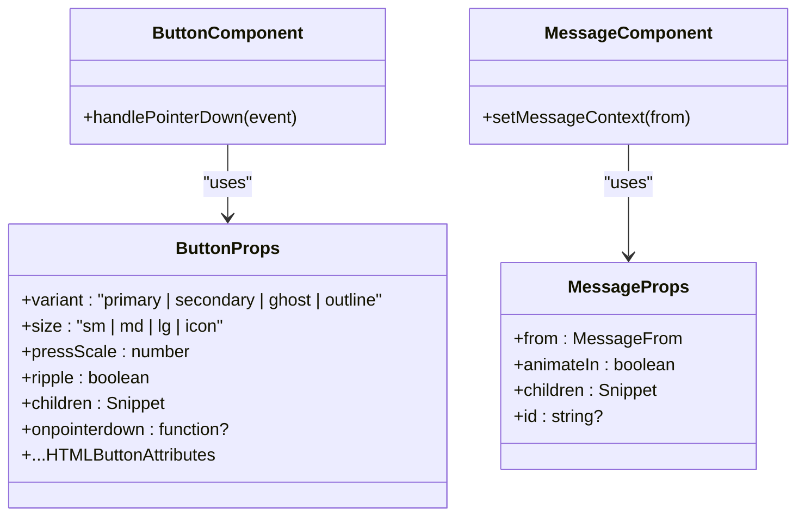
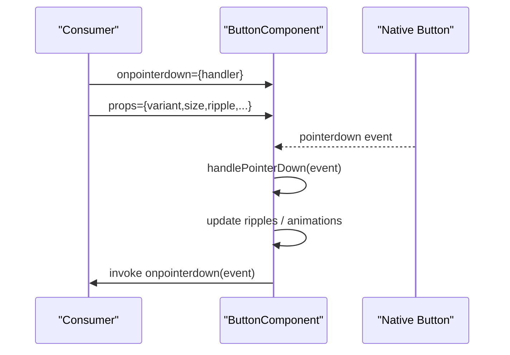
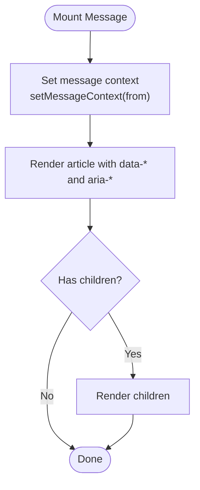
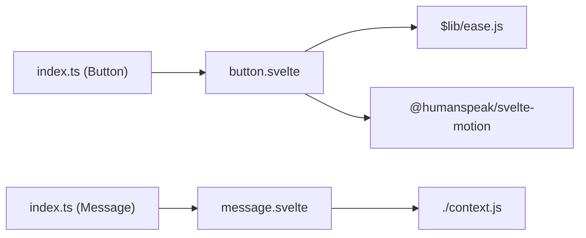

<cite>
**Referenced Files in This Document**
- `fractal-svelte/src/lib/components/motion/button/button.svelte`
- `fractal-svelte/src/lib/components/motion/button/index.ts`
- `fractal-svelte/src/lib/components/agents/message/message.svelte`
- `fractal-svelte/src/lib/components/agents/message/context.ts`
- `fractal-svelte/src/lib/components/agents/message/index.ts`
</cite>

## Table of Contents
1. Introduction
2. Project Structure
3. Core Components
4. Architecture Overview
5. Detailed Component Analysis
6. Dependency Analysis
7. Performance Considerations
8. Troubleshooting Guide
9. Conclusion

## Introduction
This document explains how to extend component props and events in the Fractal UI library with a focus on TypeScript interfaces, type-safe prop extension, event forwarding, variant components, prop validation, and backward compatibility. It also covers practical patterns for extending Button and Message components with custom props such as data attributes, animation triggers, and accessibility features, and shows how to integrate Svelte 5 runes for reactive prop handling.

## Project Structure
The relevant code for this topic lives under the fractal-svelte package:
- Motion primitives like Button are implemented in src/lib/components/motion/button.
- Agent components like Message are implemented in src/lib/components/agents/message.
- Each component typically exposes its public API via an index.ts re-export file.

**Diagram sources**
- `fractal-svelte/src/lib/components/motion/button/button.svelte`
- `fractal-svelte/src/lib/components/motion/button/index.ts`
- `fractal-svelte/src/lib/components/agents/message/message.svelte`
- `fractal-svelte/src/lib/components/agents/message/context.ts`
- `fractal-svelte/src/lib/components/agents/message/index.ts`

**Section sources**
- `fractal-svelte/src/lib/components/motion/button/button.svelte`
- `fractal-svelte/src/lib/components/motion/button/index.ts`
- `fractal-svelte/src/lib/components/agents/message/message.svelte`
- `fractal-svelte/src/lib/components/agents/message/context.ts`
- `fractal-svelte/src/components/agents/message/index.ts`

## Core Components
- Button (motion): A Svelte component that composes HTML button attributes with additional motion-related props and forwards pointer events while applying animations.
- Message (agents): A Svelte component that sets message context and renders children with semantic attributes and optional animation flags.

Key takeaways:
- Both components use Svelte 5 runes ($props) for reactive prop handling.
- Props are typed using TypeScript, often by intersecting or extending base attribute types.
- Events are forwarded through handlers to maintain composition and user control.

**Section sources**
- `fractal-svelte/src/lib/components/motion/button/button.svelte`
- `fractal-svelte/src/lib/components/agents/message/message.svelte`

## Architecture Overview
At a high level, each component defines a typed props interface, consumes props reactively with $props, performs internal state updates, and forwards DOM events to consumers. Variants and sizes are expressed as string literal unions. Accessibility attributes are set directly on the root element.

**Diagram sources**
- `fractal-svelte/src/lib/components/motion/button/button.svelte`
- `fractal-svelte/src/lib/components/agents/message/message.svelte`
- `fractal-svelte/src/lib/components/agents/message/context.ts`

## Detailed Component Analysis

### Extending Button Props and Events
Patterns demonstrated:
- Type-safe prop extension: The component intersects HTMLButtonAttributes with custom props to inherit all native button attributes while adding domain-specific ones.
- Variant and size enums: String literal unions provide strict typing for visual variants and sizes.
- Event forwarding: A handler wraps the native onpointerdown, runs internal logic (e.g., ripple), then invokes the consumer-provided callback if present.
- Svelte 5 runes: $props() provides reactive props; $state manages internal state; useReducedMotion integrates with system preferences.

Practical extension ideas:
- Add data attributes: Extend props with data-* fields and spread them onto the root element.
- Animation triggers: Add props like animateOnMount or animationName and wire them to motion transitions.
- Accessibility: Add aria-* props (already covered by HTMLButtonAttributes) and ensure meaningful labels.

Backward compatibility:
- Provide sensible defaults for new props so existing usages remain unchanged.
- Keep required props minimal; prefer optional props with defaults.

Event forwarding best practices:
- Always call the provided callback after your internal logic to preserve consumer expectations.
- Normalize event types when necessary to avoid breaking changes downstream.

**Diagram sources**
- `fractal-svelte/src/lib/components/motion/button/button.svelte`

**Section sources**
- `fractal-svelte/src/lib/components/motion/button/button.svelte`
- `fractal-svelte/src/lib/components/motion/button/index.ts`

### Extending Message Props and Context
Patterns demonstrated:
- Simple props with defaults: from, animateIn, children, id are defined with default values where appropriate.
- Context usage: setMessageContext is called reactively to inform child components about the message origin.
- Semantic markup: The root element includes aria-label and data attributes for styling and testing.

Extension ideas:
- Add animation triggers: Introduce props like animationDuration or animationEasing and pass them to child animations.
- Accessibility: Expose props for aria-describedby or role overrides when needed.
- Data attributes: Add data-testid or analytics attributes via props.

Backward compatibility:
- New props should be optional with safe defaults.
- Avoid changing the shape of existing props; instead, add new fields.

**Diagram sources**
- `fractal-svelte/src/lib/components/agents/message/message.svelte`
- `fractal-svelte/src/lib/components/agents/message/context.ts`

**Section sources**
- `fractal-svelte/src/lib/components/agents/message/message.svelte`
- `fractal-svelte/src/lib/components/agents/message/context.ts`
- `fractal-svelte/src/lib/components/agents/message/index.ts`

### Creating Variant Components with Additional Properties
Approach:
- Define a base props interface (e.g., BaseButtonProps) containing shared properties.
- Create variant-specific interfaces that extend the base (e.g., PrimaryButtonProps extends BaseButtonProps).
- In the component, accept a union of variant props and use discriminated unions if needed.
- Spread remaining props to the underlying element to support HTML attributes and data-* attributes.

Type safety tips:
- Use string literal unions for variant names and sizes.
- Prefer intersection with HTML*Attributes to inherit standard attributes.
- Export the extended prop types so consumers can import and reuse them.

Accessibility considerations:
- Ensure variants do not change semantics unexpectedly.
- Provide explicit aria-* props when variant behavior affects meaning.

**Section sources**
- `fractal-svelte/src/lib/components/motion/button/button.svelte`

### Handling Prop Validation and Defaults
Guidelines:
- Use TypeScript to enforce valid values at compile time.
- Provide runtime defaults in $props destructuring for robustness.
- For complex validation, consider runtime checks inside the component and throw descriptive errors.

Examples:
- Default variant and size to stable values.
- Guard against invalid combinations (e.g., disabled with interactive animations).

**Section sources**
- `fractal-svelte/src/lib/components/motion/button/button.svelte`
- `fractal-svelte/src/lib/components/agents/message/message.svelte`

### Maintaining Backward Compatibility
Strategies:
- Make new props optional with sensible defaults.
- Avoid removing or renaming existing props.
- If behavior must change, introduce a feature flag prop to opt-in.
- Keep event signatures stable; if you must change, deprecate the old signature first.

**Section sources**
- `fractal-svelte/src/lib/components/motion/button/button.svelte`
- `fractal-svelte/src/lib/components/agents/message/message.svelte`

### Integrating Svelte 5 Runes for Reactive Prop Handling
Patterns:
- Use $props() to receive reactive props.
- Use $state for internal mutable state.
- Combine with derived values or effects as needed.
- Respect reduced motion settings via useReducedMotion.

Best practices:
- Keep derived computations close to their usage.
- Avoid unnecessary reactivity by using untrack where appropriate.

**Section sources**
- `fractal-svelte/src/lib/components/motion/button/button.svelte`
- `fractal-svelte/src/lib/components/agents/message/message.svelte`

## Dependency Analysis
- Button depends on motion utilities and ease presets to apply animations.
- Message depends on a local context module to propagate message metadata to children.
- Both components export their default implementations via index.ts files for clean imports.

**Diagram sources**
- `fractal-svelte/src/lib/components/motion/button/button.svelte`
- `fractal-svelte/src/lib/components/agents/message/message.svelte`
- `fractal-svelte/src/lib/components/motion/button/index.ts`
- `fractal-svelte/src/lib/components/agents/message/index.ts`

**Section sources**
- `fractal-svelte/src/lib/components/motion/button/button.svelte`
- `fractal-svelte/src/lib/components/agents/message/message.svelte`
- `fractal-svelte/src/lib/components/motion/button/index.ts`
- `fractal-svelte/src/lib/components/agents/message/index.ts`

## Performance Considerations
- Minimize re-renders by keeping internal state localized and avoiding unnecessary derived computations.
- Respect reduced motion preferences to avoid heavy animations when users prefer reduced motion.
- Spread only necessary props to the root element to prevent excessive attribute updates.
- Use untrack for side effects that should not trigger reactivity unnecessarily.

[No sources needed since this section provides general guidance]

## Troubleshooting Guide
Common issues and resolutions:
- Event not firing: Ensure you forward the original event callback after performing internal logic.
- Types mismatch: Verify that your extended props intersect correctly with HTML attributes and that you export updated types.
- Animations not respecting preferences: Check reduced motion integration and conditional rendering of animations.
- Missing accessibility attributes: Confirm aria-* and semantic roles are set appropriately on the root element.

**Section sources**
- `fractal-svelte/src/lib/components/motion/button/button.svelte`
- `fractal-svelte/src/lib/components/agents/message/message.svelte`

## Conclusion
Extending props and events in Fractal UI follows clear patterns: define typed props, use Svelte 5 runes for reactivity, forward events responsibly, and maintain backward compatibility with defaults and optional fields. By following these guidelines, you can safely add data attributes, animation triggers, and accessibility enhancements to components like Button and Message while preserving type safety and performance.

[No sources needed since this section summarizes without analyzing specific files]