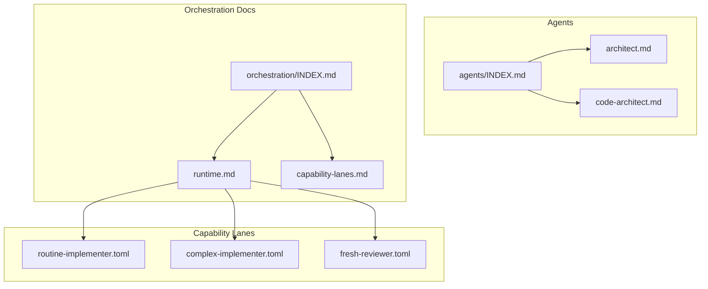
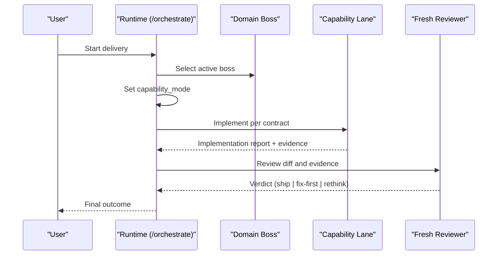
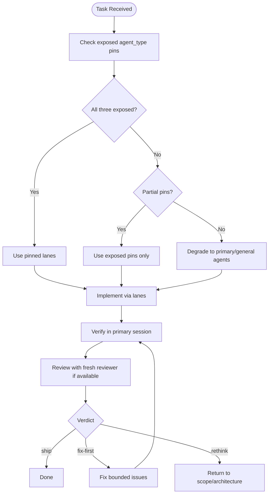
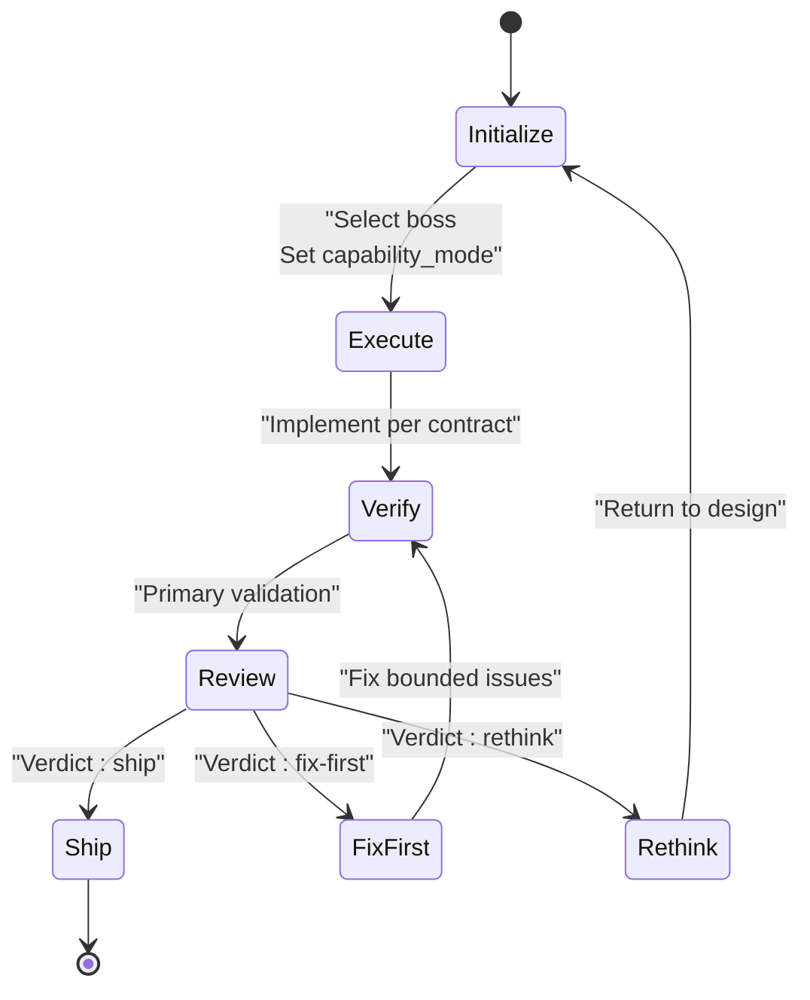
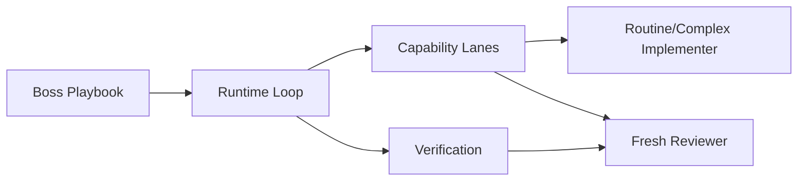

<cite>
**Referenced Files in This Document**
- `fractal-agentic/agents/INDEX.md`
- `fractal-agentic/agents/architect.md`
- `fractal-agentic/agents/code-architect.md`
- `fractal-agentic/agents/fractal-agentic-routine-implementer.toml`
- `fractal-agentic/agents/fractal-agentic-complex-implementer.toml`
- `fractal-agentic/agents/fractal-agentic-fresh-reviewer.toml`
- `fractal-agentic/docs/orchestration/capability-lanes.md`
- `fractal-agentic/docs/orchestration/runtime.md`
- `fractal-agentic/docs/orchestration/INDEX.md`
- `fractal-agentic/skills/boss-orchestration/references/capability-mode.md`
</cite>

## Table of Contents
1. [Introduction](#introduction)
2. [Project Structure](#project-structure)
3. [Core Components](#core-components)
4. [Architecture Overview](#architecture-overview)
5. [Detailed Component Analysis](#detailed-component-analysis)
6. [Dependency Analysis](#dependency-analysis)
7. [Performance Considerations](#performance-considerations)
8. [Troubleshooting Guide](#troubleshooting-guide)
9. [Conclusion](#conclusion)

## Introduction
This document explains the agent architecture patterns in the Fractal Agentic system. It covers how agents are defined, how capabilities are declared and routed, and how the runtime orchestrates initialization, execution, verification, and review. It also documents lifecycle phases, state persistence, memory management, and resource allocation patterns as implemented by the plugin’s orchestration kernel and capability lanes.

## Project Structure
The agent ecosystem is organized into:
- Agent definitions (Markdown-based prompts with metadata)
- Capability lane configurations (TOML files for specialized implementers and reviewers)
- Orchestration documentation that defines the runtime loop and capability selection policy
- Live inventories that enumerate available agents

**Diagram sources**
- `fractal-agentic/agents/INDEX.md`
- `fractal-agentic/agents/architect.md`
- `fractal-agentic/agents/code-architect.md`
- `fractal-agentic/agents/fractal-agentic-routine-implementer.toml`
- `fractal-agentic/agents/fractal-agentic-complex-implementer.toml`
- `fractal-agentic/agents/fractal-agentic-fresh-reviewer.toml`
- `fractal-agentic/docs/orchestration/runtime.md`
- `fractal-agentic/docs/orchestration/capability-lanes.md`
- `fractal-agentic/docs/orchestration/INDEX.md`

**Section sources**
- `fractal-agentic/agents/INDEX.md`
- `fractal-agentic/docs/orchestration/INDEX.md`

## Core Components
- Agent definition structure: Each agent is a Markdown file with YAML frontmatter specifying name, description, model, and tools. Behavioral specifications are provided in the body as role instructions, constraints, and process guidance.
- Capability lanes: TOML files define specialized roles for routine implementation, complex implementation, and fresh review, including model selection and sandboxing policies.
- Orchestration runtime: The delivery loop selects a boss, sets capability mode, writes a contract, implements via appropriate lanes, verifies, and reviews with a strict verdict.

Key fields and concepts:
- Metadata: name, description, model, tools
- Behavioral specs: developer_instructions or prompt sections defining role, constraints, and processes
- Capability lanes: agent_type values and pins controlling delegation and review
- Runtime loop: select boss → set capability_mode → write contract → implement → verify → review

**Section sources**
- `fractal-agentic/agents/architect.md`
- `fractal-agentic/agents/code-architect.md`
- `fractal-agentic/agents/fractal-agentic-routine-implementer.toml`
- `fractal-agentic/agents/fractal-agentic-complex-implementer.toml`
- `fractal-agentic/agents/fractal-agentic-fresh-reviewer.toml`
- `fractal-agentic/docs/orchestration/runtime.md`
- `fractal-agentic/docs/orchestration/capability-lanes.md`

## Architecture Overview
Fractal Agentic separates domain ownership from capability routing:
- Bosses own the mission and constraints for a task.
- Capability lanes provide optional specialized workers and reviewers.
- The runtime enforces a consistent sequence to ensure quality and traceability.

**Diagram sources**
- `fractal-agentic/docs/orchestration/runtime.md`
- `fractal-agentic/docs/orchestration/capability-lanes.md`

## Detailed Component Analysis

### Agent Definition Structure
Agent definitions use Markdown with YAML frontmatter to declare metadata and behavioral specifications:
- name: Unique identifier used by the runtime and indexes
- description: Human-readable purpose and when to use the agent
- model: Model selection strategy (e.g., inherit or specific model)
- tools: Allowed toolset for the agent (e.g., Read, Grep, Glob, Bash)
- Behavioral specs: Role, constraints, and process steps described in the body

Examples:
- Architect agent: Defines role, principles, and architectural review process
- Code Architect agent: Focuses on pattern analysis, blueprint generation, and build sequencing

These definitions enable discovery, routing, and consistent behavior across sessions.

**Section sources**
- `fractal-agentic/agents/architect.md`
- `fractal-agentic/agents/code-architect.md`

### Capability Declarations and Routing
Capability lanes are optional but improve delegation and independent review:
- Routine implementer: For bounded, fully specified work
- Complex implementer: For context-heavy, higher-risk tasks
- Fresh reviewer: Read-only final review with strict verdicts

Routing depends on session exposure of agent_type values and pins. If pins are missing, the system degrades gracefully without blocking delivery.

**Diagram sources**
- `fractal-agentic/docs/orchestration/capability-lanes.md`
- `fractal-agentic/skills/boss-orchestration/references/capability-mode.md`

**Section sources**
- `fractal-agentic/docs/orchestration/capability-lanes.md`
- `fractal-agentic/skills/boss-orchestration/references/capability-mode.md`

### Lifecycle Phases: Initialization, Execution, Cleanup
The runtime loop defines a clear lifecycle:
- Initialization: Select boss, set capability_mode once per non-trivial task
- Execution: Write contract, implement using lanes or primary session
- Verification: Primary session validates diffs and commands
- Review: Fresh reviewer provides ship/fix-first/rethink verdict
- Cleanup: Capture wiki episode if configured; maintain audit trail

**Diagram sources**
- `fractal-agentic/docs/orchestration/runtime.md`

**Section sources**
- `fractal-agentic/docs/orchestration/runtime.md`

### Input/Output Schemas and Communication Protocols
- Input schema: Contracts specify objective, ownership, interfaces, constraints, and verification criteria
- Output schema: Implementation reports include evidence, diffs, and verification results
- Communication protocols: Agents follow boss constraints and monorepo stack defaults; handoffs preserve context and boundaries

The five-part contract ensures consistent input/output expectations across lanes and sessions.

**Section sources**
- `fractal-agentic/docs/orchestration/runtime.md`

### Examples: Architect and Code Architect
- Architect agent: Provides architectural review process, principles, and decision records
- Code Architect agent: Analyzes existing patterns, produces blueprints, and orders build sequences

Both demonstrate proper agent definition syntax, capability registration through tools, and context management via structured outputs.

**Section sources**
- `fractal-agentic/agents/architect.md`
- `fractal-agentic/agents/code-architect.md`

### State Persistence, Memory Management, and Resource Allocation
- State persistence: Wiki episodes capture durable knowledge under raw/fractal/ when configured
- Memory management: Daily logs, decisions, and templates support long-term project memory
- Resource allocation: Capability lanes allocate specialized models and reasoning effort based on task complexity

The system avoids hard dependencies on optional systems while enabling improvements through hooks and continuous learning.

**Section sources**
- `fractal-agentic/docs/orchestration/runtime.md`
- `fractal-agentic/docs/orchestration/INDEX.md`

## Dependency Analysis
Agent definitions depend on:
- Boss playbooks for domain constraints
- Capability lanes for specialized implementation and review
- Orchestration runtime for lifecycle enforcement

**Diagram sources**
- `fractal-agentic/docs/orchestration/runtime.md`
- `fractal-agentic/docs/orchestration/capability-lanes.md`

**Section sources**
- `fractal-agentic/docs/orchestration/runtime.md`
- `fractal-agentic/docs/orchestration/capability-lanes.md`

## Performance Considerations
- Use routine lanes for bounded tasks to minimize reasoning overhead
- Reserve complex lanes for high-judgment work requiring deeper context
- Leverage read-only reviewer to avoid unintended side effects during inspection
- Degrade gracefully when pins are unavailable to maintain throughput

[No sources needed since this section provides general guidance]

## Troubleshooting Guide
Common issues and resolutions:
- Missing capability pins: System degrades to primary/general agents without blocking delivery
- Incorrect capability_mode: Ensure it is set once per non-trivial task
- Verification failures: Re-run checks and report actual evidence rather than redesigning architecture
- Review verdicts: Follow ship/fix-first/rethink semantics strictly

**Section sources**
- `fractal-agentic/docs/orchestration/capability-lanes.md`
- `fractal-agentic/skills/boss-orchestration/references/capability-mode.md`

## Conclusion
Fractal Agentic’s agent architecture combines well-defined agent structures, flexible capability lanes, and a robust runtime loop to deliver consistent, verifiable outcomes. By separating domain ownership from capability routing and enforcing strict contracts and review processes, the system enables scalable, maintainable multi-agent workflows that degrade gracefully when optional components are unavailable.