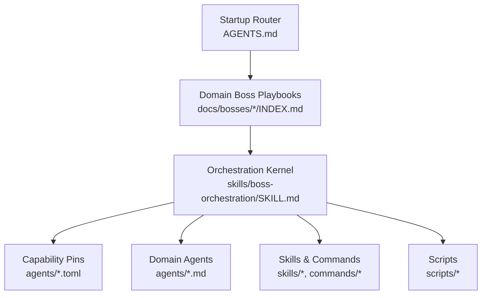
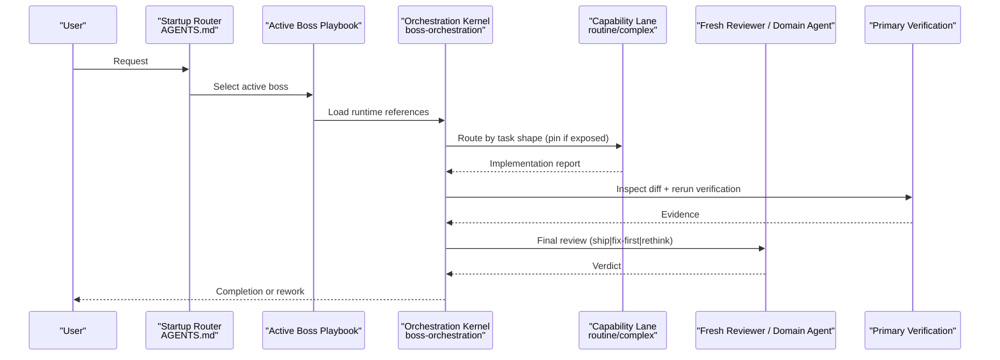
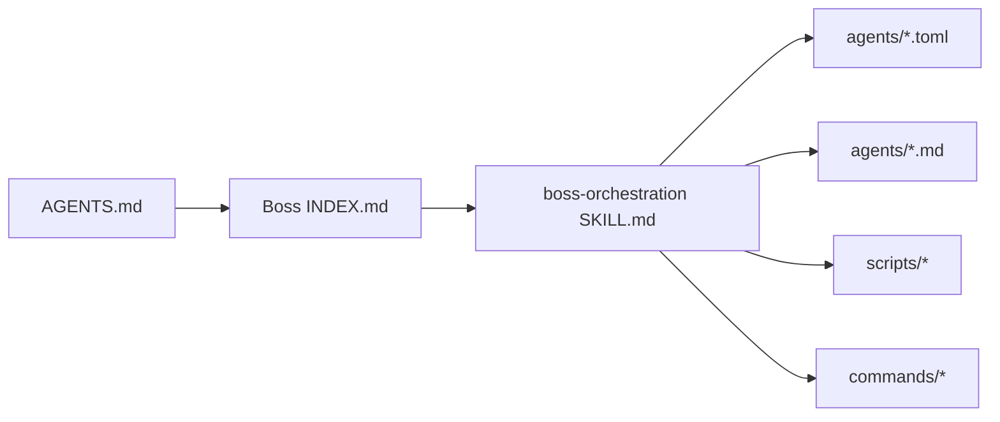

<cite>
**Referenced Files in This Document**
- `fractal-agentic/README.md`
- `fractal-agentic/CUSTOMIZE.md`
- `fractal-agentic/AGENTS.md`
- `fractal-agentic/docs/bosses/INDEX.md`
- `fractal-agentic/skills/boss-orchestration/SKILL.md`
- `fractal-agentic/skills/boss-orchestration/references/capability-mode.md`
- `fractal-agentic/agents/INDEX.md`
- `fractal-agentic/agents/silent-failure-hunter.md`
- `fractal-agentic/agents/performance-optimizer.md`
- `fractal-agentic/agents/security-reviewer.md`
- `fractal-agentic/skills/error-handling/SKILL.md`
- `fractal-agentic/skills/agent-introspection-debugging/SKILL.md`
</cite>

## Table of Contents
1. [Introduction](#introduction)
2. [Project Structure](#project-structure)
3. [Core Components](#core-components)
4. [Architecture Overview](#architecture-overview)
5. [Detailed Component Analysis](#detailed-component-analysis)
6. [Dependency Analysis](#dependency-analysis)
7. [Performance Considerations](#performance-considerations)
8. [Troubleshooting Guide](#troubleshooting-guide)
9. [Conclusion](#conclusion)
10. [Appendices](#appendices)

## Introduction
This document explains how to customize agent behavior in the Fractal Agentic system. It covers implementing task-specific logic, handling different input types, managing execution contexts, and structuring state across tasks. It also documents inter-agent communication protocols, error handling strategies, retry mechanisms, and practical examples from specialized agents: Silent Failure Hunter, Performance Optimizer, and Security Reviewer. Finally, it provides debugging techniques, logging strategies, and performance monitoring guidance for custom agents.

## Project Structure
Fractal Agentic organizes customization into three layers:
- Domain discovery: startup router and boss playbooks
- Armory: skills, domain agents, and commands
- Runtime kernel: orchestration skill, capability pins, and scripts

**Diagram sources**
- `fractal-agentic/AGENTS.md#L1-L106`
- `fractal-agentic/docs/bosses/INDEX.md#L1-L92`
- `fractal-agentic/skills/boss-orchestration/SKILL.md#L1-L312`
- `fractal-agentic/agents/INDEX.md#L1-L42`

**Section sources**
- `fractal-agentic/README.md#L1-L120`
- `fractal-agentic/CUSTOMIZE.md#L1-L120`
- `fractal-agentic/AGENTS.md#L1-L106`
- `fractal-agentic/docs/bosses/INDEX.md#L1-L92`

## Core Components
- Startup router: selects one domain boss per session and enforces handoffs.
- Orchestration kernel: defines non-blocking capability lanes, five-part contracts, verification, and final review with a strict verdict vocabulary.
- Capability lanes: routine implementer, complex implementer, fresh reviewer; exposed via TOML pins when available, otherwise degrade gracefully.
- Domain agents: specialists like security-reviewer, performance-optimizer, silent-failure-hunter used for consults or reviews.
- Skills and commands: reusable capabilities mapped by bosses and invoked through slash commands.

Key behaviors:
- Non-blocking policy ensures project work proceeds even if pins are missing or install is incomplete.
- Session capability mode determines which lanes are usable and how to degrade.
- Five-part contract standardizes delegation and verification.

**Section sources**
- `fractal-agentic/skills/boss-orchestration/SKILL.md#L1-L120`
- `fractal-agentic/skills/boss-orchestration/references/capability-mode.md#L40-L74`
- `fractal-agentic/AGENTS.md#L60-L106`

## Architecture Overview
The runtime orchestrates domain selection, lane routing, verification, and review. It integrates optional capability pins and falls back to primary or general subagents when pins are unavailable.

**Diagram sources**
- `fractal-agentic/AGENTS.md#L60-L106`
- `fractal-agentic/skills/boss-orchestration/SKILL.md#L150-L260`
- `fractal-agentic/skills/boss-orchestration/references/capability-mode.md#L40-L74`

## Detailed Component Analysis

### Orchestration Kernel and State Management
- Session capability mode: plugin_missing, degraded, pinned_partial, pinned. Determines whether to use pins and how to degrade.
- Preflight checks: disk templates check and session exposure check; both are best-effort and never block delivery.
- Five-part contract: objective, files and ownership, interfaces, constraints (injected from boss-prompts), verification commands.
- Verification: primary inspects working tree and diffs, reruns verification commands, and compares evidence against objectives.
- Final review: prefer fresh reviewer pin; fallback to domain specialist, general read-only thread, or structured self-review. Verdict must be exactly ship | fix-first | rethink.

State patterns:
- Session persistence: maintain capability_mode once per session; record pins status on completion reports.
- Variable scoping: keep boss constraints local to worker contracts; do not leak across handoffs unless explicitly carried.
- Data flow between tasks: pass implementation receipts with owned paths, changed paths, command results, gaps, residual risk, and proposed verdict.

**Section sources**
- `fractal-agentic/skills/boss-orchestration/SKILL.md#L30-L120`
- `fractal-agentic/skills/boss-orchestration/SKILL.md#L150-L260`
- `fractal-agentic/skills/boss-orchestration/references/capability-mode.md#L40-L74`

### Inter-Agent Communication Protocols
- Delegation uses the five-part contract; workers return an implementation receipt with explicit fields.
- Handoffs preserve evidence and switch active boss; only the receiving boss’s playbook is loaded.
- Consults at commitment boundaries use bounded packets; reviewers do not implement fixes.
- Shared armory commands provide consistent quality gates and review flows.

**Section sources**
- `fractal-agentic/skills/boss-orchestration/SKILL.md#L210-L260`
- `fractal-agentic/AGENTS.md#L84-L106`

### Error Handling Strategies and Retry Mechanisms
- Fail fast and loudly; typed errors over string messages; user-facing vs developer messages separation.
- Result pattern for expected failures; global exception handlers map codes to responses.
- Retry with exponential backoff and jitter; only retry transient errors; avoid retry storms.
- Introspection debugging captures failure state, diagnoses root cause, applies contained recovery, and produces an introspection report.

Practical patterns:
- Use typed error classes and result wrappers for robust APIs.
- Wrap unreliable calls with retry utilities that respect non-retryable codes.
- When loops stall or context drifts, activate introspection debugging to capture and recover safely.

**Section sources**
- `fractal-agentic/skills/error-handling/SKILL.md#L1-L120`
- `fractal-agentic/skills/error-handling/SKILL.md#L299-L335`
- `fractal-agentic/skills/agent-introspection-debugging/SKILL.md#L1-L120`

### Specialized Agents: Practical Examples

#### Silent Failure Hunter
Focus areas:
- Empty catch blocks, inadequate logging, dangerous fallbacks, error propagation issues, missing error handling around network/file/db paths.
Output format:
- For each finding: location, severity, issue, impact, fix recommendation.

Customization tips:
- Extend hunt targets to include framework-specific anti-patterns.
- Add tooling integrations (e.g., grep patterns for common swallow patterns).
- Enforce minimum logging context requirements and severity rules.

**Section sources**
- `fractal-agentic/agents/silent-failure-hunter.md#L1-L60`

#### Performance Optimizer
Responsibilities:
- Profiling, bundle optimization, runtime optimization, React/render optimization, database/network optimization, memory management.
Analysis commands:
- Bundle analysis, Lighthouse audits, Node profiling, memory analysis, React DevTools profiler, network analysis.
Workflow:
- Identify indicators, algorithmic analysis, React anti-patterns, bundle size strategies, query optimization, network strategies, memory leak detection, testing and budgets.

Customization tips:
- Tailor thresholds to project budgets (bundle size, LCP, INP, CLS).
- Integrate CI checks for performance regressions.
- Provide project-specific optimization recipes (e.g., code splitting points, caching policies).

**Section sources**
- `fractal-agentic/agents/performance-optimizer.md#L1-L120`
- `fractal-agentic/agents/performance-optimizer.md#L120-L260`
- `fractal-agentic/agents/performance-optimizer.md#L260-L460`

#### Security Reviewer
Responsibilities:
- OWASP Top 10 checks, secrets detection, input validation, authentication/authorization, dependency security, best practices.
Workflow:
- Initial scan, OWASP checklist, code pattern review, false positive awareness, emergency response, success metrics.

Customization tips:
- Add project-specific secret scanning patterns and allowed public keys.
- Integrate dependency audit tools and enforce thresholds.
- Define escalation procedures for critical vulnerabilities.

**Section sources**
- `fractal-agentic/agents/security-reviewer.md#L1-L122`

### Implementing Task-Specific Logic and Input Types
- Define clear objectives and interfaces in the five-part contract.
- Use boss constraints to tailor worker prompts for domain-specific rules.
- Handle varied inputs by validating early and mapping to canonical structures.
- Prefer deterministic outcomes for routine lanes; escalate to complex lanes when judgment is required.

**Section sources**
- `fractal-agentic/skills/boss-orchestration/SKILL.md#L170-L210`
- `fractal-agentic/AGENTS.md#L60-L106`

### Managing Execution Contexts
- Set capability_mode once per session and persist it in reports.
- Keep boss constraints scoped to worker contracts; do not leak across handoffs.
- Preserve evidence across phases: spec → implementation → verification → review.

**Section sources**
- `fractal-agentic/skills/boss-orchestration/references/capability-mode.md#L40-L74`
- `fractal-agentic/skills/boss-orchestration/SKILL.md#L210-L260`

## Dependency Analysis
The orchestration kernel depends on:
- Startup router for boss selection and handoffs
- Boss playbooks for domain constraints and verification defaults
- Capability pins for optimized lanes (best effort)
- Domain agents for specialist consults and reviews
- Scripts for installation, inspection, and health checks

**Diagram sources**
- `fractal-agentic/AGENTS.md#L1-L106`
- `fractal-agentic/docs/bosses/INDEX.md#L1-L92`
- `fractal-agentic/skills/boss-orchestration/SKILL.md#L1-L120`

**Section sources**
- `fractal-agentic/CUSTOMIZE.md#L49-L120`
- `fractal-agentic/README.md#L280-L340`

## Performance Considerations
- Prefer routine lanes for mechanical work; escalate to complex lanes for judgment-heavy tasks.
- Use parallel independent work where safe; serialize shared dependencies.
- Monitor Core Web Vitals and bundle sizes; integrate CI checks for regressions.
- Apply caching, debouncing, and batching for network operations.
- Profile CPU and memory hotspots; eliminate unnecessary re-renders and computations.

[No sources needed since this section provides general guidance]

## Troubleshooting Guide
Common symptoms and actions:
- Spawn types missing: run installer and start a new task.
- Installer differs: resolve destination vs template; installer will not overwrite differing files.
- Model/effort unknown: inspect agent runtime if rollout exists; continue with available evidence.
- Reviewer mutated files: stop and assess residual risk; do not claim read-only unless observed.
- Missing skill: confirm vendored skill exists under skills/<id>/SKILL.md.
- Wrong stack defaults: re-check router and active boss stack gate.

Debugging techniques:
- Activate introspection debugging to capture failure state, diagnose root cause, apply contained recovery, and produce an introspection report.
- Use verification-loop after recovery to ensure changes are correct.
- Log structured errors with codes and messages; separate user-facing text from developer logs.

**Section sources**
- `fractal-agentic/CUSTOMIZE.md#L560-L579`
- `fractal-agentic/skills/agent-introspection-debugging/SKILL.md#L1-L166`
- `fractal-agentic/skills/error-handling/SKILL.md#L336-L368`

## Conclusion
Fractal Agentic provides a robust, non-blocking orchestration layer that composes domain bosses, capability lanes, and specialist agents. By following the five-part contract, enforcing verification and review, and leveraging error handling and introspection debugging, you can build reliable, high-quality custom agents tailored to specific domains. Use the provided scripts and indexes to maintain consistency and health across your customized armory.

[No sources needed since this section summarizes without analyzing specific files]

## Appendices

### Adding or Customizing Agents and Skills
- Place skills under skills/<id>/ with a SKILL.md frontmatter; map them into owning boss playbooks.
- Create domain agents under agents/<name>.md; update agents/INDEX.md and boss mappings.
- For capability pins, edit TOML files and synchronize all references (SKILL.md, role-contracts, verify.sh, README).

**Section sources**
- `fractal-agentic/CUSTOMIZE.md#L78-L170`
- `fractal-agentic/CUSTOMIZE.md#L220-L278`
- `fractal-agentic/agents/INDEX.md#L1-L42`