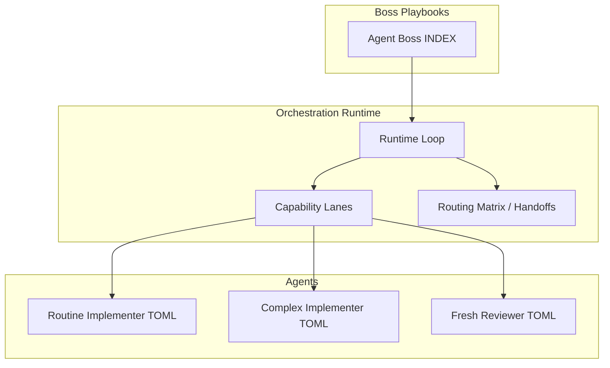
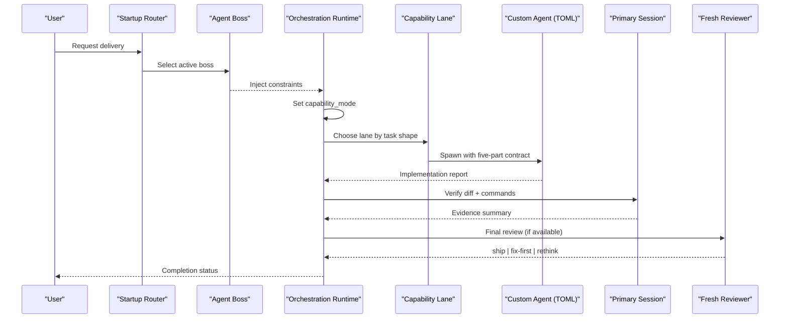
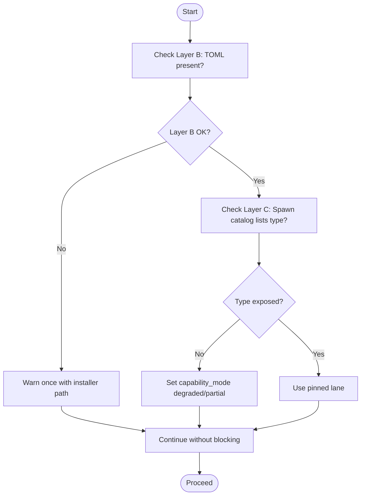
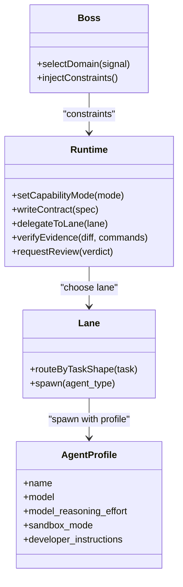
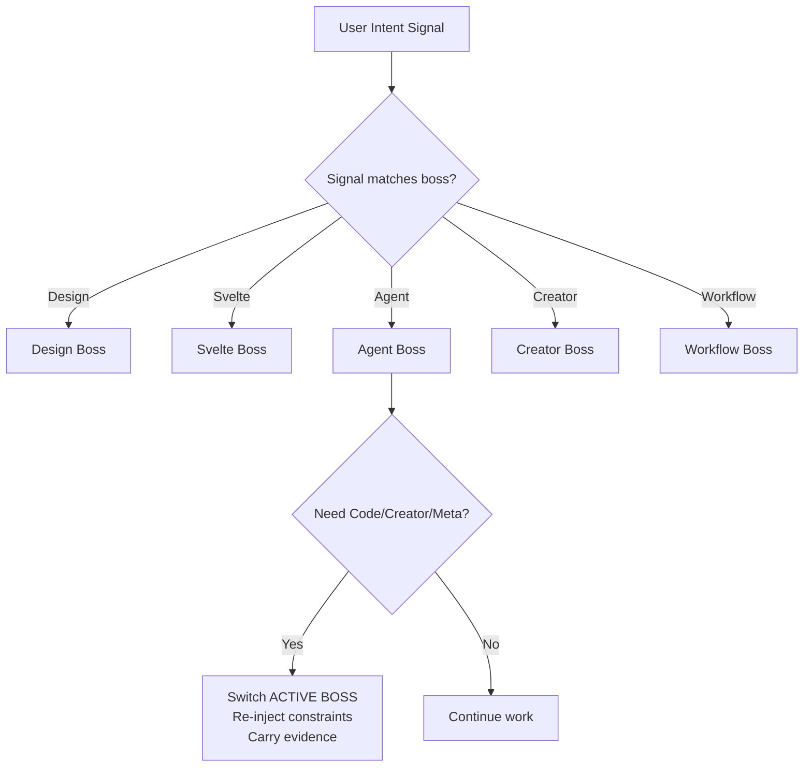
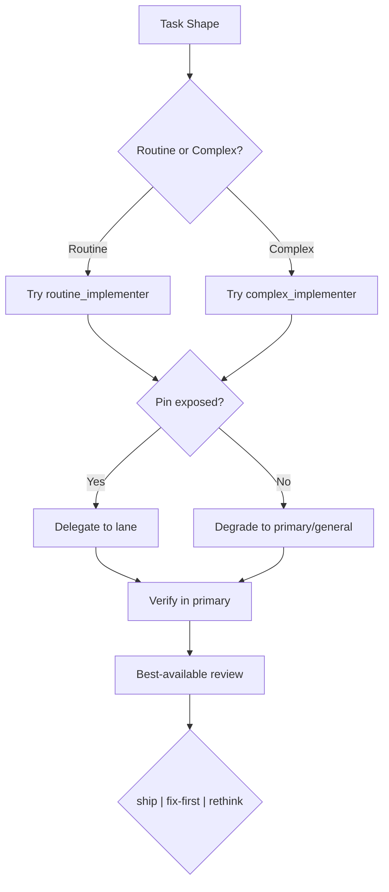
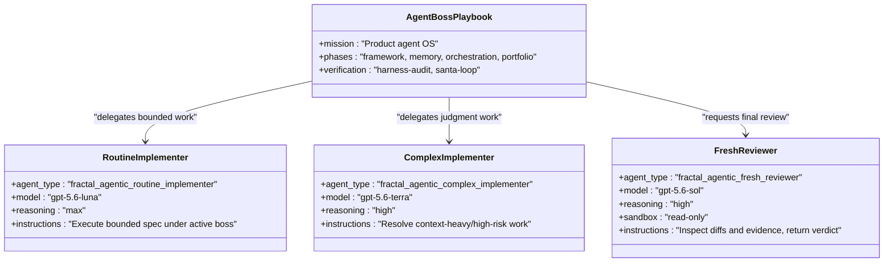
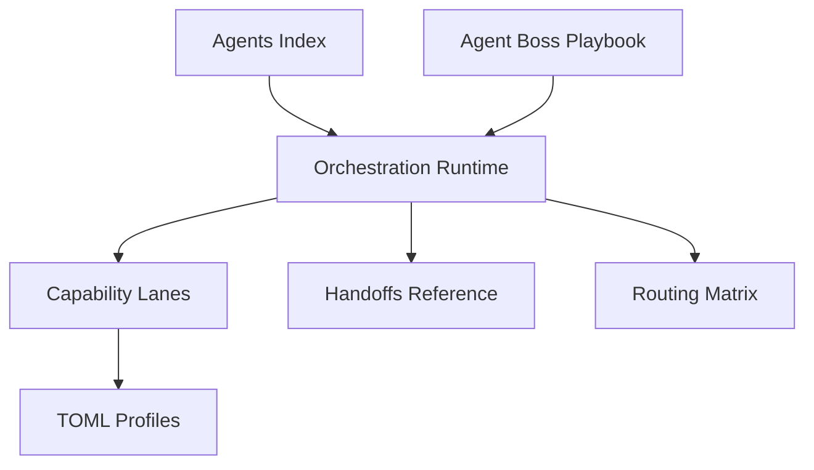

<cite>
**Referenced Files in This Document**
- `fractal-agentic/bosses/agent/INDEX.md`
- `fractal-agentic/docs/orchestration/capability-lanes.md`
- `fractal-agentic/docs/orchestration/runtime.md`
- `fractal-agentic/skills/boss-orchestration/SKILL.md`
- `fractal-agentic/agents/INDEX.md`
- `fractal-agentic/agents/fractal-agentic-routine-implementer.toml`
- `fractal-agentic/agents/fractal-agentic-complex-implementer.toml`
- `fractal-agentic/agents/fractal-agentic-fresh-reviewer.toml`
- `fractal-agentic/skills/boss-orchestration/references/handoffs.md`
</cite>

## Table of Contents
1. [Introduction](#introduction)
2. [Project Structure](#project-structure)
3. [Core Components](#core-components)
4. [Architecture Overview](#architecture-overview)
5. [Detailed Component Analysis](#detailed-component-analysis)
6. [Dependency Analysis](#dependency-analysis)
7. [Performance Considerations](#performance-considerations)
8. [Troubleshooting Guide](#troubleshooting-guide)
9. [Conclusion](#conclusion)

## Introduction
This document explains how to integrate custom agents with the boss orchestration system. It covers agent registration, capability discovery, routing rules, handoff protocols between bosses and agents, task delegation patterns, selection criteria, priority handling, fallback strategies, testing and monitoring practices, and troubleshooting common integration issues. The guidance is grounded in the repository’s orchestration runtime, capability lanes, and boss playbooks.

## Project Structure
The boss orchestration system centers around:
- Boss playbooks that define mission, boundaries, and verification defaults for each domain (e.g., Agent Boss).
- Orchestration runtime that selects a boss, sets capability mode, writes contracts, implements, verifies, and reviews deliverables.
- Capability lanes implemented as TOML profiles that expose optional pins for routine implementation, complex implementation, and fresh review.
- A startup router and references that govern routing, handoffs, and non-blocking progression.

**Diagram sources**
- `fractal-agentic/bosses/agent/INDEX.md#L1-L146`
- `fractal-agentic/docs/orchestration/runtime.md#L1-L53`
- `fractal-agentic/docs/orchestration/capability-lanes.md#L1-L64`
- `fractal-agentic/skills/boss-orchestration/SKILL.md#L1-L312`
- `fractal-agentic/agents/fractal-agentic-routine-implementer.toml#L1-L19`
- `fractal-agentic/agents/fractal-agentic-complex-implementer.toml#L1-L19`
- `fractal-agentic/agents/fractal-agentic-fresh-reviewer.toml#L1-L20`

**Section sources**
- `fractal-agentic/bosses/agent/INDEX.md#L1-L146`
- `fractal-agentic/docs/orchestration/runtime.md#L1-L53`
- `fractal-agentic/docs/orchestration/capability-lanes.md#L1-L64`
- `fractal-agentic/skills/boss-orchestration/SKILL.md#L1-L312`

## Core Components
- Agent Boss playbook: defines ownership of product agent systems (harness, memory, evals, multi-agent orchestration, MCP tool servers), mapped skills, commands, phases, and handoffs.
- Orchestration runtime: enforces a non-blocking policy, sets capability mode per session, writes five-part contracts, delegates by lane, verifies evidence, and requires a final review with ship|fix-first|rethink verdicts.
- Capability lanes: optional host-recognized roles exposed via spawn catalog; degrade gracefully when unavailable.
- Custom agent profiles: TOML files defining agent_type, model, reasoning effort, sandbox mode, and developer instructions for routine, complex, and reviewer lanes.

Key responsibilities:
- Boss selection and constraints injection into worker contracts.
- Lane selection based on task shape and availability.
- Verification in the primary session before acceptance.
- Final review using best-available reviewer or domain specialist.

**Section sources**
- `fractal-agentic/bosses/agent/INDEX.md#L1-L146`
- `fractal-agentic/skills/boss-orchestration/SKILL.md#L1-L312`
- `fractal-agentic/docs/orchestration/capability-lanes.md#L1-L64`

## Architecture Overview
The integration architecture connects bosses, runtime, capability lanes, and custom agents through a clear flow:
- Startup router selects an authoritative boss.
- Runtime sets capability_mode once per session based on plugin install and session exposure.
- Contracts are written with objective, ownership, interfaces, constraints, and verification.
- Implementation is delegated to routine or complex lanes when available; otherwise degrades to primary/general implementers.
- Verification occurs in the primary session with real diffs and commands.
- Final review uses a fresh reviewer pin if available, else domain specialists or self-review.

**Diagram sources**
- `fractal-agentic/docs/orchestration/runtime.md#L1-L53`
- `fractal-agentic/skills/boss-orchestration/SKILL.md#L1-L312`
- `fractal-agentic/docs/orchestration/capability-lanes.md#L1-L64`
- `fractal-agentic/agents/fractal-agentic-routine-implementer.toml#L1-L19`
- `fractal-agentic/agents/fractal-agentic-complex-implementer.toml#L1-L19`
- `fractal-agentic/agents/fractal-agentic-fresh-reviewer.toml#L1-L20`

## Detailed Component Analysis

### Agent Registration and Capability Discovery
- Registration surface: TOML profiles under agents/ define agent_type, model, reasoning effort, sandbox mode, and developer_instructions. These are templates installed to the host agents directory.
- Discovery layers:
  - Layer B (Install): Check disk presence of TOML files.
  - Layer C (Session): Confirm types are listed in the current task’s spawn catalog; only this layer proves pins usable mid-session.
- Non-blocking policy: Missing installs or missing spawn types never block work; degrade gracefully.

**Diagram sources**
- `fractal-agentic/skills/boss-orchestration/SKILL.md#L108-L167`
- `fractal-agentic/docs/orchestration/capability-lanes.md#L22-L45`

**Section sources**
- `fractal-agentic/skills/boss-orchestration/SKILL.md#L108-L167`
- `fractal-agentic/docs/orchestration/capability-lanes.md#L1-L64`

### Routing Rules and Task Delegation Patterns
- Domain selection: Decision tree maps signals to active boss (e.g., UI craft → Design, Svelte implementation → Svelte, product agent harness → Agent).
- Capability routing: Routine lane for bounded/spec-driven tasks; Complex lane for judgment-heavy or high-blast-radius tasks.
- Delegation pattern: Write a five-part contract (objective, active boss + stack defaults, files and ownership, interfaces, constraints (+ boss-prompts bullets), verification (exact commands + success criteria), return → implementation report).
- Parallelism: Independent non-overlapping work may run in parallel; shared files and dependency chains run serially.

**Diagram sources**
- `fractal-agentic/skills/boss-orchestration/references/handoffs.md#L6-L33`
- `fractal-agentic/docs/orchestration/runtime.md#L11-L35`
- `fractal-agentic/skills/boss-orchestration/SKILL.md#L169-L208`
- `fractal-agentic/agents/fractal-agentic-routine-implementer.toml#L1-L19`
- `fractal-agentic/agents/fractal-agentic-complex-implementer.toml#L1-L19`
- `fractal-agentic/agents/fractal-agentic-fresh-reviewer.toml#L1-L20`

**Section sources**
- `fractal-agentic/skills/boss-orchestration/references/handoffs.md#L6-L33`
- `fractal-agentic/docs/orchestration/runtime.md#L11-L35`
- `fractal-agentic/skills/boss-orchestration/SKILL.md#L169-L208`

### Handoff Protocols Between Bosses and Agents
- Decision tree maps user intent to the appropriate boss.
- Handoff table specifies when to switch bosses (e.g., Svelte → Design for polish, Creator → Agent for AI features, Agent → Code for secrets/tools/user data).
- Orchestration behavior on handoff: finish or pause cleanly, switch ACTIVE BOSS, re-inject constraints, carry VERIFICATION EVIDENCE forward.

**Diagram sources**
- `fractal-agentic/skills/boss-orchestration/references/handoffs.md#L6-L42`

**Section sources**
- `fractal-agentic/skills/boss-orchestration/references/handoffs.md#L6-L42`

### Configuration of Agent Selection Criteria, Priority Handling, and Fallback Strategies
- Selection criteria:
  - Task shape determines lane choice (routine vs complex).
  - Session capability_mode set once per task based on plugin install and spawn catalog exposure.
- Priority handling:
  - Prefer pins when present; degrade without ceremony when not.
  - One worker per owned file set or bounded responsibility.
- Fallback strategies:
  - When pins are absent, use primary or general implementers.
  - For review, prefer fresh reviewer pin → domain specialist → general read-only thread → structured self-review.
  - Always report capability_mode and pins status honestly.

**Diagram sources**
- `fractal-agentic/skills/boss-orchestration/SKILL.md#L169-L208`
- `fractal-agentic/docs/orchestration/capability-lanes.md#L32-L54`

**Section sources**
- `fractal-agentic/skills/boss-orchestration/SKILL.md#L169-L208`
- `fractal-agentic/docs/orchestration/capability-lanes.md#L32-L54`

### Examples: Specialized Agents Integrating with Agent Boss
- Capability lane configuration:
  - Routine lane: agent_type fractal_agentic_routine_implementer, model gpt-5.6-luna, max reasoning effort.
  - Complex lane: agent_type fractal_agentic_complex_implementer, model gpt-5.6-terra, high reasoning effort.
  - Fresh reviewer: agent_type fractal_agentic_fresh_reviewer, model gpt-5.6-sol, high reasoning effort, read-only sandbox.
- Workflow participation:
  - Agent Boss owns harness, memory, evals, multi-agent orchestration, MCP tools.
  - Use continuous loops, team/parallel orchestration, and safety guard when building product agents.
  - Verification defaults include harness audits and santa-loop for release-critical checks.

**Diagram sources**
- `fractal-agentic/agents/fractal-agentic-routine-implementer.toml#L1-L19`
- `fractal-agentic/agents/fractal-agentic-complex-implementer.toml#L1-L19`
- `fractal-agentic/agents/fractal-agentic-fresh-reviewer.toml#L1-L20`
- `fractal-agentic/bosses/agent/INDEX.md#L1-L146`

**Section sources**
- `fractal-agentic/agents/fractal-agentic-routine-implementer.toml#L1-L19`
- `fractal-agentic/agents/fractal-agentic-complex-implementer.toml#L1-L19`
- `fractal-agentic/agents/fractal-agentic-fresh-reviewer.toml#L1-L20`
- `fractal-agentic/bosses/agent/INDEX.md#L1-L146`

## Dependency Analysis
- Boss playbooks depend on orchestration runtime for execution policy and lane selection.
- Runtime depends on capability lanes and references (routing matrix, handoffs, role contracts).
- Custom agents depend on TOML profiles for identity, model, and instructions.
- Agents index provides live inventory and descriptions for discoverability.

**Diagram sources**
- `fractal-agentic/agents/INDEX.md#L1-L42`
- `fractal-agentic/bosses/agent/INDEX.md#L1-L146`
- `fractal-agentic/skills/boss-orchestration/SKILL.md#L1-L312`
- `fractal-agentic/skills/boss-orchestration/references/handoffs.md#L1-L57`
- `fractal-agentic/agents/fractal-agentic-routine-implementer.toml#L1-L19`
- `fractal-agentic/agents/fractal-agentic-complex-implementer.toml#L1-L19`
- `fractal-agentic/agents/fractal-agentic-fresh-reviewer.toml#L1-L20`

**Section sources**
- `fractal-agentic/agents/INDEX.md#L1-L42`
- `fractal-agentic/bosses/agent/INDEX.md#L1-L146`
- `fractal-agentic/skills/boss-orchestration/SKILL.md#L1-L312`
- `fractal-agentic/skills/boss-orchestration/references/handoffs.md#L1-L57`

## Performance Considerations
- Prefer pins when present; degrade gracefully to avoid stalls.
- Run independent work in parallel where possible; serialize shared dependencies.
- Keep contracts minimal and precise to reduce rework.
- Use verification commands early to catch failures before review.
- Avoid silent substitution of roles/models; report actual usage and capability_mode.

[No sources needed since this section provides general guidance]

## Troubleshooting Guide
Common issues and resolutions:
- Missing plugin or spawn types:
  - Check Layer B (disk templates) and Layer C (session spawn catalog).
  - If missing, warn once and proceed; do not block delivery.
- Pins not used but claimed:
  - Report pins: unverified or partial; never claim a pin was used when it was not.
- Failed lane execution:
  - Correct the spec and retry; do not repeat unchanged prompts.
- Review verdicts:
  - ship: report completion with evidence.
  - fix-first: apply named fixes, re-verify, re-review.
  - rethink: return to architecture; do not claim completion.

**Section sources**
- `fractal-agentic/skills/boss-orchestration/SKILL.md#L108-L167`
- `fractal-agentic/skills/boss-orchestration/SKILL.md#L210-L258`
- `fractal-agentic/docs/orchestration/capability-lanes.md#L46-L54`

## Conclusion
Integrating custom agents with the boss orchestration system involves registering TOML profiles, discovering capabilities at runtime, delegating work via capability lanes, verifying evidence in the primary session, and obtaining a final review. The system enforces a non-blocking policy, ensuring delivery proceeds even when optional infrastructure is missing. By following the runtime loop, capability lanes, and handoff protocols, specialized agents can seamlessly participate in multi-agent workflows under the Agent Boss.

[No sources needed since this section summarizes without analyzing specific files]