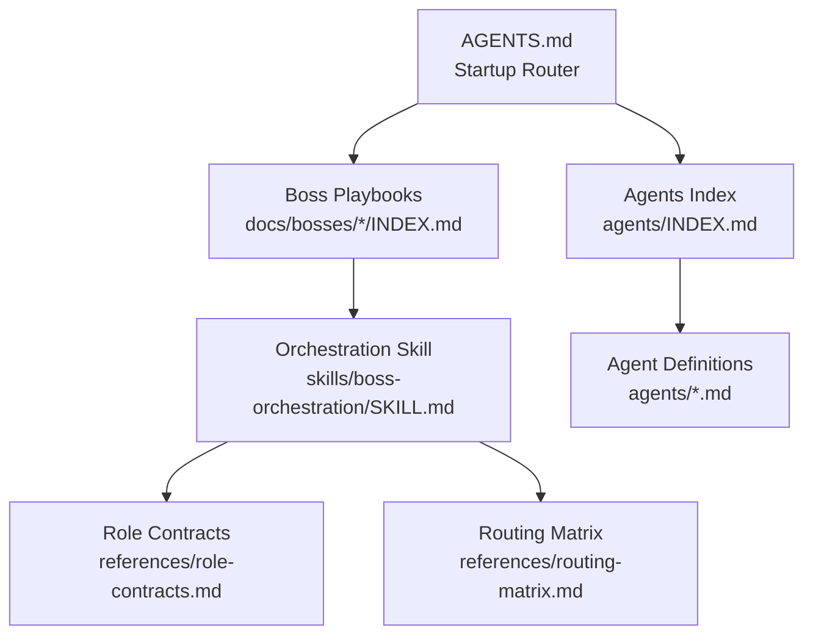
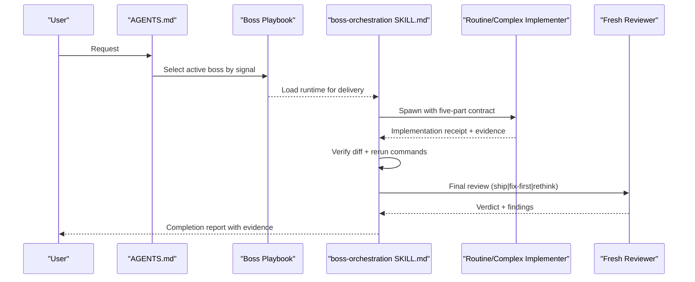
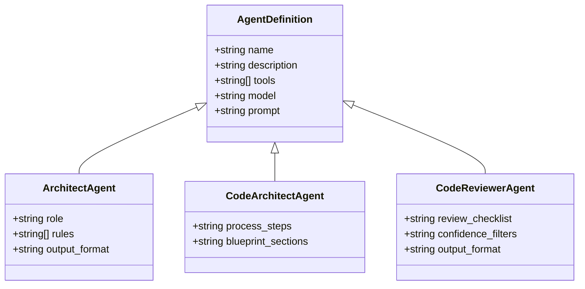
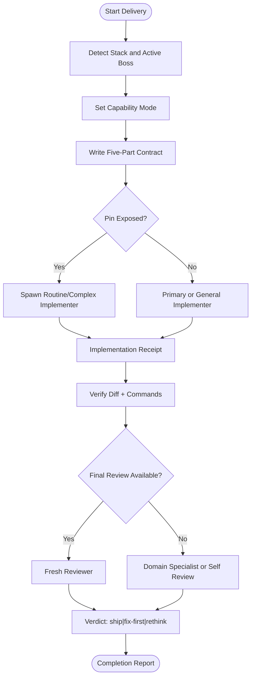
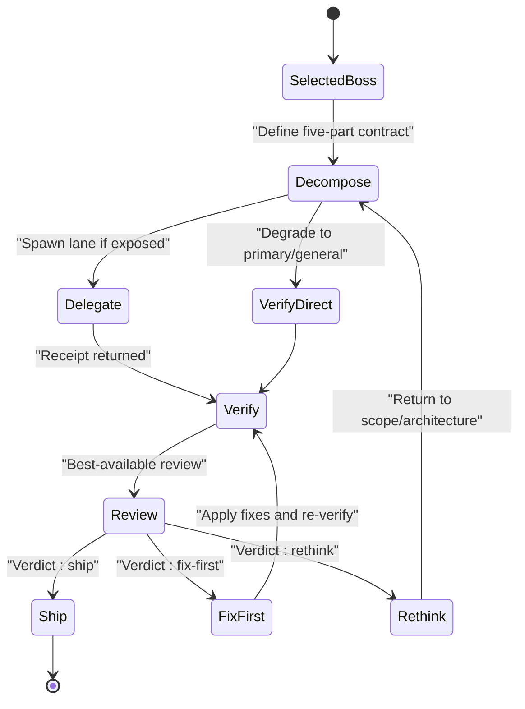
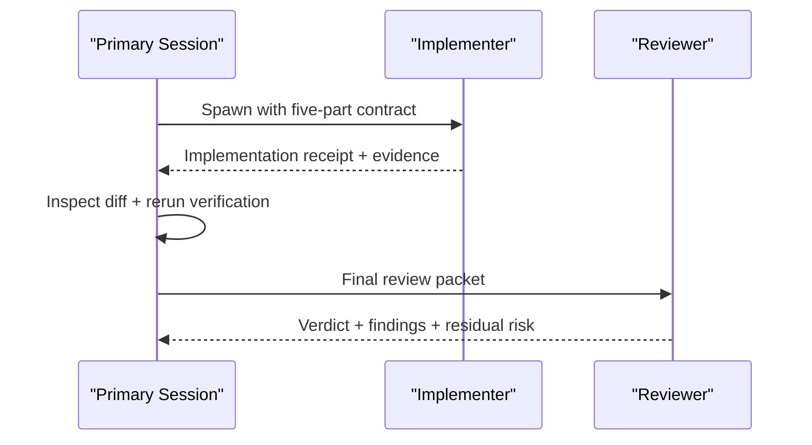
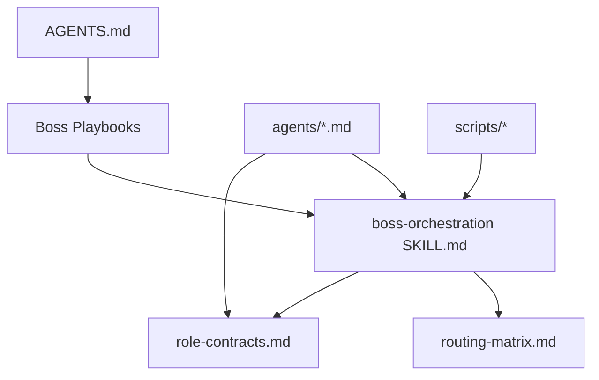

<cite>
**Referenced Files in This Document**
- `fractal-agentic/README.md`
- `fractal-agentic/AGENTS.md`
- `fractal-agentic/SOUL.md`
- `fractal-agentic/agents/INDEX.md`
- `fractal-agentic/agents/architect.md`
- `fractal-agentic/agents/code-architect.md`
- `fractal-agentic/agents/code-reviewer.md`
- `fractal-agentic/skills/boss-orchestration/SKILL.md`
- `fractal-agentic/skills/boss-orchestration/references/role-contracts.md`
- `fractal-agentic/skills/boss-orchestration/references/routing-matrix.md`
- `fractal-agentic/docs/orchestration/INDEX.md`
- `fractal-agentic/CUSTOMIZE.md`
</cite>

## Table of Contents
1. [Introduction](#introduction)
2. [Project Structure](#project-structure)
3. [Core Components](#core-components)
4. [Architecture Overview](#architecture-overview)
5. [Detailed Component Analysis](#detailed-component-analysis)
6. [Dependency Analysis](#dependency-analysis)
7. [Performance Considerations](#performance-considerations)
8. [Troubleshooting Guide](#troubleshooting-guide)
9. [Conclusion](#conclusion)
10. [Appendices](#appendices)

## Introduction
This document explains how to develop custom agents for the Fractal Agentic system. It covers agent definition structure, behavior customization, capability lanes, integration with the boss orchestration runtime, lifecycle and state management, communication protocols, and practical examples from existing agents such as Architect, Code Architect, and specialized reviewers. It also includes testing strategies, debugging techniques, and performance optimization patterns aligned with the non-blocking policy and best-available review model.

## Project Structure
Fractal Agentic organizes agents, skills, commands, and orchestration references into a clear hierarchy:
- Agents are defined as markdown files under agents/, each with frontmatter metadata (name, description, tools, model).
- The startup router AGENTS.md selects one domain boss and delegates to its playbook.
- The orchestration runtime is implemented as a skill under skills/boss-orchestration/ with reference contracts and routing matrices.
- Domain bosses and activation commands live under docs/bosses/ and commands/.

**Diagram sources**
- `fractal-agentic/AGENTS.md#L1-L106`
- `fractal-agentic/skills/boss-orchestration/SKILL.md#L1-L312`
- `fractal-agentic/skills/boss-orchestration/references/role-contracts.md#L1-L245`
- `fractal-agentic/skills/boss-orchestration/references/routing-matrix.md#L1-L65`
- `fractal-agentic/agents/INDEX.md#L1-L42`

**Section sources**
- `fractal-agentic/README.md#L1-L440`
- `fractal-agentic/AGENTS.md#L1-L106`
- `fractal-agentic/SOUL.md#L1-L53`

## Core Components
- Startup router and identity:
  - AGENTS.md defines authority, precedence, trivial exemption, boss selection, stack detection, handoffs, and non-blocking capability rules.
  - SOUL.md captures core identity, principles, and orchestration philosophy.
- Orchestration runtime:
  - skills/boss-orchestration/SKILL.md implements the delivery loop, capability mode, preflight checks, verification, and final review.
  - role-contracts.md defines the five-part contract, implementer prompts, reviewer packet, and consult flows.
  - routing-matrix.md maps task shape to domain and capability lanes.
- Agent definitions:
  - agents/INDEX.md catalogs available agents.
  - Example agents include architect.md, code-architect.md, and code-reviewer.md.

Key responsibilities:
- Primary session owns intent, architecture, decomposition, verification evidence, and final acceptance.
- Capability lanes (routine, complex, fresh reviewer) are optional pins; missing pins degrade gracefully without blocking work.
- Non-blocking rule ensures project work always proceeds even if install or spawn types are absent.

**Section sources**
- `fractal-agentic/AGENTS.md#L1-L106`
- `fractal-agentic/SOUL.md#L1-L53`
- `fractal-agentic/skills/boss-orchestration/SKILL.md#L1-L312`
- `fractal-agentic/skills/boss-orchestration/references/role-contracts.md#L1-L245`
- `fractal-agentic/skills/boss-orchestration/references/routing-matrix.md#L1-L65`
- `fractal-agentic/agents/INDEX.md#L1-L42`

## Architecture Overview
The system separates domain selection (Axis A) from capability selection (Axis B), then enforces verification and best-available review before claiming completion.

**Diagram sources**
- `fractal-agentic/AGENTS.md#L1-L106`
- `fractal-agentic/skills/boss-orchestration/SKILL.md#L1-L312`
- `fractal-agentic/skills/boss-orchestration/references/role-contracts.md#L1-L245`

## Detailed Component Analysis

### Agent Definition Structure
- Frontmatter fields:
  - name: unique identifier used for discovery and mapping.
  - description: concise purpose for indexes and activation.
  - tools: allowed tool set (Read, Write, Edit, Grep, Glob, Bash).
  - model: inheritance or explicit model pin when supported.
- Behavior customization:
  - Prompt sections define role, rules, output format, and constraints.
  - Defense baseline prevents persona override, secret leakage, and unsafe outputs.
- Examples:
  - Architect agent focuses on system design, scalability, and trade-off analysis.
  - Code Architect analyzes existing patterns and produces implementation blueprints with file paths, interfaces, data flow, and build order.
  - Code Reviewer applies confidence-based filtering, security and quality checklists, and structured verdicts.

**Diagram sources**
- `fractal-agentic/agents/architect.md#L1-L249`
- `fractal-agentic/agents/code-architect.md#L1-L86`
- `fractal-agentic/agents/code-reviewer.md#L1-L329`

**Section sources**
- `fractal-agentic/agents/architect.md#L1-L249`
- `fractal-agentic/agents/code-architect.md#L1-L86`
- `fractal-agentic/agents/code-reviewer.md#L1-L329`
- `fractal-agentic/agents/INDEX.md#L1-L42`

### Integration with Boss Orchestration System
- Five-part contract:
  - OBJECTIVE, FILES AND OWNERSHIP, INTERFACES, CONSTRAINTS (including ACTIVE BOSS bullets), VERIFICATION.
  - Workers return an IMPLEMENTATION RECEIPT with STATUS, CHANGED PATHS, COMMAND RESULTS, JUDGMENT CALLS, GAPS, RESIDUAL RISK, PROPOSED VERDICT.
- Capability lanes:
  - Routine lane for mechanical/spec-driven tasks.
  - Complex lane for judgment-heavy tasks.
  - Fresh reviewer for final read-only review with ship|fix-first|rethink verdict.
- Preflight and progression:
  - Optional disk check via installer script.
  - Session exposure determined by spawn catalog; degraded mode degrades gracefully.
  - Non-blocking policy ensures delivery continues regardless of pin availability.

**Diagram sources**
- `fractal-agentic/skills/boss-orchestration/SKILL.md#L1-L312`
- `fractal-agentic/skills/boss-orchestration/references/role-contracts.md#L1-L245`
- `fractal-agentic/skills/boss-orchestration/references/routing-matrix.md#L1-L65`

**Section sources**
- `fractal-agentic/skills/boss-orchestration/SKILL.md#L1-L312`
- `fractal-agentic/skills/boss-orchestration/references/role-contracts.md#L1-L245`
- `fractal-agentic/skills/boss-orchestration/references/routing-matrix.md#L1-L65`

### Lifecycle and State Management
- Lifecycle phases:
  - Selection (router → boss playbook).
  - Decomposition (primary defines objective, ownership, interfaces, constraints, verification).
  - Delegation (spawn routine/complex lanes when exposed).
  - Verification (primary inspects diff and reruns commands).
  - Review (fresh reviewer or domain specialist/self-review).
  - Acceptance (verdict drives next action: ship, fix-first, rethink).
- State management:
  - capability_mode set once per session: plugin_missing, degraded, pinned_partial, pinned.
  - Evidence accumulation: receipts, command outputs, diffs, and artifacts.
  - Handoff protocol preserves evidence and resets active boss context.

**Diagram sources**
- `fractal-agentic/skills/boss-orchestration/SKILL.md#L1-L312`
- `fractal-agentic/skills/boss-orchestration/references/role-contracts.md#L1-L245`

**Section sources**
- `fractal-agentic/skills/boss-orchestration/SKILL.md#L1-L312`
- `fractal-agentic/skills/boss-orchestration/references/role-contracts.md#L1-L245`

### Communication Protocols with Other Agents
- Shared implementation contract:
  - Enforces consistent OBJECTIVE, OWNERSHIP, INTERFACES, CONSTRAINTS, VERIFICATION across all workers.
  - Requires exact commands and concrete expected results.
- Review packet:
  - STATED GOAL, ACTIVE BOSS, ACCUMULATED CHANGE SET, INTERFACES AND CONSTRAINTS, VERIFICATION EVIDENCE, IMPLEMENTATION RECEIPT.
  - Verdict must be exactly ship|fix-first|rethink with decisive reason and residual risk.
- Consult flows:
  - Commitment-boundary consult uses fresh reviewer thread with read-only profile.
  - Domain specialist consult preferred when pins are absent.

**Diagram sources**
- `fractal-agentic/skills/boss-orchestration/references/role-contracts.md#L1-L245`

**Section sources**
- `fractal-agentic/skills/boss-orchestration/references/role-contracts.md#L1-L245`

### Practical Examples from Existing Agents
- Architect:
  - Focuses on system design, scalability, and architectural decision records.
  - Uses Read/Grep/Glob tools; inherits model; emphasizes modularity, performance, and maintainability.
- Code Architect:
  - Analyzes existing patterns and conventions; produces implementation blueprints with file paths, interfaces, data flow, and build sequence.
  - Tools include Read/Grep/Glob/Bash; outputs structured markdown with decisions, files to create/modify, and build order.
- Code Reviewer:
  - Applies confidence-based filtering and detailed checklists for security, quality, React/Next.js, Node.js backend, performance, and best practices.
  - Produces severity-tagged findings and summary verdicts; avoids false positives and noise.

**Section sources**
- `fractal-agentic/agents/architect.md#L1-L249`
- `fractal-agentic/agents/code-architect.md#L1-L86`
- `fractal-agentic/agents/code-reviewer.md#L1-L329`

### Creating Specialized Agents with Metadata and Capabilities
- Define agent frontmatter:
  - name, description, tools, model.
- Provide behavior customization:
  - Role definition, rules, output format, and defense baseline.
- Map into boss armory:
  - Add row to agents/INDEX.md; link from owning nested boss playbook.
- Integrate with orchestration:
  - If it affects delivery constraints, update boss-prompts.md and routing-matrix.md.
  - For capability pins, add TOML template and update installer/verify scripts.

**Section sources**
- `fractal-agentic/agents/INDEX.md#L1-L42`
- `fractal-agentic/CUSTOMIZE.md#L174-L218`
- `fractal-agentic/skills/boss-orchestration/SKILL.md#L108-L168`

### Handling Different Task Types
- Routing matrix guides lane selection:
  - Routine for spec-driven mechanical work.
  - Complex for judgment-heavy tasks.
  - Escalate after misclassification with corrected spec.
- Stack detection influences primary reviewers:
  - Svelte, React, Vue, Flutter, Rust, polyglot.
- Parallelism and serial execution:
  - Independent non-overlapping work may run in parallel; shared dependencies require serial execution.

**Section sources**
- `fractal-agentic/skills/boss-orchestration/references/routing-matrix.md#L1-L65`
- `fractal-agentic/skills/boss-orchestration/SKILL.md#L169-L209`

### Integrating with the Skill System
- Skills are vendored under skills/<id>/ with SKILL.md defining name/description/instructions.
- Map skills into boss playbooks for discovery.
- Update orchestration references if skills affect constraints or routing.
- Health checks ensure critical skills exist and paths resolve correctly.

**Section sources**
- `fractal-agentic/CUSTOMIZE.md#L78-L150`
- `fractal-agentic/skills/boss-orchestration/SKILL.md#L1-L312`

## Dependency Analysis
- Startup router depends on boss playbooks and orchestration skill.
- Orchestration skill depends on role contracts and routing matrix.
- Agents depend on boss constraints and skill references.
- Scripts provide installer, verify, and inspection utilities.

**Diagram sources**
- `fractal-agentic/AGENTS.md#L1-L106`
- `fractal-agentic/skills/boss-orchestration/SKILL.md#L1-L312`
- `fractal-agentic/skills/boss-orchestration/references/role-contracts.md#L1-L245`
- `fractal-agentic/skills/boss-orchestration/references/routing-matrix.md#L1-L65`

**Section sources**
- `fractal-agentic/AGENTS.md#L1-L106`
- `fractal-agentic/skills/boss-orchestration/SKILL.md#L1-L312`

## Performance Considerations
- Prefer routine lane for mechanical work; escalate only when justified.
- Use cost discipline: route by task shape, not prestige.
- Avoid unnecessary complexity; keep verification commands minimal and deterministic.
- Parallelize independent work; serialize shared dependencies.
- Observe model/effort notes when observable; do not claim unverified pins.

[No sources needed since this section provides general guidance]

## Troubleshooting Guide
- Missing spawn types:
  - Run installer script; start a new task to refresh spawn catalog.
- Installer check fails:
  - Diff destination vs template; resolve deliberately; installer will not overwrite differing files.
- Model/effort unknown:
  - Use inspector script if rollout exists; otherwise continue with available evidence.
- Reviewer mutated files:
  - Stop; do not claim read-only; capture residual risk.
- Missing skill:
  - Confirm skill directory exists; all skills are vendored locally.
- Wrong stack defaults:
  - Re-read router and active boss stack gate; monorepo default is Svelte.

**Section sources**
- `fractal-agentic/CUSTOMIZE.md#L561-L571`
- `fractal-agentic/skills/boss-orchestration/SKILL.md#L108-L168`

## Conclusion
Custom agent development in Fractal Agentic centers on well-defined agent structures, robust orchestration contracts, and non-blocking capability lanes. By following the startup router, using the five-part contract, and adhering to best-available review, developers can create specialized agents that integrate seamlessly with the boss orchestration system while maintaining high quality and safety standards.

[No sources needed since this section summarizes without analyzing specific files]

## Appendices
- Orchestration overview and progressive reading path:
  - See docs/orchestration/INDEX.md for runtime loop, capability lanes, and non-blocking policy.

**Section sources**
- `fractal-agentic/docs/orchestration/INDEX.md#L1-L71`