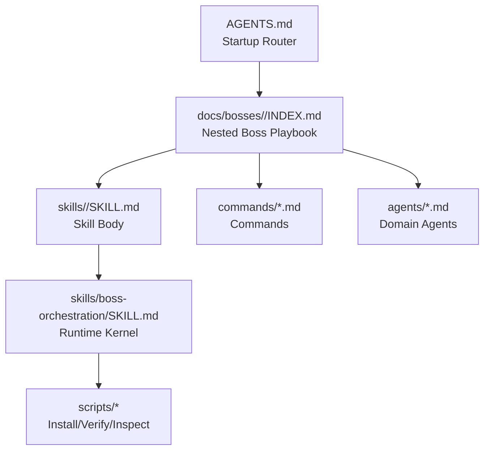
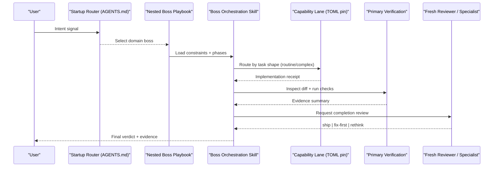
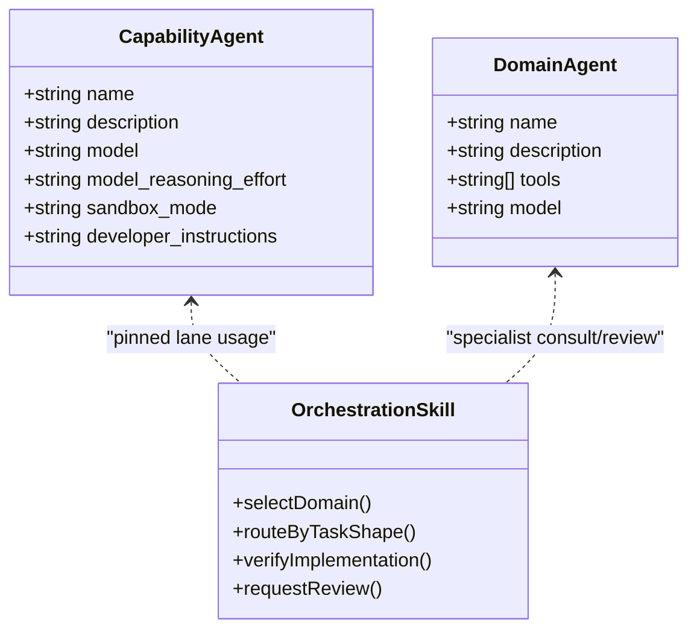
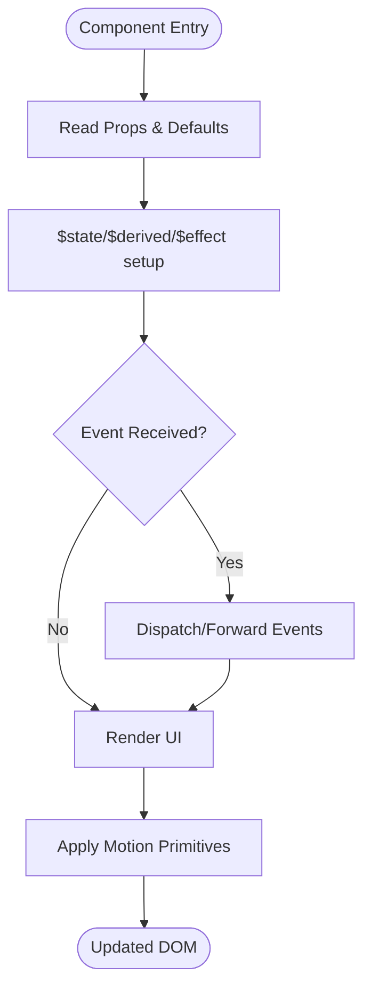
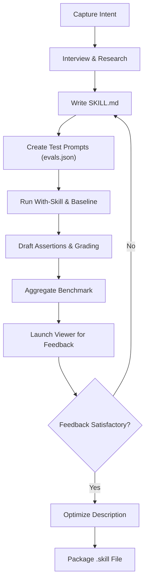
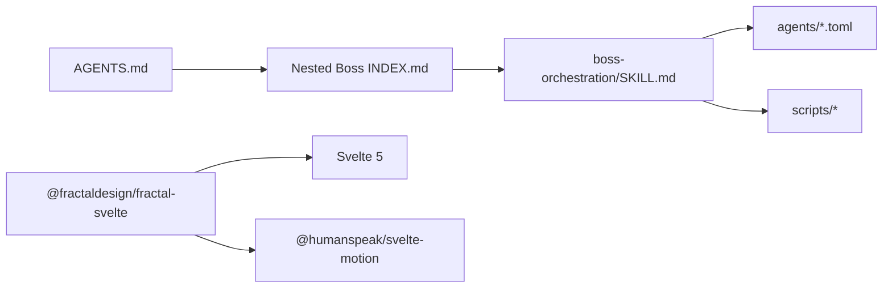

<cite>
**Referenced Files in This Document**
- `fractal-agentic/CUSTOMIZE.md`
- `fractal-agentic/docs/INDEX.md`
- `fractal-agentic/skills/boss-orchestration/SKILL.md`
- `fractal-agentic/skills/skill-creator/SKILL.md`
- `fractal-svelte/package.json`
- `fractal-svelte/src/lib/index.ts`
- `fractal-agentic/agents/fractal-agentic-routine-implementer.toml`
</cite>

## Table of Contents
1. [Introduction](#introduction)
2. [Project Structure](#project-structure)
3. [Core Components](#core-components)
4. [Architecture Overview](#architecture-overview)
5. [Detailed Component Analysis](#detailed-component-analysis)
6. [Dependency Analysis](#dependency-analysis)
7. [Performance Considerations](#performance-considerations)
8. [Troubleshooting Guide](#troubleshooting-guide)
9. [Conclusion](#conclusion)
10. [Appendices](#appendices)

## Introduction
This document explains how to build custom extensions in the Fractal ecosystem:
- Custom agents with architecture patterns, behavior customization, and integration with the boss orchestration system
- Svelte component extension patterns for props, events, and animations
- Skill creation using the standardized skill interface, including metadata, execution context, and verification mechanisms
- Practical examples from the codebase and strategies for testing and debugging custom developments

The goal is to enable both newcomers and experienced developers to extend Fractal safely and effectively while maintaining consistency across the armory and runtime.

## Project Structure
Fractal Agentic organizes customizations into three layers:
- Domain discovery: startup router and nested boss playbooks
- Armory: skills, agents, and commands available to bosses
- Runtime kernel: orchestration skill, capability pins, and scripts

**Diagram sources**
- `fractal-agentic/CUSTOMIZE.md#L49-L74`
- `fractal-agentic/skills/boss-orchestration/SKILL.md#L14-L28`

**Section sources**
- `fractal-agentic/CUSTOMIZE.md#L20-L74`
- `fractal-agentic/docs/INDEX.md#L28-L54`

## Core Components
- Orchestration skill (runtime kernel): defines session modes, capability lanes, verification, and review flow
- Skill creator skill: end-to-end process to create, test, evaluate, and optimize skills
- Capability TOMLs: pinned agent types used by orchestration for routine/complex implementation and fresh review
- Svelte package: component library exports and structure enabling extension via props, events, and motion primitives

Key responsibilities:
- Orchestration skill selects domain boss, decomposes work, routes to capability lanes when available, verifies outcomes, and obtains a final review
- Skill creator guides iterative development with evals, benchmarking, and description optimization
- TOML pins define model and effort settings for lanes; installers and verifiers keep them consistent
- Svelte components expose typed props, events, and animation hooks through a structured export map

**Section sources**
- `fractal-agentic/skills/boss-orchestration/SKILL.md#L30-L107`
- `fractal-agentic/skills/skill-creator/SKILL.md#L45-L113`
- `fractal-agentic/agents/fractal-agentic-routine-implementer.toml#L1-L19`
- `fractal-svelte/package.json#L54-L214`

## Architecture Overview
The orchestration layer integrates domain selection, capability routing, verification, and review. It enforces non-blocking progression and best-effort use of pinned lanes.

**Diagram sources**
- `fractal-agentic/skills/boss-orchestration/SKILL.md#L83-L107`
- `fractal-agentic/skills/boss-orchestration/SKILL.md#L169-L209`
- `fractal-agentic/skills/boss-orchestration/SKILL.md#L210-L258`

## Detailed Component Analysis

### Custom Agent Development
- Agent definition structure:
  - Domain agents are Markdown files under agents/*.md with frontmatter (name, description, tools, model)
  - Capability agents are TOML files defining agent_type, model, reasoning effort, and developer instructions
- Behavior customization:
  - Use boss constraints injected via boss-prompts to tailor worker behavior per domain
  - Prefer capability lanes when exposed; degrade gracefully otherwise
- Integration with boss orchestration:
  - Orchestration skill reads routing matrix and handoffs to select appropriate lanes and specialists
  - Installers and verifiers ensure TOML pins match expected shapes and names

**Diagram sources**
- `fractal-agentic/agents/fractal-agentic-routine-implementer.toml#L1-L19`
- `fractal-agentic/skills/boss-orchestration/SKILL.md#L108-L168`

Practical example references:
- Add a new domain agent: create agents/<agent-id>.md, map it in the owning boss playbook, update indexes
- Add or change a capability lane: edit TOML, update SKILL.md, role-contracts, verify.sh, install-agents.sh

**Section sources**
- `fractal-agentic/CUSTOMIZE.md#L174-L218`
- `fractal-agentic/CUSTOMIZE.md#L221-L278`
- `fractal-agentic/skills/boss-orchestration/SKILL.md#L108-L168`

### Svelte Component Extension Patterns
- Prop extension:
  - Extend existing components by composing props and leveraging Svelte 5 runes ($props, $bindable)
  - Use index.ts barrel exports to re-export extended variants
- Event handling:
  - Forward or wrap native events; emit custom events via Svelte’s event dispatcher pattern
  - Keep event contracts stable to avoid breaking consumers
- Animation customization:
  - Integrate @humanspeak/svelte-motion for spring-based animations
  - Compose motion primitives with component state to drive transitions

**Diagram sources**
- `fractal-svelte/package.json#L215-L218`
- `fractal-svelte/src/lib/index.ts#L1-L6`

Practical example references:
- Extend a motion component by wrapping its props and adding custom animation parameters
- Create an agent-facing component that composes message, prompt-input, and streaming-response with typed props and events

**Section sources**
- `fractal-svelte/package.json#L54-L214`
- `fractal-svelte/src/lib/index.ts#L1-L6`

### Skill Creation and Standardized Interface
- Skill metadata:
  - SKILL.md frontmatter includes name and description; body contains instructions and references
- Execution context:
  - Progressive disclosure loads metadata first, then SKILL.md body, then bundled resources on demand
- Verification mechanisms:
  - Skill creator provides eval harness, grading, aggregation, and viewer for quantitative and qualitative feedback
  - Description optimization loop improves triggering accuracy based on eval queries

**Diagram sources**
- `fractal-agentic/skills/skill-creator/SKILL.md#L45-L113`
- `fractal-agentic/skills/skill-creator/SKILL.md#L175-L266`
- `fractal-agentic/skills/skill-creator/SKILL.md#L356-L428`

Practical example references:
- Create a new skill directory with SKILL.md and optional scripts/references/assets
- Run the evaluation loop, iterate based on feedback, and optimize the description for better triggering

**Section sources**
- `fractal-agentic/skills/skill-creator/SKILL.md#L45-L113`
- `fractal-agentic/skills/skill-creator/SKILL.md#L175-L266`
- `fractal-agentic/skills/skill-creator/SKILL.md#L356-L428`

## Dependency Analysis
- Orchestration depends on:
  - Startup router (AGENTS.md) for domain selection
  - Nested boss playbooks for constraints and phases
  - Capability TOMLs for pinned lanes
  - Scripts for install/verify/inspect
- Svelte package depends on:
  - Svelte 5 runtime and motion primitives
  - Barrel exports for clean imports

**Diagram sources**
- `fractal-agentic/skills/boss-orchestration/SKILL.md#L14-L28`
- `fractal-svelte/package.json#L215-L218`

**Section sources**
- `fractal-agentic/skills/boss-orchestration/SKILL.md#L14-L28`
- `fractal-svelte/package.json#L215-L218`

## Performance Considerations
- Orchestration prefers high-reasoning primary models when available but never blocks on model confirmation
- Capability lanes reduce overhead by delegating bounded tasks to specialized workers
- Non-blocking policy ensures delivery proceeds even if install or spawn types are missing
- Svelte motion primitives should be used judiciously to avoid layout thrashing; prefer GPU-accelerated transforms

[No sources needed since this section provides general guidance]

## Troubleshooting Guide
Common issues and resolutions:
- Spawn types missing: run installer and start a fresh Codex task
- Installer check fails: diff destination vs template; resolve deliberately; installer will not overwrite differing files
- Model/effort unknown: inspect agent runtime if rollout exists; otherwise continue with available evidence
- Missing skill: confirm SKILL.md exists under skills/<id>; all skills are vendored locally
- Wrong stack defaults: re-read router and active boss stack gate; monorepo default is Svelte, not React

**Section sources**
- `fractal-agentic/CUSTOMIZE.md#L561-L571`
- `fractal-agentic/skills/boss-orchestration/SKILL.md#L114-L140`

## Conclusion
Custom development in Fractal centers around three pillars:
- Agents: define domain specialists and capability lanes, integrate with orchestration, and maintain consistency via installers and verifiers
- Components: extend Svelte components with typed props, robust event handling, and motion-driven animations
- Skills: follow the standardized interface, leverage the skill creator for iterative improvement, and optimize descriptions for reliable triggering

Adhering to these patterns ensures scalable, maintainable, and high-quality extensions across the ecosystem.

[No sources needed since this section summarizes without analyzing specific files]

## Appendices
- Recommended customization recipes:
  - Drop unused framework skills, add company-internal skills, create new bosses, adjust LLM pins, slim public editions, retarget stacks
- Verify after every edit:
  - Run check-armory.sh and verify.sh; optionally probe plugin root resolution

**Section sources**
- `fractal-agentic/CUSTOMIZE.md#L535-L544`
- `fractal-agentic/CUSTOMIZE.md#L507-L516`