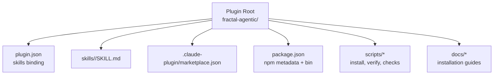
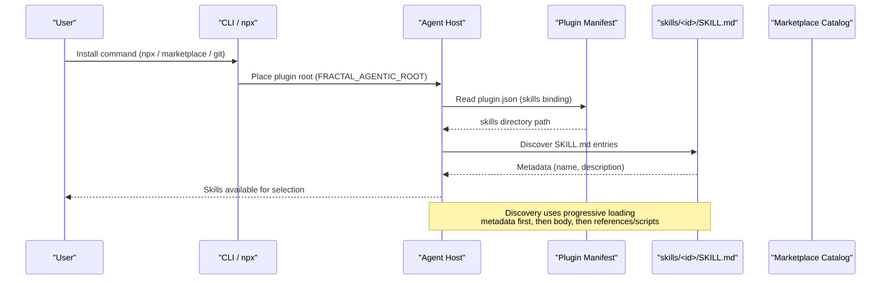
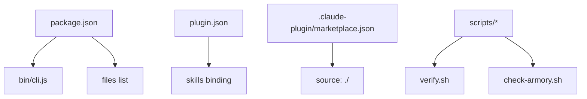

<cite>
**Referenced Files in This Document**
- `fractal-agentic/package.json`
- `fractal-agentic/plugin.json`
- `fractal-agentic/.claude-plugin/marketplace.json`
- `fractal-agentic/docs/02-install.md`
- `fractal-agentic/skills/INDEX.md`
- `fractal-agentic/skills/academic-research/SKILL.md`
- `fractal-agentic/skills/skill-creator/SKILL.md`
- `fractal-agentic/scripts/check-armory.sh`
- `fractal-agentic/scripts/verify.sh`
- `fractal-agentic/docs/armory/skills.md`
</cite>

## Table of Contents
1. [Introduction](#introduction)
2. [Project Structure](#project-structure)
3. [Core Components](#core-components)
4. [Architecture Overview](#architecture-overview)
5. [Detailed Component Analysis](#detailed-component-analysis)
6. [Dependency Analysis](#dependency-analysis)
7. [Performance Considerations](#performance-considerations)
8. [Troubleshooting Guide](#troubleshooting-guide)
9. [Conclusion](#conclusion)
10. [Appendices](#appendices)

## Introduction
This document explains how to package and distribute custom skills in the Fractal Agentic ecosystem. It covers the skill package structure (SKILL.md, scripts, assets, references), versioning strategy, dependency management, compatibility requirements, distribution channels (local installation, marketplace publishing, git-based distribution), update mechanisms, rollback strategies, backward compatibility, security considerations, code signing, integrity verification, and skill discovery and registration with the runtime.

## Project Structure
Fractal Agentic ships as a multi-host plugin that includes a large set of vendored skills under a single directory. The plugin manifest binds the skills directory so hosts can discover and load SKILL.md packages automatically.

**Diagram sources**
- `fractal-agentic/plugin.json#L21-L21`
- `fractal-agentic/package.json#L1-L34`
- `fractal-agentic/.claude-plugin/marketplace.json#L1-L19`

**Section sources**
- `fractal-agentic/plugin.json#L1-L31`
- `fractal-agentic/package.json#L1-L59`
- `fractal-agentic/.claude-plugin/marketplace.json#L1-L19`

## Core Components
- Skill package: Each skill is a folder under skills/<skill-id>/ containing at least SKILL.md. Optional subfolders include scripts/, references/, and assets/.
- Plugin manifest: plugin.json declares the skills directory path for host discovery.
- Marketplace manifest: .claude-plugin/marketplace.json registers the plugin for Claude Code marketplace flows.
- npm package: package.json provides metadata, bin entry, and files list for packaging and distribution via npm/npx.
- Installation docs: docs/02-install.md describes multiple install methods across hosts.

Key responsibilities:
- SKILL.md frontmatter defines name and description used for discovery; body defines instructions and optional references.
- Scripts provide deterministic or repetitive tasks invoked by skills.
- References hold documentation loaded on demand.
- Assets contain output templates, icons, fonts, etc.

**Section sources**
- `fractal-agentic/skills/INDEX.md#L1-L177`
- `fractal-agentic/skills/academic-research/SKILL.md#L1-L103`
- `fractal-agentic/skills/skill-creator/SKILL.md#L62-L113`
- `fractal-agentic/plugin.json#L21-L21`
- `fractal-agentic/package.json#L1-L34`
- `fractal-agentic/docs/02-install.md#L59-L69`

## Architecture Overview
The runtime discovers skills through the plugin manifest and loads SKILL.md metadata and content when needed. Distribution occurs via npm/npx, host marketplaces, or git checkouts. Verification and health checks ensure integrity and completeness.

**Diagram sources**
- `fractal-agentic/plugin.json#L21-L21`
- `fractal-agentic/docs/02-install.md#L74-L112`

## Detailed Component Analysis

### Skill Package Structure
A skill package consists of:
- SKILL.md: Required. YAML frontmatter with name and description; markdown body with instructions.
- scripts/: Optional executable code for deterministic tasks.
- references/: Optional documentation loaded on demand.
- assets/: Optional static resources used in outputs.

Progressive disclosure ensures minimal context overhead:
- Always-in-context: metadata (~100 words).
- Trigger-in-context: SKILL.md body (<500 lines ideal).
- On-demand: references and scripts.

Examples of well-structured skills are present in the repository index and sample SKILL.md files.

**Section sources**
- `fractal-agentic/skills/skill-creator/SKILL.md#L73-L113`
- `fractal-agentic/skills/academic-research/SKILL.md#L1-L103`
- `fractal-agentic/skills/INDEX.md#L1-L177`

### Versioning Strategy
- Plugin-level versioning is declared in package.json and plugin.json. These versions drive updates and compatibility checks across hosts.
- Skills themselves do not declare explicit version fields in SKILL.md; stability is maintained via stable directory names and careful changes to SKILL.md frontmatter and body.
- For host-specific plugins, marketplace manifests also carry version information.

Recommendations:
- Keep skill directory names stable to avoid breaking boss mappings and indexes.
- Use semantic versioning for the plugin package to coordinate updates across hosts.

**Section sources**
- `fractal-agentic/package.json#L1-L10`
- `fractal-agentic/plugin.json#L1-L10`
- `fractal-agentic/.claude-plugin/marketplace.json#L1-L19`

### Dependency Management and Compatibility
- Skills may depend on external tools (e.g., MCP servers, CLIs). SKILL.md documents preferred tooling and fallbacks.
- Compatibility is expressed within SKILL.md descriptions and instructions; no separate dependency manifest is required per skill.
- Critical skills are enforced by checks; missing or unreadable SKILL.md triggers warnings/failures.

Best practices:
- Prefer installed tools when available; define clear fallbacks.
- Document required capabilities explicitly in SKILL.md.
- Maintain critical skill sets to ensure armory completeness.

**Section sources**
- `fractal-agentic/skills/academic-research/SKILL.md#L24-L41`
- `fractal-agentic/scripts/check-armory.sh#L84-L119`

### Distribution Channels
- Local installation: Manual git clone and setting FRACTAL_AGENTIC_ROOT; run verification scripts.
- Marketplace publishing: Register plugin via host marketplace commands; manifests point to source directories.
- Git-based distribution: Clone repositories and add local paths as marketplaces for development.

Installation methods and verification steps are documented in the install guide.

**Section sources**
- `fractal-agentic/docs/02-install.md#L74-L173`
- `fractal-agentic/docs/02-install.md#L59-L69`

### Update Mechanisms and Rollback Strategies
- Updates occur via host marketplace upgrades or re-running installers against the same target.
- Idempotent installs ensure repeatable outcomes without partial mutations.
- Rollbacks rely on stable skill directory names and plugin versions; keep previous versions accessible until new ones are verified.

Verification scripts validate installer behavior, including idempotency and conflict refusal.

**Section sources**
- `fractal-agentic/scripts/verify.sh#L173-L226`
- `fractal-agentic/docs/02-install.md#L123-L138`

### Backward Compatibility Maintenance
- Preserve skill directory names and SKILL.md frontmatter fields (name, description) to maintain discovery and mapping stability.
- Avoid breaking changes in SKILL.md that alter expected behaviors unless coordinated via plugin version bumps.
- Use progressive disclosure to minimize impact of larger reference files.

**Section sources**
- `fractal-agentic/docs/armory/skills.md#L48-L56`
- `fractal-agentic/skills/skill-creator/SKILL.md#L62-L113`

### Security Considerations, Code Signing, and Integrity Verification
- Skills must not contain malicious content; follow the principle of lack of surprise.
- Integrity verification is performed by scripts that validate JSON manifests, TOML templates, and installer behavior.
- Runtime inspector extracts safe allowlisted fields from session data to prevent leaks.

Recommendations:
- Validate SKILL.md readability and presence for critical skills.
- Use verification scripts in CI to enforce standards.
- Avoid embedding secrets; rely on environment variables and secure configuration.

**Section sources**
- `fractal-agentic/skills/skill-creator/SKILL.md#L115-L117`
- `fractal-agentic/scripts/verify.sh#L228-L274`
- `fractal-agentic/scripts/check-armory.sh#L84-L119`

### Skill Discovery and Registration
- Discovery is driven by plugin.json binding to the skills directory.
- Hosts read SKILL.md metadata (name, description) to decide when to surface skills.
- Index generation keeps the live inventory aligned with actual skill folders.

**Section sources**
- `fractal-agentic/plugin.json#L21-L21`
- `fractal-agentic/skills/INDEX.md#L1-L177`

## Dependency Analysis
The plugin depends on:
- npm metadata for distribution and CLI exposure.
- Host-specific manifests for marketplace integration.
- Scripts for verification and installation.

**Diagram sources**
- `fractal-agentic/package.json#L1-L34`
- `fractal-agentic/plugin.json#L1-L31`
- `fractal-agentic/.claude-plugin/marketplace.json#L1-L19`
- `fractal-agentic/scripts/verify.sh#L1-L20`
- `fractal-agentic/scripts/check-armory.sh#L84-L119`

**Section sources**
- `fractal-agentic/package.json#L1-L59`
- `fractal-agentic/plugin.json#L1-L31`
- `fractal-agentic/.claude-plugin/marketplace.json#L1-L19`

## Performance Considerations
- Progressive disclosure reduces initial context load: metadata only, then body, then references/scripts.
- Keep SKILL.md concise; move detailed procedures into references/ to avoid bloating trigger context.
- Use scripts for heavy operations to avoid loading large files into memory unnecessarily.

[No sources needed since this section provides general guidance]

## Troubleshooting Guide
Common issues and resolutions:
- Missing SKILL.md in critical skills: Run check-armory.sh to identify gaps; ensure SKILL.md is readable.
- Broken symlinks under skills/: Fix links or replace with local copies.
- Installer conflicts: Refuses to partially mutate targets; resolve conflicts before reinstalling.
- Invalid manifests: Verify JSON/TOML validity using verify.sh.

Operational tips:
- Use --check mode to validate existing installations without mutation.
- Ensure FRACTAL_AGENTIC_ROOT points to the correct plugin root.

**Section sources**
- `fractal-agentic/scripts/check-armory.sh#L84-L119`
- `fractal-agentic/scripts/verify.sh#L173-L226`

## Conclusion
Fractal Agentic’s skill packaging model centers on SKILL.md packages bound by plugin.json and distributed via npm, host marketplaces, or git. Robust verification scripts and progressive disclosure ensure reliability and performance. By following the outlined structure, versioning strategy, and distribution practices, you can create secure, maintainable, and discoverable skills that integrate seamlessly with the runtime.

[No sources needed since this section summarizes without analyzing specific files]

## Appendices

### Example Skill Manifests and Declarations
- SKILL.md frontmatter: name and description fields drive discovery.
- Plugin manifest: plugin.json binds skills directory.
- Marketplace manifest: .claude-plugin/marketplace.json registers plugin source.

**Section sources**
- `fractal-agentic/skills/academic-research/SKILL.md#L1-L10`
- `fractal-agentic/plugin.json#L21-L21`
- `fractal-agentic/.claude-plugin/marketplace.json#L1-L19`

### Installation Scripts and Commands
- NPX installer supports auto-detection and guided setup.
- Host-specific commands register and install plugins from marketplaces or local checkouts.
- Manual git clone requires setting FRACTAL_AGENTIC_ROOT and running verification.

**Section sources**
- `fractal-agentic/docs/02-install.md#L74-L173`