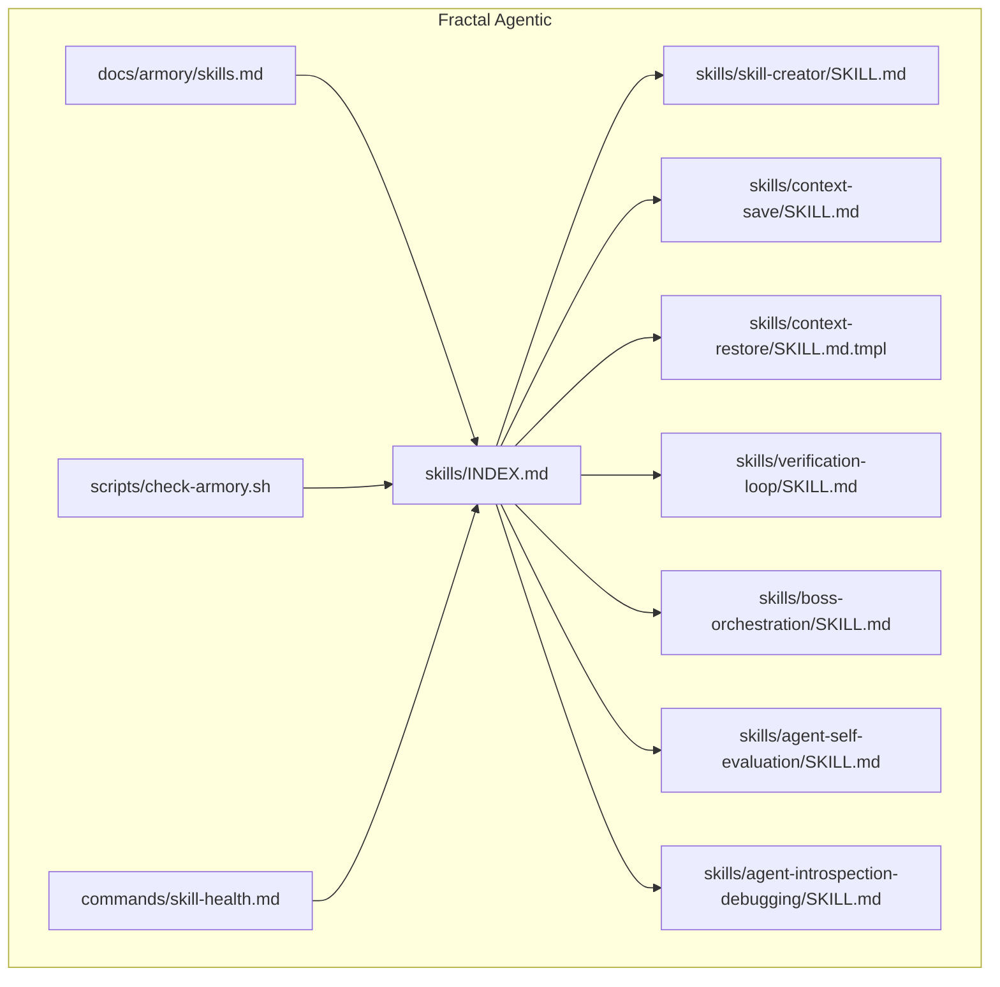
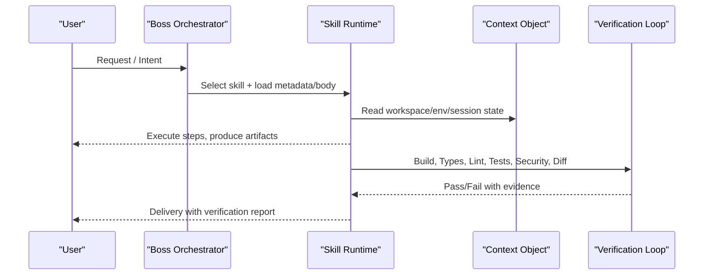
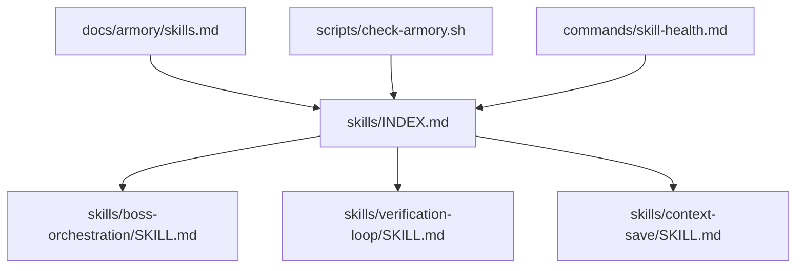

<cite>
**Referenced Files in This Document**
- `fractal-agentic/skills/INDEX.md`
- `fractal-agentic/skills/skill-creator/SKILL.md`
- `fractal-agentic/skills/context-save/SKILL.md`
- `fractal-agentic/skills/context-restore/SKILL.md.tmpl`
- `fractal-agentic/skills/verification-loop/SKILL.md`
- `fractal-agentic/skills/boss-orchestration/SKILL.md`
- `fractal-agentic/skills/agent-self-evaluation/SKILL.md`
- `fractal-agentic/skills/agent-introspection-debugging/SKILL.md`
- `fractal-agentic/docs/armory/skills.md`
- `fractal-agentic/scripts/check-armory.sh`
- `fractal-agentic/commands/skill-health.md`
</cite>

## Table of Contents
1. Introduction
2. Project Structure
3. Core Components
4. Architecture Overview
5. Detailed Component Analysis
6. Dependency Analysis
7. Performance Considerations
8. Troubleshooting Guide
9. Conclusion
10. Appendices

## Introduction
This document defines the standardized skill interface and metadata system used by Fractal Agentic. It explains how skills are declared, discovered, executed, verified, and maintained across sessions. You will learn:
- The required and optional fields in a skill’s metadata (id/name, description, version, execution parameters).
- How the skill context object provides access to workspace files, environment variables, and session state.
- The verification mechanism that ensures outputs meet quality standards before delivery.
- Examples from existing skills demonstrating proper metadata configuration, context usage patterns, and verification implementation.
- Lifecycle events, error handling strategies, logging conventions, and best practices for creating well-structured skill definitions.

## Project Structure
Skills are vendored locally under the skills directory. Each skill is a folder containing at least a SKILL.md file with YAML frontmatter and Markdown instructions. Optional resources include scripts/, references/, and assets/. A live index enumerates all available skills and their descriptions.

**Diagram sources**
- `fractal-agentic/skills/INDEX.md`
- `fractal-agentic/docs/armory/skills.md`
- `fractal-agentic/scripts/check-armory.sh`
- `fractal-agentic/commands/skill-health.md`

**Section sources**
- `fractal-agentic/skills/INDEX.md`
- `fractal-agentic/docs/armory/skills.md`

## Core Components
- Skill metadata (frontmatter): name, description, version, allowed-tools, triggers, preamble-tier, metadata.origin, and other optional fields.
- Skill body (Markdown): step-by-step procedures, examples, and references.
- Bundled resources: scripts/ for deterministic tasks, references/ for domain docs, assets/ for output templates.
- Context object: runtime-provided access to workspace files, environment variables, and session state; exposed via tools and shell variables within skill steps.
- Verification loop: build/type/lint/test/security/diff phases to gate delivery.
- Orchestration integration: boss routing, capability lanes, handoffs, and review packets.

Key patterns:
- Progressive disclosure: metadata (~100 words), SKILL.md body (<500 lines ideal), bundled resources as needed.
- Non-blocking policy: missing installs or pins should warn but never block product work.
- Evidence-based verification: require receipts, diffs, and command results before acceptance.

**Section sources**
- `fractal-agentic/skills/skill-creator/SKILL.md`
- `fractal-agentic/skills/context-save/SKILL.md`
- `fractal-agentic/skills/verification-loop/SKILL.md`
- `fractal-agentic/skills/boss-orchestration/SKILL.md`

## Architecture Overview
The skill system integrates discovery, execution, and verification through a consistent interface:
- Discovery: skills/index and boss playbooks map user intent to the right skill(s).
- Execution: the agent loads metadata and body, then follows procedural steps using allowed tools and context.
- Verification: built-in phases ensure correctness before delivery; optional self-evaluation and debugging loops improve reliability.

**Diagram sources**
- `fractal-agentic/skills/boss-orchestration/SKILL.md`
- `fractal-agentic/skills/verification-loop/SKILL.md`
- `fractal-agentic/skills/context-save/SKILL.md`

## Detailed Component Analysis

### Skill Metadata Schema
Required and common fields:
- name: Unique identifier for the skill.
- description: Triggering guidance and scope; primary mechanism for discovery.
- version: Semantic version for change tracking and health dashboards.
- allowed-tools: Explicit list of tools the skill may use (e.g., Bash, Read, Write, Glob, Grep, AskUserQuestion).
- triggers: Phrases or commands that should activate the skill.
- preamble-tier: Loading priority tier for progressive disclosure.
- metadata.origin: Source attribution (e.g., ECC).

Optional fields commonly seen:
- compatibility: Required tools or dependencies.
- additional keys per skill-specific needs.

Best practices:
- Keep description “pushy” enough to avoid undertriggering while remaining accurate.
- Use semantic versions and update on meaningful changes.
- Limit allowed-tools to what is necessary for safety and clarity.

Examples:
- See the skill-creator’s frontmatter and structure guidance for naming, description strategy, and resource organization.
- See context-save’s frontmatter showing allowed-tools and triggers.

**Section sources**
- `fractal-agentic/skills/skill-creator/SKILL.md`
- `fractal-agentic/skills/context-save/SKILL.md`

### Skill Context Object
The context object exposes:
- Workspace files: read/write via dedicated tools (Read, Write, Glob, Grep) and shell commands when allowed.
- Environment variables: accessible via shell variables set by the harness (e.g., plan mode flags, telemetry toggles).
- Session state: current branch, session IDs, model overlays, and lifecycle markers.

Patterns:
- Use dedicated tools over raw Bash where possible for cost and clarity.
- Respect plan-mode constraints; only allowed operations proceed without breaking flow.
- Capture telemetry and timeline entries at start/end of workflows.

Example usage:
- context-save demonstrates reading git state, detecting plan mode, and writing analytics/timeline entries.
- context-restore template shows how to resume state and rehydrate context.

**Section sources**
- `fractal-agentic/skills/context-save/SKILL.md`
- `fractal-agentic/skills/context-restore/SKILL.md.tmpl`

### Verification Mechanism
A comprehensive verification loop enforces quality gates:
- Build verification: ensure project builds successfully.
- Type check: run type checkers and fix critical errors.
- Lint check: enforce style and rules.
- Test suite: run tests with coverage thresholds.
- Security scan: detect secrets and unsafe patterns.
- Diff review: inspect changed files for unintended side effects.

Output format:
- Produce a structured verification report summarizing each phase and an overall readiness verdict.

Integration:
- Use after significant changes, before PRs, and continuously during long sessions.
- Combine with hooks for immediate feedback and deeper reviews for comprehensive validation.

**Section sources**
- `fractal-agentic/skills/verification-loop/SKILL.md`

### Orchestration and Handoffs
The orchestration skill coordinates multi-step deliveries:
- Domain selection based on signals (UI, Svelte, security, scaffolding, etc.).
- Capability lanes (routine vs complex) with fallback progression when pins are unavailable.
- Five-part specs and review packets injected into worker contracts.
- Final review with ship | fix-first | rethink verdicts.

Non-blocking policy:
- Missing installs or pins warn but do not stop product work.
- Prefer any exposed pin; degrade gracefully.

Handoffs:
- Clear transitions between bosses with preserved verification evidence.

**Section sources**
- `fractal-agentic/skills/boss-orchestration/SKILL.md`

### Self-Evaluation and Debugging
Self-evaluation:
- After non-trivial tasks, rate output on five axes: accuracy, completeness, clarity, actionability, conciseness.
- Provide evidence for scores below 5 and propose concrete improvements.

Debugging:
- Structured capture of failure state, diagnosis, contained recovery, and introspection reports.
- Integrate with verification-loop and continuous learning to prevent recurrence.

**Section sources**
- `fractal-agentic/skills/agent-self-evaluation/SKILL.md`
- `fractal-agentic/skills/agent-introspection-debugging/SKILL.md`

### Templates and Best Practices
Templates:
- SKILL.md.tmpl variants provide auto-generated scaffolding for skills like context-save and context-restore.

Best practices:
- Progressive disclosure: metadata first, concise body, reference resources on demand.
- Principle of lack of surprise: no malware or misleading content.
- Writing patterns: imperative instructions, explicit output formats, clear examples.
- Test cases: define eval prompts and assertions; aggregate results with benchmark viewers.
- Description optimization: generate trigger eval queries and iterate to improve triggering accuracy.

**Section sources**
- `fractal-agentic/skills/skill-creator/SKILL.md`
- `fractal-agentic/skills/context-restore/SKILL.md.tmpl`
- `fractal-agentic/skills/context-save/SKILL.md`

## Dependency Analysis
Skills depend on:
- Index and armory documentation for discovery and canonical names.
- Scripts for health checks and critical skill validation.
- Commands for operational utilities like skill-health dashboards.

**Diagram sources**
- `fractal-agentic/skills/INDEX.md`
- `fractal-agentic/docs/armory/skills.md`
- `fractal-agentic/scripts/check-armory.sh`
- `fractal-agentic/commands/skill-health.md`

**Section sources**
- `fractal-agentic/skills/INDEX.md`
- `fractal-agentic/docs/armory/skills.md`
- `fractal-agentic/scripts/check-armory.sh`
- `fractal-agentic/commands/skill-health.md`

## Performance Considerations
- Keep SKILL.md bodies concise to reduce context pressure; offload details to references/.
- Prefer dedicated tools over Bash for cheaper and clearer operations.
- Use progressive disclosure to minimize token consumption.
- Batch independent tasks and parallelize where safe; serialize shared-file edits.
- Avoid unnecessary retries; capture timing and tokens for analysis.

[No sources needed since this section provides general guidance]

## Troubleshooting Guide
Common issues and resolutions:
- Broken symlinks or missing SKILL.md: validate with armory checks and fix paths.
- Undertriggering skills: optimize description using eval queries and iterative improvement.
- Plan mode violations: ensure only allowed operations execute; follow prose fallback for AskUserQuestion when unavailable.
- Verification failures: address build/type/lint/test/security issues sequentially; collect evidence and re-run.
- Telemetry and timeline gaps: confirm analytics writes at start/end; check permissions and binary availability.

Operational utilities:
- Use skill-health dashboard to monitor success rates, failure patterns, and pending amendments.
- Run check-armory.sh to validate critical skills and symlink integrity.

**Section sources**
- `fractal-agentic/scripts/check-armory.sh`
- `fractal-agentic/commands/skill-health.md`
- `fractal-agentic/skills/context-save/SKILL.md`

## Conclusion
Fractal Agentic’s skill interface standardizes how knowledge is packaged, discovered, executed, and verified. By adhering to the metadata schema, leveraging the context object safely, and enforcing verification gates, teams can build reliable, maintainable skills that scale across sessions and domains. Use the provided templates, best practices, and operational tools to create high-quality skill definitions and keep them healthy over time.

[No sources needed since this section summarizes without analyzing specific files]

## Appendices

### Appendix A: Skill Lifecycle Events
- Start: Load metadata and body; initialize context; detect plan mode and tool availability.
- Execute: Follow procedural steps; use allowed tools; write artifacts; log telemetry.
- Verify: Run build/type/lint/test/security/diff; collect evidence; produce report.
- Review: Obtain best-available review; accept ship | fix-first | rethink verdicts.
- End: Persist context if requested; finalize telemetry; summarize outcomes.

**Section sources**
- `fractal-agentic/skills/context-save/SKILL.md`
- `fractal-agentic/skills/verification-loop/SKILL.md`
- `fractal-agentic/skills/boss-orchestration/SKILL.md`

### Appendix B: Error Handling Strategies
- Fail fast on critical errors (build/type); continue with warnings for non-blocking issues.
- Capture detailed diagnostics for debugging; produce human-readable reports.
- Escalate after repeated failures or ambiguous decisions; request clarification with structured briefs.

**Section sources**
- `fractal-agentic/skills/agent-introspection-debugging/SKILL.md`
- `fractal-agentic/skills/context-save/SKILL.md`

### Appendix C: Logging Conventions
- Timeline entries: record skill start/completion, branch, outcome, duration, session ID.
- Analytics: log usage gated by telemetry settings; avoid sensitive data.
- Question logs: capture decision preferences and tuning events deterministically.

**Section sources**
- `fractal-agentic/skills/context-save/SKILL.md`