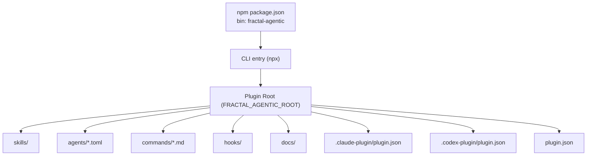
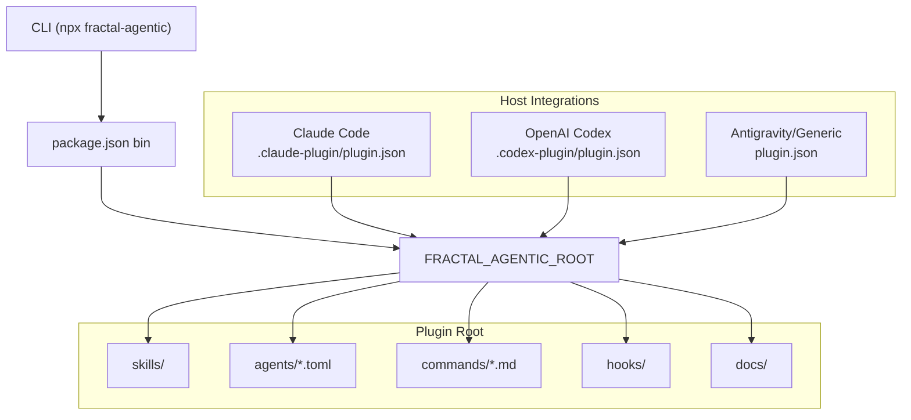

<cite>
**Referenced Files in This Document**
- `fractal-agentic/package.json`
- `fractal-agentic/README.md`
- `fractal-agentic/docs/02-install.md`
- `fractal-agentic/TROUBLESHOOTING.md`
- `fractal-agentic/scripts/check-armory.sh`
- `fractal-agentic/scripts/verify.sh`
- `fractal-agentic/hooks/README.md`
- `fractal-agentic/agents/fractal-agentic-routine-implementer.toml`
- `fractal-agentic/agents/fractal-agentic-complex-implementer.toml`
- `fractal-agentic/agents/fractal-agentic-fresh-reviewer.toml`
</cite>

## Table of Contents
1. [Introduction](#introduction)
2. [Project Structure](#project-structure)
3. [Core Components](#core-components)
4. [Architecture Overview](#architecture-overview)
5. [Detailed Component Analysis](#detailed-component-analysis)
6. [Dependency Analysis](#dependency-analysis)
7. [Performance Considerations](#performance-considerations)
8. [Troubleshooting Guide](#troubleshooting-guide)
9. [Conclusion](#conclusion)
10. [Appendices](#appendices)

## Introduction
This document provides enterprise-grade deployment guidance for Fractal Agentic, focusing on secure installation, environment configuration, access control, monitoring and logging, scaling patterns, CI/CD integration, backup and recovery, high availability, and troubleshooting. The system is a multi-host plugin with an npm CLI entrypoint and a self-contained plugin directory that hosts skills, agents, commands, hooks, and documentation. It supports multiple AI tool hosts via marketplace manifests and provides verification scripts to ensure operational health.

## Project Structure
Fractal Agentic is distributed as both an npm package and a host-agnostic plugin tree. The root package exposes a CLI binary used by npx, while the plugin directory serves as the operational unit for hosts. Installation methods include NPX installer, Claude Code marketplace, OpenAI Codex, Google Antigravity, and manual Git clone. Post-installation verification ensures assets, contracts, and policies are intact.



**Diagram sources**
- `fractal-agentic/package.json#L1-L59`
- `fractal-agentic/docs/02-install.md#L31-L69`

**Section sources**
- `fractal-agentic/package.json#L1-L59`
- `fractal-agentic/docs/02-install.md#L31-L69`

## Core Components
- CLI and Package Entry: The npm package defines the executable used by npx to bootstrap installation and operations.
- Plugin Manifests: Host-specific manifests define identity and capabilities for Claude Code, Codex, and generic/Antigravity environments.
- Skills and Agents: Vendored skills under skills/ provide domain capabilities; agent TOML files define model lanes and constraints.
- Commands: Markdown-based command definitions with frontmatter describe behavior and usage.
- Hooks: Optional event-driven automations for safety and quality checks across sessions and edits.
- Verification Suite: Scripts validate asset presence, JSON validity, TOML pins, non-blocking policy, and safe runtime inspection.

Key responsibilities:
- Secure installation path selection and post-install verification
- Environment configuration via FRACTAL_AGENTIC_ROOT and optional hook profiles
- Access control through read-only reviewer lane and pre-bash/config protections
- Monitoring and audit via runtime inspector and session metadata extraction
- Scaling via capability lanes and non-blocking progression

**Section sources**
- `fractal-agentic/package.json#L1-L59`
- `fractal-agentic/docs/02-install.md#L31-L69`
- `fractal-agentic/hooks/README.md#L1-L124`
- `fractal-agentic/scripts/verify.sh#L1-L274`

## Architecture Overview
The deployment architecture centers around a plugin root that hosts skills, agents, commands, and hooks. Host integrations use manifest files to discover and load capabilities. The CLI orchestrates installation and verification, while hooks enforce safety and quality policies. Agent lanes route work to specialized models with defined reasoning effort and sandbox modes.



**Diagram sources**
- `fractal-agentic/docs/02-install.md#L31-L69`
- `fractal-agentic/package.json#L1-L59`

## Detailed Component Analysis

### Secure Installation Procedures
- Choose an install method aligned with your host ecosystem (NPX, Claude marketplace, Codex, Antigravity, or manual clone).
- Set FRACTAL_AGENTIC_ROOT to point at the plugin directory.
- Run verification scripts to confirm asset integrity and non-blocking policy compliance.
- Optionally install hooks for safety and quality enforcement.

Recommended steps:
- Use the NPX installer for auto-detection and guided setup.
- For Claude Code, add the repository as a marketplace and install the plugin.
- For Codex, use sparse checkout and marketplace commands.
- For Antigravity, copy or symlink the plugin directory into the global plugins location.
- After installation, run check-armory and verify suites to ensure readiness.

**Section sources**
- `fractal-agentic/docs/02-install.md#L72-L172`
- `fractal-agentic/TROUBLESHOOTING.md#L17-L27`

### Environment Configuration and Access Control
- Environment variables:
  - FRACTAL_AGENTIC_ROOT: absolute path to the plugin directory
  - FRACTAL_HOOK_PROFILE: minimal | standard | strict
  - FRACTAL_DISABLED_HOOKS: comma-separated hook IDs to disable
  - FRACTAL_GATEGUARD: off to disable fact-force even in strict profile
  - FRACTAL_SESSION_START_MAX_CHARS and FRACTAL_SESSION_START_CONTEXT: control session bootstrap size and context inclusion
- Access control mechanisms:
  - Pre-bash safety hooks block destructive or secret-exfiltrating commands
  - Config protection prevents unsafe edits to linter/formatter configurations
  - Read-only reviewer lane enforces inspection without modifications
  - Non-blocking doctrine ensures product work continues even if optional features are missing

**Section sources**
- `fractal-agentic/hooks/README.md#L9-L28`
- `fractal-agentic/hooks/README.md#L97-L109`
- `fractal-agentic/agents/fractal-agentic-fresh-reviewer.toml#L1-L20`

### Monitoring and Logging Setup
- Runtime Inspector: Extracts allowlisted metadata from session rollout logs, including thread ID, agent role, model, effort, sandbox policy type, permission profile type, and working directory. Sensitive content is excluded.
- Session Metadata: Captures environment and config fields but avoids leaking secrets; inspectors validate safe extraction.
- Audit Trails: Session meta and turn context provide traceability for agent routing and execution context.
- Health Checks: check-armory validates critical assets and openai.yaml shape; verify.sh runs comprehensive validations including TOML pin correctness and installer idempotency.

Operational recommendations:
- Centralize session rollout logs and configure the runtime inspector to query them.
- Integrate log aggregation pipelines to capture session meta and turn context for auditing.
- Use verify.sh in CI to assert asset integrity and policy compliance before deployment.

**Section sources**
- `fractal-agentic/scripts/verify.sh#L234-L274`
- `fractal-agentic/scripts/check-armory.sh#L121-L140`

### Scaling Patterns for Multi-User Environments
- Capability Lanes:
  - Routine implementer: bounded, fully specified tasks with max reasoning effort
  - Complex implementer: context-heavy or higher-risk tasks with high reasoning effort
  - Fresh reviewer: read-only final review with ship|fix-first|rethink verdict
- Non-blocking Progression: Missing pins or hooks degrade gracefully without blocking product work.
- Resource Allocation: Model lanes and effort levels allow tuning throughput vs. reasoning depth based on workload characteristics.

Scaling strategies:
- Route routine tasks to high-throughput lanes and complex tasks to deeper reasoning lanes.
- Enforce read-only reviews to prevent concurrent modification conflicts.
- Use non-blocking policies to maintain productivity when optional components are unavailable.

**Section sources**
- `fractal-agentic/agents/fractal-agentic-routine-implementer.toml#L1-L19`
- `fractal-agentic/agents/fractal-agentic-complex-implementer.toml#L1-L19`
- `fractal-agentic/agents/fractal-agentic-fresh-reviewer.toml#L1-L20`

### CI/CD Pipeline Integration and Automated Testing
- Verification Suite: verify.sh performs comprehensive checks including JSON validity, TOML pin validation, installer idempotency, and runtime inspector safety.
- Asset Validation: check-armory ensures critical skills, commands, and orchestration references are present and well-formed.
- Policy Enforcement: Non-blocking policy checks guarantee that missing components do not halt workflows.
- CI Recommendations:
  - Run verify.sh and check-armory.sh in CI stages to assert deployment readiness.
  - Cache dependencies and skip network calls where possible.
  - Fail fast on assertion failures to prevent broken deployments.

**Section sources**
- `fractal-agentic/scripts/verify.sh#L1-L100`
- `fractal-agentic/scripts/check-armory.sh#L1-L80`

### Backup and Recovery Procedures
- Backup Targets:
  - Plugin directory (FRACTAL_AGENTIC_ROOT) containing skills, agents, commands, hooks, and docs
  - Hook configuration files in ~/.config/fractal-agentic/hooks.json and env.sh
  - Host-specific settings (e.g., Claude settings.json, Cursor .cursor/hooks.json)
- Recovery Steps:
  - Restore plugin directory to original state
  - Reinstall hooks using install-hooks.sh with appropriate target and profile
  - Verify installation using check-armory.sh and verify.sh
- Disaster Planning:
  - Maintain versioned backups of plugin directories and hook configurations
  - Document recovery procedures for each host environment
  - Test recovery procedures regularly to ensure reliability

**Section sources**
- `fractal-agentic/hooks/README.md#L82-L91`
- `fractal-agentic/docs/02-install.md#L174-L198`

### High Availability Configurations
- Redundant Installations: Maintain multiple copies of the plugin directory across different locations or environments.
- Stateless Operations: Ensure hooks and commands operate independently of shared state where possible.
- Graceful Degradation: Design workflows to continue operation when optional components are unavailable.
- Load Distribution: Distribute agent workloads across capability lanes to balance resource utilization.

**Section sources**
- `fractal-agentic/hooks/README.md#L1-L124`
- `fractal-agentic/README.md#L143-L168`

## Dependency Analysis
Fractal Agentic has clear separation between CLI entrypoints, plugin manifests, and operational assets. Dependencies are primarily file-based with minimal runtime coupling.

```mermaid
graph LR
PKG["package.json"] --> BIN["bin/cli.js"]
BIN --> ROOT["FRACTAL_AGENTIC_ROOT"]
ROOT --> SKILLS["skills/"]
ROOT --> AGENTS["agents/*.toml"]
ROOT --> COMMANDS["commands/*.md"]
ROOT --> HOOKS["hooks/"]
ROOT --> DOCS["docs/"]
ROOT --> MANIFESTS[".claude-plugin/plugin.json", ".codex-plugin/plugin.json", "plugin.json"]
```

**Diagram sources**
- `fractal-agentic/package.json#L1-L59`
- `fractal-agentic/docs/02-install.md#L31-L69`

**Section sources**
- `fractal-agentic/package.json#L1-L59`
- `fractal-agentic/docs/02-install.md#L31-L69`

## Performance Considerations
- Model Lane Selection: Choose appropriate lanes based on task complexity and required reasoning depth.
- Non-blocking Policies: Avoid dependencies that could stall workflows; prefer graceful degradation.
- Resource Optimization: Limit session context size and disable unnecessary hooks in performance-sensitive environments.
- Verification Efficiency: Cache verification results and avoid redundant checks in CI pipelines.

[No sources needed since this section provides general guidance]

## Troubleshooting Guide
Common issues and resolutions:
- Missing Assets: Run check-armory.sh to identify missing critical files and skills.
- Invalid Manifests: Use verify.sh to validate JSON structure and TOML pin correctness.
- Hook Conflicts: Adjust FRACTAL_DISABLED_HOOKS or FRACTAL_GATEGUARD settings to resolve conflicts.
- Runtime Inspection Failures: Ensure session rollout logs are accessible and properly formatted for the runtime inspector.

Quick health checks:
- Resolve plugin root and verify armory integrity
- Check non-blocking policy compliance
- Validate custom agent templates and installer behavior

**Section sources**
- `fractal-agentic/TROUBLESHOOTING.md#L17-L27`
- `fractal-agentic/scripts/check-armory.sh#L1-L80`
- `fractal-agentic/scripts/verify.sh#L100-L174`

## Conclusion
Fractal Agentic provides a robust foundation for enterprise deployment with secure installation procedures, comprehensive monitoring capabilities, and scalable agent orchestration. The system's design emphasizes non-blocking progression, graceful degradation, and strong security controls through hooks and read-only review lanes. By following the deployment guidelines and leveraging the provided verification tools, organizations can achieve reliable, auditable, and scalable AI-assisted development workflows.

[No sources needed since this section summarizes without analyzing specific files]

## Appendices

### Security Best Practices
- Restrict hook profiles to minimal or standard unless strict policies are required
- Regularly audit session logs for sensitive information leakage
- Implement least-privilege principles for agent permissions and sandbox modes
- Monitor and rotate any credentials or tokens used in session contexts

### Monitoring Dashboard Recommendations
- Track session metadata trends (model usage, effort levels, sandbox policies)
- Alert on failed verification checks or missing critical assets
- Monitor hook execution rates and failure patterns
- Visualize agent lane distribution and completion rates

### Scaling Playbook
- Start with routine implementer lane for high-volume, low-complexity tasks
- Gradually introduce complex implementer lane for challenging scenarios
- Enforce fresh reviewer lane for all production changes
- Scale horizontally by distributing workloads across multiple agent instances

[No sources needed since this section provides general guidance]