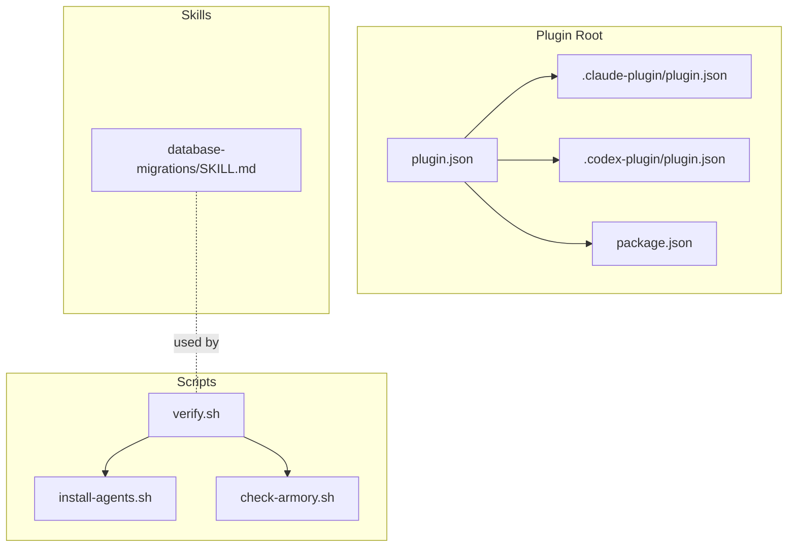
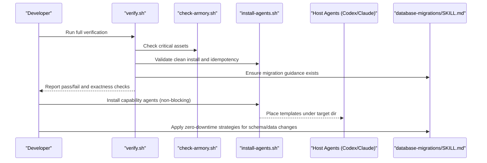
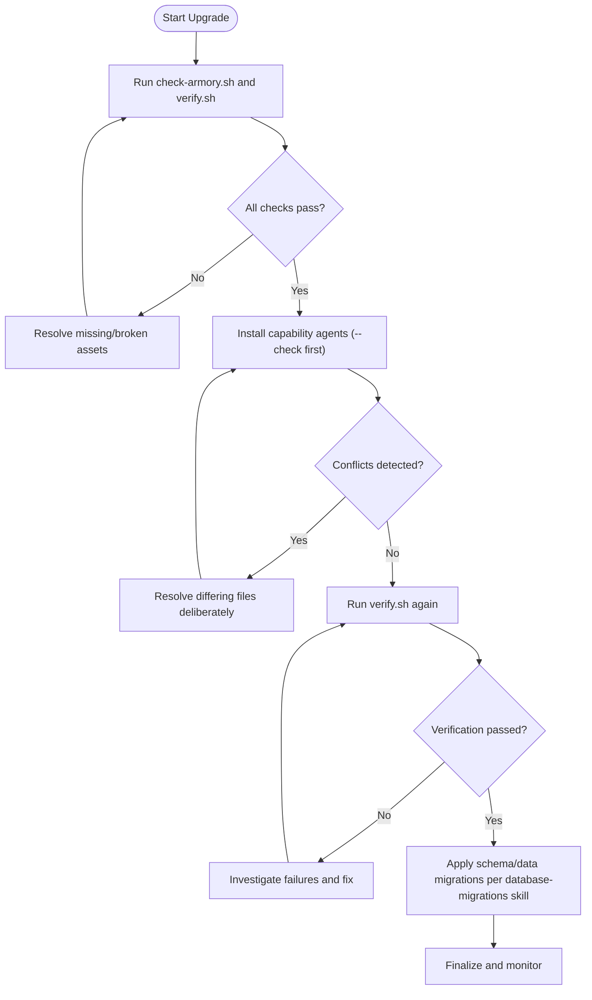
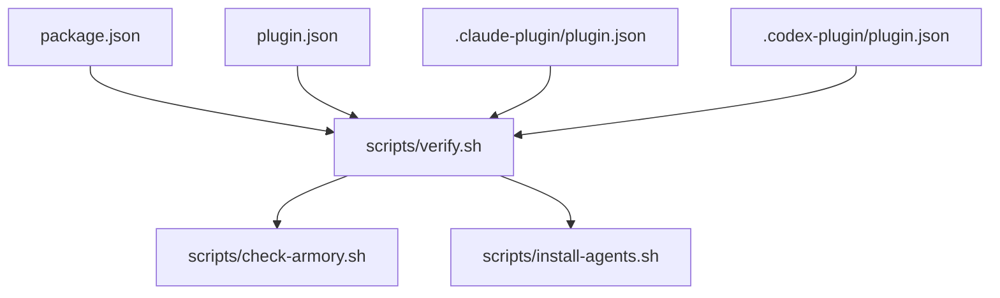

<cite>
**Referenced Files in This Document**
- `fractal-agentic/package.json`
- `fractal-agentic/plugin.json`
- `fractal-agentic/.claude-plugin/plugin.json`
- `fractal-agentic/.codex-plugin/plugin.json`
- `fractal-agentic/README.md`
- `fractal-agentic/CUSTOMIZE.md`
- `fractal-agentic/TROUBLESHOOTING.md`
- `fractal-agentic/scripts/install-agents.sh`
- `fractal-agentic/scripts/check-armory.sh`
- `fractal-agentic/scripts/verify.sh`
- `fractal-agentic/skills/database-migrations/SKILL.md`
</cite>

## Table of Contents
1. [Introduction](#introduction)
2. [Project Structure](#project-structure)
3. [Core Components](#core-components)
4. [Architecture Overview](#architecture-overview)
5. [Detailed Component Analysis](#detailed-component-analysis)
6. [Dependency Analysis](#dependency-analysis)
7. [Performance Considerations](#performance-considerations)
8. [Troubleshooting Guide](#troubleshooting-guide)
9. [Conclusion](#conclusion)
10. [Appendices](#appendices)

## Introduction
This document provides comprehensive migration guides for upgrading Fractal Agentic and related packages, focusing on backwards compatibility, breaking changes, deprecation timelines, dependency updates, configuration migrations, data and schema migrations, step-by-step upgrade procedures with rollback plans, validation steps, common pitfalls, and automated tools. It consolidates versioning information across plugin manifests and scripts that enforce consistency and safety during upgrades.

## Project Structure
Fractal Agentic is a plugin package with:
- Versioned manifests for multiple hosts (Claude, Codex, generic).
- Scripts to install capability agents and verify health.
- Vendored skills including database migration patterns.
- Documentation and troubleshooting references.

**Diagram sources**
- `fractal-agentic/plugin.json#L1-L31`
- `fractal-agentic/.claude-plugin/plugin.json#L1-L20`
- `fractal-agentic/.codex-plugin/plugin.json#L1-L28`
- `fractal-agentic/package.json#L1-L59`
- `fractal-agentic/scripts/install-agents.sh#L1-L180`
- `fractal-agentic/scripts/check-armory.sh#L1-L143`
- `fractal-agentic/scripts/verify.sh#L1-L274`
- `fractal-agentic/skills/database-migrations/SKILL.md#L1-L426`

**Section sources**
- `fractal-agentic/package.json#L1-L59`
- `fractal-agentic/plugin.json#L1-L31`
- `fractal-agentic/.claude-plugin/plugin.json#L1-L20`
- `fractal-agentic/.codex-plugin/plugin.json#L1-L28`

## Core Components
- Version manifests:
  - package.json defines the npm package version.
  - plugin.json and host-specific manifests define plugin versions and metadata.
- Orchestration and verification:
  - verify.sh validates TOML templates, contracts, skill presence, installer behavior, and runtime inspector outputs.
  - check-armory.sh ensures critical files and skills exist.
  - install-agents.sh installs capability agent templates without mutating host configs.
- Database migrations skill:
  - database-migrations/SKILL.md provides best practices and tooling workflows for safe schema and data migrations.

**Section sources**
- `fractal-agentic/package.json#L1-L59`
- `fractal-agentic/plugin.json#L1-L31`
- `fractal-agentic/scripts/verify.sh#L1-L274`
- `fractal-agentic/scripts/check-armory.sh#L1-L143`
- `fractal-agentic/scripts/install-agents.sh#L1-L180`
- `fractal-agentic/skills/database-migrations/SKILL.md#L1-L426`

## Architecture Overview
The upgrade and migration architecture centers around consistent versioning across manifests and strict verification of installed artifacts and runtime expectations.

**Diagram sources**
- `fractal-agentic/scripts/verify.sh#L1-L274`
- `fractal-agentic/scripts/check-armory.sh#L1-L143`
- `fractal-agentic/scripts/install-agents.sh#L1-L180`
- `fractal-agentic/skills/database-migrations/SKILL.md#L1-L426`

## Detailed Component Analysis

### Version Compatibility Matrix
- Current versions:
  - package.json: 2.4.0
  - plugin.json: 2.4.0
  - .claude-plugin/plugin.json: 2.4.0
  - .codex-plugin/plugin.json: 2.4.0
- Compatibility notes:
  - All manifests are synchronized at 2.4.0; ensure they remain aligned when publishing updates.
  - Capability lanes and orchestration contracts must stay consistent with TOML pins and verify expectations.

**Section sources**
- `fractal-agentic/package.json#L1-L59`
- `fractal-agentic/plugin.json#L1-L31`
- `fractal-agentic/.claude-plugin/plugin.json#L1-L20`
- `fractal-agentic/.codex-plugin/plugin.json#L1-L28`

### Breaking Changes and Deprecation Policy
- Non-blocking policy:
  - Missing pins or hooks do not block product work; degrade gracefully and continue.
- Installer discipline:
  - install-agents.sh never overwrites differing destination files; conflicts require deliberate resolution.
- Contract stability:
  - Five-part implementation contract fields and verdict vocabulary must remain stable to preserve auditability.
- Deprecation timeline:
  - Announce deprecations early; provide backward-compatible paths until removal; update indexes and docs accordingly.

**Section sources**
- `fractal-agentic/CUSTOMIZE.md#L1-L579`
- `fractal-agentic/scripts/install-agents.sh#L1-L180`
- `fractal-agentic/scripts/verify.sh#L1-L274`

### Dependency Updates and Configuration Migrations
- Update manifests consistently:
  - Bump package.json and all plugin.json files together.
- Capability agent pins:
  - If changing model pins, update SKILL.md, role-contracts, verify expected pins, and README lane tables.
- Project integration snippet:
  - If renaming plugin or moving root, update project-integration snippet and resolve-plugin-root probe.

**Section sources**
- `fractal-agentic/CUSTOMIZE.md#L1-L579`
- `fractal-agentic/scripts/verify.sh#L1-L274`

### Data Migration Strategies and Schema Updates
- Principles:
  - Every change is a migration; forward-only in production; separate schema and data migrations; test against production-sized data; immutability once deployed.
- Zero-downtime strategy:
  - Expand-contract pattern across phases; backfill existing data; deploy app changes incrementally.
- Tooling:
  - Prisma, Drizzle, Kysely, Django, golang-migrate workflows provided for safe operations.

**Section sources**
- `fractal-agentic/skills/database-migrations/SKILL.md#L1-L426`

### Step-by-Step Upgrade Procedures
- Pre-upgrade validation:
  - Run check-armory.sh and verify.sh to ensure baseline health.
- Install capability agents:
  - Use install-agents.sh with --target-dir or default location; run --check to validate without mutation.
- Post-upgrade verification:
  - Re-run verify.sh to confirm byte-exact installations and contract consistency.
- Rollback plan:
  - For agent templates: revert to previous templates if conflicts arise; avoid partial mutations.
  - For schema/data: use forward-only rollbacks via new migrations; maintain down migrations where applicable.

**Diagram sources**
- `fractal-agentic/scripts/check-armory.sh#L1-L143`
- `fractal-agentic/scripts/verify.sh#L1-L274`
- `fractal-agentic/scripts/install-agents.sh#L1-L180`
- `fractal-agentic/skills/database-migrations/SKILL.md#L1-L426`

**Section sources**
- `fractal-agentic/scripts/check-armory.sh#L1-L143`
- `fractal-agentic/scripts/verify.sh#L1-L274`
- `fractal-agentic/scripts/install-agents.sh#L1-L180`
- `fractal-agentic/skills/database-migrations/SKILL.md#L1-L426`

### Automated Migration Tools and Scripts
- verify.sh:
  - Validates JSON manifests, TOML templates, contracts, skill presence, installer behavior, and runtime inspector allowlists.
- check-armory.sh:
  - Ensures critical files and skills exist; warns about missing critical skills; detects broken symlinks.
- install-agents.sh:
  - Installs capability agent templates safely; refuses to overwrite differing files; supports --check mode.

**Section sources**
- `fractal-agentic/scripts/verify.sh#L1-L274`
- `fractal-agentic/scripts/check-armory.sh#L1-L143`
- `fractal-agentic/scripts/install-agents.sh#L1-L180`

### Common Migration Pitfalls and Solutions
- Missing capability agent types:
  - Run install-agents.sh and start a new task to rediscover spawn types.
- Destination file conflicts:
  - Inspect differences; resolve deliberately; installer will not overwrite conflicting files.
- Model/effort unknown:
  - Use inspect-agent-runtime.sh to observe rollout details; otherwise continue degraded.
- Reviewer mutated files:
  - Stop immediately; do not claim read-only; capture residual risk.
- Missing skill:
  - Confirm skills are vendored locally; no external links should be required.

**Section sources**
- `fractal-agentic/TROUBLESHOOTING.md#L1-L27`
- `fractal-agentic/scripts/install-agents.sh#L1-L180`
- `fractal-agentic/scripts/verify.sh#L1-L274`

## Dependency Analysis
Version synchronization across manifests is critical to avoid drift. The following diagram shows how manifests relate and what scripts depend on them.

**Diagram sources**
- `fractal-agentic/package.json#L1-L59`
- `fractal-agentic/plugin.json#L1-L31`
- `fractal-agentic/.claude-plugin/plugin.json#L1-L20`
- `fractal-agentic/.codex-plugin/plugin.json#L1-L28`
- `fractal-agentic/scripts/verify.sh#L1-L274`
- `fractal-agentic/scripts/check-armory.sh#L1-L143`
- `fractal-agentic/scripts/install-agents.sh#L1-L180`

**Section sources**
- `fractal-agentic/package.json#L1-L59`
- `fractal-agentic/plugin.json#L1-L31`
- `fractal-agentic/.claude-plugin/plugin.json#L1-L20`
- `fractal-agentic/.codex-plugin/plugin.json#L1-L28`
- `fractal-agentic/scripts/verify.sh#L1-L274`

## Performance Considerations
- Prefer non-blocking upgrades:
  - Continue product work while pins are unverified; validate later.
- Avoid heavy preflight:
  - Keep preflight checks lightweight; rely on verify.sh for thorough checks outside hot paths.
- Database migrations:
  - Use batched updates and concurrent index creation to minimize lock times and downtime.

[No sources needed since this section provides general guidance]

## Troubleshooting Guide
- Quick health checks:
  - Resolve plugin root, check armory, and non-blocking policy.
- Common issues:
  - Spawn types missing: reinstall agents and restart tasks.
  - Conflicts: inspect diffs and resolve deliberately.
  - Unknown model/effort: inspect runtime rollout or continue degraded.
  - Missing skills: ensure vendored locally.

**Section sources**
- `fractal-agentic/TROUBLESHOOTING.md#L1-L27`
- `fractal-agentic/scripts/check-armory.sh#L1-L143`
- `fractal-agentic/scripts/install-agents.sh#L1-L180`

## Conclusion
Upgrading Fractal Agentic requires synchronized version bumps across manifests, careful handling of capability agent templates, and adherence to non-blocking policies. Verification scripts enforce correctness and safety, while database migration guidelines ensure zero-downtime schema and data changes. Following the step-by-step procedures and troubleshooting tips will help maintain stability and compatibility across environments.

[No sources needed since this section summarizes without analyzing specific files]

## Appendices

### Appendix A: Upgrade Checklist
- Synchronize versions in package.json and all plugin.json files.
- Run check-armory.sh and verify.sh before and after changes.
- Install capability agents with --check first; resolve any conflicts.
- Apply database migrations using recommended tooling and zero-downtime patterns.
- Re-run verify.sh to confirm post-upgrade integrity.

**Section sources**
- `fractal-agentic/package.json#L1-L59`
- `fractal-agentic/plugin.json#L1-L31`
- `fractal-agentic/.claude-plugin/plugin.json#L1-L20`
- `fractal-agentic/.codex-plugin/plugin.json#L1-L28`
- `fractal-agentic/scripts/check-armory.sh#L1-L143`
- `fractal-agentic/scripts/verify.sh#L1-L274`
- `fractal-agentic/scripts/install-agents.sh#L1-L180`
- `fractal-agentic/skills/database-migrations/SKILL.md#L1-L426`

### Appendix B: Deprecation Timeline Template
- Announce deprecation with clear sunset date.
- Provide backward-compatible alternatives.
- Update indexes and documentation to reflect changes.
- Enforce removal only after sunset date and validation.

[No sources needed since this section provides general guidance]