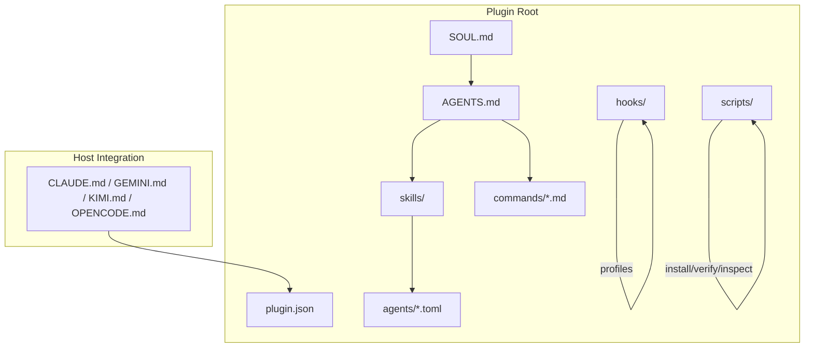
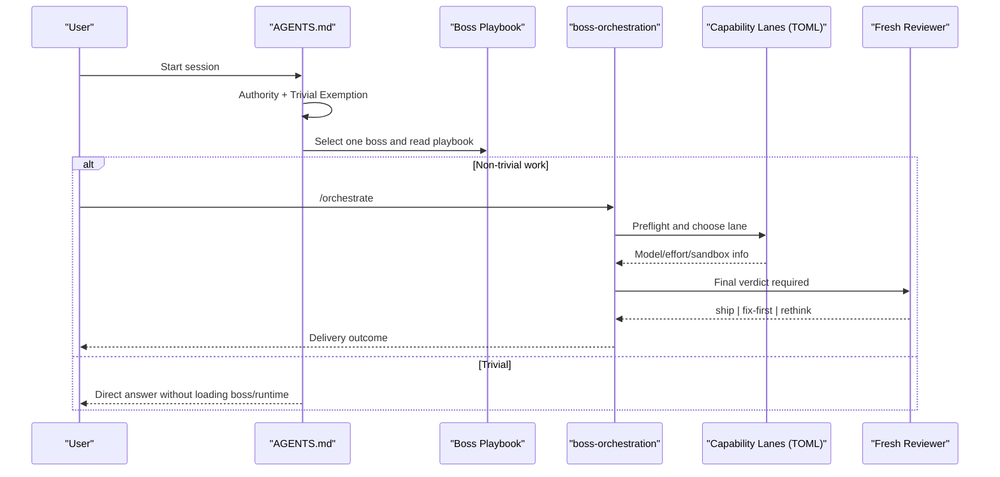
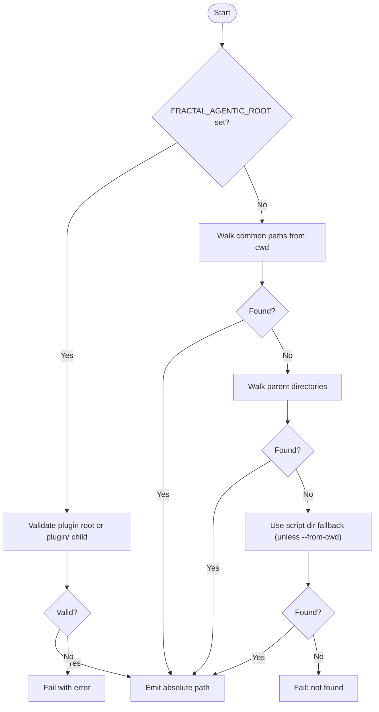
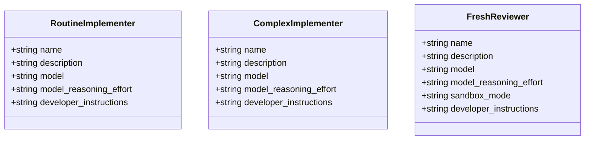
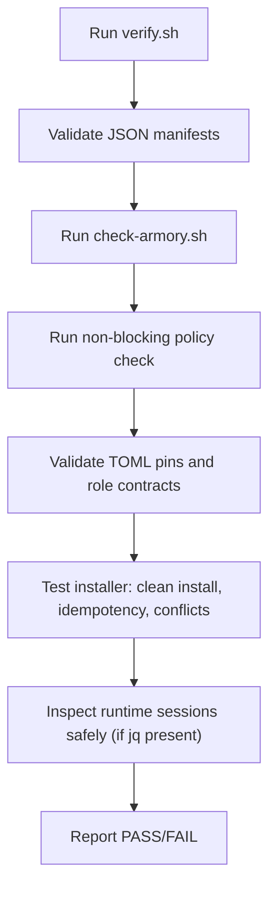
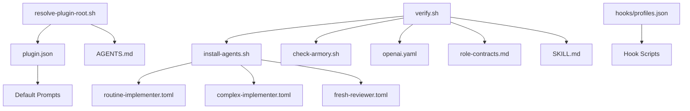

<cite>
**Referenced Files in This Document**
- `fractal-agentic/SOUL.md`
- `fractal-agentic/AGENTS.md`
- `fractal-agentic/README.md`
- `fractal-agentic/CUSTOMIZE.md`
- `fractal-agentic/TROUBLESHOOTING.md`
- `fractal-agentic/package.json`
- `fractal-agentic/plugin.json`
- `fractal-agentic/scripts/resolve-plugin-root.sh`
- `fractal-agentic/scripts/install-agents.sh`
- `fractal-agentic/scripts/check-armory.sh`
- `fractal-agentic/scripts/verify.sh`
- `fractal-agentic/hooks/profiles.json`
- `fractal-agentic/agents/fractal-agentic-routine-implementer.toml`
- `fractal-agentic/agents/fractal-agentic-complex-implementer.toml`
- `fractal-agentic/agents/fractal-agentic-fresh-reviewer.toml`
</cite>

## Table of Contents
1. Introduction
2. Project Structure
3. Core Components
4. Architecture Overview
5. Detailed Component Analysis
6. Dependency Analysis
7. Performance Considerations
8. Troubleshooting Guide
9. Conclusion
10. Appendices

## Introduction
This document explains how to configure and set up the Fractal Agentic agent system. It covers the startup router, authority precedence rules, trivial exemption policy, environment variables, configuration files, runtime settings, identity principles from SOUL.md, plugin configuration, host integration, profile management, security and access control, debugging and logging, troubleshooting, and performance tuning. The goal is to help both new and experienced users operate the system reliably across different hosts and environments.

## Project Structure
The installable unit is the plugin directory referenced by FRACTAL_AGENTIC_ROOT. It contains:
- Identity and routing: SOUL.md, AGENTS.md, host shims (CLAUDE.md, GEMINI.md, KIMI.md, OPENCODE.md)
- Armory: skills/, agents/*.md, commands/*.md
- Runtime kernel: skills/boss-orchestration/*, capability TOML pins under agents/*.toml
- Scripts for installation, verification, and inspection
- Hooks for optional session automation and profiles
- Plugin manifests for marketplace integration

**Diagram sources**
- `fractal-agentic/SOUL.md#L1-L53`
- `fractal-agentic/AGENTS.md#L1-L106`
- `fractal-agentic/plugin.json#L1-L31`
- `fractal-agentic/scripts/resolve-plugin-root.sh#L1-L140`
- `fractal-agentic/scripts/install-agents.sh#L1-L180`
- `fractal-agentic/hooks/profiles.json#L1-L38`

**Section sources**
- `fractal-agentic/README.md#L44-L56`
- `fractal-agentic/CUSTOMIZE.md#L49-L74`

## Core Components
- Startup router: AGENTS.md defines authority precedence, one-boss selection, handoffs, and stop-reading rules.
- Identity and principles: SOUL.md describes core identity, boss-first routing, orchestration philosophy, and cross-harness vision.
- Capability lanes: Three TOML pins define routine implementer, complex implementer, and fresh reviewer roles with model and effort pins.
- Orchestration runtime: skills/boss-orchestration provides the delivery loop, contracts, and review gate.
- Host integration: plugin.json and host shims enable marketplace discovery and default prompts.
- Profiles: hooks/profiles.json selects a hook profile controlling session automation and safety checks.

Key environment variables:
- FRACTAL_AGENTIC_ROOT: Points to the plugin root; used by resolve-plugin-root.sh and all scripts.

**Section sources**
- `fractal-agentic/AGENTS.md#L6-L36`
- `fractal-agentic/SOUL.md#L1-L27`
- `fractal-agentic/agents/fractal-agentic-routine-implementer.toml#L1-L19`
- `fractal-agentic/agents/fractal-agentic-complex-implementer.toml#L1-L19`
- `fractal-agentic/agents/fractal-agentic-fresh-reviewer.toml#L1-L20`
- `fractal-agentic/plugin.json#L11-L20`
- `fractal-agentic/scripts/resolve-plugin-root.sh#L76-L86`

## Architecture Overview
The system follows a strict startup flow:
- Read project-local AGENTS.md and this router.
- Apply trivial exemption when applicable.
- Select exactly one domain boss and read its playbook.
- For non-trivial work, load /orchestrate and follow the runtime contracts.
- Use capability lanes (routine/complex/reviewer) when available; otherwise degrade gracefully.

**Diagram sources**
- `fractal-agentic/AGENTS.md#L17-L36`
- `fractal-agentic/README.md#L280-L329`
- `fractal-agentic/agents/fractal-agentic-fresh-reviewer.toml#L1-L20`

## Detailed Component Analysis

### Startup Router and Authority Precedence
- Authority precedence:
  1) Project-local AGENTS.md and explicit user requirements win for repository conventions and scope.
  2) This router supplies process guidance.
  3) The runtime source-of-truth is skills/boss-orchestration and its references.
- Trivial exemption: For single-sentence answers or pure explanations with no repo changes, respond directly without loading bosses or runtime.
- Mandatory state machine: Read applicable instructions, apply trivial exemption, select exactly one boss, read its INDEX.md fully, stop reading other playbooks, then use /orchestrate for delivery work.

**Section sources**
- `fractal-agentic/AGENTS.md#L6-L36`

### Trivial Exemption Policy
- Applies to quick answers, pure explanations, or simple “what is X?” questions.
- Avoid loading bosses, runtime, pins, or inventories unless the task becomes non-trivial.

**Section sources**
- `fractal-agentic/AGENTS.md#L17-L21`

### Environment Variables and Resolution
- FRACTAL_AGENTIC_ROOT must point at the plugin root (not monorepo root).
- resolve-plugin-root.sh resolves the plugin root via env, cwd walk-up, and script location fallback.
- If FRACTAL_AGENTIC_ROOT points to monorepo root but plugin/ exists and is valid, it will be accepted.

**Diagram sources**
- `fractal-agentic/scripts/resolve-plugin-root.sh#L76-L136`

**Section sources**
- `fractal-agentic/scripts/resolve-plugin-root.sh#L1-L140`

### Capability Lanes and TOML Pins
- Routine implementer: bounded, fully specified work under an active boss.
- Complex implementer: context-heavy or higher-risk work under an active boss.
- Fresh reviewer: read-only final review with ship|fix-first|rethink verdict.
- Fields include name, description, model, model_reasoning_effort, and sandbox_mode (reviewer).

**Diagram sources**
- `fractal-agentic/agents/fractal-agentic-routine-implementer.toml#L1-L19`
- `fractal-agentic/agents/fractal-agentic-complex-implementer.toml#L1-L19`
- `fractal-agentic/agents/fractal-agentic-fresh-reviewer.toml#L1-L20`

**Section sources**
- `fractal-agentic/agents/fractal-agentic-routine-implementer.toml#L1-L19`
- `fractal-agentic/agents/fractal-agentic-complex-implementer.toml#L1-L19`
- `fractal-agentic/agents/fractal-agentic-fresh-reviewer.toml#L1-L20`

### Plugin Configuration and Host Shims
- plugin.json defines display metadata, default prompts, and skills path.
- Host shims (CLAUDE.md, GEMINI.md, KIMI.md, OPENCODE.md) provide adapter behavior for specific hosts.
- package.json exposes CLI entry and scripts for verification and health checks.

**Section sources**
- `fractal-agentic/plugin.json#L11-L20`
- `fractal-agentic/package.json#L1-L34`

### Hook Profiles and Session Automation
- hooks/profiles.json defines minimal, standard, and strict profiles that compose lifecycle hooks.
- Profiles include pre-bash safety, config protection, session start/handoff detection, periodic essays, and stop hooks for quality and console warnings.

**Section sources**
- `fractal-agentic/hooks/profiles.json#L1-L38`

### Installation and Verification
- install-agents.sh installs three TOML templates into $CODEX_HOME/agents or ~/.codex/agents without modifying config files.
- verify.sh validates JSON manifests, runs armory check, enforces non-blocking policy, validates TOML pins, checks role contracts, ensures command frontmatter, tests installer idempotency and conflict refusal, and inspects runtime data safely.
- check-armory.sh asserts presence of critical files and skills, warns on missing critical skills, and validates openai.yaml shape.

**Diagram sources**
- `fractal-agentic/scripts/verify.sh#L92-L143`
- `fractal-agentic/scripts/verify.sh#L173-L226`
- `fractal-agentic/scripts/check-armory.sh#L84-L106`

**Section sources**
- `fractal-agentic/scripts/install-agents.sh#L1-L180`
- `fractal-agentic/scripts/verify.sh#L1-L274`
- `fractal-agentic/scripts/check-armory.sh#L1-L143`

### Security, Authentication, and Access Control
- Fresh reviewer uses sandbox_mode=read-only to enforce read-only constraints during final review.
- Installer never overwrites differing destination files and does not mutate config.toml.
- Runtime inspector extracts only allowlisted fields and refuses invalid thread IDs or zero-match cases.
- Hooks include pre-edit config protection and bash safety measures.

**Section sources**
- `fractal-agentic/agents/fractal-agentic-fresh-reviewer.toml#L1-L20`
- `fractal-agentic/scripts/install-agents.sh#L127-L163`
- `fractal-agentic/scripts/verify.sh#L234-L273`
- `fractal-agentic/hooks/profiles.json#L1-L38`

### Debugging, Logging, and Diagnostics
- Use inspect-agent-runtime.sh to extract safe routing information from a subagent thread ID when available.
- verify.sh includes runtime inspector tests to ensure safe extraction and refusal of invalid inputs.
- TROUBLESHOOTING.md provides quick links and a 30-second health checklist.

**Section sources**
- `fractal-agentic/scripts/verify.sh#L234-L273`
- `fractal-agentic/TROUBLESHOOTING.md#L17-L27`

### Common Configuration Scenarios
- One-time setup:
  - Set FRACTAL_AGENTIC_ROOT to the plugin root.
  - Run install-agents.sh to install capability TOML pins.
  - Confirm with check-armory.sh and verify.sh.
- Per-project auto-use:
  - Paste the AGENTS snippet into the project’s AGENTS.md.
  - Ensure resolve-plugin-root.sh succeeds from the project directory.
- Profile selection:
  - Choose minimal, standard, or strict in hooks/profiles.json based on desired safety and automation level.
- Stack defaults:
  - Detect Svelte, React, Vue, Flutter, Rust, or Tauri from manifests and extensions; adjust boss mappings accordingly.

**Section sources**
- `fractal-agentic/README.md#L143-L168`
- `fractal-agentic/scripts/resolve-plugin-root.sh#L76-L136`
- `fractal-agentic/hooks/profiles.json#L1-L38`
- `fractal-agentic/AGENTS.md#L54-L61`

### Performance Considerations
- Prefer routine implementer for bounded tasks to reduce reasoning overhead.
- Use complex implementer only when necessary due to higher model effort.
- Keep capability_mode degraded when pins are absent to avoid blocking product work.
- Minimize hook complexity for faster session startup; choose minimal profile where appropriate.

[No sources needed since this section provides general guidance]

## Dependency Analysis
The following diagram shows key dependencies among configuration and runtime components.

**Diagram sources**
- `fractal-agentic/scripts/resolve-plugin-root.sh#L1-L140`
- `fractal-agentic/scripts/verify.sh#L1-L274`
- `fractal-agentic/scripts/install-agents.sh#L1-L180`
- `fractal-agentic/scripts/check-armory.sh#L1-L143`
- `fractal-agentic/hooks/profiles.json#L1-L38`
- `fractal-agentic/plugin.json#L11-L20`

**Section sources**
- `fractal-agentic/scripts/verify.sh#L1-L274`
- `fractal-agentic/scripts/check-armory.sh#L1-L143`

## Performance Considerations
- Use the least capable lane sufficient for the task to minimize cost and latency.
- Avoid unnecessary hook execution by selecting minimal profiles for fast iteration.
- Keep skills vendored locally to prevent network or symlink delays.
- Defer heavy diagnostics (runtime inspector) until needed.

[No sources needed since this section provides general guidance]

## Troubleshooting Guide
- Health checks:
  - Resolve plugin root: export FRACTAL_AGENTIC_ROOT and run resolve-plugin-root.sh.
  - Armory health: run check-armory.sh.
  - Full verification: run verify.sh.
- Common issues:
  - Spawn types missing: install capability TOMLs and start a new task.
  - Installer conflict: resolve differing destination files deliberately; installer will not overwrite.
  - Wrong stack defaults: re-read router and active boss stack gate; monorepo default is Svelte.
  - Missing skill: confirm SKILL.md exists under skills/<id>/; all skills are vendored locally.

**Section sources**
- `fractal-agentic/TROUBLESHOOTING.md#L17-L27`
- `fractal-agentic/scripts/install-agents.sh#L127-L163`
- `fractal-agentic/scripts/check-armory.sh#L84-L106`

## Conclusion
Fractal Agentic provides a robust, host-agnostic agent configuration system centered on a clear startup router, strict authority precedence, and a non-blocking capability policy. By using environment variables, TOML pins, hook profiles, and verification scripts, teams can tailor the system to their stack and security needs while maintaining reliable delivery through orchestration and review gates.

[No sources needed since this section summarizes without analyzing specific files]

## Appendices

### Quick Reference: Environment and Commands
- FRACTAL_AGENTIC_ROOT: Path to plugin root.
- install-agents.sh [--target-dir <path>] [--check]: Install or validate capability TOML pins.
- check-armory.sh: Assert critical assets and skills.
- verify.sh: Full local verification suite.
- resolve-plugin-root.sh [--from-cwd]: Resolve plugin root from env/cwd/script location.

**Section sources**
- `fractal-agentic/scripts/resolve-plugin-root.sh#L1-L140`
- `fractal-agentic/scripts/install-agents.sh#L1-L180`
- `fractal-agentic/scripts/check-armory.sh#L1-L143`
- `fractal-agentic/scripts/verify.sh#L1-L274`