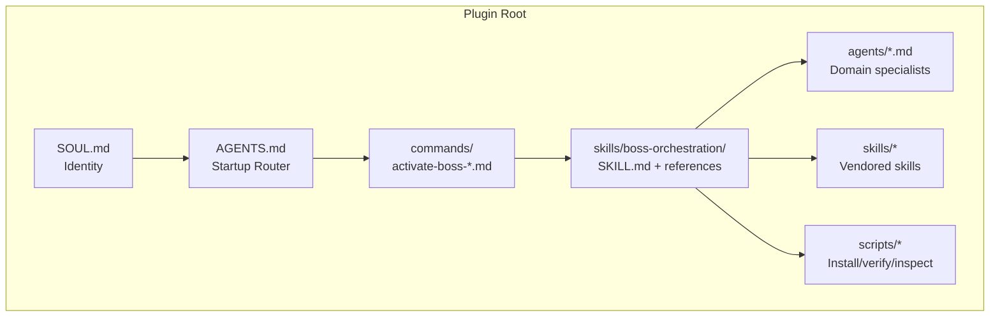
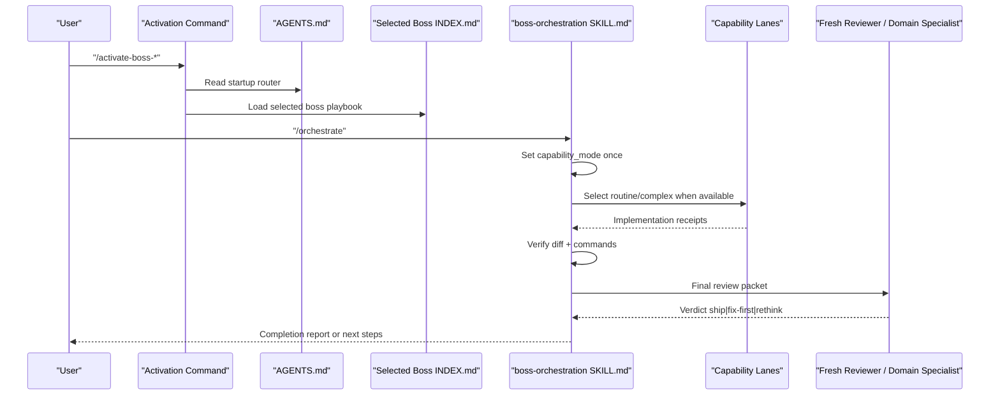
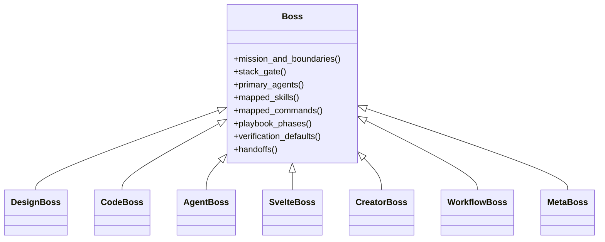
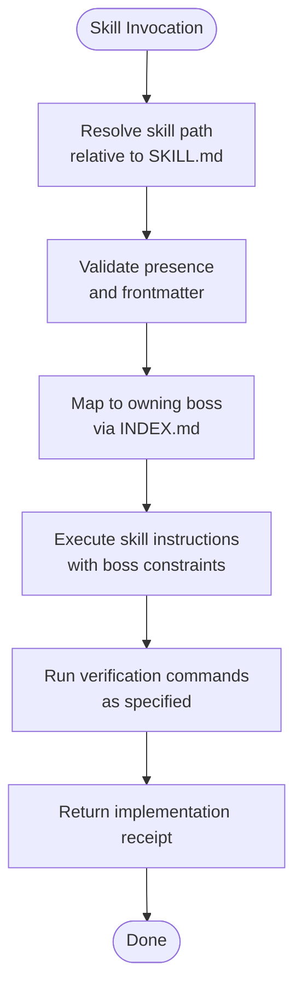
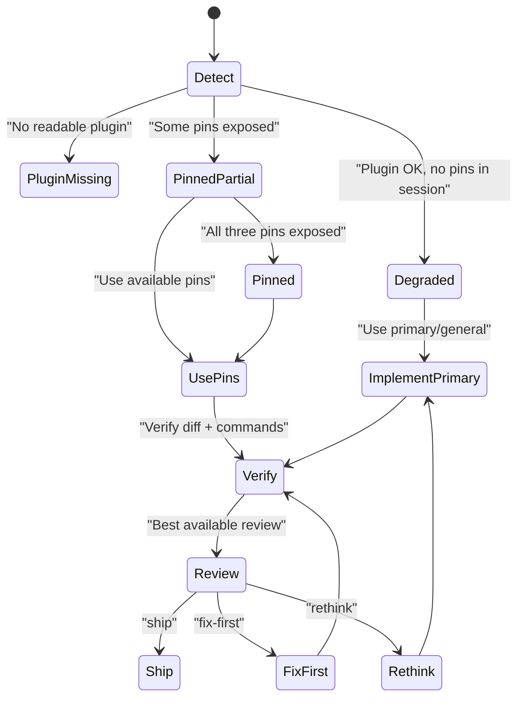
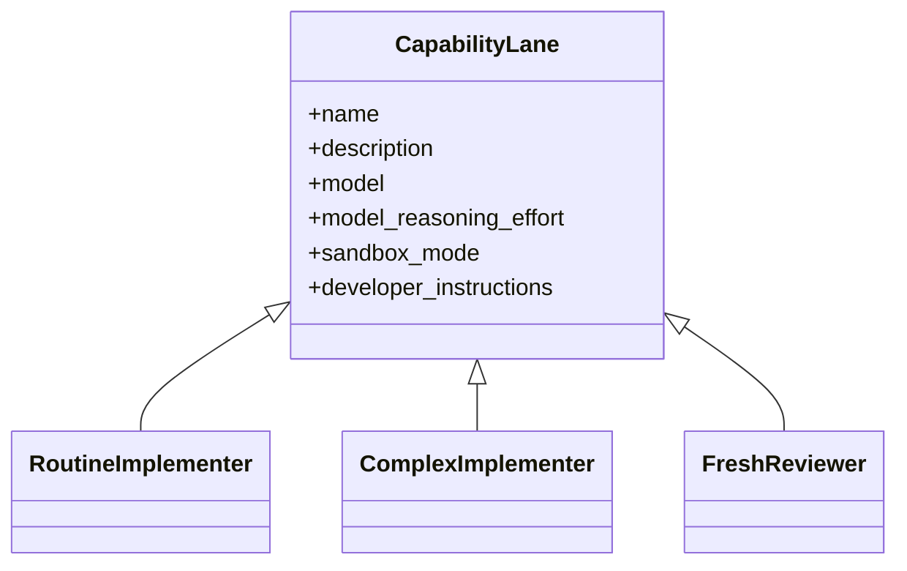
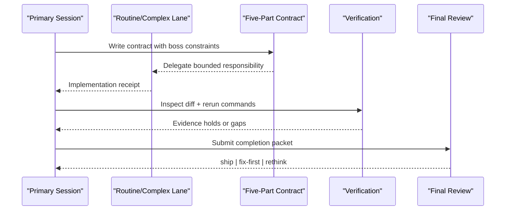
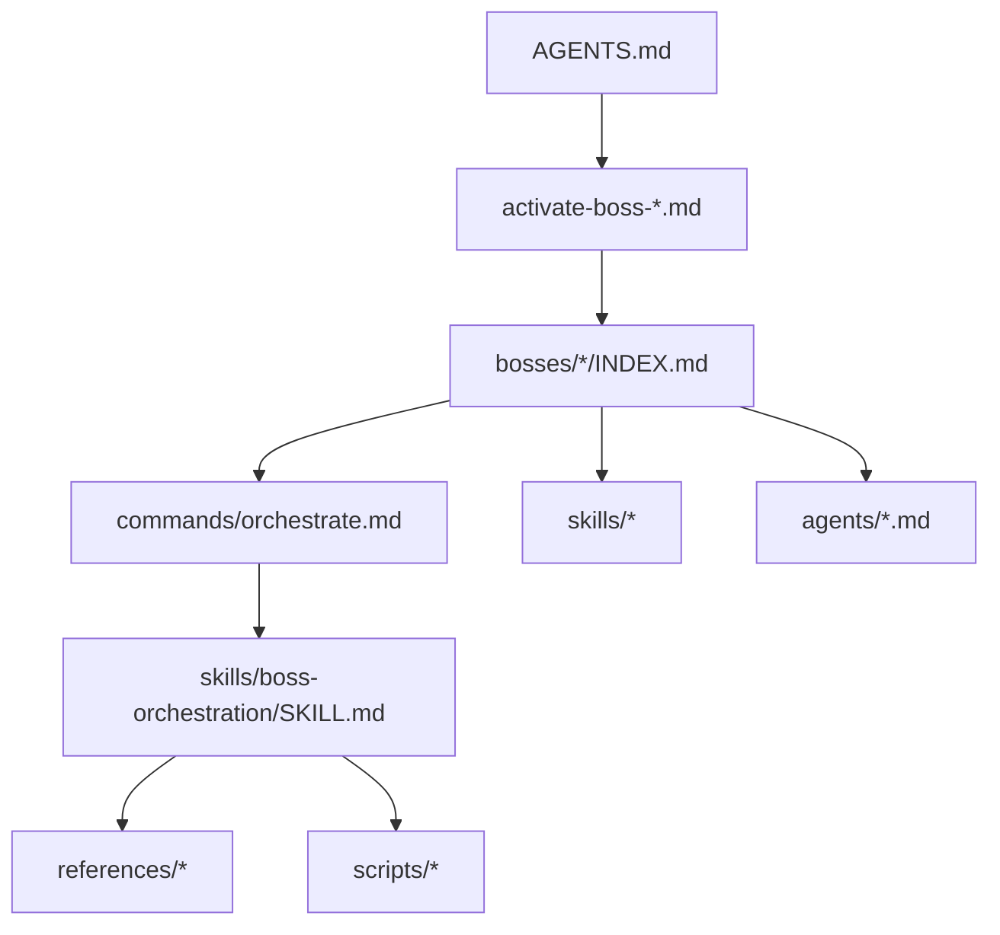

<cite>
**Referenced Files in This Document**
- `fractal-agentic/README.md`
- `fractal-agentic/CLAUDE.md`
- `fractal-agentic/CUSTOMIZE.md`
- `fractal-agentic/docs/00-overview.md`
- `fractal-agentic/docs/orchestration/runtime.md`
- `fractal-agentic/skills/boss-orchestration/SKILL.md`
- `fractal-agentic/commands/orchestrate.md`
- `fractal-agentic/bosses/agent/INDEX.md`
- `fractal-agentic/bosses/code/INDEX.md`
- `fractal-agentic/bosses/creator/INDEX.md`
- `fractal-agentic/bosses/design/INDEX.md`
- `fractal-agentic/bosses/meta/INDEX.md`
- `fractal-agentic/bosses/svelte/INDEX.md`
- `fractal-agentic/bosses/workflow/INDEX.md`
</cite>

## Table of Contents
1. [Introduction](#introduction)
2. [Project Structure](#project-structure)
3. [Core Components](#core-components)
4. [Architecture Overview](#architecture-overview)
5. [Detailed Component Analysis](#detailed-component-analysis)
6. [Dependency Analysis](#dependency-analysis)
7. [Performance Considerations](#performance-considerations)
8. [Troubleshooting Guide](#troubleshooting-guide)
9. [Conclusion](#conclusion)
10. [Appendices](#appendices)

## Introduction
This document explains the AI agent orchestration system centered on a boss-based architecture with seven specialized domain bosses: Design, Code, Agent, Svelte, Creator, Workflow, and Meta. It covers the skill execution engine with 167+ vendored skills, agent configuration via capability lanes, custom agent development, progressive capability discovery, handoff protocols, multi-agent coordination patterns, performance optimization, security considerations, debugging techniques, and troubleshooting common issues. The system is host-agnostic and tuned for Svelte-first stacks but can be adapted to other environments.

## Project Structure
The plugin root contains identity files, startup router, domain playbooks, armory (skills, agents, commands), optional hooks, and scripts that support installation, verification, and runtime inspection. The orchestrator runtime is implemented as a skill under skills/boss-orchestration, with references defining contracts, routing, and prompts. Activation commands load the startup router and one domain playbook; /orchestrate executes the delivery runtime.

**Diagram sources**
- `fractal-agentic/README.md`
- `fractal-agentic/CLAUDE.md`
- `fractal-agentic/skills/boss-orchestration/SKILL.md`
- `fractal-agentic/commands/orchestrate.md`

**Section sources**
- `fractal-agentic/README.md`
- `fractal-agentic/docs/00-overview.md`

## Core Components
- Seven domain bosses define mission, boundaries, stack gates, primary agents, mapped skills/commands, phases, verification defaults, and handoffs.
- Orchestration runtime defines non-blocking policy, capability mode, lane selection, five-part contracts, verification, review verdicts, and optional wiki/self-improvement capture.
- Activation commands load the router and one boss playbook; /orchestrate executes the runtime.
- Scripts provide install checks, full verification, and runtime inspection.

Key responsibilities:
- Boss playbooks: domain authority, constraints, and verification defaults injected into worker contracts.
- Runtime kernel: best-effort capability lanes, progressive discovery, and strict verification/review.
- Armory: vendored skills and specialist agents mapped per boss.

**Section sources**
- `fractal-agentic/skills/boss-orchestration/SKILL.md`
- `fractal-agentic/commands/orchestrate.md`
- `fractal-agentic/bosses/agent/INDEX.md`
- `fractal-agentic/bosses/code/INDEX.md`
- `fractal-agentic/bosses/creator/INDEX.md`
- `fractal-agentic/bosses/design/INDEX.md`
- `fractal-agentic/bosses/meta/INDEX.md`
- `fractal-agentic/bosses/svelte/INDEX.md`
- `fractal-agentic/bosses/workflow/INDEX.md`

## Architecture Overview
The system separates identity/router from domain playbooks and runtime. Activation selects one boss; orchestration enforces contracts, lanes, verification, and review. Capability lanes are optional quality improvements; missing pins never block work.

**Diagram sources**
- `fractal-agentic/commands/orchestrate.md`
- `fractal-agentic/skills/boss-orchestration/SKILL.md`

## Detailed Component Analysis

### Boss-Based Architecture
Each boss defines:
- Mission and boundaries
- Stack and surface gate
- Primary and secondary agents
- Mapped skills and commands
- Phased playbook
- Verification defaults
- Handoffs to other bosses

Examples:
- Design: tokens, UI craft, a11y, motion, visual QA.
- Code: audits, security, tests, perf, docs-from-code.
- Agent: harness, memory, evals, MCP, safety.
- Svelte: runes, Kit data flow, SASS, port lane.
- Creator: scaffold → build → ship; executive cross-domain armory.
- Workflow: personal habits, automation, context, cost, loops.
- Meta: ECC install, inventory, compliance, promotion, pruning.

**Diagram sources**
- `fractal-agentic/bosses/design/INDEX.md`
- `fractal-agentic/bosses/code/INDEX.md`
- `fractal-agentic/bosses/agent/INDEX.md`
- `fractal-agentic/bosses/svelte/INDEX.md`
- `fractal-agentic/bosses/creator/INDEX.md`
- `fractal-agentic/bosses/workflow/INDEX.md`
- `fractal-agentic/bosses/meta/INDEX.md`

**Section sources**
- `fractal-agentic/bosses/design/INDEX.md`
- `fractal-agentic/bosses/code/INDEX.md`
- `fractal-agentic/bosses/agent/INDEX.md`
- `fractal-agentic/bosses/svelte/INDEX.md`
- `fractal-agentic/bosses/creator/INDEX.md`
- `fractal-agentic/bosses/workflow/INDEX.md`
- `fractal-agentic/bosses/meta/INDEX.md`

### Skill Execution Engine
- Vendored skills under skills/* with live indexes; no external symlinks at runtime.
- Skills map to bosses via boss playbooks; some skills are shared across bosses.
- Orchestration references define role contracts, routing matrix, handoffs, and boss prompts.
- Commands expose entry points to orchestration and domain-specific flows.

**Diagram sources**
- `fractal-agentic/skills/boss-orchestration/SKILL.md`
- `fractal-agentic/CUSTOMIZE.md`

**Section sources**
- `fractal-agentic/README.md`
- `fractal-agentic/CUSTOMIZE.md`

### Progressive Capability Discovery
- Three layers: Content (readable guides), Install (TOML templates present), Session (spawn catalog exposes types).
- Capability modes: plugin_missing, degraded, pinned_partial, pinned.
- Preflight checks are optional and non-blocking; session exposure is the only proof of pin usability.
- When pins are unavailable, degrade gracefully without blocking product work.

**Diagram sources**
- `fractal-agentic/skills/boss-orchestration/SKILL.md`

**Section sources**
- `fractal-agentic/skills/boss-orchestration/SKILL.md`

### Agent Configuration and Custom Development
- Capability lanes defined by TOML templates: routine implementer, complex implementer, fresh reviewer.
- Installer copies templates to host agents directory; verify ensures expected fields and names.
- Custom domain agents authored as .md files with frontmatter and rules; mapped under boss playbooks.
- Adding/changing lanes requires updates across orchestration references, installer, verify, and README.

**Diagram sources**
- `fractal-agentic/CUSTOMIZE.md`

**Section sources**
- `fractal-agentic/CUSTOMIZE.md`

### Agent Handoff Protocols and Multi-Agent Coordination
- Handoffs between bosses are explicit, with clear out-of-scope boundaries and escalation paths.
- Five-part contracts enforce objective, ownership, interfaces, constraints, and verification.
- Workers return implementation receipts; primary re-verifies evidence before acceptance.
- Optional parallel domain specialists consult at commitment boundaries; final review uses best available.

**Diagram sources**
- `fractal-agentic/skills/boss-orchestration/SKILL.md`
- `fractal-agentic/docs/orchestration/runtime.md`

**Section sources**
- `fractal-agentic/skills/boss-orchestration/SKILL.md`
- `fractal-agentic/docs/orchestration/runtime.md`

### Practical Examples
- Boss activation: use /activate-boss-* to load router and one domain playbook.
- Skill execution: invoke skills via mapped commands or boss playbooks; verify with exact commands.
- Agent customization: author .md agents, map under boss, update indexes; adjust TOML lanes and reinstall.

**Section sources**
- `fractal-agentic/commands/orchestrate.md`
- `fractal-agentic/CUSTOMIZE.md`

## Dependency Analysis
- Startup router (AGENTS.md) selects one boss; activation commands load nested INDEX.md.
- Orchestration skill depends on references for contracts, routing, handoffs, and prompts.
- Scripts support install checks, verification, and runtime inspection; health checks validate critical assets.
- Boss playbooks depend on mapped skills and agents; commands provide entry points.

**Diagram sources**
- `fractal-agentic/README.md`
- `fractal-agentic/skills/boss-orchestration/SKILL.md`
- `fractal-agentic/commands/orchestrate.md`

**Section sources**
- `fractal-agentic/README.md`
- `fractal-agentic/skills/boss-orchestration/SKILL.md`

## Performance Considerations
- Prefer capability lanes when exposed to offload volume; otherwise implement in primary.
- Run independent non-overlapping work in parallel; serialize shared dependencies.
- Use verification early to avoid rework; keep contracts precise to reduce ambiguity.
- Avoid hardcoding counts; rely on live indexes to prevent stale guidance.
- For release-critical paths, add adversarial review (/santa-loop) after ship verdict.

[No sources needed since this section provides general guidance]

## Troubleshooting Guide
Common symptoms and actions:
- Spawn types missing: run install-agents.sh, then start a new task.
- --check fails due to differing destination: resolve differences deliberately; installer will not overwrite.
- Model/effort unknown: inspect-agent-runtime.sh if rollout exists; otherwise continue with available evidence.
- Reviewer mutated files: stop; do not claim read-only; capture residual risk.
- Missing skill: confirm skills/<id>/SKILL.md exists; all skills are vendored locally.
- Wrong stack defaults: re-read router and active boss stack gate; monorepo default is Svelte.

**Section sources**
- `fractal-agentic/CUSTOMIZE.md`

## Conclusion
The system delivers a robust, host-agnostic orchestration model with clear domain boundaries, progressive capability discovery, and strict verification/review. Boss playbooks guide constraints and verification; the runtime enforces contracts and non-blocking progression. With 167+ vendored skills and specialist agents, teams can scale delivery while maintaining quality and safety.

[No sources needed since this section summarizes without analyzing specific files]

## Appendices
- Installation and auto-use mandate: follow project-integration snippet and set FRACTAL_AGENTIC_ROOT.
- Health checks: check-armory.sh and verify.sh ensure asset integrity and pin consistency.
- Optional systems: wiki capture and self-improvement are non-blocking and configurable.

**Section sources**
- `fractal-agentic/README.md`
- `fractal-agentic/docs/00-overview.md`