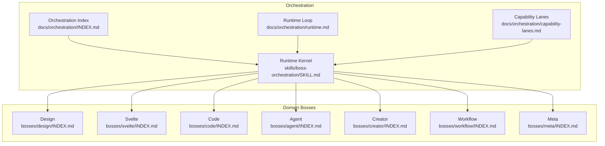
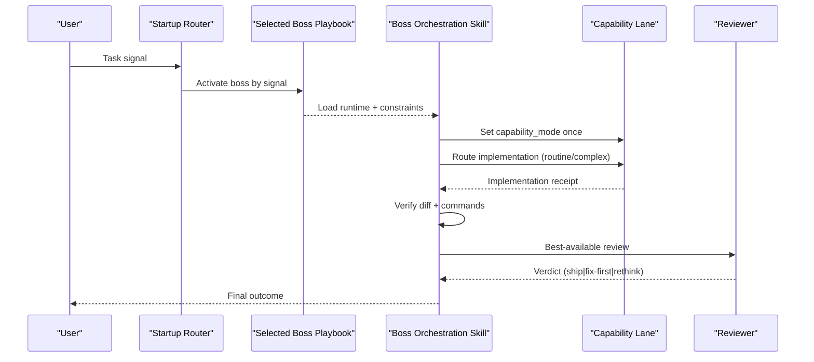
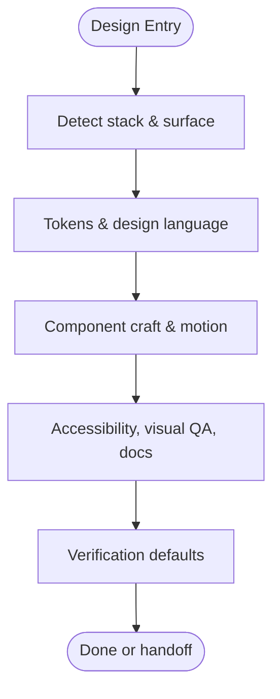
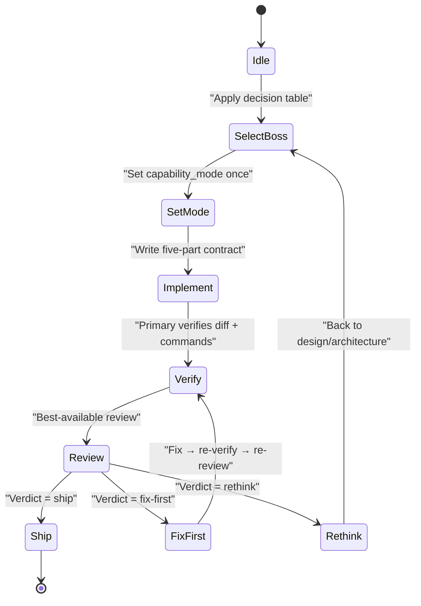
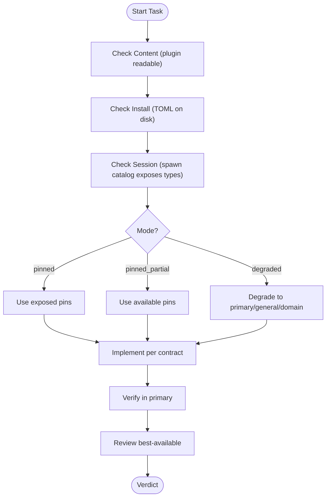
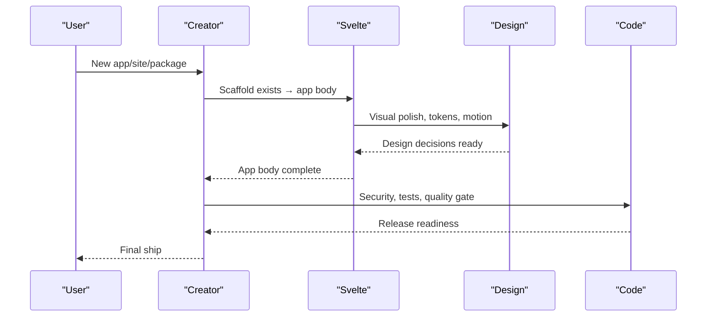
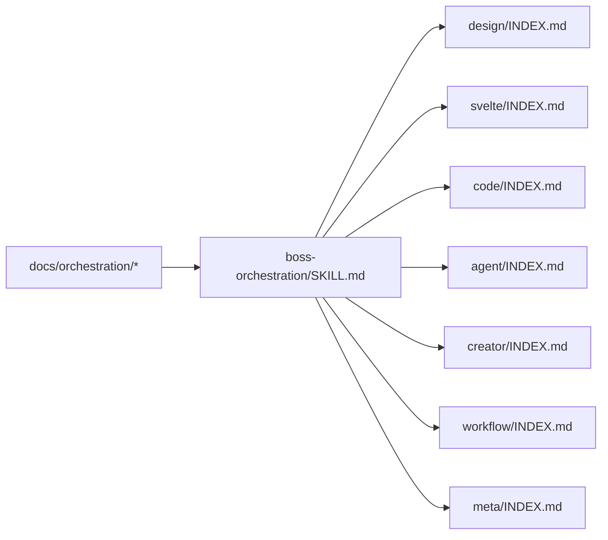

<cite>
**Referenced Files in This Document**
- `skills/boss-orchestration/SKILL.md`
- `docs/orchestration/INDEX.md`
- `docs/orchestration/runtime.md`
- `docs/orchestration/capability-lanes.md`
- `docs/bosses/INDEX.md`
- `bosses/design/INDEX.md`
- `bosses/code/INDEX.md`
- `bosses/agent/INDEX.md`
- `bosses/svelte/INDEX.md`
- `bosses/creator/INDEX.md`
- `bosses/workflow/INDEX.md`
- `bosses/meta/INDEX.md`
</cite>

## Table of Contents
1. [Introduction](#introduction)
2. [Project Structure](#project-structure)
3. [Core Components](#core-components)
4. [Architecture Overview](#architecture-overview)
5. [Detailed Component Analysis](#detailed-component-analysis)
6. [Dependency Analysis](#dependency-analysis)
7. [Performance Considerations](#performance-considerations)
8. [Troubleshooting Guide](#troubleshooting-guide)
9. [Conclusion](#conclusion)

## Introduction
This document explains the boss orchestration system that routes tasks to one of seven specialized domain bosses, enforces capability lanes and non-blocking policies, and runs a deterministic delivery loop with verification and review. It covers:
- The seven bosses and their responsibilities
- Boss selection based on task signals
- Handoff protocols between bosses
- Startup state machine and activation commands
- Capability lanes and the non-blocking rule
- Routing examples, handoff scenarios, and integration patterns
- Boss-specific configurations, stack detection, and surface gates
- Troubleshooting and performance optimization tips

The runtime kernel is defined in the boss-orchestration skill, while each boss’s authoritative playbook lives under docs/bosses/<boss>/INDEX.md.

**Section sources**
- `skills/boss-orchestration/SKILL.md#L1-L312`
- `docs/orchestration/INDEX.md#L1-L71`

## Project Structure
At a high level:
- The orchestration runtime is implemented as a skill (boss-orchestration) and referenced by the startup router and boss playbooks.
- Each boss has an authoritative INDEX.md describing mission, boundaries, stack/surface gate, mapped skills and commands, phases, verification defaults, and handoffs.
- Orchestration documentation provides progressive reading paths, runtime loop, and capability lanes.

**Diagram sources**
- `skills/boss-orchestration/SKILL.md#L1-L312`
- `docs/orchestration/INDEX.md#L1-L71`
- `docs/orchestration/runtime.md#L1-L53`
- `docs/orchestration/capability-lanes.md#L1-L64`
- `docs/bosses/INDEX.md#L1-L92`

**Section sources**
- `skills/boss-orchestration/SKILL.md#L1-L312`
- `docs/orchestration/INDEX.md#L1-L71`
- `docs/orchestration/runtime.md#L1-L53`
- `docs/orchestration/capability-lanes.md#L1-L64`
- `docs/bosses/INDEX.md#L1-L92`

## Core Components
- Runtime kernel (boss-orchestration): executive architect for domain routing, capability lane selection, five-part contracts, verification, and final review. Enforces non-blocking policy and progression when pins are missing.
- Domain bosses: Design, Svelte, Code, Agent, Creator, Workflow, Meta — each owns a distinct responsibility set with stack/surface gates, mapped skills/commands, phases, verification defaults, and handoff rules.
- Orchestration docs: progressive path, runtime loop, and capability lanes guide how to select a boss, set capability mode, write contracts, implement, verify, and review.

Key runtime behaviors:
- Non-blocking rule: missing install or spawn types never stop product work; degrade gracefully.
- Session capability mode: plugin_missing, degraded, pinned_partial, pinned.
- Five-part contract: objective, active boss + stack defaults, files/ownership, interfaces, constraints (+ boss-prompts), verification.
- Verdicts: ship, fix-first, rethink.

**Section sources**
- `skills/boss-orchestration/SKILL.md#L30-L63`
- `skills/boss-orchestration/SKILL.md#L169-L208`
- `skills/boss-orchestration/SKILL.md#L210-L258`
- `docs/orchestration/runtime.md#L1-L53`
- `docs/orchestration/capability-lanes.md#L1-L64`

## Architecture Overview
The orchestration architecture separates domain ownership from capability execution:
- Startup router selects one boss based on signals.
- Selected boss’s INDEX.md supplies constraints, phases, and verification defaults.
- Runtime loads only what is needed for the current capability or review decision.
- Capability lanes improve delegation but are optional; degradation is first-class.

**Diagram sources**
- `skills/boss-orchestration/SKILL.md#L83-L106`
- `skills/boss-orchestration/SKILL.md#L169-L208`
- `skills/boss-orchestration/SKILL.md#L210-L258`
- `docs/bosses/INDEX.md#L23-L38`

**Section sources**
- `docs/orchestration/INDEX.md#L1-L71`
- `skills/boss-orchestration/SKILL.md#L83-L106`

## Detailed Component Analysis

### Design Boss
- Mission: UI craft, tokens, accessibility, motion, visual QA. Monorepo is Svelte UI first.
- Stack and surface gate: Detect stack from manifests/extensions; default to Svelte; identify surface (Studio app shell, public sites, package docs, mobile). SEO path only for public sites.
- Primary agents: A11Y Architect, Svelte Reviewer, SEO Specialist. Secondary reviewers for React/Vue/Flutter when present.
- Mapped skills: design-system, frontend-design-direction, frontend-design, web-design-guidelines, impeccable, make-interfaces-feel-better, better-ui/layout/typography/interface, motion foundations/UI/advanced/patterns, accessibility/frontend-a11y, liquid-glass-design, brand discovery/voice, browser-qa, inherit-legacy-style, theme-factory, canvas-design, algorithmic-art, styling-docs-builder, frontend-patterns.
- Mapped commands: plan-canvas, svelte-review, quality-gate, react-build/review, vue-review.
- Phases: stack/surface → tokens/design language → component craft/motion → accessibility/visual QA/docs.
- Verification defaults: inspect token usage and contrast surfaces; run quality-gate; check semantic/SEO structure for public sites.
- Handoffs: to Svelte (implementation), Code (security/tests/release), Creator (new product scaffold).

**Diagram sources**
- `bosses/design/INDEX.md#L25-L118`

**Section sources**
- `bosses/design/INDEX.md#L1-L131`

### Svelte Boss
- Mission: Frontend contract for apps, sites, packages. Default stack: Svelte 5 + SvelteKit + indented SASS.
- Stack gate: React/Vue reviewers are migration-only secondary.
- Primary agents: Svelte Reviewer, Code Reviewer, Build Error Resolver, A11Y Architect (secondary shared with Design).
- Mapped skills: svelte-5-runes, svelte-runes, components patterns/components/template directives, styling patterns/styling, sveltekit architecture/data flow/remote functions/structure/deployment, ecosystem guide, design-system, e2e-testing, tdd-workflow.
- Port lane: port-component, shadcn-porting, shadcn-to-svelte, styling-docs-builder.
- Mapped commands: svelte-review → svelte-build → svelte-test → quality-gate; code-review.
- Phases: runes/data flow → components/snippets/SASS → port/library work → review/check/E2E.
- Verification defaults: svelte-review mindset, svelte-test when behavior changes, quality-gate before ship.
- Handoffs: to Design (polish), Code (security/ship), Creator (new package/app), Agent (in-product AI feature).

**Section sources**
- `bosses/svelte/INDEX.md#L1-L118`

### Code Boss
- Mission: Audits, security, tests, performance, tech debt, test coverage, architecture health, docs-from-code.
- Stack gate: Detect Svelte, React, Vue, Rust, Tauri; use primary reviewer per detected stack; retain Code/Security cross-stack discipline.
- Primary agents: Code Reviewer, Architect/Code Architect, Code Explorer, Security Reviewer, Performance Optimizer, Build Error Resolver, Refactor Cleaner, Silent Failure Hunter, Comment Analyzer, PR Test Analyzer, Doc Updater.
- Mapped skills: codebase-onboarding, repo-scan, production-audit, workspace-surface-audit, security-review/security-scan/security-bounty-hunter, plankton-code-quality, coding-standards, tdd-workflow/e2e-testing/ai-regression-testing, benchmark/benchmark-optimization-loop/latency-critical-systems/performance-investigator, adr-writing/updating, error-handling/verification-loop/gateguard, database-migrations/postgres-patterns/redis-patterns, app-documenter/doc-frontmatter/browser-use.
- Mapped commands: code-review, security-scan, test-coverage, refactor-clean, quality-gate, harness-audit, santa-loop.
- Phases: exploration/surfaces → deep audit → remediation/release → documentation.
- Verification defaults: security-scan for sensitive surfaces; scoped tests/test-coverage; quality-gate before ship; santa-loop for release-critical.
- Handoffs: to Design (visual/a11y polish), from Agent (product agent work involving tools/secrets/user data), to/from Svelte/Creator (security/tests/release checks), to Meta (skill portfolio rot/compliance).

**Section sources**
- `bosses/code/INDEX.md#L1-L132`

### Agent Boss
- Mission: Product agent systems inside code: harnesses, memory, evals, multi-agent orchestration, MCP tool servers, action-space safety.
- Stack and surface gate: For AI surface in Svelte monorepo, Agent owns harness/action-space layer; Svelte/Design own UI implementation/craft. Escalate secrets/tools/user-data to Code before ship.
- Primary agents: Agent Evaluator, Harness Optimizer, Loop Operator, GAN Planner/Evaluator, Conversation Analyzer, Chief of Staff.
- Mapped skills: agentic-os/agentic-engineering, autonomous-agent-harness/agent-harness-construction/better-harness, continuous-agent-loop/autonomous-loops, continuous-learning-v2/continuous-learning, memclaw, llm-wiki, context-budget/token-budget-advisor, agent-eval/eval-harness/agent-self-evaluation, recursive-decision-ledger/team-agent-orchestration/dispatching-parallel-agents/subagent-driven-development, mcp-builder/skill-creator/hookify-rules/safety-guard/gateguard, cost-aware-llm-pipeline/cost-tracking/acontext-installer.
- Mapped commands: harness-audit, learn/learn-eval, instinct-status/export/import, hookify/hookify-configure/hookify-list, loop-start/loop-status, santa-loop, model-route/cost-report, wiki-init/status/capture/ingest/query/lint.
- Phases: framework identification/harness → memory tiers → orchestration/safety/eval → portfolio handoff.
- Verification defaults: harness-audit when harness changes; better-harness for action-space; santa-loop for agent-output claims; hand tools/secrets/user-data to Code.
- Handoffs: to Code (secrets/tools/user-data), from Creator (new product needs AI features), to Workflow (personal-only automation), to Meta (portfolio/install/compliance/promote/prune).

**Section sources**
- `bosses/agent/INDEX.md#L1-L146`

### Creator Boss
- Mission: End-to-end product delivery (scaffold → build → ship) for apps, sites, packages. Executive authority to pull other boss armories.
- Stack and target gate: Detect stack/target before scaffolding; default frontend to SvelteKit + Svelte 5 + indented SASS; Tauri for desktop when applicable; use live indexes rather than static registry.
- Executive cross-domain armory: pulls Design, Svelte, Code, Agent, Workflow, Meta as needed.
- Primary agents: Architect/Code Architect, Code Explorer, Rust Reviewer/Rust Build Resolver (Tauri 2), OpenSource Packager/Forker/Sanitizer, Build Error Resolver.
- Mapped skills: brainstorming/spec-writing, blueprint/build-feature-end-to-end, subagent-driven-development, port-component/shadcn pipeline, web-artifacts-builder, mcp-builder, app-documenter, design-system/frontend-patterns, rust-patterns/rust-testing/vite-patterns/bun-runtime, opensource-pipeline, liquid-glass-design/motion-foundations/architecture-decision-records, taste (media only).
- Mapped commands: plan-canvas, project-init, rust-build/review/test, skill-create, promote/pr, quality-gate, santa-loop.
- Phases: brainstorm/spec/blueprint/scaffold → architecture/native gate → cross-domain construction → verify/ship.
- Verification defaults: project-init/blueprint alignment; quality-gate and package/open-source gates; santa-loop before major ship.
- Handoffs: to Svelte (scaffold exists and app body is SvelteKit), to Design (visual system/polish), to Code (pre-ship audit/release gates), to Agent (AI harness/MCP surface), to Meta (new skill moves into portfolio health).

**Section sources**
- `bosses/creator/INDEX.md#L1-L128`

### Workflow Boss
- Mission: Personal OS: session habits, multi-channel triage, cost awareness, instinct hygiene, tool pruning, personal loops. Not a home for building LangChain or product agent frameworks.
- Stack and surface gate: Usually stack-neutral; if editing monorepo, does not take over product harness or release role.
- Primary/secondary agents: Chief of Staff (primary), Conversation Analyzer, Loop Operator, Agent Evaluator (secondary for personal-automation quality).
- Mapped skills: automation-audit-ops/hookify-rules, continuous-agent-loop/autonomous-loops, continuous-learning-v2/continuous-learning, recursive-decision-ledger, context-budget/token-budget-advisor, context-save/context-restore, llm-wiki, file-organizer/human-writing/docs-writer, agent-sort/using-superpowers.
- Mapped commands: hookify/hookify-configure/hookify-list, learn/learn-eval, instinct-status/export/import, loop-start/loop-status, wiki-init/query/lint, hooks-init/hooks-status, improve-init/improve-status, prune/auto-update/skill-health/cost-report, santa-loop for critical personal automations.
- Phases: observe friction → engineer personal loops → prune and budget.
- Verification defaults: product quality gates normally unnecessary; if automation edits repository, hand change to Code or Svelte; hooks/wiki/pins/local learning remain optional and non-blocking.
- Handoffs: to Agent (personal automation becomes product feature), to Meta (ECC-wide compliance/promotion/portfolio), to Creator (automation grows into new app/package).

**Section sources**
- `bosses/workflow/INDEX.md#L1-L119`

### Meta Boss
- Mission: Maintain ECC itself: installation, inventory, compliance, skill quality, promotion, pruning. Keeps ECC maintenance separate from Agent’s product-agent work.
- Inventory and stack gate: Use live indexes; keep real stack classification for capabilities.
- Primary agents: Agent Evaluator (quality scorecards), Harness Optimizer (install tuning).
- Mapped skills: configure-ecc, ecc-guide, skill-scout, skill-stocktake, skill-comply, skill-creator, agent-sort, rules-distill.
- Mapped commands: ecc-guide, skill-create, skill-health, auto-update, promote, prune.
- Phases: orient → portfolio health → promote and prune.
- Verification defaults: check live indexes via ecc-guide; use skill-health and installer/check scripts when pins change; run verify.sh after orchestration template changes.
- Handoffs: to Agent (product agent implementation), to Workflow (personal use of healthy portfolio), to Creator (new monorepo product scaffold); receives any boss needing installation/inventory/compliance/promotion/pruning.

**Section sources**
- `bosses/meta/INDEX.md#L1-L92`

### Boss Selection Algorithm and Startup State Machine
- Decision table maps signals to active boss (UI craft/tokens/a11y/motion → Design; Svelte/SvelteKit → Svelte; shadcn/fractalsvelte port → Svelte; security/audit/tests/docs-from-code → Code; product agent harness/memory/MCP → Agent; scaffold→ship → Creator; personal habits/prune/session → Workflow; ECC install/inventory/comply → Meta; unclear → Creator or observe via Workflow first).
- Startup router selects one boss; read its INDEX.md fully; stop reading others until a handoff.
- Capability mode set once per task: plugin_missing, degraded, pinned_partial, pinned.
- Non-blocking rule ensures progress even if install or spawn types are missing.

**Diagram sources**
- `docs/bosses/INDEX.md#L23-L38`
- `skills/boss-orchestration/SKILL.md#L50-L63`
- `skills/boss-orchestration/SKILL.md#L210-L258`

**Section sources**
- `docs/bosses/INDEX.md#L23-L38`
- `skills/boss-orchestration/SKILL.md#L50-L63`

### Capability Lanes and Non-blocking Policy
- Three lanes: routine implementer, complex implementer, fresh reviewer.
- Check layers: Content (readable plugin), Install (TOML on disk), Session (spawn catalog lists types).
- Degrade path: implement in primary/general/domain agents; keep five-part contract; verify in primary; review order: exposed fresh-reviewer pin → domain specialist → general read-only → structured self-review; report capability_mode + pins status.
- Non-blocking rule: missing TOML, spawn types, failed --check, hosts cannot pin models, or task not restarted after install are warnings and progression — never refuse implementation or demand a fresh task.

**Diagram sources**
- `docs/orchestration/capability-lanes.md#L22-L54`
- `skills/boss-orchestration/SKILL.md#L30-L63`

**Section sources**
- `docs/orchestration/capability-lanes.md#L1-L64`
- `skills/boss-orchestration/SKILL.md#L30-L63`

### Activation Commands
- Each boss has an activation command:
  - Design: /activate-boss-design
  - Svelte: /activate-boss-svelte
  - Code: /activate-boss-code
  - Agent: /activate-boss-agent
  - Creator: /activate-boss-creator
  - Workflow: /activate-boss-workflow
  - Meta: /activate-boss-meta

These commands activate the corresponding boss playbook for focused work.

**Section sources**
- `bosses/design/INDEX.md#L9-L13`
- `bosses/svelte/INDEX.md#L9-L13`
- `bosses/code/INDEX.md#L9-L13`
- `bosses/agent/INDEX.md#L9-L13`
- `bosses/creator/INDEX.md#L9-L13`
- `bosses/workflow/INDEX.md#L9-L13`
- `bosses/meta/INDEX.md#L9-L13`

### Integration Patterns and Handoff Scenarios
- Typical flow: Creator orchestrates scaffold → pulls Svelte for app body → pulls Design for polish → pulls Code for security/tests/release → returns to Creator for final ship.
- Agent work escalates to Code when touching secrets/tools/user-data.
- Workflow automations edit repositories but hand off feature changes to Agent and ship gates to Svelte/Code.
- Any boss can call Meta for install/inventory/compliance/promotion/pruning.

**Diagram sources**
- `bosses/creator/INDEX.md#L102-L114`
- `bosses/svelte/INDEX.md#L111-L118`
- `bosses/code/INDEX.md#L124-L132`

**Section sources**
- `docs/bosses/INDEX.md#L57-L73`

## Dependency Analysis
- Boss playbooks depend on the runtime kernel for capability lanes, contracts, verification, and review.
- Each boss references mapped skills and commands; these are external resources consumed during phases.
- Orchestration docs provide progressive guidance and runtime loop; they do not replace boss playbooks.

**Diagram sources**
- `skills/boss-orchestration/SKILL.md#L1-L312`
- `docs/orchestration/INDEX.md#L1-L71`

**Section sources**
- `skills/boss-orchestration/SKILL.md#L1-L312`
- `docs/orchestration/INDEX.md#L1-L71`

## Performance Considerations
- Prefer capability lanes when exposed to delegate volume efficiently; otherwise degrade without ceremony.
- Keep workers independent and non-overlapping; run parallel where possible, serial where dependencies exist.
- Avoid silent misrepresentation of pins; report unverified/partial clearly.
- Use targeted verification commands and diffs to minimize rework.
- For release-critical work, add santa-loop after normal review to catch adversarial issues early.

[No sources needed since this section provides general guidance]

## Troubleshooting Guide
Common issues and resolutions:
- Boss selection wrong: Reapply decision table; ensure you read the selected boss INDEX.md fully and stop reading others until a handoff.
- Capability lanes not available: Check Content → Install → Session layers; if degraded, follow progression path and report capability_mode + pins status.
- Missing install or spawn types: Treat as warnings; continue implementation; optionally run installer check and note path.
- Verdict loop (fix-first repeatedly): Ensure corrections are bounded and verified; re-run review on new change set.
- Release-critical concerns: Run santa-loop after ship verdict when Code or Creator release phase applies.

**Section sources**
- `skills/boss-orchestration/SKILL.md#L30-L63`
- `skills/boss-orchestration/SKILL.md#L151-L161`
- `skills/boss-orchestration/SKILL.md#L210-L258`

## Conclusion
The boss orchestration system cleanly separates domain ownership from capability execution, ensuring tasks are routed to the right boss, executed with best-available lanes, verified rigorously, and reviewed deterministically. Non-blocking policies guarantee progress even when infrastructure is incomplete, while handoff protocols maintain clear boundaries across domains. Following the runtime loop and boss playbooks yields consistent, high-quality deliveries across the monorepo.

[No sources needed since this section summarizes without analyzing specific files]