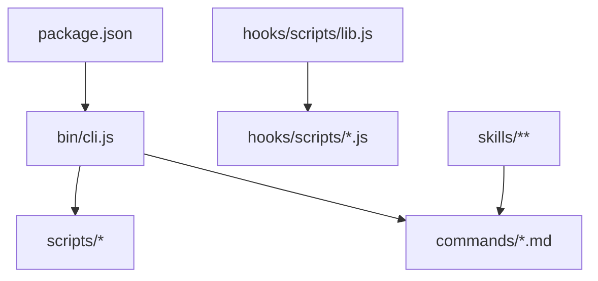
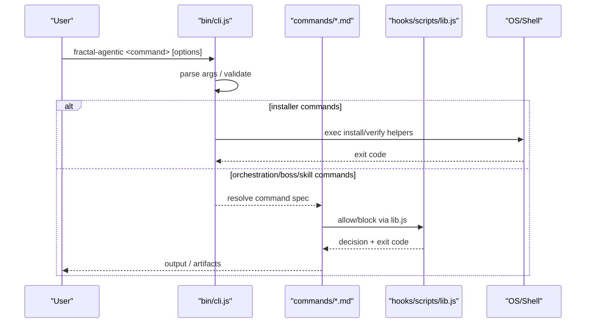
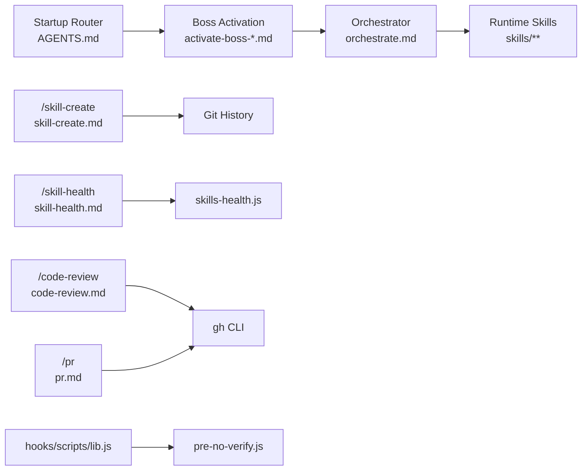

<cite>
**Referenced Files in This Document**
- `fractal-agentic/bin/cli.js`
- `fractal-agentic/package.json`
- `fractal-agentic/commands/INDEX.md`
- `fractal-agentic/AGENTS.md`
- `fractal-agentic/commands/orchestrate.md`
- `fractal-agentic/commands/activate-boss-agent.md`
- `fractal-agentic/commands/activate-boss-code.md`
- `fractal-agentic/commands/skill-create.md`
- `fractal-agentic/commands/skill-health.md`
- `fractal-agentic/commands/code-review.md`
- `fractal-agentic/commands/pr.md`
- `fractal-agentic/commands/wiki-init.md`
- `fractal-agentic/hooks/scripts/lib.js`
- `fractal-agentic/hooks/scripts/pre-no-verify.js`
</cite>

## Table of Contents
1. [Introduction](#introduction)
2. [Project Structure](#project-structure)
3. [Core Components](#core-components)
4. [Architecture Overview](#architecture-overview)
5. [Detailed Component Analysis](#detailed-component-analysis)
6. [Dependency Analysis](#dependency-analysis)
7. [Performance Considerations](#performance-considerations)
8. [Troubleshooting Guide](#troubleshooting-guide)
9. [Conclusion](#conclusion)
10. [Appendices](#appendices)

## Introduction
This document provides a comprehensive CLI API reference for the Fractal Agentic plugin and its command surface. It covers:
- The main orchestrator command (/orchestrate), including parameter validation, configuration options, and execution modes.
- Boss activation commands with domain-specific parameters and routing logic.
- Skill management commands (creation, execution, verification).
- Command chaining patterns, environment variables, exit codes, error handling strategies, logging levels, and debugging options.
- Complete parameter references with data types, defaults, and validation rules.
- Practical examples of common command sequences and automation patterns.

## Project Structure
The CLI entrypoint is a Node script that exposes installer utilities and delegates to scripts and skills. Commands are documented as Markdown files under commands/. The package metadata defines the binary name and included assets.

**Diagram sources**
- `fractal-agentic/bin/cli.js#L1-L148`
- `fractal-agentic/package.json#L1-L59`
- `fractal-agentic/hooks/scripts/lib.js#L61-L136`

**Section sources**
- `fractal-agentic/bin/cli.js#L1-L148`
- `fractal-agentic/package.json#L1-L59`

## Core Components
- Installer CLI: Provides install, verify, help, target selection, and project snippet injection.
- Command Index: Central inventory of all available commands and their triggers.
- Startup Router: Determines boss selection and runtime invocation rules.
- Hooks Library: Shared utilities for hook lifecycle, input parsing, allow/block decisions, and exit codes.

Key responsibilities:
- bin/cli.js: Argument parsing, host installation flows, and project integration.
- commands/: Authoritative command specifications used by agents and users.
- hooks/scripts/lib.js: Common behavior for pre-* hooks (allow/block/warn, exit codes).

**Section sources**
- `fractal-agentic/bin/cli.js#L27-L43`
- `fractal-agentic/commands/INDEX.md#L1-L68`
- `fractal-agentic/AGENTS.md#L1-L106`
- `fractal-agentic/hooks/scripts/lib.js#L61-L136`

## Architecture Overview
The CLI architecture separates concerns across three layers:
- Entry layer: bin/cli.js handles top-level commands and environment setup.
- Command layer: commands/*.md define user-facing workflows and arguments.
- Runtime layer: Skills and scripts implement behaviors invoked by commands.

**Diagram sources**
- `fractal-agentic/bin/cli.js#L106-L148`
- `fractal-agentic/hooks/scripts/lib.js#L86-L118`

## Detailed Component Analysis

### Main Orchestrator: /orchestrate
Purpose: Enter the executable delivery runtime for a selected boss, choose lanes, verify evidence, and obtain a final verdict (ship | fix-first | rethink).

Parameters and validation:
- No direct CLI flags; behavior driven by active boss and runtime skill.
- Validates capability_mode once per session spawn catalog.
- Enforces non-blocking policy when pins or optional tools are missing.

Execution modes:
- Selects routine, complex, and fresh-review lanes based on availability.
- Requires implementation receipts from workers and a final review with one verdict.
- On fix-first: re-implement, re-verify, and re-review.
- On rethink: return to scope/architecture before claiming completion.

Configuration and environment:
- Uses startup router and runtime skill references to determine required readings and handoffs.
- Optional health check via scripts/check-armory.sh.

Exit codes:
- Follows runtime conventions; typically 0 on success, non-zero on fatal errors.

Practical usage:
- Activate a boss first, then run /orchestrate to execute the runtime.

**Section sources**
- `fractal-agentic/commands/orchestrate.md#L1-L63`
- `fractal-agentic/AGENTS.md#L62-L82`

### Boss Activation Commands
Activation commands set the active boss and load the authoritative playbook for that domain.

Common flow:
- Read startup router.
- Load the boss’s INDEX.md in full.
- Make it the active boss and do not switch until an explicit handoff occurs.
- For non-trivial work, run /orchestrate and load the runtime skill.

Domain-specific notes:
- Agent Boss: Product agent systems, memory, eval, MCP. Handoff tools/secrets/user-data surfaces to Code.
- Code Boss: Audits, security, tests, performance, docs from code. Handoff visual craft to Design and product-agent safety to Agent before shipping.

Routing logic:
- Startup router maps task signals to bosses and enforces single-active-boss semantics.

**Section sources**
- `fractal-agentic/commands/activate-boss-agent.md#L1-L22`
- `fractal-agentic/commands/activate-boss-code.md#L1-L22`
- `fractal-agentic/AGENTS.md#L38-L53`

### Skill Management Commands

#### /skill-create
Purpose: Analyze local git history to extract coding patterns and generate SKILL.md files. Optionally produce instincts for continuous-learning-v2.

Parameters:
- --commits <number>: Number of commits to analyze (default varies by implementation).
- --output <path>: Custom output directory for generated SKILL.md files.
- --instincts: Generate instincts alongside skills.

Validation rules:
- Requires a valid git repository.
- Output path must be writable.

Workflow:
- Parse git log and file co-changes.
- Detect commit conventions, architecture, workflows, testing patterns.
- Generate SKILL.md with frontmatter and sections.
- Optionally create YAML instincts with id, trigger, confidence, domain, source.

Exit codes:
- 0 on success; non-zero on failure (e.g., invalid repo, write errors).

**Section sources**
- `fractal-agentic/commands/skill-create.md#L1-L126`

#### /skill-health
Purpose: Show skill portfolio health dashboard with analytics.

Parameters:
- --dashboard: Full dashboard view.
- --panel <name>: Restrict to a specific panel (e.g., failures).
- --json: Machine-readable JSON output.

Environment:
- ECC_ROOT can be provided or auto-resolved.

Exit codes:
- 0 on success; non-zero on failure.

**Section sources**
- `fractal-agentic/commands/skill-health.md#L1-L55`

### Code Review Command
Modes:
- Local review mode: Reviews uncommitted changes.
- PR review mode: Requires gh CLI; fetches diff, reviews, posts results.

Parameters:
- Accepts PR number, URL, or branch name; supports --pr flag.
- Supports override flags like --approve or --request-changes.

Validation:
- Detects project type and runs appropriate checks (typecheck, lint, test, build).
- Falls back gracefully if gh CLI is unavailable.

Outputs:
- Review artifact at .claude/reviews/pr-<NUMBER>-review.md.
- GitHub review posted when gh is available.

Exit codes:
- 0 on success; non-zero on failure.

**Section sources**
- `fractal-agentic/commands/code-review.md#L1-L319`

### Create Pull Request Command
Purpose: Create a GitHub PR from current branch with unpushed commits, discover templates, analyze changes, push, and verify.

Parameters:
- Base branch (default: main).
- Flags: --draft.

Phases:
- Validate preconditions (branch, clean state, commits ahead, no existing PR).
- Discover PR template and analyze commits/files.
- Push branch (rebase if needed).
- Create PR with template or default format.
- Verify PR and CI checks.

Edge cases:
- Requires gh CLI; stops with guidance if missing or unauthenticated.
- Handles divergence and large PRs.

Exit codes:
- 0 on success; non-zero on failure.

**Section sources**
- `fractal-agentic/commands/pr.md#L1-L189`

### Wiki Initialization Command
Purpose: Initialize continuous LLM wiki vault with interactive prompts and scaffold directories/config.

Parameters:
- Interactive inputs: vault name, parent directory, domain/purpose, default project slug.

Steps:
- Scaffold using skill scripts.
- Write AGENTS.md schema with description frontmatter.
- Optionally write multi-host agent configs.
- Export FRACTAL_WIKI_ROOT and config location.

Exit codes:
- 0 on success; non-zero on failure.

**Section sources**
- `fractal-agentic/commands/wiki-init.md#L1-L47`

### Installer CLI (bin/cli.js)
Capabilities:
- Commands: install, verify, help.
- Options: --target=<host>, --project.
- Hosts: antigravity, claude, codex, all.

Behavior:
- Installs plugin to host-specific directories.
- Injects AGENTS snippet into project root when requested.
- Verifies installation via scripts/verify.sh.

Exit codes:
- verify: exits 1 on failure; otherwise propagates script exit code.
- install: prints messages and continues even on partial failures.

**Section sources**
- `fractal-agentic/bin/cli.js#L27-L43`
- `fractal-agentic/bin/cli.js#L106-L148`

## Dependency Analysis
Command dependencies and relationships:
- /orchestrate depends on the active boss and runtime skill references.
- Boss activation commands depend on the startup router and boss playbooks.
- /skill-create depends on git history and optional continuous-learning-v2 outputs.
- /skill-health depends on skills-health.js and ECC_ROOT resolution.
- /code-review and /pr depend on gh CLI for PR operations.
- Hooks rely on lib.js for allow/block decisions and standardized exit codes.

**Diagram sources**
- `fractal-agentic/AGENTS.md#L1-L106`
- `fractal-agentic/commands/orchestrate.md#L1-L63`
- `fractal-agentic/commands/skill-create.md#L1-L126`
- `fractal-agentic/commands/skill-health.md#L1-L55`
- `fractal-agentic/commands/code-review.md#L1-L319`
- `fractal-agentic/commands/pr.md#L1-L189`
- `fractal-agentic/hooks/scripts/lib.js#L61-L136`
- `fractal-agentic/hooks/scripts/pre-no-verify.js#L1-L29`

**Section sources**
- `fractal-agentic/commands/INDEX.md#L1-L68`

## Performance Considerations
- Avoid unnecessary reads: Startup router instructs to read only the active boss’s playbook and runtime references when needed.
- Non-blocking policy: Continue delivery even if optional capabilities are missing; record capability_mode and pins status.
- Use targeted analysis: /skill-create limits commit windows via --commits to reduce processing time.
- Prefer local-only fallbacks: When gh CLI is unavailable, commands fall back to local operations to avoid network latency.

[No sources needed since this section provides general guidance]

## Troubleshooting Guide
Common issues and resolutions:
- Missing gh CLI: Install GitHub CLI and authenticate; commands will stop with clear instructions.
- Diverged branches: Rebase onto base branch before creating PR or reviewing.
- Large PRs: Split changes into smaller PRs; focus on source changes first.
- Hook blocks: pre-no-verify blocks git --no-verify and HUSKY=0; remove flags or get explicit approval.
- Exit codes:
  - Allow: 0 (continue).
  - Block: 2 (Claude-compatible block).
  - Verify: 1 on failure.

Logging and debugging:
- Hooks library writes warnings to stderr with [fractal-hooks] prefix.
- Installer prints installation status and errors to stdout/stderr.

**Section sources**
- `fractal-agentic/commands/code-review.md#L314-L319`
- `fractal-agentic/commands/pr.md#L182-L189`
- `fractal-agentic/hooks/scripts/pre-no-verify.js#L14-L29`
- `fractal-agentic/hooks/scripts/lib.js#L110-L118`
- `fractal-agentic/bin/cli.js#L115-L122`

## Conclusion
The Fractal Agentic CLI provides a structured, extensible command surface for orchestrating AI-assisted development workflows. Commands are well-documented, enforce non-blocking policies, and integrate with external tools like gh while providing robust fallbacks. Use the startup router and boss activations to select domains, then leverage /orchestrate for consistent delivery processes.

[No sources needed since this section summarizes without analyzing specific files]

## Appendices

### Parameter Reference Summary
- /orchestrate: No direct flags; governed by active boss and runtime skill.
- /skill-create: --commits (number), --output (string), --instincts (flag).
- /skill-health: --dashboard (flag), --panel (string), --json (flag).
- /code-review: PR number/URL/branch, --pr, --approve, --request-changes.
- /pr: base-branch (string, default main), --draft (flag).
- /wiki-init: interactive inputs (vault name, parent dir, domain, project slug).
- Installer CLI: --target (enum: antigravity|claude|codex|all), --project (flag).

### Environment Variables
- ECC_ROOT: Resolves ECC plugin root for skill-health and other scripts.
- FRACTAL_WIKI_ROOT: Absolute vault path for wiki operations.
- CLAUDE_PLUGIN_ROOT: Used by some scripts to locate plugin root.

### Exit Codes
- 0: Success or allowed by hooks.
- 1: Installer verify failure or general error.
- 2: Blocked by hooks (Claude-compatible).

### Command Chaining Patterns
- Activate boss → /orchestrate → /quality-gate → /security-scan → /santa-loop (for release-critical work).
- /skill-create → /instinct-import → /instinct-status → /evolve.
- /pr → /code-review → merge when ready.

**Section sources**
- `fractal-agentic/commands/skill-create.md#L1-L126`
- `fractal-agentic/commands/skill-health.md#L1-L55`
- `fractal-agentic/commands/code-review.md#L1-L319`
- `fractal-agentic/commands/pr.md#L1-L189`
- `fractal-agentic/commands/wiki-init.md#L1-L47`
- `fractal-agentic/bin/cli.js#L27-L43`
- `fractal-agentic/hooks/scripts/lib.js#L86-L118`