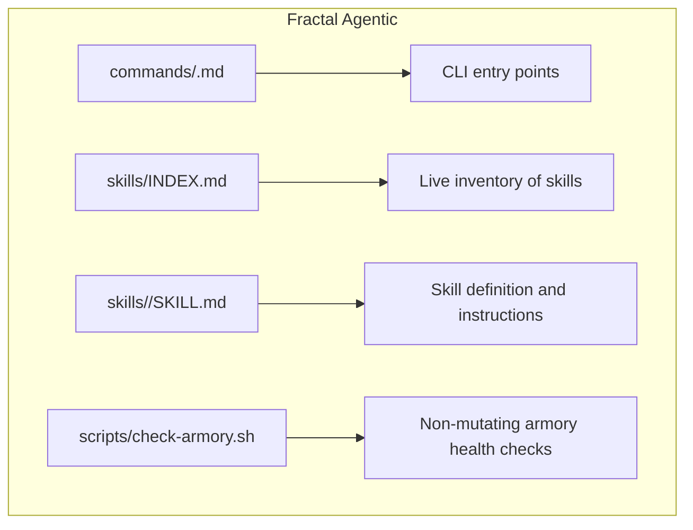
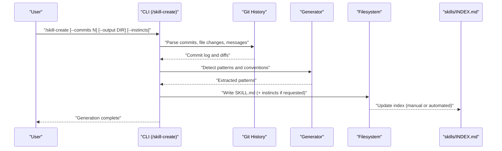
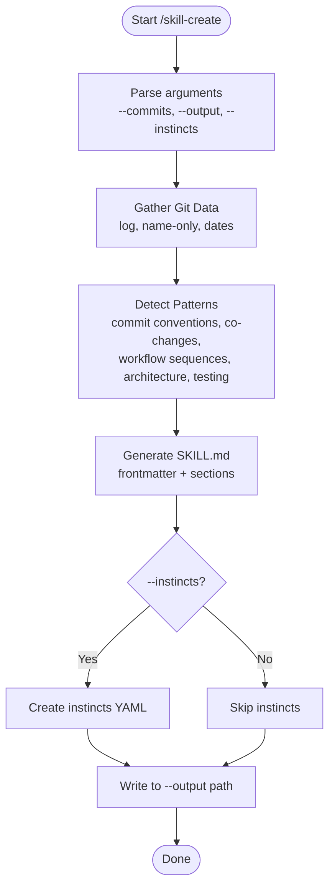
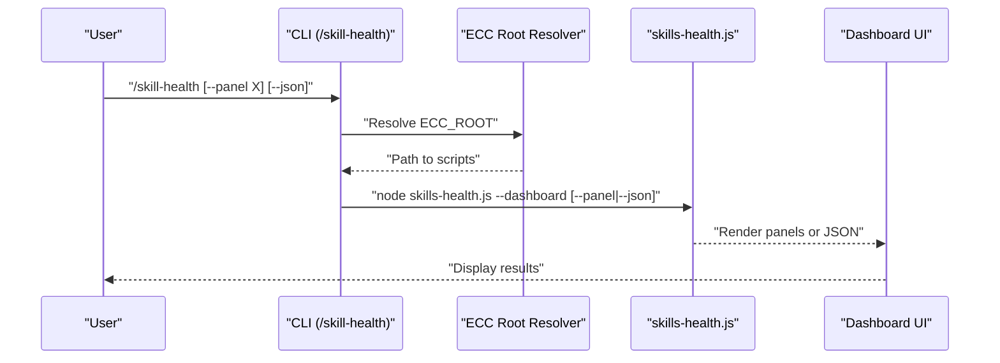
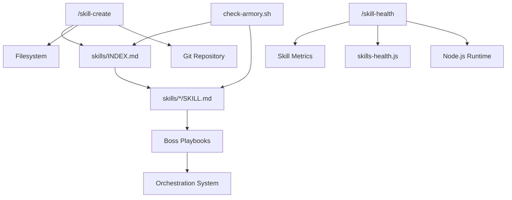

<cite>
**Referenced Files in This Document**
- `fractal-agentic/commands/skill-create.md`
- `fractal-agentic/commands/skill-health.md`
- `fractal-agentic/skills/INDEX.md`
- `fractal-agentic/skills/skill-creator/SKILL.md`
- `fractal-agentic/skills/skill-comply/SKILL.md`
- `fractal-agentic/scripts/check-armory.sh`
- `fractal-agentic/docs/armory/skills.md`
</cite>

## Table of Contents
1. [Introduction](#introduction)
2. [Project Structure](#project-structure)
3. [Core Components](#core-components)
4. [Architecture Overview](#architecture-overview)
5. [Detailed Component Analysis](#detailed-component-analysis)
6. [Dependency Analysis](#dependency-analysis)
7. [Performance Considerations](#performance-considerations)
8. [Troubleshooting Guide](#troubleshooting-guide)
9. [Conclusion](#conclusion)

## Introduction
This document provides comprehensive guidance for skill management CLI commands focused on creation, health checking, and lifecycle management within the Fractal Agentic ecosystem. It covers:
- The /skill-create command for generating SKILL.md files from repository patterns and git history
- The /skill-health command for portfolio-wide health dashboards, failure clustering, and version tracking
- Skill registration and discovery via the skills index
- Execution workflows and integration with orchestration
- Versioning, compatibility checks, and troubleshooting common issues

## Project Structure
Skills are vendored locally under a dedicated directory and cataloged by an index file. Each skill is a folder containing a SKILL.md (required) and optional resources such as scripts, references, and assets.

**Diagram sources**
- `fractal-agentic/commands/skill-create.md#L1-L126`
- `fractal-agentic/commands/skill-health.md#L1-L55`
- `fractal-agentic/skills/INDEX.md#L1-L177`
- `fractal-agentic/scripts/check-armory.sh#L1-L119`

**Section sources**
- `fractal-agentic/skills/INDEX.md#L1-L177`
- `fractal-agentic/docs/armory/skills.md#L1-L35`

## Core Components
- /skill-create: Analyzes local git history to extract coding patterns and generate SKILL.md files. Supports commit limits, custom output directories, and optional instincts generation for continuous-learning-v2.
- /skill-health: Runs a dashboard that shows success rates, failure pattern clustering, pending amendments, and version history across all skills. Supports panel filtering and JSON output.
- Skills Index: Central registry enumerating all vendored skills with descriptions and source attribution.
- Skill Creator: Reference implementation and workflow for creating, evaluating, and improving skills, including test harnesses and description optimization.
- Compliance Measurement: Automated compliance measurement tool to verify whether agents follow skills, rules, or agent definitions.

**Section sources**
- `fractal-agentic/commands/skill-create.md#L1-L126`
- `fractal-agentic/commands/skill-health.md#L1-L55`
- `fractal-agentic/skills/INDEX.md#L1-L177`
- `fractal-agentic/skills/skill-creator/SKILL.md#L1-L511`
- `fractal-agentic/skills/skill-comply/SKILL.md#L1-L62`

## Architecture Overview
The skill system integrates CLI commands, local skill packages, and orchestration. Creation flows analyze repository artifacts to produce standardized SKILL.md files. Health flows aggregate metrics and present actionable insights. Discovery uses the skills index to enumerate available capabilities. Orchestration maps bosses to skills and loads them contextually during execution.

**Diagram sources**
- `fractal-agentic/commands/skill-create.md#L1-L126`
- `fractal-agentic/skills/INDEX.md#L1-L177`

## Detailed Component Analysis

### /skill-create Command
Purpose: Generate SKILL.md files by analyzing local git history and repository patterns.

Key behaviors:
- Parses recent commits and file changes to detect conventions and workflows
- Generates valid SKILL.md frontmatter and body based on detected patterns
- Optionally generates instincts for continuous-learning-v2 integration
- Supports parameters:
  - --commits: number of commits to analyze
  - --output: custom output directory
  - --instincts: include instinct YAML files

Processing steps:
1. Gather Git data (commit logs, co-changes, message patterns)
2. Detect patterns (commit conventions, file co-changes, architecture, testing)
3. Generate SKILL.md with structured sections
4. Optionally create instincts for learning systems

**Diagram sources**
- `fractal-agentic/commands/skill-create.md#L1-L126`

**Section sources**
- `fractal-agentic/commands/skill-create.md#L1-L126`

### /skill-health Command
Purpose: Provide a comprehensive health dashboard for the entire skill portfolio.

Key features:
- Success rate sparklines over 30 days per skill
- Failure pattern clustering with horizontal bar charts
- Pending amendments tracking
- Version history timeline per skill
- Panel-specific views (--panel failures)
- Machine-readable JSON output (--json)

Execution flow:
1. Resolve ECC root environment
2. Run skills-health.js with appropriate flags
3. Display dashboard or return JSON

**Diagram sources**
- `fractal-agentic/commands/skill-health.md#L1-L55`

**Section sources**
- `fractal-agentic/commands/skill-health.md#L1-L55`

### Skill Structure Requirements
A skill consists of a SKILL.md file with required frontmatter fields and optional bundled resources.

Required structure:
- SKILL.md with YAML frontmatter (name, description required)
- Optional directories:
  - scripts/ for executable code
  - references/ for documentation loaded into context
  - assets/ for output templates and resources

Progressive disclosure model:
1. Metadata (name + description) always in context
2. SKILL.md body when skill triggers (<500 lines ideal)
3. Bundled resources as needed (unlimited, scripts execute without loading)

Best practices:
- Keep SKILL.md concise and well-structured
- Use imperative form in instructions
- Include examples and clear output formats
- Organize domain variants with reference files
- Follow principle of lack of surprise (no malicious content)

**Section sources**
- `fractal-agentic/skills/skill-creator/SKILL.md#L62-L114`

### Skill Registration and Discovery
Skills are registered through the central index file which maintains a live inventory of all vendored skills.

Registration process:
1. Add skill directory with SKILL.md to skills/
2. Update skills/INDEX.md with skill metadata
3. Ensure proper categorization under relevant boss playbooks
4. Validate with check-armory.sh script

Discovery mechanisms:
- Live skills index provides complete inventory
- Boss nested playbooks map preferred skills
- Skills explorer for browser-based filtering
- Frontmatter fields (name, description) aid host discovery

**Section sources**
- `fractal-agentic/skills/INDEX.md#L1-L177`
- `fractal-agentic/docs/armory/skills.md#L1-L35`

### Execution Workflows and Integration
Skills integrate with the orchestration system through boss mappings and contextual loading.

Orchestration integration:
- Boss selects appropriate skills based on task type
- Skills load progressively based on need
- Scripts execute deterministically without loading full context
- References provide additional context when required

Lifecycle management:
- Skill creator provides evaluation framework
- Compliance measurement ensures adherence to definitions
- Health monitoring tracks performance trends
- Version history enables rollback and comparison

**Section sources**
- `fractal-agentic/skills/skill-creator/SKILL.md#L175-L266`
- `fractal-agentic/skills/skill-comply/SKILL.md#L1-L62`

## Dependency Analysis
The skill system has clear dependencies between components:

**Diagram sources**
- `fractal-agentic/commands/skill-create.md#L1-L126`
- `fractal-agentic/commands/skill-health.md#L1-L55`
- `fractal-agentic/skills/INDEX.md#L1-L177`
- `fractal-agentic/scripts/check-armory.sh#L1-L119`

**Section sources**
- `fractal-agentic/scripts/check-armory.sh#L84-L119`

## Performance Considerations
- Git analysis should limit commit ranges to avoid excessive processing time
- SKILL.md files should stay under 500 lines for optimal context loading
- Scripts execute without loading full skill context for better performance
- Parallel execution of test cases improves evaluation throughput
- Incremental updates to skills/INDEX.md reduce indexing overhead

## Troubleshooting Guide
Common issues and solutions:

Skill creation problems:
- Insufficient git history: Increase --commits parameter
- Permission errors: Verify write access to output directory
- Invalid SKILL.md format: Validate frontmatter structure

Health dashboard issues:
- ECC root resolution fails: Verify CLAUDE_PLUGIN_ROOT environment variable
- Missing metrics: Ensure skills have been executed recently
- Panel display errors: Check specific panel flags

Validation and compliance:
- Broken symlinks: Fix skill directory links
- Missing critical skills: Install required skills for your domain
- Compliance failures: Review skill definitions and agent behavior

**Section sources**
- `fractal-agentic/scripts/check-armory.sh#L108-L119`

## Conclusion
The Fractal Agentic skill management system provides robust tools for creating, validating, and maintaining skills throughout their lifecycle. The /skill-create command enables pattern-based skill generation from repository history, while /skill-health offers comprehensive portfolio monitoring. Combined with the centralized skills index and orchestration integration, these commands form a complete solution for skill development and management in multi-agent environments.