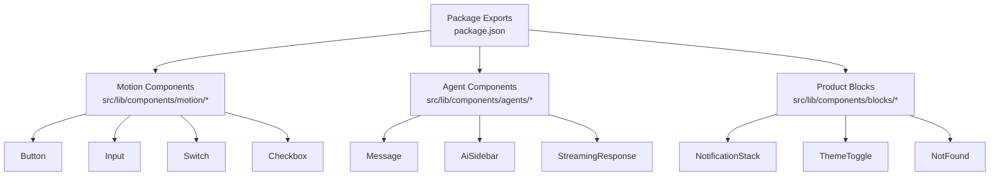
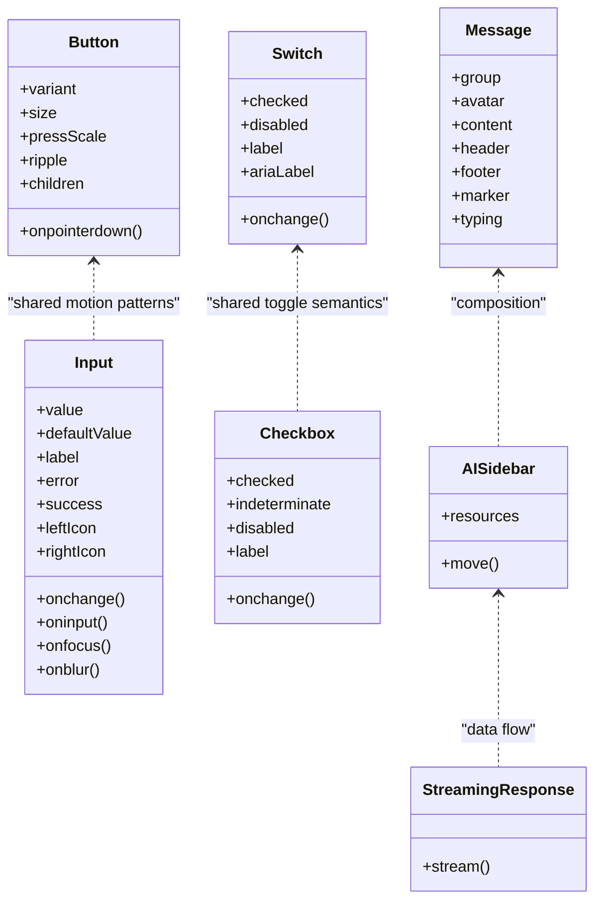
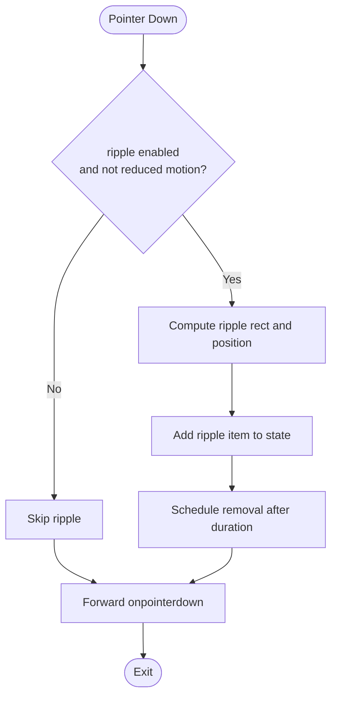
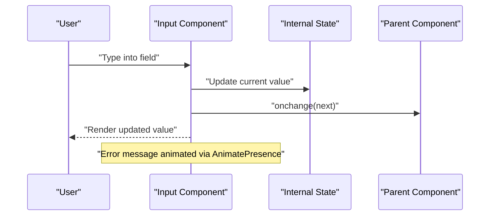
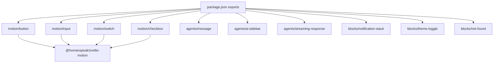

<cite>
**Referenced Files in This Document**
- `packages/fractal-svelte/package.json`
- `packages/fractal-svelte/src/lib/components/motion/button/button.svelte`
- `packages/fractal-svelte/src/lib/components/motion/button/index.ts`
- `packages/fractal-svelte/src/lib/components/motion/input/input.svelte`
- `packages/fractal-svelte/src/lib/components/motion/switch/switch.svelte`
- `packages/fractal-svelte/src/lib/components/motion/checkbox/checkbox.svelte`
- `packages/fractal-svelte/src/lib/components/agents/message/index.ts`
- `packages/fractal-svelte/src/lib/components/agents/ai-sidebar/index.ts`
</cite>

## Table of Contents
1. [Introduction](#introduction)
2. [Project Structure](#project-structure)
3. [Core Components](#core-components)
4. [Architecture Overview](#architecture-overview)
5. [Detailed Component Analysis](#detailed-component-analysis)
6. [Dependency Analysis](#dependency-analysis)
7. [Performance Considerations](#performance-considerations)
8. [Troubleshooting Guide](#troubleshooting-guide)
9. [Conclusion](#conclusion)
10. [Appendices](#appendices)

## Introduction
This document provides comprehensive API documentation for the Svelte component library, focusing on:
- Motion components: Button, Input, Switch, Checkbox
- Agent components: Message, AiSidebar, StreamingResponse
- Product blocks: NotificationStack, ThemeToggle, NotFound

It covers prop interfaces, events, TypeScript types, animation properties, accessibility attributes, responsive behavior, composition patterns, slot usage, theme customization, error handling, and performance considerations.

## Project Structure
The library is organized by feature areas under src/lib/components:
- motion: UI primitives with spring animations
- agents: AI interaction components
- blocks: Product-level layout and utility components

Exports are declared in package.json to enable clean imports per component.

**Diagram sources**
- `packages/fractal-svelte/package.json`

**Section sources**
- `packages/fractal-svelte/package.json`

## Core Components
This section summarizes the core motion and agent components with their APIs, props, events, and accessibility notes.

- Button
  - Props: variant, size, pressScale, ripple, children (snippet), plus standard HTML button attributes
  - Events: onpointerdown forwarded; internal pointer interactions for ripple and hover
  - Animation: spring-based whileHover and whileTap; optional ripple effect; respects reduced motion
  - Accessibility: aria-hidden on decorative ripples; data-* attributes for styling hooks
  - Slots: default slot via children snippet

- Input
  - Props: value/defaultValue, label, error/success states, leftIcon/rightIcon snippets, onchange, plus standard input attributes
  - Events: oninput, onfocus, onblur forwarded; custom onchange(value)
  - Animation: AnimatePresence for error message transitions; reduced motion support
  - Accessibility: aria-invalid when error; aria-describedby linked to error message; unique id generation
  - Slots: leftIcon/rightIcon as snippets

- Switch
  - Props: checked (bindable), disabled, label, ariaLabel, onchange
  - Events: onchange(checked)
  - Animation: thumb position and scale with spring; reduced motion respected
  - Accessibility: role="switch", aria-checked, label association

- Checkbox
  - Props: checked (bindable), indeterminate, disabled, label, onchange
  - Events: onchange(checked)
  - Accessibility: role="checkbox", aria-checked supports mixed state; label association

- Message (Agent)
  - Exports: Message, MessageGroup, MessageAvatar, MessageContent, MessageHeader, MessageFooter, MessageMarker, MessageTyping, MessageBubble variants, MessageScroller
  - Types: MessageFrom exported for typing messages from different sources

- AiSidebar (Agent)
  - Exports: AISidebar/AiSidebar with typed resources and move operations

- StreamingResponse (Agent)
  - Exported via package.json; intended for streaming AI responses

- NotificationStack, ThemeToggle, NotFound (Blocks)
  - Exported via package.json; layout and customization options available through slots and props

**Section sources**
- `packages/fractal-svelte/src/lib/components/motion/button/button.svelte`
- `packages/fractal-svelte/src/lib/components/motion/button/index.ts`
- `packages/fractal-svelte/src/lib/components/motion/input/input.svelte`
- `packages/fractal-svelte/src/lib/components/motion/switch/switch.svelte`
- `packages/fractal-svelte/src/lib/components/motion/checkbox/checkbox.svelte`
- `packages/fractal-svelte/src/lib/components/agents/message/index.ts`
- `packages/fractal-svelte/src/lib/components/agents/ai-sidebar/index.ts`
- `packages/fractal-svelte/package.json`

## Architecture Overview
The library uses Svelte 5 runes ($props, $state, $derived, $effect) and @humanspeak/svelte-motion for animations. Components expose typed props and forward native events where appropriate. Slots are implemented using Snippet types for flexible content injection.

**Diagram sources**
- `packages/fractal-svelte/src/lib/components/motion/button/button.svelte`
- `packages/fractal-svelte/src/lib/components/motion/input/input.svelte`
- `packages/fractal-svelte/src/lib/components/motion/switch/switch.svelte`
- `packages/fractal-svelte/src/lib/components/motion/checkbox/checkbox.svelte`
- `packages/fractal-svelte/src/lib/components/agents/message/index.ts`
- `packages/fractal-svelte/src/lib/components/agents/ai-sidebar/index.ts`

## Detailed Component Analysis

### Button
- Props
  - variant: 'primary' | 'secondary' | 'ghost' | 'outline'
  - size: 'sm' | 'md' | 'lg' | 'icon'
  - pressScale: number
  - ripple: boolean
  - children: Snippet
  - Standard HTML button attributes forwarded
- Events
  - onpointerdown(event): forwarded after internal ripple logic
- Animation
  - whileHover and whileTap use spring transitions; disabled or reduced motion disables animations
  - Ripple effect computed from pointer coordinates and element bounds
- Accessibility
  - Decorative ripples marked aria-hidden
  - Data attributes for styling hooks (data-variant, data-size, data-ripple)
- Composition
  - Default slot via children snippet
- Usage example references
  - See `packages/fractal-svelte/src/examples/ButtonExample.svelte`

**Diagram sources**
- `packages/fractal-svelte/src/lib/components/motion/button/button.svelte`

**Section sources**
- `packages/fractal-svelte/src/lib/components/motion/button/button.svelte`
- `packages/fractal-svelte/src/lib/components/motion/button/index.ts`

### Input
- Props
  - value: string (bindable)
  - defaultValue: string
  - label: string
  - error: string | boolean
  - success: boolean
  - leftIcon: Snippet
  - rightIcon: Snippet
  - onchange(value: string)
  - Standard input attributes forwarded
- Events
  - oninput(event), onfocus(event), onblur(event) forwarded
- Animation
  - Error message animated with AnimatePresence; reduced motion simplifies transitions
- Accessibility
  - aria-invalid set when error present
  - aria-describedby links to error message id
  - Unique id generated for label-input association
- Composition
  - leftIcon/rightIcon slots via snippets
- Usage example references
  - See `packages/fractal-svelte/src/examples/InputExample.svelte`

**Diagram sources**
- `packages/fractal-svelte/src/lib/components/motion/input/input.svelte`

**Section sources**
- `packages/fractal-svelte/src/lib/components/motion/input/input.svelte`

### Switch
- Props
  - checked: boolean (bindable)
  - disabled: boolean
  - label: string
  - ariaLabel: string
  - onchange(checked: boolean)
- Events
  - onchange(checked)
- Animation
  - Thumb x-position and scale animate with spring; reduced motion disables animation
- Accessibility
  - role="switch", aria-checked reflects state
  - Label association via for/id
- Usage example references
  - See `packages/fractal-svelte/src/examples/SwitchExample.svelte`

**Section sources**
- `packages/fractal-svelte/src/lib/components/motion/switch/switch.svelte`

### Checkbox
- Props
  - checked: boolean (bindable)
  - indeterminate: boolean
  - disabled: boolean
  - label: string
  - onchange(checked: boolean)
- Events
  - onchange(checked)
- Accessibility
  - role="checkbox", aria-checked supports mixed state
  - Label association via for/id
- Usage example references
  - See `packages/fractal-svelte/src/examples/CheckboxExample.svelte`

**Section sources**
- `packages/fractal-svelte/src/lib/components/motion/checkbox/checkbox.svelte`

### Message (Agent)
- Exports
  - Message, MessageGroup, MessageAvatar, MessageContent, MessageHeader, MessageFooter, MessageMarker, MessageTyping
  - MessageBubble variants and MessageScroller
- Types
  - MessageFrom type exported for source typing
- Composition
  - Grouped messages with avatar, header, content, footer, marker, typing indicators
- Usage example references
  - See `packages/fractal-svelte/tests/message-components.test.ts`

**Section sources**
- `packages/fractal-svelte/src/lib/components/agents/message/index.ts`

### AiSidebar (Agent)
- Exports
  - AISidebar/AiSidebar with typed resource kinds and move operations
- Props
  - Resources array with kind, metadata, and move handlers
- Composition
  - Sidebar layout with resource list and actions
- Usage example references
  - See `packages/fractal-svelte/src/examples/AISidebarExample.svelte`

**Section sources**
- `packages/fractal-svelte/src/lib/components/agents/ai-sidebar/index.ts`

### StreamingResponse (Agent)
- Export
  - Available via package.json export path
- Purpose
  - Renders streaming AI responses with incremental updates
- Integration
  - Typically used within Message or AiSidebar contexts

**Section sources**
- `packages/fractal-svelte/package.json`

### NotificationStack (Block)
- Export
  - Available via package.json export path
- Purpose
  - Stacks notifications with animations and dismiss actions
- Customization
  - Props and slots for content and actions

**Section sources**
- `packages/fractal-svelte/package.json`

### ThemeToggle (Block)
- Export
  - Available via package.json export path
- Purpose
  - Toggles application theme with accessible controls
- Customization
  - Props and slots for icons and labels

**Section sources**
- `packages/fractal-svelte/package.json`

### NotFound (Block)
- Export
  - Available via package.json export path
- Variants
  - Multiple visual styles (glitch, magnetic, spotlight, stacked, terminal)
- Customization
  - Props and slots for text and actions

**Section sources**
- `packages/fractal-svelte/package.json`

## Dependency Analysis
- External dependencies
  - svelte: ^5.0.0 (peer dependency)
  - @humanspeak/svelte-motion: ^0.8.0 (peer dependency)
- Internal structure
  - Components import motion utilities and ease functions
  - Tests validate component behavior across scenarios

**Diagram sources**
- `packages/fractal-svelte/package.json`

**Section sources**
- `packages/fractal-svelte/package.json`

## Performance Considerations
- Reduced motion
  - All motion components respect user preferences via useReducedMotion; animations are disabled when reduced motion is preferred
- Spring animations
  - Use lightweight spring configurations; avoid excessive mass/stiffness that may cause jank
- Event forwarding
  - Forward only necessary events to minimize overhead
- State management
  - Prefer local $state for transient UI state; bind external state via $bindable props
- Rendering
  - Use snippets for slots to defer rendering until needed
- Memory
  - Clean up temporary state (e.g., ripple items) promptly to prevent leaks

[No sources needed since this section provides general guidance]

## Troubleshooting Guide
- Input validation
  - Ensure error is a string or boolean; when true, no message is shown unless provided
  - Verify aria-describedby matches error message id
- Switch/Checkbox state
  - Confirm bindable checked prop is updated; onchange should reflect new state
- Button ripple
  - Ripple requires pointer events; ensure container is interactive and not disabled
- Message composition
  - Use MessageGroup for consistent spacing and alignment
- AiSidebar resources
  - Validate resource kinds and move handlers to prevent runtime errors

**Section sources**
- `packages/fractal-svelte/src/lib/components/motion/input/input.svelte`
- `packages/fractal-svelte/src/lib/components/motion/switch/switch.svelte`
- `packages/fractal-svelte/src/lib/components/motion/checkbox/checkbox.svelte`
- `packages/fractal-svelte/src/lib/components/motion/button/button.svelte`
- `packages/fractal-svelte/src/lib/components/agents/message/index.ts`
- `packages/fractal-svelte/src/lib/components/agents/ai-sidebar/index.ts`

## Conclusion
The Svelte component library offers a cohesive set of motion primitives, agent-focused components, and product blocks with strong TypeScript support, accessibility, and animation capabilities. By following the documented APIs and patterns, developers can build accessible, performant, and visually consistent interfaces.

[No sources needed since this section summarizes without analyzing specific files]

## Appendices

### Accessibility Attributes Summary
- Button: aria-hidden on decorative elements; data attributes for styling
- Input: aria-invalid, aria-describedby, unique ids
- Switch: role="switch", aria-checked
- Checkbox: role="checkbox", aria-checked (supports mixed)

**Section sources**
- `packages/fractal-svelte/src/lib/components/motion/button/button.svelte`
- `packages/fractal-svelte/src/lib/components/motion/input/input.svelte`
- `packages/fractal-svelte/src/lib/components/motion/switch/switch.svelte`
- `packages/fractal-svelte/src/lib/components/motion/checkbox/checkbox.svelte`

### Responsive Behavior Notes
- Components adapt to screen sizes via CSS classes and data attributes
- Use media queries in custom styles to override defaults
- Avoid fixed widths; prefer fluid layouts and relative units

[No sources needed since this section provides general guidance]

### Composition Patterns
- Use snippets for flexible content injection (e.g., icons, children)
- Compose complex UIs by nesting Message parts or combining blocks
- Leverage data attributes for targeted styling

**Section sources**
- `packages/fractal-svelte/src/lib/components/motion/button/button.svelte`
- `packages/fractal-svelte/src/lib/components/motion/input/input.svelte`
- `packages/fractal-svelte/src/lib/components/agents/message/index.ts`

### Theme Customization Options
- Override CSS variables or classes via data attributes
- Use consistent naming conventions for variants and sizes
- Integrate with global theme providers for dynamic switching

**Section sources**
- `packages/fractal-svelte/package.json`