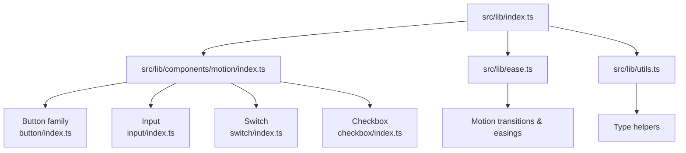
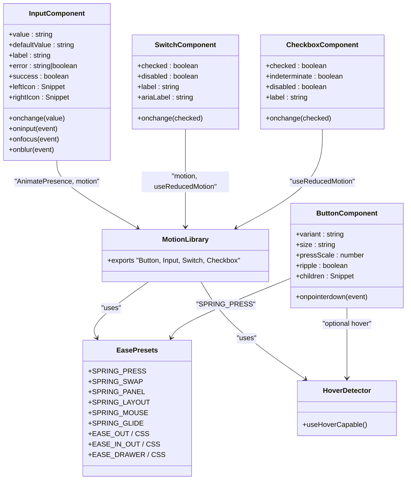
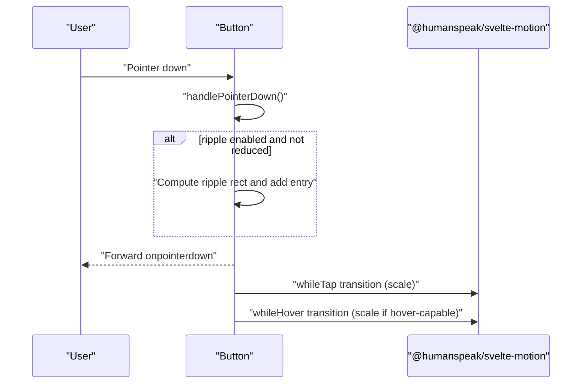
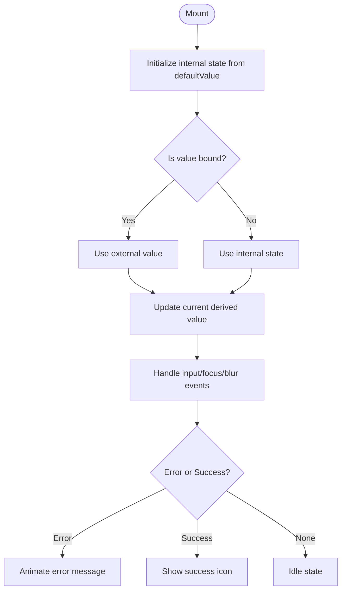
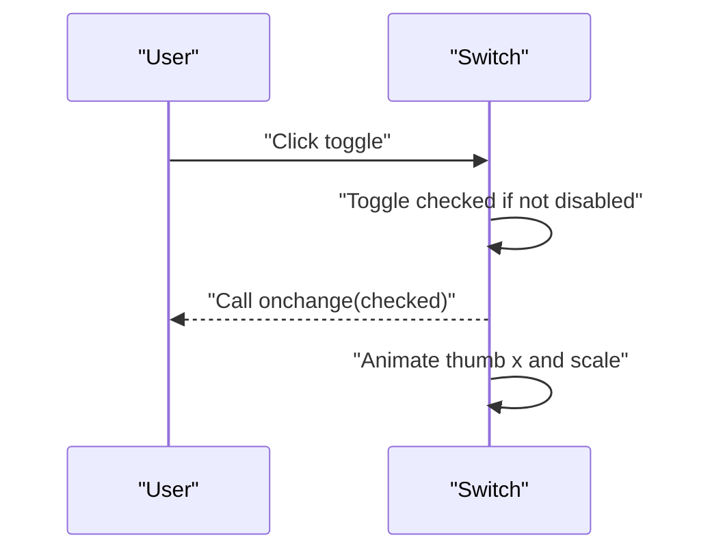
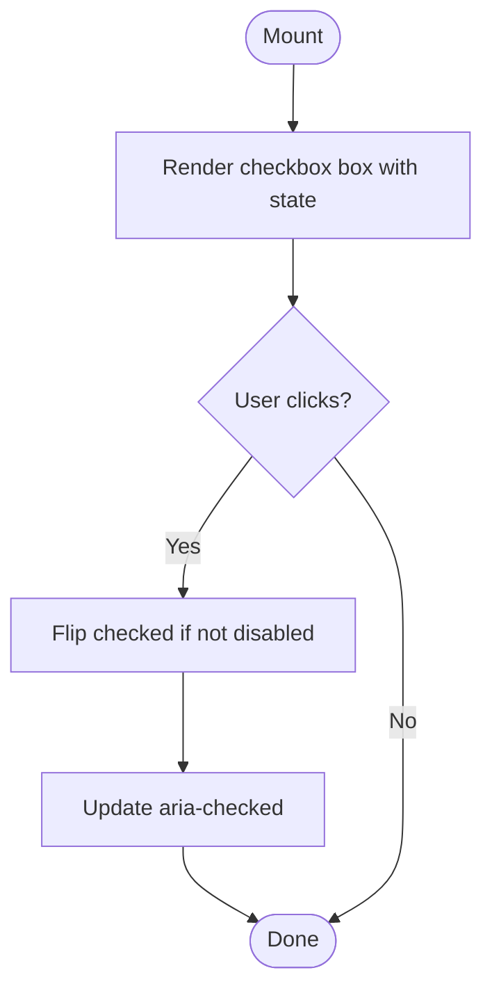
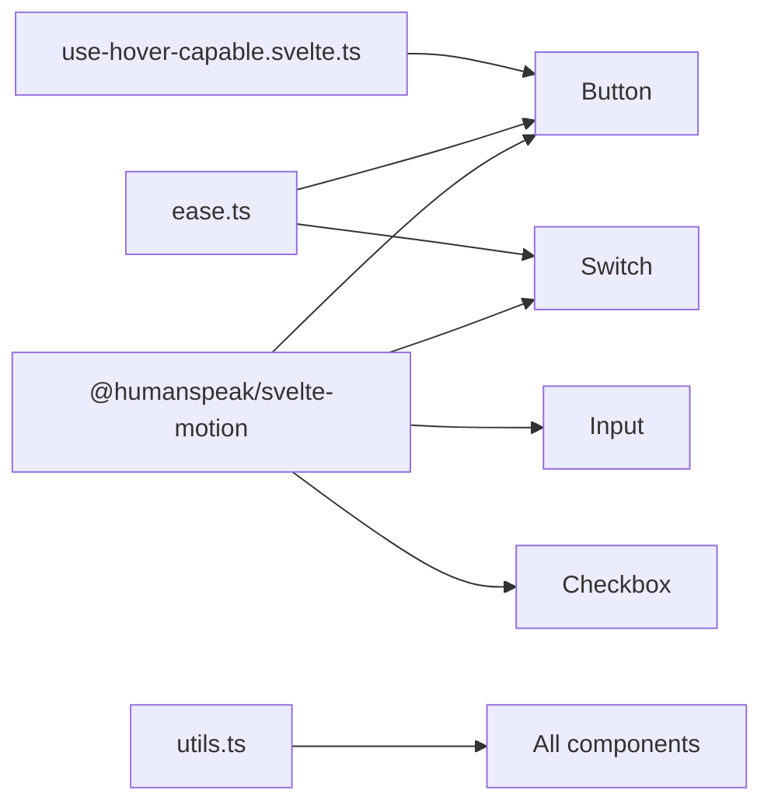

<cite>
**Referenced Files in This Document**
- `src/lib/index.ts`
- `src/lib/components/motion/index.ts`
- `src/lib/ease.ts`
- `src/lib/utils.ts`
- `src/lib/motion/use-hover-capable.svelte.ts`
- `src/lib/components/motion/button/index.ts`
- `src/lib/components/motion/button/button.svelte`
- `src/lib/components/motion/input/index.ts`
- `src/lib/components/motion/input/input.svelte`
- `src/lib/components/motion/switch/index.ts`
- `src/lib/components/motion/switch/switch.svelte`
- `src/lib/components/motion/checkbox/index.ts`
- `src/lib/components/motion/checkbox/checkbox.svelte`
</cite>

## Table of Contents
1. [Introduction](#introduction)
2. [Project Structure](#project-structure)
3. [Core Components](#core-components)
4. [Architecture Overview](#architecture-overview)
5. [Detailed Component Analysis](#detailed-component-analysis)
6. [Dependency Analysis](#dependency-analysis)
7. [Performance Considerations](#performance-considerations)
8. [Troubleshooting Guide](#troubleshooting-guide)
9. [Conclusion](#conclusion)
10. [Appendices](#appendices)

## Introduction
This document provides comprehensive API documentation for motion-based UI components in the Svelte component library. It covers Button, Input, Switch, Checkbox, and related interactive elements that integrate spring animations, easing functions, and accessibility attributes. You will find TypeScript type definitions, event handlers, customization options, state management patterns (hover, focus, active), composition with slots, and theme integration guidance. Usage examples demonstrate animation configurations, responsive behavior, and performance optimization techniques.

## Project Structure
The motion components are organized under a dedicated module and exported through a central index. The library also exposes shared motion utilities such as easing presets and helpers.

**Diagram sources**
- `src/lib/index.ts#L1-L6`
- `src/lib/components/motion/index.ts#L1-L13`
- `src/lib/ease.ts#L1-L23`
- `src/lib/utils.ts#L1-L4`

**Section sources**
- `src/lib/index.ts#L1-L6`
- `src/lib/components/motion/index.ts#L1-L13`

## Core Components
The motion package exports a set of interactive primitives with built-in motion behaviors:

- Button family: Button, StatefulButton, MagneticButton
- Input: Input
- Switch: Switch
- Checkbox: Checkbox
- Additional motion components: Loader, Marquee, Number, RadioGroup, Tabs, TextAnimation, Tooltip, AnimatedBadge

These components leverage @humanspeak/svelte-motion for declarative animations and respect user preferences via useReducedMotion.

**Section sources**
- `src/lib/components/motion/index.ts#L1-L13`

## Architecture Overview
At runtime, each motion component composes:
- Svelte runes for reactive state ($state, $derived, $effect, $bindable)
- Motion primitives from @humanspeak/svelte-motion (motion, AnimatePresence, useReducedMotion)
- Shared easing and spring presets from ease.ts
- Optional hover capability detection via useHoverCapable

**Diagram sources**
- `src/lib/ease.ts#L1-L23`
- `src/lib/motion/use-hover-capable.svelte.ts#L1-L15`
- `src/lib/components/motion/button/button.svelte#L1-L45`
- `src/lib/components/motion/input/input.svelte#L1-L27`
- `src/lib/components/motion/switch/switch.svelte#L1-L19`
- `src/lib/components/motion/checkbox/checkbox.svelte#L1-L20`

## Detailed Component Analysis

### Button (and variants)
- Props
  - variant: 'primary' | 'secondary' | 'ghost' | 'outline'
  - size: 'sm' | 'md' | 'lg' | 'icon'
  - pressScale: number (default 0.93)
  - ripple: boolean (default false)
  - children: Snippet
  - onpointerdown(event): forwarded to underlying button
  - All HTMLButtonAttributes are supported via rest spread
- Behavior
  - whileTap scales to pressScale when not reduced motion and not disabled
  - whileHover scales slightly upward on hover-capable devices when not reduced motion and not disabled
  - Ripple effect is computed from pointer position and cleaned up after animation
  - Respects prefers-reduced-motion by disabling animations and using duration 0
- Accessibility
  - data-slot and data-* attributes for styling hooks
  - aria-hidden on decorative ripples
- Composition
  - Use children slot to render content inside the button
- Events
  - onpointerdown is forwarded; you can attach custom logic

**Diagram sources**
- `src/lib/components/motion/button/button.svelte#L1-L45`
- `src/lib/ease.ts#L11-L12`

**Section sources**
- `src/lib/components/motion/button/index.ts#L1-L4`
- `src/lib/components/motion/button/button.svelte#L1-L45`
- `src/lib/ease.ts#L11-L12`
- `src/lib/motion/use-hover-capable.svelte.ts#L1-L15`

### Input
- Props
  - value: string (bindable)
  - defaultValue: string
  - label: string
  - error: string | boolean
  - success: boolean
  - leftIcon: Snippet
  - rightIcon: Snippet
  - onchange(value: string)
  - oninput(event), onfocus(event), onblur(event)
  - id: string (auto-generated default)
  - disabled: boolean
  - All HTMLInputAttributes except value/onchange are supported via rest spread
- Behavior
  - Maintains internal state when uncontrolled (defaultValue), controlled when value provided
  - Focus state toggles wrapper data-state
  - Error messages are animated with AnimatePresence and motion
  - Respects reduced motion by simplifying initial/animate/exit transitions
- Accessibility
  - aria-invalid set when error is truthy
  - aria-describedby links to error message element
  - role="alert" on error text
- Composition
  - Slots for leftIcon and rightIcon via Snippet rendering

**Diagram sources**
- `src/lib/components/motion/input/input.svelte#L1-L27`

**Section sources**
- `src/lib/components/motion/input/index.ts#L1-L2`
- `src/lib/components/motion/input/input.svelte#L1-L27`

### Switch
- Props
  - checked: boolean (bindable)
  - disabled: boolean
  - label: string
  - ariaLabel: string
  - onchange(checked: boolean)
  - id: string (auto-generated default)
  - All HTMLButtonAttributes except onchange are supported via rest spread
- Behavior
  - Toggles checked state and calls onchange when not disabled
  - Thumb animates x and scale with spring physics; pressed state triggers subtle scale
  - Respects reduced motion by disabling animation duration
- Accessibility
  - role="switch", aria-checked reflects state
  - aria-label supports custom label when needed
  - Label associates via for/id when provided

**Diagram sources**
- `src/lib/components/motion/switch/switch.svelte#L1-L19`

**Section sources**
- `src/lib/components/motion/switch/index.ts#L1-L2`
- `src/lib/components/motion/switch/switch.svelte#L1-L19`

### Checkbox
- Props
  - checked: boolean (bindable)
  - indeterminate: boolean
  - disabled: boolean
  - label: string
  - onchange(checked: boolean)
  - id: string (auto-generated default)
  - All HTMLButtonAttributes except onchange are supported via rest spread
- Behavior
  - Toggles checked state and calls onchange when not disabled
  - Renders check or dash icon based on checked/indeterminate
  - Respects reduced motion for SVG path animations
- Accessibility
  - role="checkbox", aria-checked reflects mixed/true/false
  - Label associates via for/id when provided

**Diagram sources**
- `src/lib/components/motion/checkbox/checkbox.svelte#L1-L20`

**Section sources**
- `src/lib/components/motion/checkbox/index.ts#L1-L2`
- `src/lib/components/motion/checkbox/checkbox.svelte#L1-L20`

## Dependency Analysis
The motion components depend on:
- @humanspeak/svelte-motion for motion primitives and reduced motion detection
- ease.ts for shared spring and easing presets
- useHoverCapable for detecting hover-capable pointers
- Svelte runes for reactivity and binding

**Diagram sources**
- `src/lib/ease.ts#L1-L23`
- `src/lib/motion/use-hover-capable.svelte.ts#L1-L15`
- `src/lib/utils.ts#L1-L4`
- `src/lib/components/motion/button/button.svelte#L1-L45`
- `src/lib/components/motion/input/input.svelte#L1-L27`
- `src/lib/components/motion/switch/switch.svelte#L1-L19`
- `src/lib/components/motion/checkbox/checkbox.svelte#L1-L20`

**Section sources**
- `src/lib/ease.ts#L1-L23`
- `src/lib/motion/use-hover-capable.svelte.ts#L1-L15`
- `src/lib/utils.ts#L1-L4`

## Performance Considerations
- Respect reduced motion: All components disable animations when useReducedMotion detects user preference, ensuring better performance and accessibility.
- Prefer springs over durations: Springs provide natural motion with minimal configuration and adapt well to device capabilities.
- Avoid heavy computations in event handlers: For example, ripple calculations should be kept lightweight and short-lived.
- Minimize re-renders: Use $derived for computed values and avoid unnecessary state updates.
- Batch DOM reads: When measuring layout (e.g., ripple sizing), read once per event and reuse results.
- Keep transitions simple: Complex filters or transforms can cause repaints; prefer transform and opacity where possible.

[No sources needed since this section provides general guidance]

## Troubleshooting Guide
- Animations not playing
  - Check if reduced motion is enabled; components will skip animations in that case.
  - Ensure the component is mounted in a browser environment (SSR may affect window access).
- Ripple not appearing
  - Verify ripple prop is true and the component is not disabled.
  - Confirm pointer events are firing and not prevented elsewhere.
- Input validation messages not showing
  - Ensure error is a non-empty string or truthy; success requires explicit true.
  - Check that aria-describedby points to the correct error element id.
- Switch/Checkbox not responding
  - Confirm the component is not disabled and that onchange handlers are wired correctly.
  - For controlled usage, ensure value/checked props are updated appropriately.

**Section sources**
- `src/lib/components/motion/button/button.svelte#L1-L45`
- `src/lib/components/motion/input/input.svelte#L1-L27`
- `src/lib/components/motion/switch/switch.svelte#L1-L19`
- `src/lib/components/motion/checkbox/checkbox.svelte#L1-L20`

## Conclusion
The motion components provide a cohesive, accessible, and performant foundation for interactive UI elements with spring-driven animations. By leveraging shared easing presets, motion primitives, and careful state management, these components deliver consistent behavior across devices while honoring user preferences. Use the documented APIs to compose rich interactions, customize styles via slots and data attributes, and integrate seamlessly into your design system.

[No sources needed since this section summarizes without analyzing specific files]

## Appendices

### TypeScript Type Definitions Summary
- ButtonProps
  - variant: 'primary' | 'secondary' | 'ghost' | 'outline'
  - size: 'sm' | 'md' | 'lg' | 'icon'
  - pressScale: number
  - ripple: boolean
  - children: Snippet
  - onpointerdown(event)
  - Inherits HTMLButtonAttributes
- InputProps
  - value: string (bindable)
  - defaultValue: string
  - label: string
  - error: string | boolean
  - success: boolean
  - leftIcon: Snippet
  - rightIcon: Snippet
  - onchange(value: string)
  - oninput(event), onfocus(event), onblur(event)
  - id: string
  - disabled: boolean
  - Inherits HTMLInputAttributes except value/onchange
- SwitchProps
  - checked: boolean (bindable)
  - disabled: boolean
  - label: string
  - ariaLabel: string
  - onchange(checked: boolean)
  - id: string
  - Inherits HTMLButtonAttributes except onchange
- CheckboxProps
  - checked: boolean (bindable)
  - indeterminate: boolean
  - disabled: boolean
  - label: string
  - onchange(checked: boolean)
  - id: string
  - Inherits HTMLButtonAttributes except onchange

**Section sources**
- `src/lib/components/motion/button/button.svelte#L10-L18`
- `src/lib/components/motion/input/input.svelte#L7-L11`
- `src/lib/components/motion/switch/switch.svelte#L6-L10`
- `src/lib/components/motion/checkbox/checkbox.svelte#L6-L9`

### Animation Presets and Easing
- Spring presets
  - SPRING_PRESS: Press feedback for buttons and interactive surfaces
  - SPRING_SWAP: Slot swaps (text/icon rolls)
  - SPRING_PANEL: Overlay panels and modals
  - SPRING_LAYOUT: Shared-layout glides (pills, tab triggers)
  - SPRING_MOUSE: Cursor-follow physics (magnetic)
  - SPRING_GLIDE: Sliders and drag handles
- Easing curves
  - EASE_OUT, EASE_IN_OUT, EASE_DRAWER (both array and CSS cubic-bezier forms)

**Section sources**
- `src/lib/ease.ts#L1-L23`

### Usage Examples Overview
- Button with ripple and press scale
  - Configure variant, size, pressScale, and enable ripple for tactile feedback
- Input with validation and icons
  - Provide left/right icons, bind value, handle errors and success states
- Switch with label and accessibility
  - Bind checked, provide ariaLabel or label, respond to onchange
- Checkbox with indeterminate support
  - Bind checked, toggle indeterminate, update aria-checked accordingly

[No sources needed since this section provides general guidance]