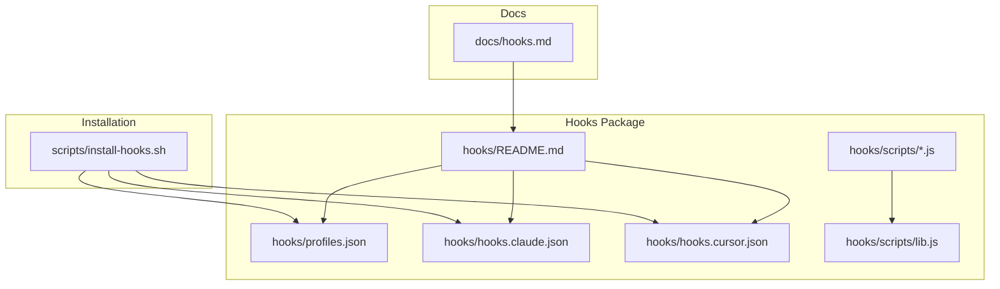
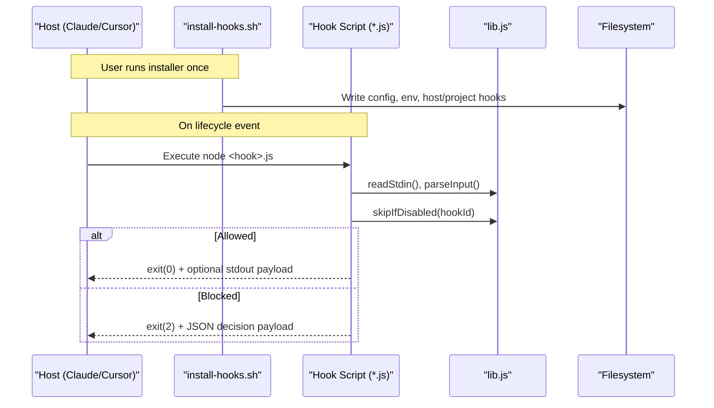
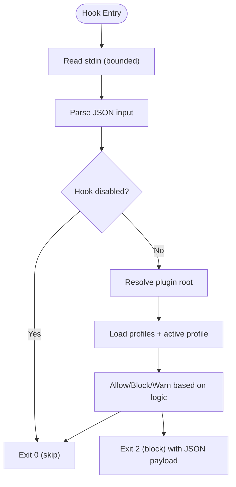
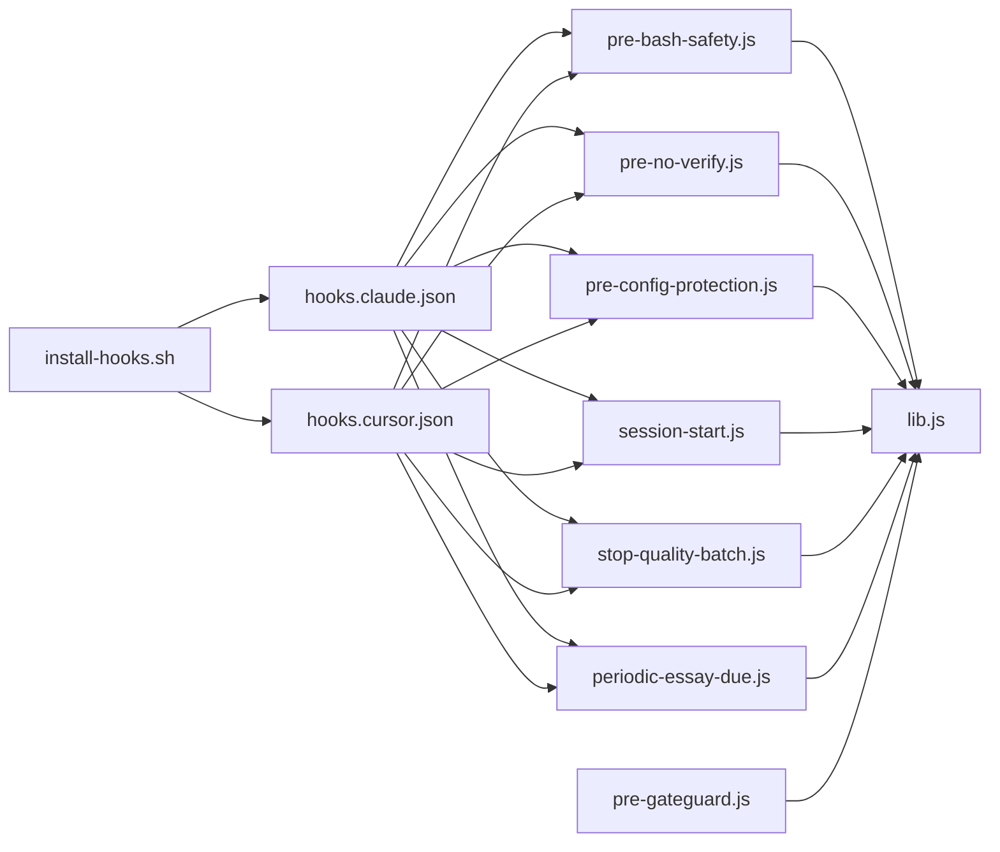

<cite>
**Referenced Files in This Document**
- `fractal-agentic/hooks/README.md`
- `fractal-agentic/hooks/hooks.claude.json`
- `fractal-agentic/hooks/profiles.json`
- `fractal-agentic/hooks/scripts/lib.js`
- `fractal-agentic/hooks/scripts/pre-bash-safety.js`
- `fractal-agentic/hooks/scripts/pre-no-verify.js`
- `fractal-agentic/hooks/scripts/pre-config-protection.js`
- `fractal-agentic/hooks/scripts/session-start.js`
- `fractal-agentic/hooks/scripts/stop-quality-batch.js`
- `fractal-agentic/hooks/scripts/periodic-essay-due.js`
- `fractal-agentic/hooks/scripts/pre-gateguard.js`
- `fractal-agentic/hooks/hooks.cursor.json`
- `fractal-agentic/scripts/install-hooks.sh`
- `fractal-agentic/docs/hooks.md`
</cite>

## Table of Contents
1. [Introduction](#introduction)
2. [Project Structure](#project-structure)
3. [Core Components](#core-components)
4. [Architecture Overview](#architecture-overview)
5. [Detailed Component Analysis](#detailed-component-analysis)
6. [Dependency Analysis](#dependency-analysis)
7. [Performance Considerations](#performance-considerations)
8. [Troubleshooting Guide](#troubleshooting-guide)
9. [Conclusion](#conclusion)
10. [Appendices](#appendices)

## Introduction
This guide explains how to develop custom hooks in the Fractal Agentic ecosystem. It covers shared utilities (stdin handling, root resolution, profile management, I/O), hook registration mechanisms across hosts, profile configuration, and conditional execution logic. It also provides best practices for cross-platform compatibility, error handling, performance optimization, TypeScript-style interfaces for contexts and payloads, testing strategies, debugging techniques, deployment patterns, and practical examples such as file watchers, validation rules, and automation workflows.

## Project Structure
The hooks package is optional and host-portable. Hooks are Node scripts under hooks/scripts/, with per-host mappings in JSON files and a central profiles registry. Installation materializes absolute paths into project or user settings.

**Diagram sources**
- `fractal-agentic/hooks/README.md#L1-L124`
- `fractal-agentic/hooks/profiles.json#L1-L38`
- `fractal-agentic/hooks/hooks.claude.json#L1-L87`
- `fractal-agentic/hooks/hooks.cursor.json#L1-L48`
- `fractal-agentic/hooks/scripts/lib.js#L1-L137`
- `fractal-agentic/scripts/install-hooks.sh#L1-L380`
- `fractal-agentic/docs/hooks.md#L1-L128`

**Section sources**
- `fractal-agentic/hooks/README.md#L1-L124`
- `fractal-agentic/docs/hooks.md#L1-L128`

## Core Components
- Shared library (lib.js): stdin reading, input parsing, plugin root resolution, profile loading, hook enablement checks, tool input extraction helpers, allow/block/warn semantics, and OS helpers.
- Hook scripts: small, focused Node programs implementing specific behaviors (bash safety, no-verify protection, config protection, session bootstrap, stop quality batch, periodic essay due check, gateguard).
- Profiles: declarative lists of hook IDs per profile (minimal, standard, strict).
- Host mappings: Claude and Cursor JSON files mapping lifecycle events to commands.
- Installer: shell script that writes preferences and materializes absolute paths into host/project configs.

Key responsibilities:
- Non-blocking by default; only block irreversible harm.
- Profile-driven activation and opt-out via environment variables.
- Cross-platform path and command detection.
- Deterministic exit codes: 0 continue, 2 block (Claude-compatible).

**Section sources**
- `fractal-agentic/hooks/scripts/lib.js#L1-L137`
- `fractal-agentic/hooks/profiles.json#L1-L38`
- `fractal-agentic/hooks/hooks.claude.json#L1-L87`
- `fractal-agentic/hooks/hooks.cursor.json#L1-L48`
- `fractal-agentic/scripts/install-hooks.sh#L1-L380`

## Architecture Overview
Hooks are invoked by hosts at lifecycle points. Each hook reads stdin, evaluates conditions, and either allows continuation or blocks with a structured payload. The installer ensures correct paths and environment setup.

**Diagram sources**
- `fractal-agentic/scripts/install-hooks.sh#L1-L380`
- `fractal-agentic/hooks/scripts/lib.js#L1-L137`
- `fractal-agentic/hooks/hooks.claude.json#L1-L87`
- `fractal-agentic/hooks/hooks.cursor.json#L1-L48`

## Detailed Component Analysis

### Shared Library Utilities (lib.js)
Responsibilities:
- Read bounded stdin and parse JSON safely.
- Resolve plugin root from environment or relative path.
- Load profiles and compute active profile and disabled set.
- Provide helper accessors for tool inputs and names.
- Implement allow/block/warn semantics with Claude-compatible outputs.
- Expose homedir utility.

Complexity:
- stdin read is O(n) with a hard cap to prevent memory abuse.
- Profile lookup is O(1) after JSON parse.
- Disabled set construction is O(k) where k is number of comma-separated IDs.

Optimization opportunities:
- Cache parsed profiles and disabled set per process lifetime.
- Avoid repeated fs reads by memoizing pluginRoot and loadProfiles.

Error handling:
- Graceful fallbacks on malformed JSON or missing files.
- Silent ignore on non-critical write failures.

**Diagram sources**
- `fractal-agentic/hooks/scripts/lib.js#L1-L137`

**Section sources**
- `fractal-agentic/hooks/scripts/lib.js#L1-L137`

### Hook Registration Mechanisms
- Claude: PreToolUse, SessionStart, Stop mapped to commands using absolute paths after installation.
- Cursor: sessionStart, beforeShellExecution, afterFileEdit, stop mapped similarly.
- Project-level materialization writes absolute paths into .fractal-agentic/hooks.claude.json.

Best practices:
- Keep host mappings minimal; implement logic in scripts.
- Use timeouts to avoid hanging the host.
- Prefer absolute paths post-installation for reliability.

**Section sources**
- `fractal-agentic/hooks/hooks.claude.json#L1-L87`
- `fractal-agentic/hooks/hooks.cursor.json#L1-L48`
- `fractal-agentic/scripts/install-hooks.sh#L1-L380`

### Profile Configuration and Conditional Execution
- Profiles define which hook IDs run (minimal, standard, strict).
- Environment overrides: FRACTAL_HOOK_PROFILE, FRACTAL_DISABLED_HOOKS, FRACTAL_GATEGUARD.
- Conditional execution uses skipIfDisabled(hookId) at the top of each hook.

Operational notes:
- Profiles are loaded from profiles.json; defaults to minimal if missing.
- Disabled set supports comma-separated IDs.
- Some hooks respect additional flags (e.g., gateguard off).

**Section sources**
- `fractal-agentic/hooks/profiles.json#L1-L38`
- `fractal-agentic/hooks/scripts/lib.js#L1-L137`

### Hook Scripts: Bash Safety (pre-bash-safety.js)
Behavior:
- Parses command from stdin.
- Blocks high-risk patterns (force-push, reset --hard, rm /, curl|sh, etc.).
- Warns on eval and chmod 777 without blocking.
- Allows by default when no command present.

Cross-platform:
- Uses regex-based matching; platform-independent.

Performance:
- Minimal overhead; fast pattern matching.

**Section sources**
- `fractal-agentic/hooks/scripts/pre-bash-safety.js#L1-L42`

### Hook Scripts: No-Verify Protection (pre-no-verify.js)
Behavior:
- Detects git commit/push/am/rebase/merge with --no-verify or -n.
- Blocks HUSKY=0 usage.
- Allows otherwise.

Design rationale:
- Prevents bypassing quality and safety hooks.

**Section sources**
- `fractal-agentic/hooks/scripts/pre-no-verify.js#L1-L30`

### Hook Scripts: Config Protection (pre-config-protection.js)
Behavior:
- Protects common lint/format/tsconfig/editor config files.
- Blocks edits to protected files unless explicitly disabled.
- Uses basename and regex checks.

Extensibility:
- Add new protected patterns to PROTECTED list or BASENAME_ONLY set.

**Section sources**
- `fractal-agentic/hooks/scripts/pre-config-protection.js#L1-L66`

### Hook Scripts: Session Bootstrap (session-start.js)
Behavior:
- Consumes stdin.
- Optionally disabled via FRACTAL_SESSION_START_CONTEXT=off.
- Writes bounded system message and stderr output describing identity, router, boss playbook, delivery guidance, pins policy, and current hook profile.
- Always allows.

Bounded context:
- Enforces max characters via FRACTAL_SESSION_START_MAX_CHARS.

**Section sources**
- `fractal-agentic/hooks/scripts/session-start.js#L1-L65`

### Hook Scripts: Stop Quality Batch (stop-quality-batch.js)
Behavior:
- Best-effort typecheck when package.json exists and pnpm is available.
- Warns on issues but never blocks Stop.
- Skips heavy checks by default.

Cross-platform:
- Uses which/where to detect tools.

**Section sources**
- `fractal-agentic/hooks/scripts/stop-quality-batch.js#L1-L50`

### Hook Scripts: Periodic Essay Due (periodic-essay-due.js)
Behavior:
- Invokes periodic-essay-runner.js with due --enqueue.
- Never starts an agent; only marks work due.
- Ignores errors unless debug flag is set.

Non-blocking:
- Always allows regardless of runner outcome.

**Section sources**
- `fractal-agentic/hooks/scripts/periodic-essay-due.js#L1-L32`

### Hook Scripts: GateGuard (pre-gateguard.js)
Behavior:
- First edit of a file triggers a deny with fact checklist.
- Marks file allowed in temporary state so retry succeeds.
- Respects FRACTAL_GATEGUARD=off.

State management:
- Stores allowed map in tmpdir keyed by cwd hash.

**Section sources**
- `fractal-agentic/hooks/scripts/pre-gateguard.js#L1-L79`

### Installer (install-hooks.sh)
Responsibilities:
- Writes config (profile, plugin_root, env snippet).
- Materializes absolute paths into project and host settings.
- Merges into Claude settings when safe; otherwise writes side-by-side file.
- Installs Cursor hooks mapping.
- Supports --check mode for verification.

Cross-platform considerations:
- Uses node when available for robust JSON manipulation; falls back to sed.
- Handles XDG_CONFIG_HOME and HOME.

**Section sources**
- `fractal-agentic/scripts/install-hooks.sh#L1-L380`

## Dependency Analysis
Hooks depend on lib.js for core utilities. Host mappings reference specific scripts. The installer depends on node availability and filesystem permissions.

**Diagram sources**
- `fractal-agentic/hooks/scripts/lib.js#L1-L137`
- `fractal-agentic/hooks/hooks.claude.json#L1-L87`
- `fractal-agentic/hooks/hooks.cursor.json#L1-L48`
- `fractal-agentic/scripts/install-hooks.sh#L1-L380`

**Section sources**
- `fractal-agentic/hooks/scripts/lib.js#L1-L137`
- `fractal-agentic/hooks/hooks.claude.json#L1-L87`
- `fractal-agentic/hooks/hooks.cursor.json#L1-L48`
- `fractal-agentic/scripts/install-hooks.sh#L1-L380`

## Performance Considerations
- Keep hooks lightweight; avoid heavy operations in Stop hooks.
- Use bounded stdin reads to prevent memory spikes.
- Prefer existence checks and quick heuristics before spawning processes.
- Cache expensive computations within a single process invocation.
- Set appropriate timeouts in host mappings to avoid blocking.

[No sources needed since this section provides general guidance]

## Troubleshooting Guide
Common issues and resolutions:
- Hooks not running: Ensure FRACTAL_AGENTIC_ROOT is set and installer has materialized paths. Restart the host after changes.
- Profile not applied: Verify FRACTAL_HOOK_PROFILE and profiles.json presence.
- Hook blocked unexpectedly: Check FRACTAL_DISABLED_HOOKS and hook-specific flags (e.g., FRACTAL_GATEGUARD=off).
- Claude merge conflicts: If existing hooks exist, installer writes fractal-hooks.json; merge manually or use --force.
- Cursor hooks missing: Confirm .cursor/hooks.json was created and contains absolute paths.

Debugging tips:
- Enable debug logs for essay due hook via FRACTAL_ESSAY_HOOK_DEBUG=1.
- Inspect stderr output prefixed with [fractal-hooks].
- Use install-hooks.sh --check to validate installation state.

**Section sources**
- `fractal-agentic/scripts/install-hooks.sh#L1-L380`
- `fractal-agentic/hooks/scripts/periodic-essay-due.js#L1-L32`
- `fractal-agentic/docs/hooks.md#L1-L128`

## Conclusion
Fractal Agentic hooks provide a flexible, non-blocking safety and automation layer across hosts. By leveraging shared utilities, profiles, and host mappings, developers can implement robust, cross-platform hooks that protect against irreversible harm while preserving productivity. Follow the patterns outlined here to create maintainable, testable, and performant hooks.

[No sources needed since this section summarizes without analyzing specific files]

## Appendices

### TypeScript Interfaces for Hook Contexts and Utilities
Note: These are TypeScript-style definitions derived from runtime behavior and payloads.

- HookContext
  - stdin: string | null
  - toolName(): string
  - toolInput(): object
  - commandFrom(input): string
  - filePathFrom(input): string
  - pluginRoot(): string
  - hookEnabled(hookId): boolean
  - skipIfDisabled(hookId): void
  - allow(message?: string): void
  - block(reason: string): void
  - warn(message: string): void
  - readStdin(): Promise<string>
  - parseInput(raw): object
  - homedir(): string

- EventPayload
  - continue?: boolean
  - systemMessage?: string
  - hookSpecificOutput?: object
  - decision?: "block" | "allow"
  - reason?: string
  - permissionDecision?: "deny" | "allow"
  - permissionDecisionReason?: string

- ProfileConfig
  - default: string
  - profiles: Record<string, string[]>

- HostMapping
  - description: string
  - hooks: Record<string, Array<{type?: string; command: string; timeout?: number}>>

- InstallerOptions
  - target: "config" | "claude" | "cursor" | "project" | "all"
  - projectDir: string
  - profile: "minimal" | "standard" | "strict"
  - checkOnly: boolean
  - force: boolean

[No sources needed since this section provides conceptual interface definitions]

### Testing Strategies
- Unit tests for lib.js functions: stdin parsing, profile loading, disabled set computation, path resolution.
- Integration tests per hook: simulate stdin payloads and assert exit codes and stderr/stdout outputs.
- Host simulation: mock host invocations to verify mapping correctness and timeouts.
- Installer tests: validate generated JSON structures and idempotency.

[No sources needed since this section provides conceptual guidance]

### Debugging Techniques
- Enable verbose logging in hooks via environment flags where supported.
- Capture stderr lines prefixed with [fractal-hooks].
- Use install-hooks.sh --check to ensure expected artifacts exist.
- Temporarily disable hooks via FRACTAL_DISABLED_HOOKS to isolate issues.

[No sources needed since this section provides conceptual guidance]

### Deployment Patterns
- Per-machine config: write ~/.config/fractal-agentic/hooks.json and env.sh.
- Per-project materialization: write .fractal-agentic/hooks.claude.json with absolute paths.
- Host merges: prefer merging into Claude settings when safe; otherwise use side-by-side files.
- CI integration: run install-hooks.sh --check to validate environment readiness.

[No sources needed since this section provides conceptual guidance]

### Practical Examples

#### File Watcher Hook
- Purpose: Trigger rebuilds or notifications on file changes.
- Implementation pattern:
  - Read stdin to get file path.
  - Validate path and extension.
  - Spawn a background task to watch and react.
  - Always allow to avoid blocking the editor.

[No sources needed since this diagram shows conceptual workflow, not actual code structure]

#### Validation Rule Hook
- Purpose: Enforce repository-specific rules (e.g., naming conventions, required metadata).
- Implementation pattern:
  - Extract file path and content from stdin.
  - Apply rule engine or regex checks.
  - Block with clear reason if violated; otherwise allow.

[No sources needed since this diagram shows conceptual workflow, not actual code structure]

#### Automation Workflow Hook
- Purpose: Coordinate multi-step tasks on session start or stop.
- Implementation pattern:
  - Consume stdin and resolve plugin root.
  - Invoke orchestrator scripts with bounded timeouts.
  - Log outcomes and always allow to keep sessions responsive.

[No sources needed since this diagram shows conceptual workflow, not actual code structure]