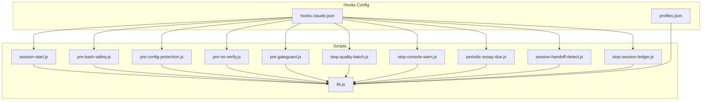
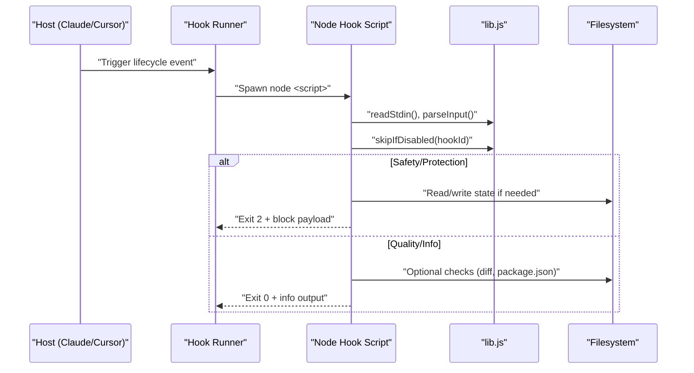
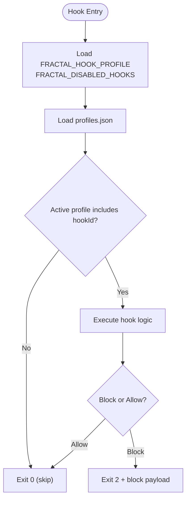
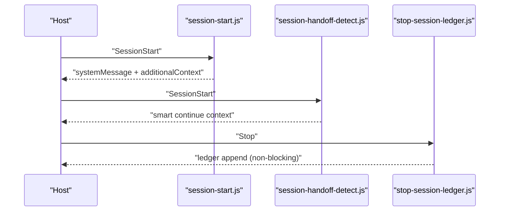
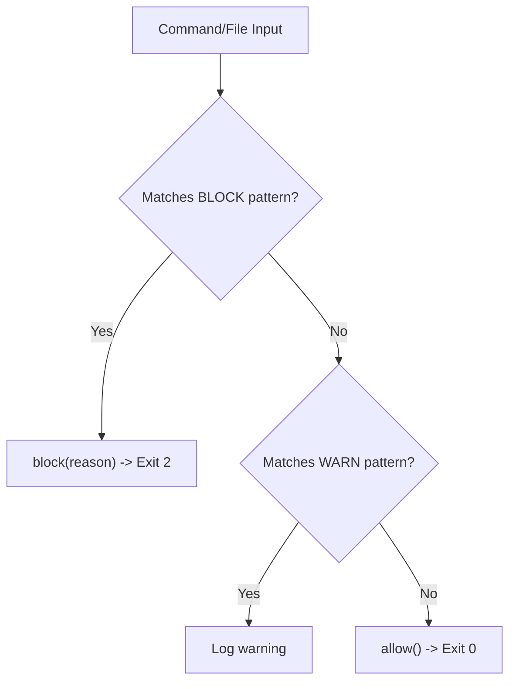
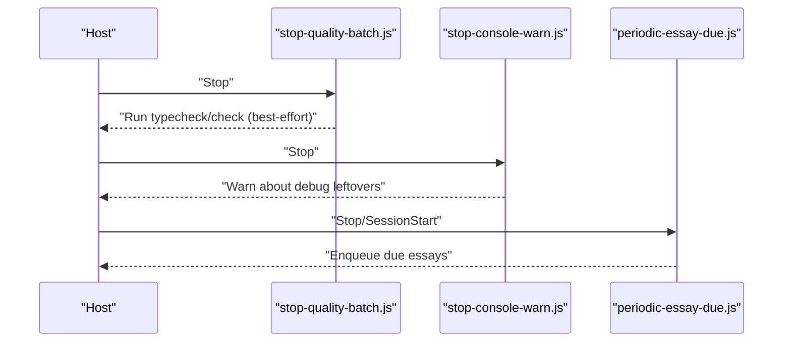
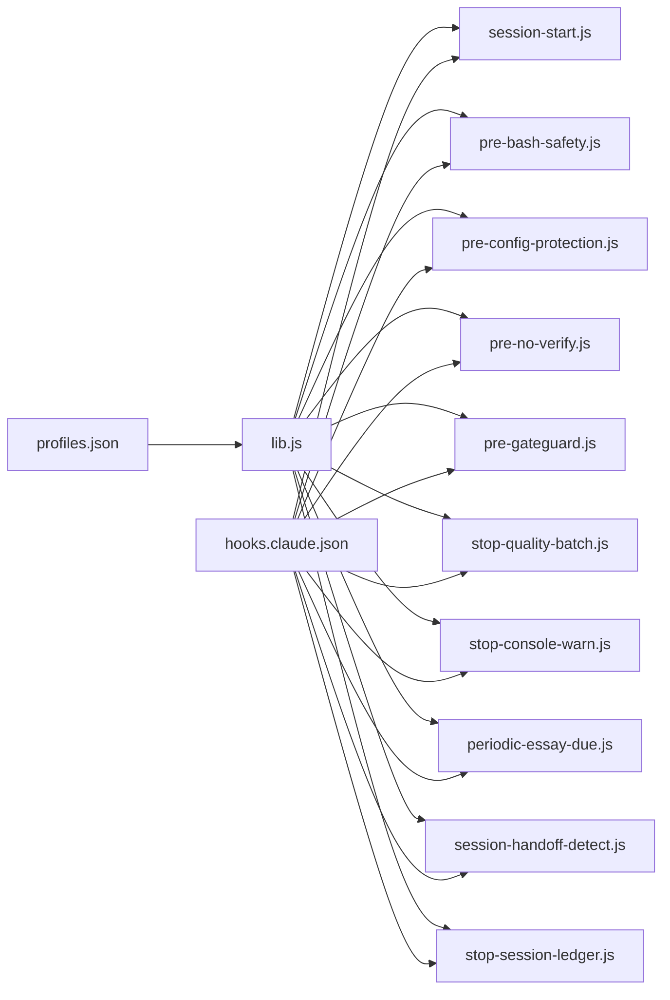

<cite>
**Referenced Files in This Document**
- `fractal-agentic/hooks/README.md`
- `fractal-agentic/hooks/hooks.claude.json`
- `fractal-agentic/hooks/profiles.json`
- `fractal-agentic/hooks/scripts/lib.js`
- `fractal-agentic/hooks/scripts/session-start.js`
- `fractal-agentic/hooks/scripts/pre-bash-safety.js`
- `fractal-agentic/hooks/scripts/pre-config-protection.js`
- `fractal-agentic/hooks/scripts/pre-no-verify.js`
- `fractal-agentic/hooks/scripts/pre-gateguard.js`
- `fractal-agentic/hooks/scripts/stop-quality-batch.js`
- `fractal-agentic/hooks/scripts/stop-console-warn.js`
- `fractal-agentic/hooks/scripts/periodic-essay-due.js`
- `fractal-agentic/hooks/scripts/session-handoff-detect.js`
- `fractal-agentic/hooks/scripts/stop-session-ledger.js`
</cite>

## Table of Contents
1. [Introduction](#introduction)
2. [Project Structure](#project-structure)
3. [Core Components](#core-components)
4. [Architecture Overview](#architecture-overview)
5. [Detailed Component Analysis](#detailed-component-analysis)
6. [Dependency Analysis](#dependency-analysis)
7. [Performance Considerations](#performance-considerations)
8. [Troubleshooting Guide](#troubleshooting-guide)
9. [Conclusion](#conclusion)
10. [Appendices](#appendices)

## Introduction
This document provides a comprehensive hook API reference for the Git hooks and lifecycle event system used by Fractal Agentic. It covers:
- Lifecycle events and their execution model
- Hook registration via host-compatible settings
- Profile-based activation and conditional execution
- Session management hooks with context data structures
- Pre-commit and pre-edit safety, security checks, and quality gates
- TypeScript-style interfaces for contexts, payloads, and utilities
- Error handling strategies, logging conventions, and debugging techniques
- Practical examples and integration patterns for custom hooks

The system is designed to be optional, non-blocking by default, and portable across hosts that support PreToolUse / Stop / SessionStart-style hooks.

**Section sources**
- `fractal-agentic/hooks/README.md#L1-L124`

## Project Structure
The hooks subsystem lives under the hooks directory and consists of:
- Configuration files for profiles and host mappings
- A shared library for input parsing, profile resolution, and I/O helpers
- Individual Node scripts implementing each hook lifecycle method

**Diagram sources**
- `fractal-agentic/hooks/profiles.json#L1-L38`
- `fractal-agentic/hooks/hooks.claude.json#L1-L87`
- `fractal-agentic/hooks/scripts/lib.js#L1-L137`
- `fractal-agentic/hooks/scripts/session-start.js#L1-L65`
- `fractal-agentic/hooks/scripts/pre-bash-safety.js#L1-L42`
- `fractal-agentic/hooks/scripts/pre-config-protection.js#L1-L66`
- `fractal-agentic/hooks/scripts/pre-no-verify.js#L1-L30`
- `fractal-agentic/hooks/scripts/pre-gateguard.js#L1-L79`
- `fractal-agentic/hooks/scripts/stop-quality-batch.js#L1-L50`
- `fractal-agentic/hooks/scripts/stop-console-warn.js#L1-L30`
- `fractal-agentic/hooks/scripts/periodic-essay-due.js#L1-L32`
- `fractal-agentic/hooks/scripts/session-handoff-detect.js#L1-L157`
- `fractal-agentic/hooks/scripts/stop-session-ledger.js#L1-L78`

**Section sources**
- `fractal-agentic/hooks/README.md#L30-L96`
- `fractal-agentic/hooks/hooks.claude.json#L1-L87`
- `fractal-agentic/hooks/profiles.json#L1-L38`

## Core Components
- Shared library (lib.js): Provides stdin reading, JSON parsing, plugin root resolution, profile loading, hook enablement checks, tool input extraction, allow/block/warn helpers, and exit codes compatible with Claude.
- Profiles (profiles.json): Defines minimal, standard, and strict sets of hook IDs to run.
- Host mapping (hooks.claude.json): Maps lifecycle events (PreToolUse, SessionStart, Stop) to specific scripts with timeouts.
- Lifecycle scripts: Implement per-hook logic for safety, protection, session bootstrap, quality checks, and state management.

Key behaviors:
- Exit code 0 means continue; exit code 2 blocks the action.
- Blocking outputs a structured payload on stdout and logs to stderr.
- Non-blocking hooks write informational messages and always allow.

**Section sources**
- `fractal-agentic/hooks/scripts/lib.js#L1-L137`
- `fractal-agentic/hooks/profiles.json#L1-L38`
- `fractal-agentic/hooks/hooks.claude.json#L1-L87`

## Architecture Overview
The hook system integrates with host environments through configuration fragments that map lifecycle events to Node scripts. Each script reads an optional JSON payload from stdin, performs checks or side effects, and exits with a decision code.

**Diagram sources**
- `fractal-agentic/hooks/hooks.claude.json#L1-L87`
- `fractal-agentic/hooks/scripts/lib.js#L1-L137`

## Detailed Component Analysis

### Lifecycle Events and Registration
- PreToolUse: Bash and Write/Edit/MultiEdit matchers trigger safety and config protection hooks.
- SessionStart: Bootstrap session context, due essay checks, handoff detection.
- Stop: Best-effort quality batch, console warning scan, ledger update, essay due check.

Each event maps to one or more scripts with explicit timeouts.

**Section sources**
- `fractal-agentic/hooks/hooks.claude.json#L1-L87`

### Profile Management and Conditional Execution
- Profiles define which hook IDs are active.
- Environment variables control profile selection, disabled hooks, and feature toggles.
- lib.js resolves active profile and determines whether a hook should run.

**Diagram sources**
- `fractal-agentic/hooks/profiles.json#L1-L38`
- `fractal-agentic/hooks/scripts/lib.js#L37-L66`

**Section sources**
- `fractal-agentic/hooks/README.md#L14-L28`
- `fractal-agentic/hooks/scripts/lib.js#L37-L66`

### Session Management Hooks
- session-start: Non-blocking bootstrap message, respects FRACTAL_SESSION_START_CONTEXT and max chars.
- session-handoff-detect: Reads handoff metadata and plan state, emits contextual summary.
- stop-session-ledger: Appends a line to a JSONL ledger with host, boss, capability mode, and summary.

**Diagram sources**
- `fractal-agentic/hooks/scripts/session-start.js#L1-L65`
- `fractal-agentic/hooks/scripts/session-handoff-detect.js#L1-L157`
- `fractal-agentic/hooks/scripts/stop-session-ledger.js#L1-L78`

**Section sources**
- `fractal-agentic/hooks/scripts/session-start.js#L1-L65`
- `fractal-agentic/hooks/scripts/session-handoff-detect.js#L1-L157`
- `fractal-agentic/hooks/scripts/stop-session-ledger.js#L1-L78`

### Pre-Commit and Pre-Edit Safety
- pre-bash-safety: Blocks destructive commands and dangerous patterns; warns on risky constructs.
- pre-no-verify: Prevents bypassing hooks via --no-verify or HUSKY=0.
- pre-config-protection: Protects linter/formatter/tsconfig files from weakening changes.
- pre-gateguard: First-touch policy requiring investigation before editing critical files.

**Diagram sources**
- `fractal-agentic/hooks/scripts/pre-bash-safety.js#L1-L42`
- `fractal-agentic/hooks/scripts/pre-no-verify.js#L1-L30`
- `fractal-agentic/hooks/scripts/pre-config-protection.js#L1-L66`
- `fractal-agentic/hooks/scripts/pre-gateguard.js#L1-L79`

**Section sources**
- `fractal-agentic/hooks/scripts/pre-bash-safety.js#L1-L42`
- `fractal-agentic/hooks/scripts/pre-no-verify.js#L1-L30`
- `fractal-agentic/hooks/scripts/pre-config-protection.js#L1-L66`
- `fractal-agentic/hooks/scripts/pre-gateguard.js#L1-L79`

### Quality Gates and Stop Hooks
- stop-quality-batch: Runs typecheck or check scripts when available; best-effort, never blocks.
- stop-console-warn: Scans diffs for console.log/debugger leftovers; warns only.
- periodic-essay-due: Enqueues due essays without blocking sessions.

**Diagram sources**
- `fractal-agentic/hooks/scripts/stop-quality-batch.js#L1-L50`
- `fractal-agentic/hooks/scripts/stop-console-warn.js#L1-L30`
- `fractal-agentic/hooks/scripts/periodic-essay-due.js#L1-L32`

**Section sources**
- `fractal-agentic/hooks/scripts/stop-quality-batch.js#L1-L50`
- `fractal-agentic/hooks/scripts/stop-console-warn.js#L1-L30`
- `fractal-agentic/hooks/scripts/periodic-essay-due.js#L1-L32`

### Hook Context Data Structures and Utilities
All scripts consume a JSON payload from stdin with flexible field names. The shared library normalizes inputs and exposes helpers.

TypeScript-style interfaces:

- HookInput
  - tool_input | toolInput | params | args: object
  - tool_name | toolName | hook_event_name | event: string
  - command | cmd: string
  - file_path | filePath | path | file: string
  - summary | last_message | prompt | _raw: string (fallback)

- HookOutput
  - continue: boolean
  - systemMessage: string
  - hookSpecificOutput: object
    - permissionDecision: "deny" | "allow"
    - permissionDecisionReason: string
    - additionalContext: string

- Utility Functions
  - readStdin(): Promise<string>
  - parseInput(raw: string): HookInput
  - pluginRoot(): string
  - loadProfiles(): { default: string; profiles: Record<string, string[]> }
  - activeProfile(): string
  - hookEnabled(hookId: string): boolean
  - skipIfDisabled(hookId: string): void
  - toolInput(input: HookInput): any
  - toolName(input: HookInput): string
  - commandFrom(input: HookInput): string
  - filePathFrom(input: HookInput): string
  - allow(message?: string): void
  - block(reason: string): void
  - warn(message: string): void

Error handling and exit codes:
- Exit 0: Continue execution
- Exit 2: Block action; writes structured payload to stdout and logs to stderr

Logging conventions:
- All warnings prefixed with [fractal-hooks]
- Block reasons include human-readable explanations and optional permissionDecision fields

**Section sources**
- `fractal-agentic/hooks/scripts/lib.js#L1-L137`

### Hook Registration Mechanisms
- Host settings merge hooks.claude.json into Claude settings or use side file.
- Cursor uses project-level .cursor/hooks.json.
- Project-level absolute paths can be materialized under .fractal-agentic/hooks.claude.json.
- Installation scripts configure environment and target locations.

Environment variables:
- FRACTAL_AGENTIC_ROOT: Plugin root path
- FRACTAL_HOOK_PROFILE: minimal | standard | strict
- FRACTAL_DISABLED_HOOKS: comma-separated hook IDs to disable
- FRACTAL_GATEGUARD: off to disable first-touch gate
- FRACTAL_SESSION_START_MAX_CHARS: limit bootstrap message length
- FRACTAL_SESSION_START_CONTEXT: off to skip context injection

**Section sources**
- `fractal-agentic/hooks/README.md#L50-L96`
- `fractal-agentic/hooks/hooks.claude.json#L1-L87`

## Dependency Analysis
The scripts depend on lib.js for common functionality and on filesystem operations for state and configuration. Profiles determine runtime behavior. Host configuration wires lifecycle events to scripts.

**Diagram sources**
- `fractal-agentic/hooks/scripts/lib.js#L1-L137`
- `fractal-agentic/hooks/profiles.json#L1-L38`
- `fractal-agentic/hooks/hooks.claude.json#L1-L87`

**Section sources**
- `fractal-agentic/hooks/scripts/lib.js#L1-L137`
- `fractal-agentic/hooks/profiles.json#L1-L38`
- `fractal-agentic/hooks/hooks.claude.json#L1-L87`

## Performance Considerations
- Timeouts: Each registered hook has a timeout to prevent long-running operations from blocking the host.
- Non-blocking doctrine: Hooks avoid heavy work; quality checks are best-effort and never block.
- Stdin size limits: Input is capped to prevent memory issues.
- Filesystem access: Minimal and guarded; state files are stored in temp or user home directories.

[No sources needed since this section provides general guidance]

## Troubleshooting Guide
Common issues and resolutions:
- Hook not running: Verify FRACTAL_HOOK_PROFILE and ensure hook ID is included; check FRACTAL_DISABLED_HOOKS.
- Action blocked unexpectedly: Inspect stderr for [fractal-hooks] messages; review block reason and adjust command or flags.
- Config protection triggers: Avoid editing protected files directly; fix code/types instead of weakening configs.
- Gateguard deny: Investigate imports and impacts; retry after stating facts; optionally set FRACTAL_GATEGUARD=off for the session.
- Quality checks failing: Run typecheck or check scripts intentionally; Stop hooks do not enforce CI.

Debugging techniques:
- Enable FRACTAL_ESSAY_HOOK_DEBUG=1 for essay-related diagnostics.
- Use /hooks-status to inspect installation and configuration.
- Review stderr logs for detailed messages.

**Section sources**
- `fractal-agentic/hooks/README.md#L72-L96`
- `fractal-agentic/hooks/scripts/periodic-essay-due.js#L25-L29`

## Conclusion
The Fractal Agentic hook system provides a robust, portable, and optional lifecycle event framework. It balances safety and productivity by enforcing protective rules while remaining non-blocking and configurable. Developers can extend the system by adding new scripts, leveraging shared utilities, and integrating with host configurations.

[No sources needed since this section summarizes without analyzing specific files]

## Appendices

### Practical Examples and Integration Patterns
- Custom bash safety hook: Add new BLOCK/WARN patterns to detect risky commands; use block() for denial and warn() for advisories.
- Custom config protection: Extend PROTECTED regexes and BASENAME_ONLY set to cover additional tooling configs.
- Custom session bootstrap: Emit systemMessage and additionalContext to guide agent behavior at session start.
- Custom quality gate: Integrate project-specific checks via package.json scripts; ensure best-effort behavior and informative warnings.

Integration steps:
- Register the hook in hooks.claude.json under appropriate matcher/event with a timeout.
- Ensure the hook ID is included in the selected profile.
- Set environment variables as needed for behavior control.

**Section sources**
- `fractal-agentic/hooks/hooks.claude.json#L1-L87`
- `fractal-agentic/hooks/profiles.json#L1-L38`
- `fractal-agentic/hooks/scripts/lib.js#L1-L137`