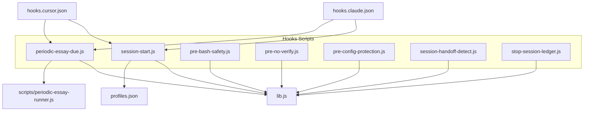
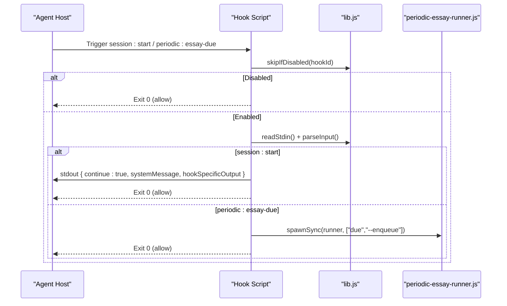
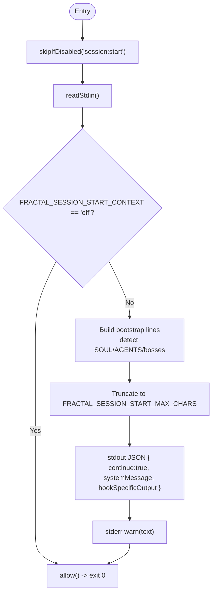
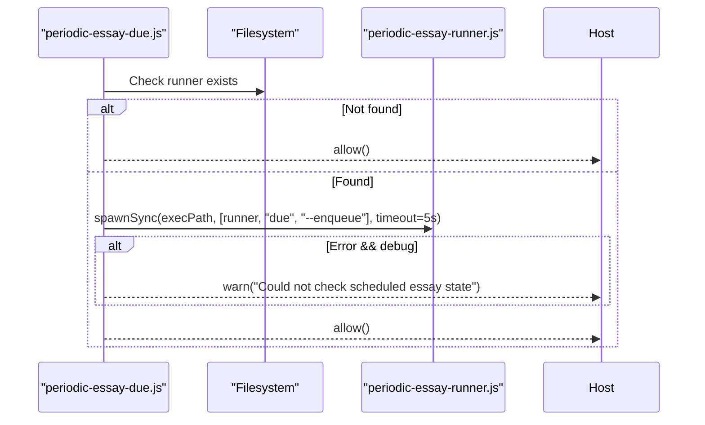
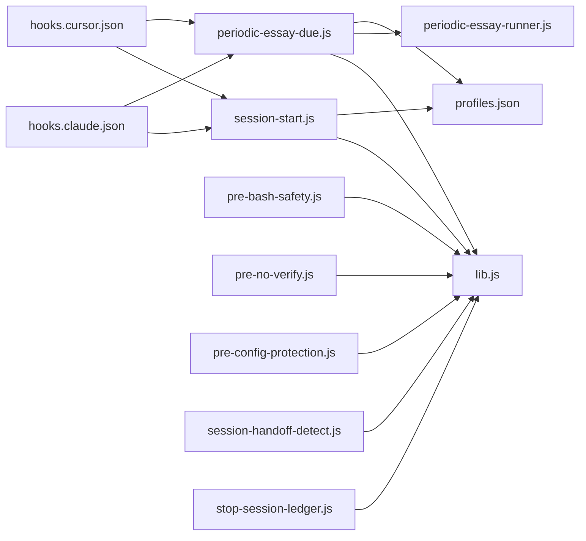

<cite>
**Referenced Files in This Document**
- `hooks/scripts/session-start.js`
- `hooks/scripts/periodic-essay-due.js`
- `hooks/scripts/lib.js`
- `hooks/profiles.json`
- `hooks/hooks.claude.json`
- `hooks/hooks.cursor.json`
- `scripts/periodic-essay-runner.js`
- `docs/hooks.md`
- `hooks/README.md`
- `scripts/install-hooks.sh`
- `hooks/scripts/pre-bash-safety.js`
- `hooks/scripts/pre-no-verify.js`
- `hooks/scripts/pre-config-protection.js`
- `hooks/scripts/session-handoff-detect.js`
- `hooks/scripts/stop-session-ledger.js`
</cite>

## Table of Contents
1. [Introduction](#introduction)
2. [Project Structure](#project-structure)
3. [Core Components](#core-components)
4. [Architecture Overview](#architecture-overview)
5. [Detailed Component Analysis](#detailed-component-analysis)
6. [Dependency Analysis](#dependency-analysis)
7. [Performance Considerations](#performance-considerations)
8. [Troubleshooting Guide](#troubleshooting-guide)
9. [Conclusion](#conclusion)
10. [Appendices](#appendices)

## Introduction
This document explains the session lifecycle hooks in the Fractal Agentic system, focusing on:
- The session:start hook and its initialization parameters, context data structures, and state management capabilities.
- The periodic:essay-due hook for scheduled task management and due date checking.
- Bootstrap processes, environment variable handling, and configuration loading patterns.
- TypeScript interfaces for session contexts, event payloads, and utility functions.
- Profile-based execution logic and conditional hook activation.
- Practical examples of custom session handlers, error recovery patterns, and debugging techniques.

## Project Structure
The hooks subsystem is implemented as small Node scripts under hooks/scripts/, with shared utilities in lib.js and profile definitions in profiles.json. Host integration is configured via JSON mappings (Claude and Cursor). A separate runner script manages periodic essays.

**Diagram sources**
- `hooks/scripts/session-start.js`
- `hooks/scripts/periodic-essay-due.js`
- `hooks/scripts/lib.js`
- `hooks/profiles.json`
- `hooks/hooks.claude.json`
- `hooks/hooks.cursor.json`
- `scripts/periodic-essay-runner.js`

**Section sources**
- `docs/hooks.md`
- `hooks/README.md`

## Core Components
- session:start: Non-blocking bootstrap that emits a bounded system message describing identity, startup router, boss playbook, delivery path, and current hook profile. It can be disabled or suppressed via environment variables.
- periodic:essay-due: Lightweight due-checker invoked at session start or stop; it calls the essay runner to mark work due without starting an agent.
- Shared library (lib.js): Provides stdin consumption, input parsing, plugin root resolution, profile evaluation, allow/block semantics, and helpers for tool/command/file introspection.
- Profiles: Define which hooks run per profile (minimal, standard, strict), controlled by FRACTAL_HOOK_PROFILE and FRACTAL_DISABLED_HOOKS.
- Host integrations: Claude and Cursor mappings wire events to the same scripts.

**Section sources**
- `hooks/scripts/session-start.js`
- `hooks/scripts/periodic-essay-due.js`
- `hooks/scripts/lib.js`
- `hooks/profiles.json`
- `hooks/hooks.claude.json`
- `hooks/hooks.cursor.json`

## Architecture Overview
The hooks are optional, non-blocking automations triggered by host lifecycle events. They read minimal input from stdin, evaluate profiles, and either allow continuation or block destructive actions. The session:start hook provides contextual bootstrap information; the periodic:essay-due hook delegates due-checking to the essay runner.

**Diagram sources**
- `hooks/scripts/session-start.js`
- `hooks/scripts/periodic-essay-due.js`
- `hooks/scripts/lib.js`
- `scripts/periodic-essay-runner.js`

## Detailed Component Analysis

### session:start Hook
Responsibilities:
- Consume stdin and optionally short-circuit if context is disabled.
- Resolve plugin root and detect presence of SOUL.md, AGENTS.md, and bosses INDEX.md.
- Emit a bounded system message (configurable max length) and stderr warning.
- Always allow continuation (non-blocking).

Key environment variables:
- FRACTAL_SESSION_START_MAX_CHARS: Maximum characters for systemMessage output (default 4000).
- FRACTAL_SESSION_START_CONTEXT: If set to off, the hook allows immediately without emitting context.
- FRACTAL_HOOK_PROFILE: Determines active profile.

Data flow:
- Reads stdin (bounded), parses input (best-effort), constructs lines, truncates to maxChars, writes JSON to stdout, warns on stderr, then exits 0.

**Diagram sources**
- `hooks/scripts/session-start.js`
- `hooks/scripts/lib.js`

**Section sources**
- `hooks/scripts/session-start.js`
- `docs/hooks.md`

### periodic:essay-due Hook
Responsibilities:
- Ensure the essay runner exists; if not, allow immediately.
- Invoke the essay runner with due --enqueue to mark pending work when due.
- Never start an agent; only marks due work.

Environment variables:
- FRACTAL_ESSAY_HOOK_DEBUG: When set to 1, logs errors from the due check.

Behavior:
- Calls spawnSync with a timeout; ignores stdout/stderr except capturing errors when debug is enabled; always allows.

**Diagram sources**
- `hooks/scripts/periodic-essay-due.js`
- `scripts/periodic-essay-runner.js`

**Section sources**
- `hooks/scripts/periodic-essay-due.js`
- `docs/hooks.md`

### Shared Library (lib.js)
Provides core utilities used by all hooks:
- I/O: readStdin (bounded), parseInput (JSON best-effort).
- Resolution: pluginRoot (env or relative fallback).
- Profiles: loadProfiles, activeProfile, disabledSet, hookEnabled, skipIfDisabled.
- Tool introspection: toolInput, toolName, commandFrom, filePathFrom.
- Control flow: allow (exit 0), block (exit 2 with structured payload), warn.

Error handling:
- Graceful fallbacks for missing files and malformed inputs.
- Consistent allow/block semantics across hooks.

**Section sources**
- `hooks/scripts/lib.js`

### Profiles and Conditional Activation
Profiles define which hooks run:
- minimal: safety, config protection, no-verify block, session:start, periodic:essay-due, handoff detection, ledger.
- standard: adds stop quality batch and console.warn capture.
- strict: adds pre-edit gateguard first-edit fact force.

Activation rules:
- FRACTAL_HOOK_PROFILE selects profile.
- FRACTAL_DISABLED_HOOKS disables specific hook IDs.
- Each hook calls skipIfDisabled(HOOK_ID) early.

**Section sources**
- `hooks/profiles.json`
- `docs/hooks.md`
- `hooks/README.md`

### Host Integration (Claude and Cursor)
- Claude mapping wires PreToolUse and SessionStart events to the appropriate scripts.
- Cursor mapping wires sessionStart, beforeShellExecution, afterFileEdit, and stop events.

These mappings ensure consistent behavior across hosts while keeping scripts portable.

**Section sources**
- `hooks/hooks.claude.json`
- `hooks/hooks.cursor.json`

### Additional Lifecycle Hooks
- pre:bash:safety: Blocks destructive shell patterns (force-push, reset --hard, rm /, curl|sh, etc.).
- pre:no-verify: Blocks git operations bypassing hooks (--no-verify, HUSKY=0).
- pre:edit:config-protection: Protects linter/formatter/tsconfig edits from accidental weakening.
- session:handoff-detect: Detects stale handoffs and surfaces context for smart continue.
- stop:session-ledger: Appends a line to a session ledger with host, timestamp, boss, capability mode, and summary.

**Section sources**
- `hooks/scripts/pre-bash-safety.js`
- `hooks/scripts/pre-no-verify.js`
- `hooks/scripts/pre-config-protection.js`
- `hooks/scripts/session-handoff-detect.js`
- `hooks/scripts/stop-session-ledger.js`

## Dependency Analysis
Hooks depend on:
- lib.js for common functionality.
- profiles.json for profile lists.
- Host-specific JSON for event-to-script mapping.
- periodic-essay-runner.js for due checks.

**Diagram sources**
- `hooks/scripts/session-start.js`
- `hooks/scripts/periodic-essay-due.js`
- `hooks/scripts/lib.js`
- `hooks/profiles.json`
- `hooks/hooks.claude.json`
- `hooks/hooks.cursor.json`
- `scripts/periodic-essay-runner.js`

**Section sources**
- `docs/hooks.md`
- `hooks/README.md`

## Performance Considerations
- All hooks are designed to be non-blocking and fast.
- stdin reading is bounded to prevent memory issues.
- periodic:essay-due uses a short timeout (5 seconds) and ignores output unless debugging.
- session:start truncates output to a configurable maximum character count.
- Avoid heavy I/O in custom hooks to keep sessions responsive.

[No sources needed since this section provides general guidance]

## Troubleshooting Guide
Common issues and resolutions:
- Hooks not running:
  - Verify FRACTAL_HOOK_PROFILE and FRACTAL_DISABLED_HOOKS.
  - Confirm host mappings (Claude/Cursor) point to correct paths.
  - Use /hooks-status or install-hooks.sh --check to validate installation.
- session:start context suppressed:
  - Check FRACTAL_SESSION_START_CONTEXT; set to off to disable context emission.
  - Adjust FRACTAL_SESSION_START_MAX_CHARS if output is truncated unexpectedly.
- Essay due check failing:
  - Enable FRACTAL_ESSAY_HOOK_DEBUG=1 to see errors.
  - Ensure scripts/periodic-essay-runner.js exists and is executable.
  - Run essay-init to configure output_dir and other settings.
- Blocking hooks:
  - Review blocked commands in pre-bash-safety.js and pre-no-verify.js.
  - Temporarily disable specific hooks via FRACTAL_DISABLED_HOOKS for testing.

**Section sources**
- `docs/hooks.md`
- `scripts/install-hooks.sh`
- `hooks/scripts/periodic-essay-due.js`
- `hooks/scripts/session-start.js`

## Conclusion
The Fractal Agentic hooks provide safe, optional, and non-blocking session automation. session:start offers lightweight bootstrap context, while periodic:essay-due integrates scheduled essay workflows without blocking user sessions. Profiles and environment variables enable flexible activation and customization. With robust error handling and host-portable design, these hooks enhance productivity while preserving user control.

[No sources needed since this section summarizes without analyzing specific files]

## Appendices

### TypeScript Interfaces for Session Contexts and Event Payloads
Note: These interfaces reflect the runtime contracts observed in the hooks and runners.

- SessionContext
  - pluginRoot: string
  - outputDir?: string
  - stateDir?: string
  - wikiRoot?: string

- HookEventPayload
  - tool_input?: Record<string, unknown>
  - tool_name?: string
  - command?: string
  - file_path?: string
  - _raw?: string

- SessionStartOutput
  - continue: boolean
  - systemMessage: string
  - hookSpecificOutput: { additionalContext: string }

- DueCheckResult
  - due: boolean

- PeriodicEssayState
  - version: number
  - run_count: number
  - pending: boolean
  - last_started_at?: string
  - last_completed_at?: string
  - next_due_at?: string
  - last_output?: string
  - last_topic?: string
  - last_error?: string

- ArticlePayload
  - title: string
  - description: string
  - tags: string[]
  - body: string

- CapturePayload
  - captured: boolean
  - ingested: boolean
  - topic: string
  - summary: string
  - tags: string[]

- LoggerContext
  - userId?: string
  - requestId?: string
  - method?: string
  - path?: string
  - [key: string]: unknown

**Section sources**
- `scripts/periodic-essay-runner.js`
- `hooks/scripts/lib.js`
- `hooks/scripts/session-start.js`
- `hooks/scripts/periodic-essay-due.js`

### Environment Variables Reference
- FRACTAL_AGENTIC_ROOT: Absolute path to plugin root (used by lib.pluginRoot).
- FRACTAL_HOOK_PROFILE: Active profile (minimal | standard | strict).
- FRACTAL_DISABLED_HOOKS: Comma-separated list of hook IDs to disable.
- FRACTAL_SESSION_START_MAX_CHARS: Max characters for session:start systemMessage.
- FRACTAL_SESSION_START_CONTEXT: Set to off to suppress context emission.
- FRACTAL_ESSAY_HOOK_DEBUG: Set to 1 to log errors during periodic:essay-due.
- FRACTAL_GATEGUARD: Set to off to disable first-edit fact-force in strict profile.

**Section sources**
- `docs/hooks.md`
- `hooks/README.md`
- `scripts/install-hooks.sh`

### Practical Examples

- Custom session handler pattern:
  - Create a new script under hooks/scripts/.
  - Use skipIfDisabled(HOOK_ID) early.
  - Read stdin and parse input with lib.parseInput.
  - Emit allowed continuation via allow() or block destructive actions via block(reason).
  - Keep execution fast and non-blocking.

- Error recovery patterns:
  - Wrap critical operations in try/catch and fall back gracefully.
  - Log warnings via lib.warn for visibility.
  - Ensure allow() is called on all code paths to avoid hanging sessions.

- Debugging techniques:
  - Enable FRACTAL_ESSAY_HOOK_DEBUG=1 for essay due-check diagnostics.
  - Use /hooks-status to verify installation and profile selection.
  - Inspect stderr output prefixed with [fractal-hooks] for hook messages.

**Section sources**
- `hooks/scripts/lib.js`
- `docs/hooks.md`
- `hooks/scripts/periodic-essay-due.js`