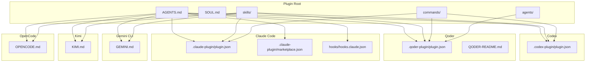
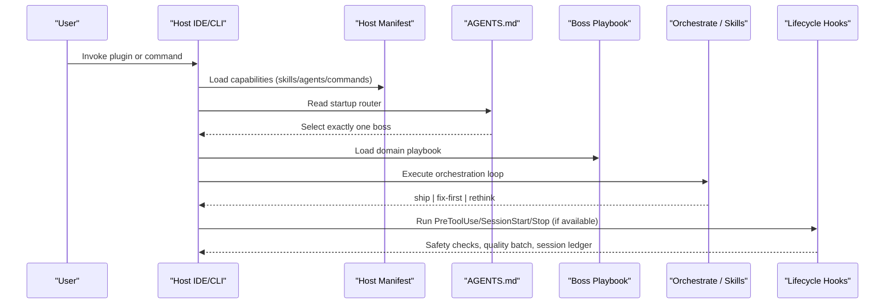
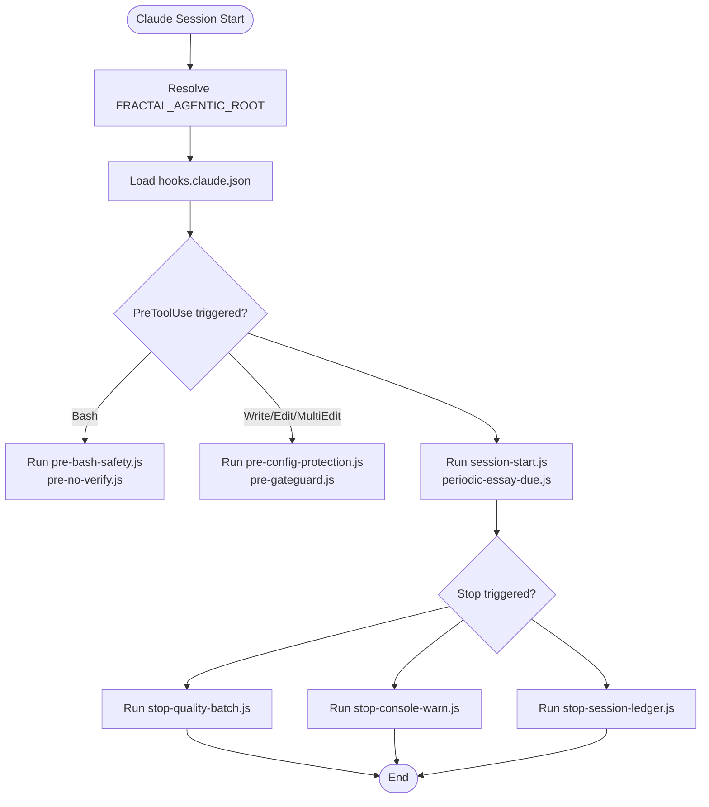
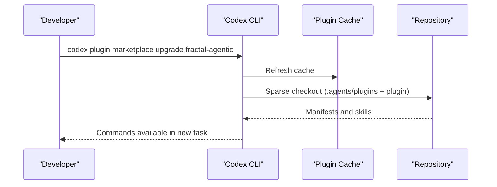
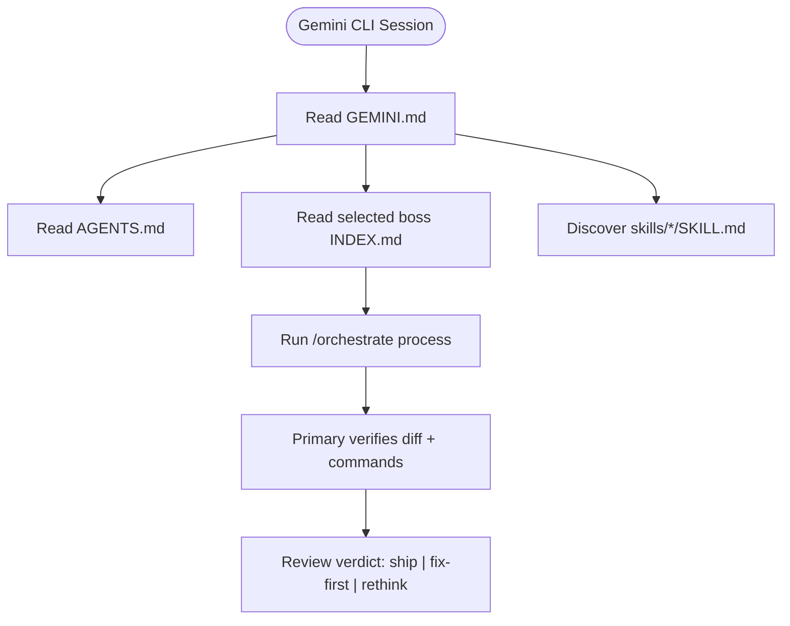
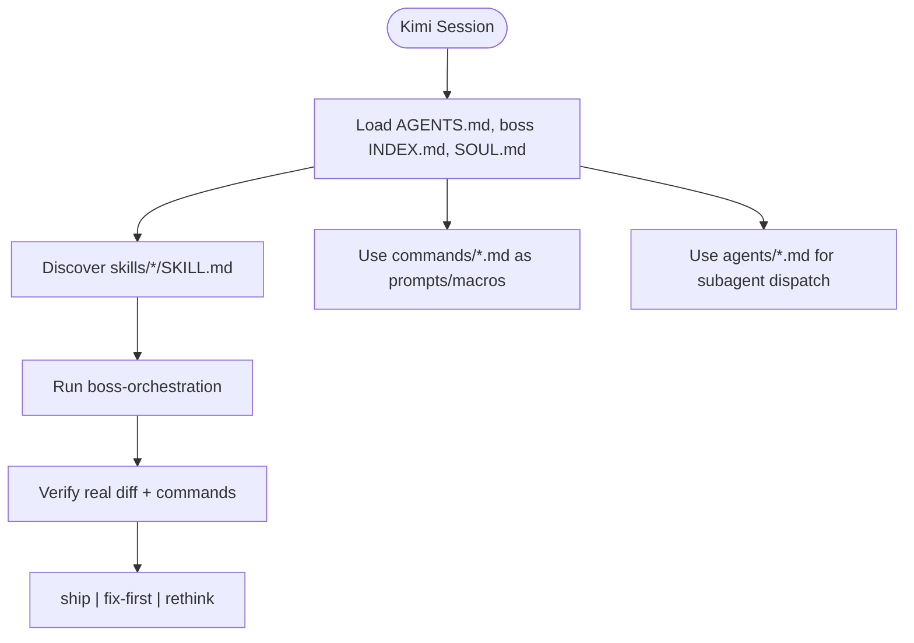
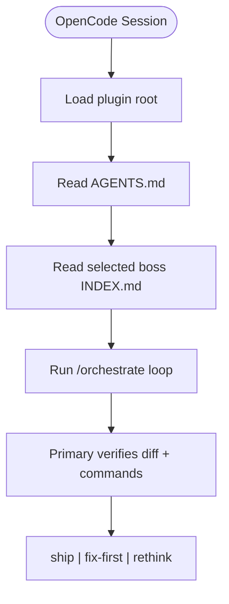
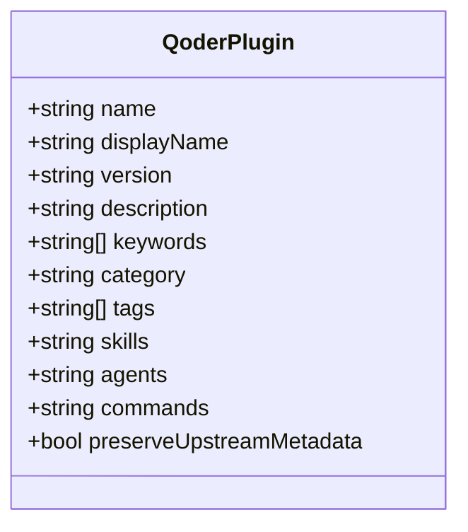
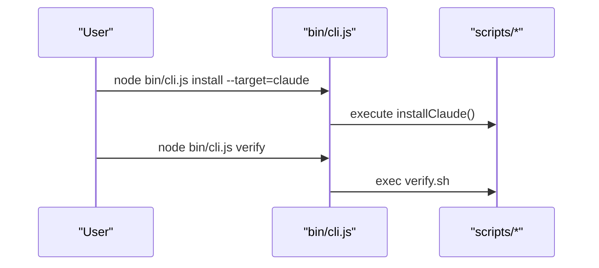
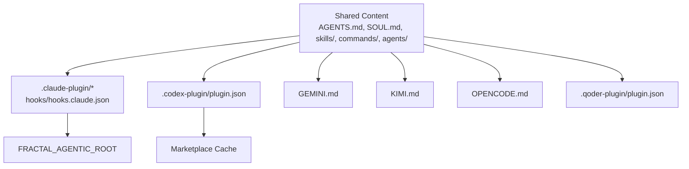

<cite>
**Referenced Files in This Document**
- `fractal-agentic/.claude-plugin/marketplace.json`
- `fractal-agentic/.claude-plugin/plugin.json`
- `fractal-agentic/.codex-plugin/plugin.json`
- `fractal-agentic/GEMINI.md`
- `fractal-agentic/KIMI.md`
- `fractal-agentic/OPENCODE.md`
- `fractal-agentic/AGENTS.md`
- `fractal-agentic/SOUL.md`
- `fractal-agentic/.fractal-agentic/hooks.claude.json`
- `fractal-agentic/hooks/hooks.claude.json`
- `fractal-agentic/hooks/hooks.cursor.json`
- `fractal-agentic-qoder-plugin/.qoder-plugin/plugin.json`
- `fractal-agentic-qoder-plugin/QODER-README.md`
- `fractal-agentic/bin/cli.js`
- `fractal-agentic/docs/troubleshooting.md`
</cite>

## Table of Contents
1. [Introduction](#introduction)
2. [Project Structure](#project-structure)
3. [Core Components](#core-components)
4. [Architecture Overview](#architecture-overview)
5. [Detailed Component Analysis](#detailed-component-analysis)
6. [Dependency Analysis](#dependency-analysis)
7. [Performance Considerations](#performance-considerations)
8. [Troubleshooting Guide](#troubleshooting-guide)
9. [Conclusion](#conclusion)

## Introduction
This document explains platform-specific integrations for Fractal Agentic across Claude Code, Codex, Google Antigravity (Gemini CLI), Kimi, OpenCode, and Qoder. It covers marketplace setup, command availability, IDE-specific behaviors, environment variables, authentication and permissions, performance characteristics, and troubleshooting strategies tailored to each host.

## Project Structure
Fractal Agentic is a host-agnostic plugin with optional adapters per platform:
- Claude Code: .claude-plugin manifests and hooks
- Codex: .codex-plugin manifest and marketplace integration
- Gemini CLI (Antigravity): GEMINI.md shim for skill discovery and runtime guidance
- Kimi: KIMI.md shim for Agent Skills and commands
- OpenCode: OPENCODE.md shim for generic agent environments
- Qoder: .qoder-plugin manifest and README

**Diagram sources**
- `fractal-agentic/.claude-plugin/plugin.json`
- `fractal-agentic/.claude-plugin/marketplace.json`
- `fractal-agentic/.codex-plugin/plugin.json`
- `fractal-agentic/GEMINI.md`
- `fractal-agentic/KIMI.md`
- `fractal-agentic/OPENCODE.md`
- `fractal-agentic-qoder-plugin/.qoder-plugin/plugin.json`
- `fractal-agentic-qoder-plugin/QODER-README.md`

**Section sources**
- `fractal-agentic/AGENTS.md`
- `fractal-agentic/SOUL.md`

## Core Components
- Startup router and boss selection: AGENTS.md defines the one-boss routing and handoffs.
- Portable identity and principles: SOUL.md provides cross-harness behavior rules.
- Host shims: GEMINI.md, KIMI.md, OPENCODE.md tailor discovery and delivery patterns per host.
- Plugin manifests: .claude-plugin, .codex-plugin, .qoder-plugin define capabilities, skills, agents, and commands exposed by each host.
- Hooks: Claude/Cursor hook definitions enable lifecycle automation where supported.

**Section sources**
- `fractal-agentic/AGENTS.md`
- `fractal-agentic/SOUL.md`
- `fractal-agentic/GEMINI.md`
- `fractal-agentic/KIMI.md`
- `fractal-agentic/OPENCODE.md`
- `fractal-agentic/.claude-plugin/plugin.json`
- `fractal-agentic/.codex-plugin/plugin.json`
- `fractal-agentic-qoder-plugin/.qoder-plugin/plugin.json`

## Architecture Overview
The plugin exposes a consistent orchestration surface across hosts while allowing host-specific features like marketplace listings, slash commands, and lifecycle hooks.

**Diagram sources**
- `fractal-agentic/AGENTS.md`
- `fractal-agentic/.claude-plugin/plugin.json`
- `fractal-agentic/.codex-plugin/plugin.json`
- `fractal-agentic-qoder-plugin/.qoder-plugin/plugin.json`
- `fractal-agentic/hooks/hooks.claude.json`

## Detailed Component Analysis

### Claude Code Integration
- Marketplace setup: The .claude-plugin/marketplace.json registers the plugin name, owner, description, and version for marketplace distribution.
- Plugin metadata: .claude-plugin/plugin.json declares name, version, description, author, homepage, repository, license, and keywords.
- Command availability: Commands are discovered from the commands directory; slash commands are surfaced when the plugin root is loaded.
- IDE-specific behaviors:
  - Hooks: hooks/hooks.claude.json and .fractal-agentic/hooks.claude.json define PreToolUse, SessionStart, Stop events with bounded timeouts and safety scripts.
  - FRACTAL_AGENTIC_ROOT must be set so hooks resolve paths correctly.
- Authentication and permissions:
  - Use host-managed auth; do not embed secrets.
  - Hook scripts enforce safety (e.g., blocking destructive shell patterns).
- Performance characteristics:
  - Hooks run with strict timeouts to avoid blocking sessions.
  - Quality-batch runs best-effort typechecks on stop.

**Diagram sources**
- `fractal-agentic/hooks/hooks.claude.json`
- `fractal-agentic/.fractal-agentic/hooks.claude.json`

**Section sources**
- `fractal-agentic/.claude-plugin/marketplace.json`
- `fractal-agentic/.claude-plugin/plugin.json`
- `fractal-agentic/hooks/hooks.claude.json`
- `fractal-agentic/.fractal-agentic/hooks.claude.json`

### Codex Plugin Configuration
- Capability exposure: .codex-plugin/plugin.json defines displayName, shortDescription, longDescription, defaultPrompt, skills path, and keywords.
- Marketplace integration: Ensure sparse checkout includes both .agents/plugins and plugin directories; use codex plugin marketplace upgrade after pushes.
- Command availability: Commands under commands/*.md are discoverable; ensure cache refresh and new task/session after updates.
- Environment variables: FRACTAL_AGENTIC_ROOT should point to the plugin root for scripts resolution.
- Security considerations: Do not rely on vendor-specific marketplaces for basic use; readable AGENTS.md + skills is sufficient.

**Diagram sources**
- `fractal-agentic/.codex-plugin/plugin.json`
- `fractal-agentic/docs/troubleshooting.md`

**Section sources**
- `fractal-agentic/.codex-plugin/plugin.json`
- `fractal-agentic/docs/troubleshooting.md`

### Google Antigravity (Gemini CLI) Integration Patterns
- Shim usage: GEMINI.md instructs loading this project as a plugin root with AGENTS.md, selected boss INDEX.md, and skills discovery.
- Operating rules: Prefer local stack detection, use /orchestrate even without slash commands, handle missing capability pins gracefully.
- Skills discovery: Gemini CLI discovers skills under skills/*/SKILL.md when the project is on the skill path.
- Environment variables: FRACTAL_AGENTIC_ROOT can be used to resolve plugin root for scripts.

**Diagram sources**
- `fractal-agentic/GEMINI.md`
- `fractal-agentic/AGENTS.md`

**Section sources**
- `fractal-agentic/GEMINI.md`
- `fractal-agentic/AGENTS.md`

### Kimi Integration
- What to load: AGENTS.md, one boss INDEX.md, SOUL.md; skills under skills/*/SKILL.md; commands under commands/*.md; agents under agents/*.md.
- Install notes: Point host project skills root at plugin directory; TOML agent templates optional via install-agents.sh.
- Delivery: Follow AGENTS.md → one boss playbook → boss-orchestration; non-blocking pins and five-part contracts when delegating.
- Health: Use resolve-plugin-root.sh and check-armory.sh with FRACTAL_AGENTIC_ROOT.

**Diagram sources**
- `fractal-agentic/KIMI.md`
- `fractal-agentic/AGENTS.md`

**Section sources**
- `fractal-agentic/KIMI.md`
- `fractal-agentic/AGENTS.md`

### OpenCode Integration
- Point host at plugin directory as skill and instruction root.
- Delivery treats non-trivial changes as an orchestrate loop: select boss, set capability mode, implement, verify, review.
- Environment: Set FRACTAL_AGENTIC_ROOT and run resolve-plugin-root.sh.
- Optional hooks: If host supports PreToolUse/Stop, see hooks/README.md.

**Diagram sources**
- `fractal-agentic/OPENCODE.md`
- `fractal-agentic/AGENTS.md`

**Section sources**
- `fractal-agentic/OPENCODE.md`
- `fractal-agentic/AGENTS.md`

### Qoder Plugin Setup
- Manifest: .qoder-plugin/plugin.json lists displayName, version, description, skills, agents, commands, and preserves upstream metadata.
- README: QODER-README.md outlines components, omitted files (Claude/Cursor hooks preserved but not activated), and validation steps.
- Setup: Set FRACTAL_AGENTIC_ROOT; run install-agents.sh if host supports custom agents; stack defaults apply when monorepo detected.

**Diagram sources**
- `fractal-agentic-qoder-plugin/.qoder-plugin/plugin.json`
- `fractal-agentic-qoder-plugin/QODER-README.md`

**Section sources**
- `fractal-agentic-qoder-plugin/.qoder-plugin/plugin.json`
- `fractal-agentic-qoder-plugin/QODER-README.md`

### Installer and Cross-Platform Bootstrapping
- CLI entrypoint: bin/cli.js orchestrates installation targets including antigravity, claude, and codex; supports --target and --project flags.
- Verification: verify command delegates to scripts/verify.sh.

**Diagram sources**
- `fractal-agentic/bin/cli.js`

**Section sources**
- `fractal-agentic/bin/cli.js`

## Dependency Analysis
- Host manifests depend on shared content: AGENTS.md, SOUL.md, skills/, commands/, agents/.
- Hooks depend on FRACTAL_AGENTIC_ROOT for path resolution.
- Troubleshooting flows reference health scripts and progression policies.

**Diagram sources**
- `fractal-agentic/AGENTS.md`
- `fractal-agentic/SOUL.md`
- `fractal-agentic/.claude-plugin/plugin.json`
- `fractal-agentic/.codex-plugin/plugin.json`
- `fractal-agentic/GEMINI.md`
- `fractal-agentic/KIMI.md`
- `fractal-agentic/OPENCODE.md`
- `fractal-agentic-qoder-plugin/.qoder-plugin/plugin.json`

**Section sources**
- `fractal-agentic/docs/troubleshooting.md`

## Performance Considerations
- Non-blocking policy: Missing pins, hooks, marketplace, or wiki never freeze product work; degrade and continue.
- Hook timeouts: All hooks have bounded timeouts to prevent session stalls.
- Best-effort verification: Quality-batch runs only when project scripts exist; console warnings are captured without blocking.
- Skill discovery: Prefer description-driven activation; avoid inventing agent types not present in the session catalog.

[No sources needed since this section provides general guidance]

## Troubleshooting Guide
- Quick health: Use resolve-plugin-root.sh, check-armory.sh, check-nonblocking-policy.sh with FRACTAL_AGENTIC_ROOT.
- Multi-host install issues:
  - Codex: Ensure sparse checkout includes .agents/plugins and plugin; upgrade marketplace and open a new task.
  - Claude-compatible hosts: Load plugin directory for commands; ensure hooks are registered.
  - Cursor: Paste AGENTS snippet and set FRACTAL_AGENTIC_ROOT.
  - Gemini/Kimi: Point skill path at plugin/skills or open plugin root as project.
- Pins/orchestration: Confirm capability_mode; run install-agents.sh --check; non-blocking policy forbids freezes.
- Hooks: Adjust profiles via FRACTAL_HOOK_PROFILE; disable specific hooks via FRACTAL_DISABLED_HOOKS when necessary.
- Wiki: Initialize with /wiki-init or set FRACTAL_WIKI_ROOT; share one wiki_root across tools.
- Skills/agents not triggering: Ensure host skill discovery includes plugin/skills; re-read startup router and boss hub.

**Section sources**
- `fractal-agentic/docs/troubleshooting.md`
- `fractal-agentic/hooks/hooks.claude.json`
- `fractal-agentic/hooks/hooks.cursor.json`

## Conclusion
Fractal Agentic provides a unified orchestration layer across multiple platforms with host-specific adapters. By following the startup router, leveraging skills and commands, and using platform-appropriate manifests and hooks, teams can achieve consistent delivery workflows. Adhering to non-blocking policies, setting FRACTAL_AGENTIC_ROOT, and using the provided health and troubleshooting scripts ensures reliable operation across Claude Code, Codex, Gemini CLI, Kimi, OpenCode, and Qoder.