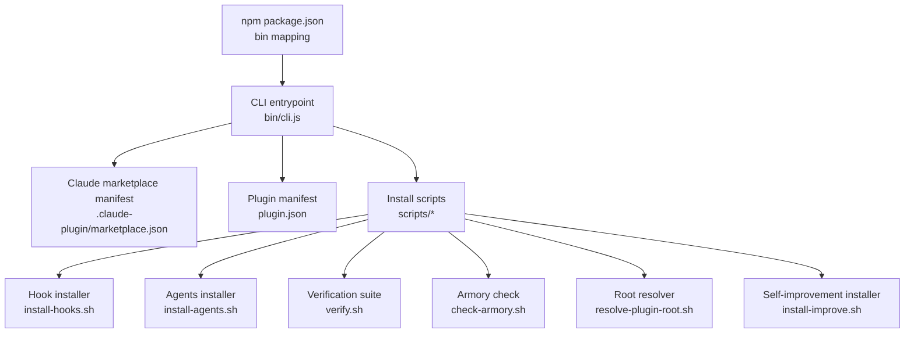
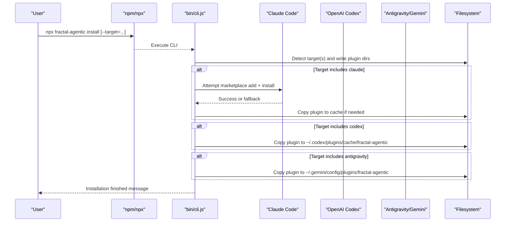
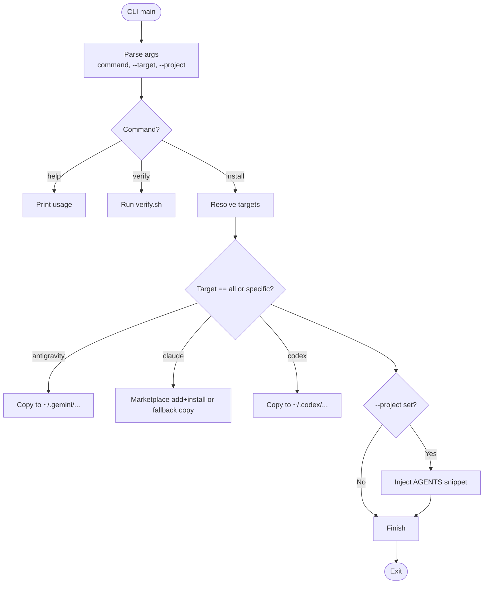
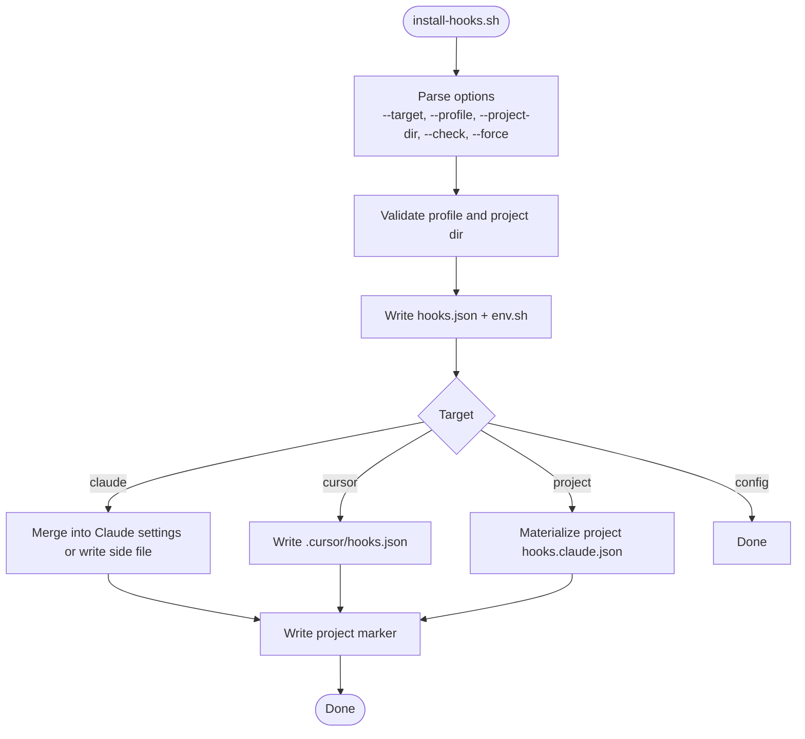
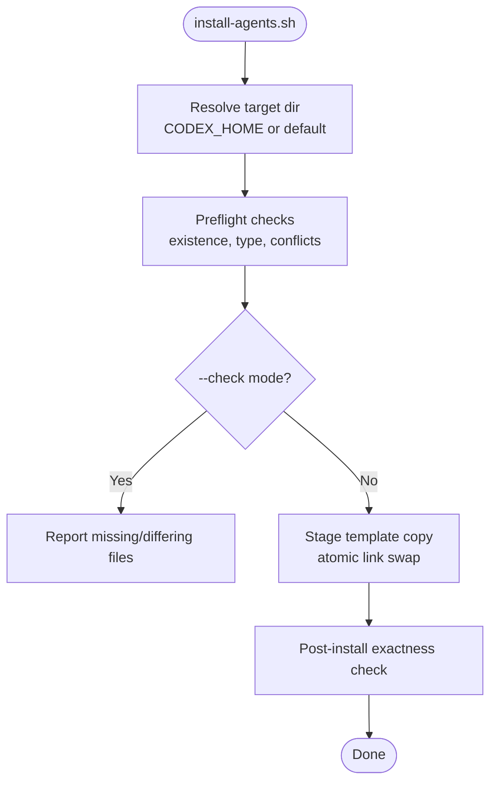
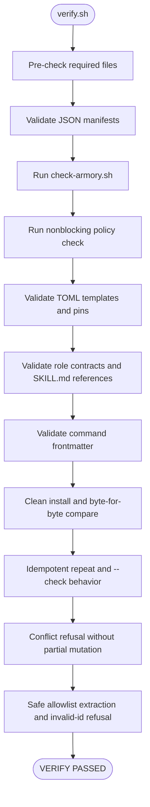
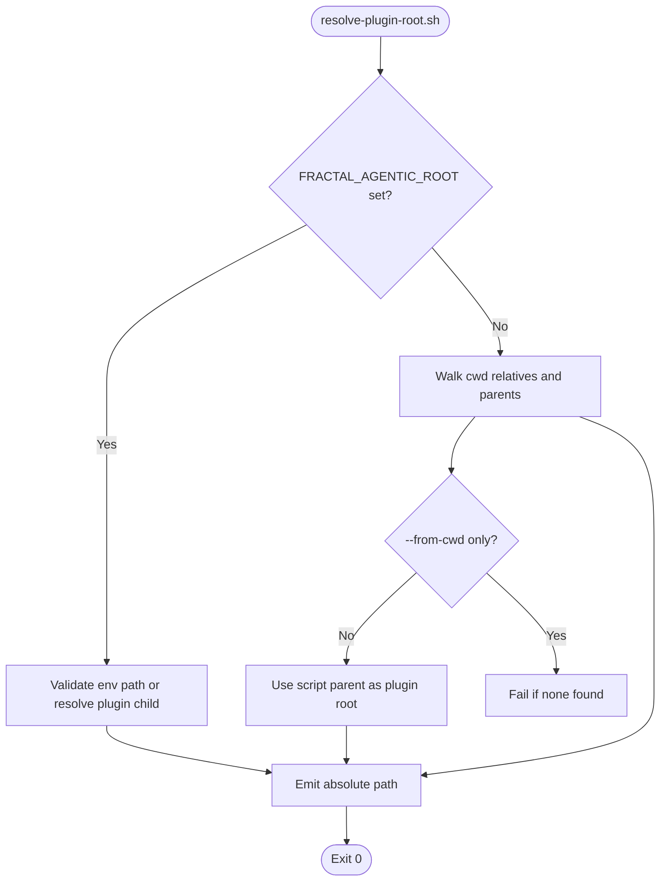
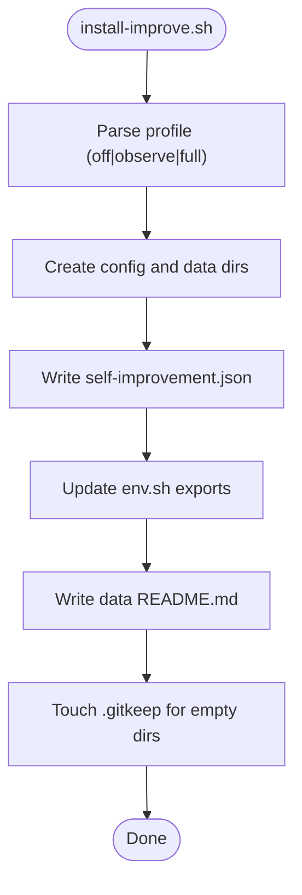
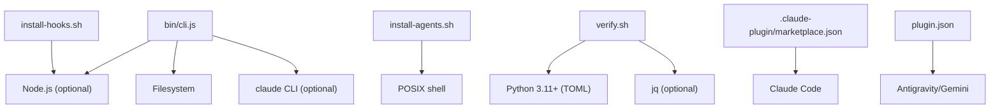

<cite>
**Referenced Files in This Document**
- `fractal-agentic/package.json`
- `fractal-agentic/bin/cli.js`
- `fractal-agentic/docs/02-install.md`
- `fractal-agentic/scripts/install-hooks.sh`
- `fractal-agentic/scripts/install-agents.sh`
- `fractal-agentic/scripts/verify.sh`
- `fractal-agentic/scripts/check-armory.sh`
- `fractal-agentic/scripts/resolve-plugin-root.sh`
- `fractal-agentic/scripts/install-improve.sh`
- `fractal-agentic/docs/hooks.md`
- `fractal-agentic/docs/troubleshooting.md`
- `fractal-agentic/TROUBLESHOOTING.md`
- `fractal-agentic/hooks/profiles.json`
- `fractal-agentic/plugin.json`
- `fractal-agentic/.claude-plugin/marketplace.json`
</cite>

## Table of Contents
1. Introduction
2. Project Structure
3. Core Components
4. Architecture Overview
5. Detailed Component Analysis
6. Dependency Analysis
7. Performance Considerations
8. Troubleshooting Guide
9. Conclusion
10. Appendices

## Introduction
This document explains how Fractal Agentic is distributed and installed across multiple environments, including CLI-based installation via npm/npx, package manager integration for Claude Code and OpenAI Codex, manual installation workflows, and optional hook and self-improvement plane setup. It covers environment-specific configuration, prerequisite checks, dependency resolution, permission requirements, security considerations, enterprise deployment scenarios (including air-gapped), and automation examples.

## Project Structure
Fractal Agentic ships as an npm package with a Node CLI entrypoint and host-specific manifests:
- The npm package exposes the CLI command through the bin mapping.
- Host catalogs are provided for Claude Code and Codex marketplaces.
- A plugin manifest defines capabilities and skills binding for generic hosts like Antigravity/Gemini.
- Scripts provide installers, verifiers, and health checks.

**Diagram sources**
- `fractal-agentic/package.json#L1-L59`
- `fractal-agentic/bin/cli.js#L1-L148`
- `fractal-agentic/.claude-plugin/marketplace.json#L1-L19`
- `fractal-agentic/plugin.json#L1-L31`
- `fractal-agentic/scripts/install-hooks.sh#L1-L380`
- `fractal-agentic/scripts/install-agents.sh#L1-L180`
- `fractal-agentic/scripts/verify.sh#L1-L274`
- `fractal-agentic/scripts/check-armory.sh#L1-L143`
- `fractal-agentic/scripts/resolve-plugin-root.sh#L1-L140`
- `fractal-agentic/scripts/install-improve.sh#L1-L264`

**Section sources**
- `fractal-agentic/package.json#L1-L59`
- `fractal-agentic/docs/02-install.md#L1-L198`

## Core Components
- CLI Installer (npx): Discovers hosts and installs plugins to appropriate directories; supports targeted installation and project snippet injection.
- Hook Installer: Configures lifecycle hooks for supported hosts and projects; writes preferences and environment snippets.
- Agents Installer: Copies custom agent templates into Codex-compatible locations without modifying host config.
- Verification Suite: Validates manifests, TOML pins, contracts, commands, and idempotency of installers.
- Armory Check: Ensures required files and structure exist for orchestration and skills.
- Root Resolver: Resolves the plugin root from environment variables, cwd, or script location.
- Self-Improvement Installer: Sets up optional learning data directories and configuration profiles.

**Section sources**
- `fractal-agentic/bin/cli.js#L1-L148`
- `fractal-agentic/scripts/install-hooks.sh#L1-L380`
- `fractal-agentic/scripts/install-agents.sh#L1-L180`
- `fractal-agentic/scripts/verify.sh#L1-L274`
- `fractal-agentic/scripts/check-armory.sh#L1-L143`
- `fractal-agentic/scripts/resolve-plugin-root.sh#L1-L140`
- `fractal-agentic/scripts/install-improve.sh#L1-L264`

## Architecture Overview
The distribution architecture supports multiple channels:
- npm/npx CLI for cross-host installation and project integration.
- Marketplace integrations for Claude Code and Codex.
- Manual installation for development or constrained environments.
- Optional hooks and self-improvement planes for enhanced workflows.

**Diagram sources**
- `fractal-agentic/bin/cli.js#L1-L148`
- `fractal-agentic/docs/02-install.md#L1-L198`

## Detailed Component Analysis

### CLI Installer (npx)
- Entry point defines usage, options, and commands (install, verify, help).
- Supports --target filtering (antigravity, claude, codex, all) and --project to inject AGENTS snippet.
- For Claude, attempts marketplace registration; falls back to copying into cache directory.
- For Codex and Antigravity, copies plugin content to host-specific directories.
- Excludes repository/packaging artifacts during copy.

**Diagram sources**
- `fractal-agentic/bin/cli.js#L1-L148`

**Section sources**
- `fractal-agentic/bin/cli.js#L1-L148`
- `fractal-agentic/package.json#L1-L59`

### Hook Installation
- Writes user preferences under XDG config and env snippet for shell sourcing.
- Merges hooks into Claude settings when safe; otherwise writes side-by-side file and materializes absolute paths for project use.
- Supports profiles (minimal, standard, strict) controlling which hooks run.
- Cursor integration writes project-local hooks configuration.
- Non-blocking behavior ensures product work continues even if hooks fail.

**Diagram sources**
- `fractal-agentic/scripts/install-hooks.sh#L1-L380`
- `fractal-agentic/hooks/profiles.json#L1-L38`

**Section sources**
- `fractal-agentic/scripts/install-hooks.sh#L1-L380`
- `fractal-agentic/docs/hooks.md#L1-L128`
- `fractal-agentic/hooks/profiles.json#L1-L38`

### Agents Installation (Codex)
- Installs three custom-agent templates into Codex agents directory without editing host config.
- Uses strict preflight checks to avoid overwriting differing files.
- Supports explicit target directory and CODEX_HOME detection.
- Idempotent and safe; verifies exactness post-install.

**Diagram sources**
- `fractal-agentic/scripts/install-agents.sh#L1-L180`

**Section sources**
- `fractal-agentic/scripts/install-agents.sh#L1-L180`

### Verification Suite
- Validates JSON manifests, TOML templates, role contracts, command frontmatter, and installer behavior.
- Runs clean install tests, idempotency checks, conflict refusal, and runtime inspector safety.
- Provides pass/fail reporting and exits non-zero on failures.

**Diagram sources**
- `fractal-agentic/scripts/verify.sh#L1-L274`
- `fractal-agentic/scripts/check-armory.sh#L1-L143`

**Section sources**
- `fractal-agentic/scripts/verify.sh#L1-L274`

### Root Resolver
- Resolves plugin root from environment variable, cwd walk-up, or script location.
- Rejects incomplete progressive-discovery trees and validates plugin identity.
- Supports monorepo layouts and convenience fallbacks.

**Diagram sources**
- `fractal-agentic/scripts/resolve-plugin-root.sh#L1-L140`

**Section sources**
- `fractal-agentic/scripts/resolve-plugin-root.sh#L1-L140`

### Self-Improvement Installer
- Creates config and data directories under XDG paths.
- Writes configuration with profile and options; updates env snippet.
- Provides README and markers for empty directories.

**Diagram sources**
- `fractal-agentic/scripts/install-improve.sh#L1-L264`

**Section sources**
- `fractal-agentic/scripts/install-improve.sh#L1-L264`

## Dependency Analysis
- The CLI depends on Node.js runtime and filesystem access; it may call external tools (e.g., claude CLI) when available.
- Hook and agents installers rely on POSIX shell utilities and optionally Node.js for JSON manipulation.
- Verification suite uses Python 3.11+ for TOML validation and jq for JSON processing where available.
- Marketplace manifests define source paths for host discovery.

**Diagram sources**
- `fractal-agentic/bin/cli.js#L1-L148`
- `fractal-agentic/scripts/install-hooks.sh#L1-L380`
- `fractal-agentic/scripts/install-agents.sh#L1-L180`
- `fractal-agentic/scripts/verify.sh#L1-L274`
- `fractal-agentic/.claude-plugin/marketplace.json#L1-L19`
- `fractal-agentic/plugin.json#L1-L31`

**Section sources**
- `fractal-agentic/bin/cli.js#L1-L148`
- `fractal-agentic/scripts/install-hooks.sh#L1-L380`
- `fractal-agentic/scripts/install-agents.sh#L1-L180`
- `fractal-agentic/scripts/verify.sh#L1-L274`
- `fractal-agentic/.claude-plugin/marketplace.json#L1-L19`
- `fractal-agentic/plugin.json#L1-L31`

## Performance Considerations
- Installation scripts are designed to be fast and non-blocking; they avoid heavy dependencies and perform minimal filesystem operations.
- Use --check modes to validate state without mutation, reducing overhead in CI pipelines.
- Prefer targeted installations (--target) to minimize unnecessary writes.
- Avoid repeated marketplace calls by caching plugin roots locally when possible.

## Troubleshooting Guide
Common issues and resolutions:
- Root resolution failures: Ensure FRACTAL_AGENTIC_ROOT points to the plugin directory containing plugin.json and AGENTS.md.
- Marketplace manifest missing for Codex: Include both .agents/plugins and plugin in sparse checkout.
- Hooks not triggering: Confirm host registers hooks and environment variables are set; restart the host.
- Pins not exposed mid-session: Disk install succeeded but session needs a new task; continue coding degraded.
- Permission errors: Ensure write permissions to target directories (user home, XDG paths); avoid running as root unless necessary.
- Network connectivity problems: When using marketplace commands, ensure network access; fall back to manual copy for air-gapped setups.

Recommended quick health checks:
- Resolve plugin root and run armory and nonblocking policy checks.
- Use verify.sh to validate core assets and installer behavior.

**Section sources**
- `fractal-agentic/docs/troubleshooting.md#L1-L143`
- `fractal-agentic/TROUBLESHOOTING.md#L1-L27`
- `fractal-agentic/docs/02-install.md#L1-L198`

## Conclusion
Fractal Agentic provides robust, multi-channel distribution and installation mechanisms tailored for diverse environments. The CLI installer streamlines setup across hosts, while optional hooks and self-improvement features enhance workflow safety and learning. Verification and health scripts ensure reliability, and troubleshooting guidance helps operators resolve common issues quickly. Enterprise deployments can leverage manual installation and air-gapped strategies, with automation scripts supporting consistent, repeatable setups.

## Appendices

### Environment-Specific Configuration
- Claude Code: Use marketplace commands or manual copy; ensure plugin directory is loaded; restart after enabling.
- OpenAI Codex: Use marketplace add with sparse flags; installed under cache directory; new task may be required for spawn types.
- Antigravity/Gemini: Point skill path at plugin/skills or open plugin root as project; auto-detects skills and startup router.

**Section sources**
- `fractal-agentic/docs/02-install.md#L1-L198`

### Prerequisite Checks and Dependency Resolution
- Node.js for CLI and some scripts; Python 3.11+ for TOML validation in verification; jq optional for JSON processing.
- XDG-compliant paths used for config and data; HOME and XDG_CONFIG_HOME/XDG_DATA_HOME respected.
- FRACTAL_AGENTIC_ROOT must point to plugin root; resolver validates presence of required files.

**Section sources**
- `fractal-agentic/scripts/verify.sh#L1-L274`
- `fractal-agentic/scripts/resolve-plugin-root.sh#L1-L140`

### Hook Installation Procedures and Profiles
- Profiles control hook sets: minimal, standard, strict.
- Safe merging into Claude settings; side-by-side file written when existing hooks present.
- Cursor project hooks written locally; project marker tracks installation state.

**Section sources**
- `fractal-agentic/scripts/install-hooks.sh#L1-L380`
- `fractal-agentic/hooks/profiles.json#L1-L38`
- `fractal-agentic/docs/hooks.md#L1-L128`

### Permission Requirements and Security Considerations
- Write permissions required for target directories (user home, XDG paths).
- Avoid running installers as root; prefer user-level installs.
- Hooks enforce safety policies (e.g., blocking destructive commands); disable selectively via environment variables if necessary.
- Data stays local by default; export only what you choose.

**Section sources**
- `fractal-agentic/scripts/install-hooks.sh#L1-L380`
- `fractal-agentic/scripts/install-improve.sh#L1-L264`
- `fractal-agentic/docs/hooks.md#L1-L128`

### Enterprise Deployment Scenarios and Air-Gapped Environments
- Manual Git clone and symlink/copy plugin to host-specific directories.
- Pre-stage marketplace manifests and plugin archives; use offline installers.
- Configure FRACTAL_AGENTIC_ROOT explicitly; run verification suite in CI to ensure correctness.
- Use --check modes to validate state without mutation.

**Section sources**
- `fractal-agentic/docs/02-install.md#L1-L198`
- `fractal-agentic/scripts/verify.sh#L1-L274`

### Automated Installation Scripts and Deployment Automation
- Example commands:
  - npx fractal-agentic install [--target=...]
  - sh scripts/install-hooks.sh --target all --profile minimal
  - sh scripts/install-agents.sh --target-dir <path>
  - sh scripts/verify.sh
- Integrate into CI/CD pipelines using --check modes and exit codes.
- Source env.sh in shell sessions or configure GUI apps with environment variables.

**Section sources**
- `fractal-agentic/docs/02-install.md#L1-L198`
- `fractal-agentic/docs/hooks.md#L1-L128`
- `fractal-agentic/scripts/verify.sh#L1-L274`