<cite>
**Referenced Files in This Document**
- `fractal-agentic/plugin.json`
- `fractal-agentic/.claude-plugin/plugin.json`
- `fractal-agentic/.claude-plugin/marketplace.json`
- `fractal-agentic/.claude-plugin/PLUGIN_SCHEMA_NOTES.md`
- `fractal-agentic/hooks/hooks.claude.json`
- `fractal-agentic/.fractal-agentic/hooks-installed.json`
- `fractal-agentic/scripts/resolve-plugin-root.sh`
- `fractal-agentic/scripts/verify.sh`
- `fractal-agentic/scripts/check-nonblocking-policy.sh`
- `fractal-agentic/docs/01-getting-started.md`
- `fractal-agentic/docs/02-install.md`
- `fractal-agentic/docs/troubleshooting.md`
- `fractal-agentic/skills/boss-orchestration/references/capability-mode.md`
- `fractal-agentic/docs/DEGRADATION.md`
- `fractal-agentic/hooks/README.md`
- `fractal-agentic/hooks/scripts/lib.js`
</cite>

## Table of Contents
1. [Introduction](#introduction)
2. [Project Structure](#project-structure)
3. [Core Components](#core-components)
4. [Architecture Overview](#architecture-overview)
5. [Detailed Component Analysis](#detailed-component-analysis)
6. [Dependency Analysis](#dependency-analysis)
7. [Performance Considerations](#performance-considerations)
8. [Troubleshooting Guide](#troubleshooting-guide)
9. [Conclusion](#conclusion)
10. [Appendices](#appendices)

## Introduction
This document defines the plugin API for host platform integration and marketplace deployment. It specifies the plugin manifest schema, capability declarations, dependency management, host discovery mechanisms, version compatibility checks, installation procedures, marketplace integration patterns, lifecycle methods, event handling, communication protocols, schemas, security considerations, sandboxing requirements, performance strategies, and practical development/deployment workflows. The content is grounded in the repository’s manifests, hooks configuration, installer scripts, and documentation.

## Project Structure
The installable unit is the plugin directory containing:
- Root manifest with metadata and capability bindings
- Host-specific manifests for Claude Code and Codex
- Marketplace catalog entries
- Optional hooks configuration and scripts
- Scripts to resolve plugin root and verify integrity

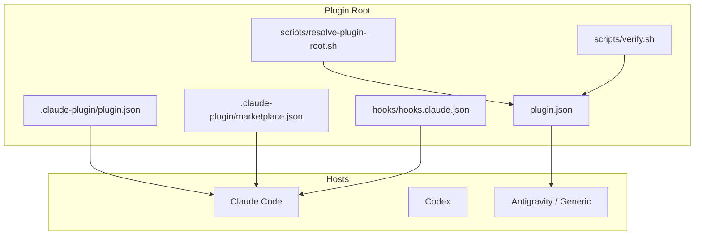

**Diagram sources**
- `fractal-agentic/plugin.json#L1-L31`
- `fractal-agentic/.claude-plugin/plugin.json#L1-L20`
- `fractal-agentic/.claude-plugin/marketplace.json#L1-L19`
- `fractal-agentic/hooks/hooks.claude.json#L1-L87`
- `fractal-agentic/scripts/resolve-plugin-root.sh#L1-L140`
- `fractal-agentic/scripts/verify.sh#L67-L101`

**Section sources**
- `fractal-agentic/docs/02-install.md#L59-L69`
- `fractal-agentic/CUSTOMIZE.md#L49-L77`

## Core Components
- Plugin Manifest (root): Declares name, version, description, author, homepage, repository, license, interface display fields, skills path, and keywords.
- Host-specific Manifests: Lean identity files for Claude Code and Codex; keep minimal to avoid validator rejections.
- Marketplace Catalog: Lists plugins with source paths, descriptions, versions, and authors for host marketplaces.
- Hooks Configuration: Event-driven automations mapped to host hook events with command-based handlers and timeouts.
- Root Resolution Script: Discovers the plugin root from environment, cwd walk-up, or script location.
- Verification Script: Validates JSON manifests and critical assets exist.

Key responsibilities:
- Metadata and UI presentation via manifests
- Capability exposure via skills binding and agent pins
- Lifecycle and safety via hooks
- Discovery and validation via scripts

**Section sources**
- `fractal-agentic/plugin.json#L1-L31`
- `fractal-agentic/.claude-plugin/plugin.json#L1-L20`
- `fractal-agentic/.claude-plugin/marketplace.json#L1-L19`
- `fractal-agentic/.claude-plugin/PLUGIN_SCHEMA_NOTES.md#L1-L22`
- `fractal-agentic/hooks/hooks.claude.json#L1-L87`
- `fractal-agentic/scripts/resolve-plugin-root.sh#L1-L140`
- `fractal-agentic/scripts/verify.sh#L67-L101`

## Architecture Overview
The plugin integrates with multiple hosts through distinct manifests and a shared runtime. Discovery uses environment variables and filesystem heuristics. Installation can be performed via NPX or host marketplace commands. Hooks provide optional session automation and safety gates.

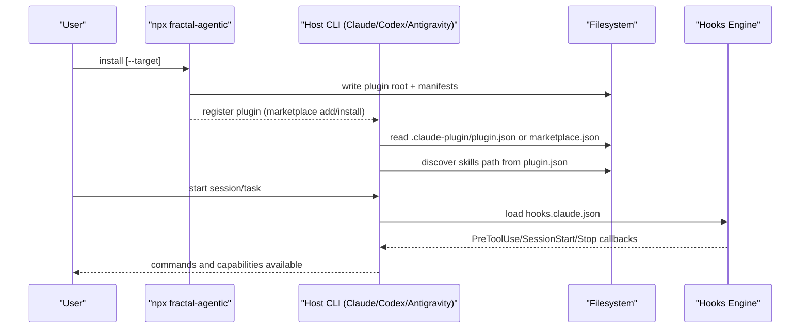

**Diagram sources**
- `fractal-agentic/docs/01-getting-started.md#L1-L59`
- `fractal-agentic/docs/02-install.md#L1-L100`
- `fractal-agentic/.claude-plugin/plugin.json#L1-L20`
- `fractal-agentic/.claude-plugin/marketplace.json#L1-L19`
- `fractal-agentic/hooks/hooks.claude.json#L1-L87`

## Detailed Component Analysis

### Plugin Manifest Schema
Root manifest fields:
- name: string (required)
- version: string (required)
- description: string
- author: object { name: string }
- homepage: string
- repository: string
- license: string
- interface: object { displayName, shortDescription, longDescription, defaultPrompt[] }
- skills: string (path to skills directory)
- keywords: string[]

Host-specific manifests should remain lean to avoid unknown field rejection.

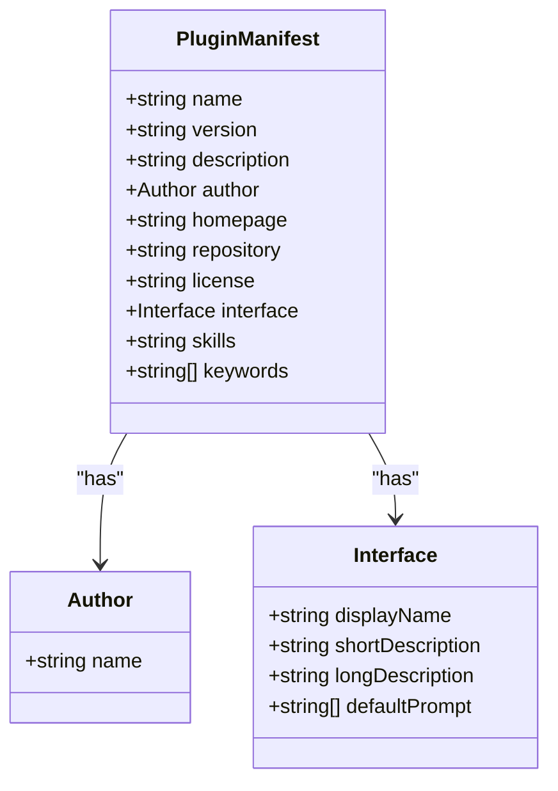

**Diagram sources**
- `fractal-agentic/plugin.json#L1-L31`
- `fractal-agentic/.claude-plugin/PLUGIN_SCHEMA_NOTES.md#L1-L22`

**Section sources**
- `fractal-agentic/plugin.json#L1-L31`
- `fractal-agentic/.claude-plugin/plugin.json#L1-L20`
- `fractal-agentic/.claude-plugin/PLUGIN_SCHEMA_NOTES.md#L1-L22`

### Marketplace Integration
Marketplace catalog structure includes:
- name: string
- owner: object { name: string }
- description: string
- plugins: array of { name, source, description, version, author }

Source points to the plugin directory. Hosts use this to list and install plugins.

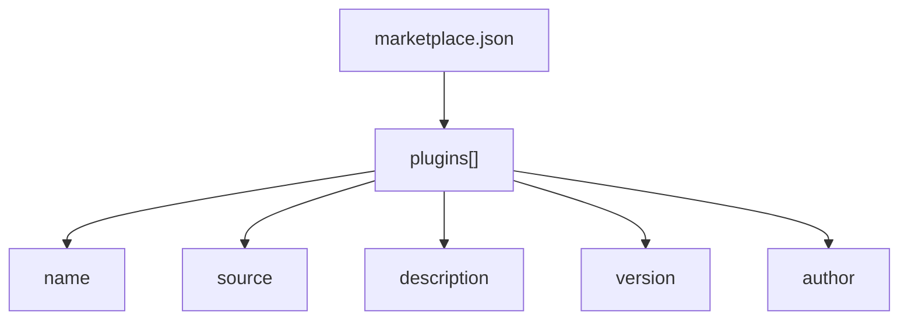

**Diagram sources**
- `fractal-agentic/.claude-plugin/marketplace.json#L1-L19`

**Section sources**
- `fractal-agentic/.claude-plugin/marketplace.json#L1-L19`
- `fractal-agentic/docs/02-install.md#L59-L69`

### Host Discovery Mechanisms
Discovery algorithm:
- Check explicit environment variable for plugin root
- Walk up from current working directory looking for known layouts
- Prefer monorepo root’s plugin/ child if present
- Validate presence of required files and correct name
- Fallback to script install location when applicable

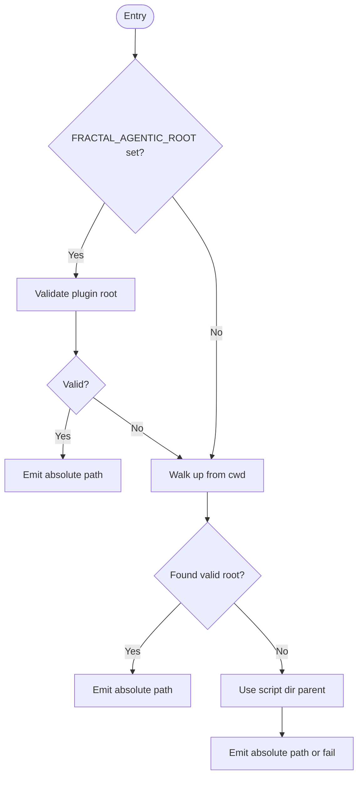

**Diagram sources**
- `fractal-agentic/scripts/resolve-plugin-root.sh#L1-L140`

**Section sources**
- `fractal-agentic/scripts/resolve-plugin-root.sh#L1-L140`
- `fractal-agentic/docs/01-getting-started.md#L44-L59`

### Version Compatibility and Capability Modes
Capability modes define how pinned agents are used versus degraded fallbacks:
- pinned/pinned_partial: prefer exposed types per role
- degraded: fall back to primary/general roles
- plugin_missing: continue under project defaults

Reporting includes mode, pin verification status, and layer coverage.

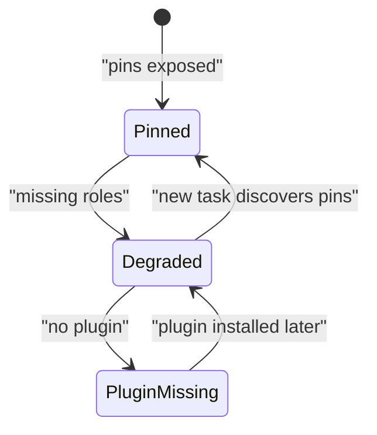

**Diagram sources**
- `fractal-agentic/skills/boss-orchestration/references/capability-mode.md#L40-L74`

**Section sources**
- `fractal-agentic/skills/boss-orchestration/references/capability-mode.md#L40-L74`
- `fractal-agentic/docs/DEGRADATION.md#L80-L114`

### Installation Procedures
Methods:
- NPX installer auto-detects hosts and installs
- Host marketplace commands for Claude Code and Codex
- Manual checkout for development or host-neutral setup

Post-install steps include setting FRACTAL_AGENTIC_ROOT, verifying root resolution, and integrating AGENTS snippet into project.

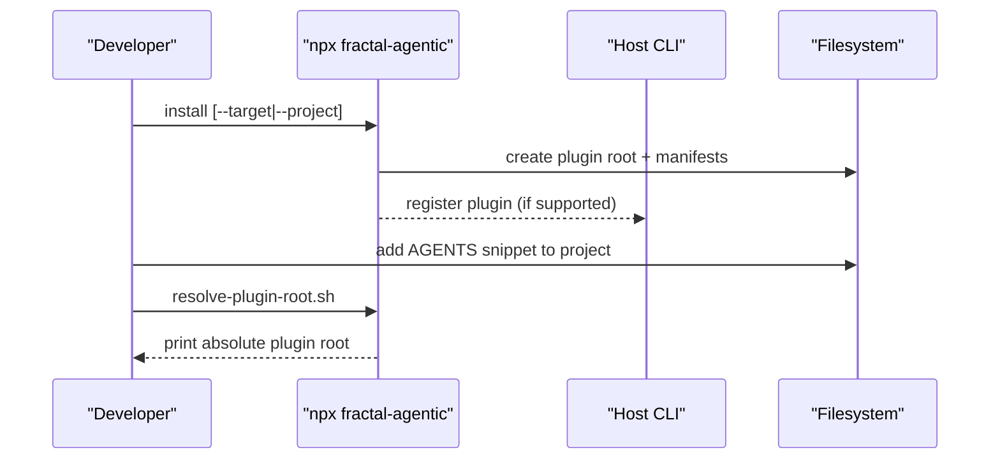

**Diagram sources**
- `fractal-agentic/docs/01-getting-started.md#L1-L59`
- `fractal-agentic/docs/02-install.md#L1-L100`
- `fractal-agentic/scripts/resolve-plugin-root.sh#L1-L140`

**Section sources**
- `fractal-agentic/docs/01-getting-started.md#L1-L59`
- `fractal-agentic/docs/02-install.md#L1-L100`

### Hooks and Lifecycle Events
Hooks are optional and profile-gated:
- Profiles: minimal, standard, strict
- Events: PreToolUse, SessionStart, Stop
- Handlers: command-based Node scripts with timeouts
- Environment controls: FRACTAL_HOOK_PROFILE, FRACTAL_DISABLED_HOOKS, FRACTAL_GATEGUARD

Installation writes target-specific configurations and materialized settings.

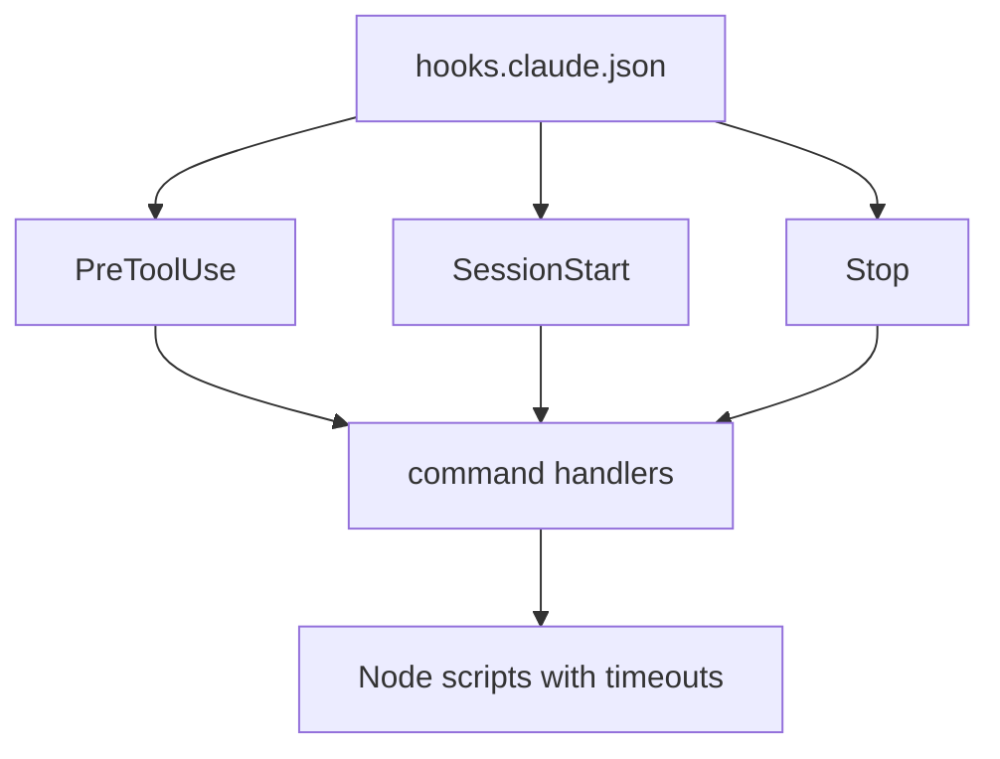

**Diagram sources**
- `fractal-agentic/hooks/hooks.claude.json#L1-L87`
- `fractal-agentic/.fractal-agentic/hooks-installed.json#L1-L9`
- `fractal-agentic/hooks/README.md#L1-L124`

**Section sources**
- `fractal-agentic/hooks/hooks.claude.json#L1-L87`
- `fractal-agentic/.fractal-agentic/.fractal-agentic/hooks-installed.json#L1-L9`
- `fractal-agentic/hooks/README.md#L1-L124`
- `fractal-agentic/hooks/scripts/lib.js#L1-L59`

### Communication Protocols
- WebSocket-based server for interactive sessions within skills (e.g., brainstorming), with message parsing, event logging, and broadcast.
- Command execution via Node scripts invoked by hooks with bounded stdin size and JSON input parsing.

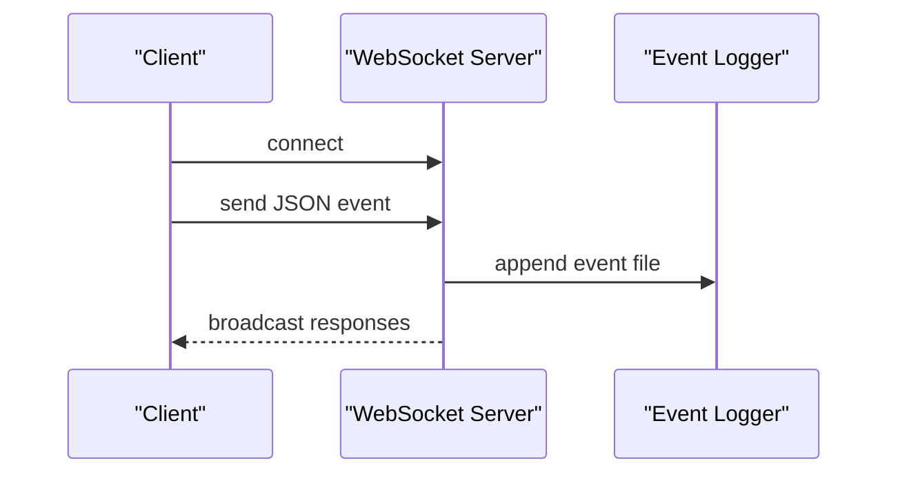

**Diagram sources**
- `fractal-agentic/skills/brainstorming/scripts/server.cjs#L540-L569`
- `fractal-agentic/skills/brainstorming/scripts/server.cjs#L711-L729`

**Section sources**
- `fractal-agentic/skills/brainstorming/scripts/server.cjs#L540-L569`
- `fractal-agentic/skills/brainstorming/scripts/server.cjs#L711-L729`

### Security Considerations and Sandboxing
- Non-blocking policy ensures implementation continues even if pins/tools are missing; only irreversible harm is blocked.
- Hook profiles enforce safety boundaries (bash safety, config protection, no-verify block).
- Input limits protect against oversized stdin in hook scripts.
- Strict mode adds fact-force gating for first edits.

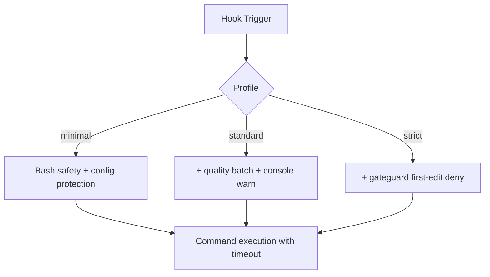

**Diagram sources**
- `fractal-agentic/scripts/check-nonblocking-policy.sh#L32-L74`
- `fractal-agentic/hooks/README.md#L1-L124`
- `fractal-agentic/hooks/scripts/lib.js#L1-L59`

**Section sources**
- `fractal-agentic/scripts/check-nonblocking-policy.sh#L32-L74`
- `fractal-agentic/hooks/README.md#L1-L124`
- `fractal-agentic/docs/DEGRADATION.md#L80-L114`

### Performance Optimization Strategies
- Progressive discovery keeps router compact and avoids monolithic references.
- Capability mode reporting reduces repeated preflight overhead after initial detection.
- Hooks run with bounded timeouts and minimal work unless expanded by profiles.
- Use new tasks to refresh spawn type discovery rather than blocking current work.

**Section sources**
- `fractal-agentic/scripts/check-progressive-discovery.sh#L1-L191`
- `fractal-agentic/skills/boss-orchestration/references/capability-mode.md#L40-L74`
- `fractal-agentic/docs/DEGRADATION.md#L80-L114`

## Dependency Analysis
Dependencies between components:
- Root manifest binds skills path and metadata consumed by hosts
- Marketplace catalog depends on plugin source path and metadata
- Hooks depend on Node scripts and environment variables
- Root resolution depends on filesystem layout and environment
- Verification depends on JSON validity and asset presence

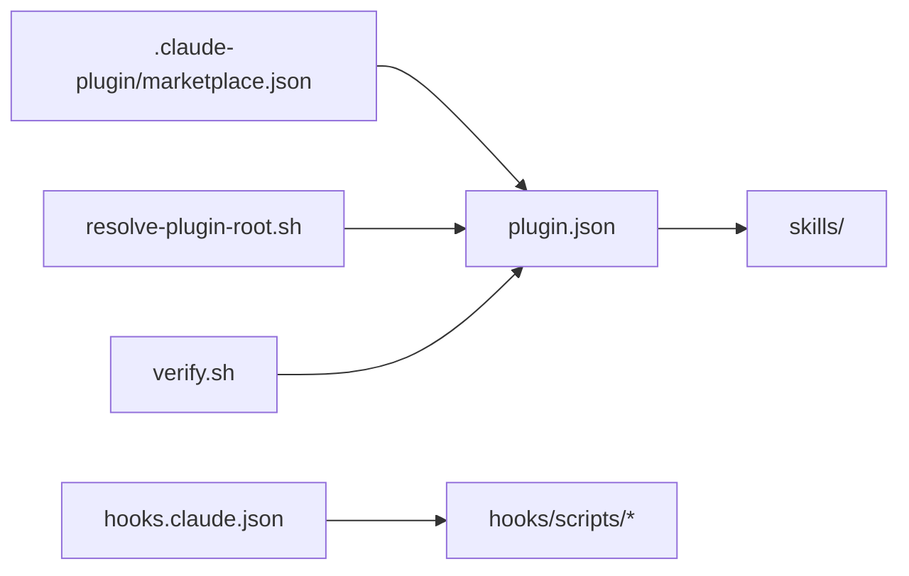

**Diagram sources**
- `fractal-agentic/plugin.json#L1-L31`
- `fractal-agentic/.claude-plugin/marketplace.json#L1-L19`
- `fractal-agentic/hooks/hooks.claude.json#L1-L87`
- `fractal-agentic/scripts/resolve-plugin-root.sh#L1-L140`
- `fractal-agentic/scripts/verify.sh#L67-L101`

**Section sources**
- `fractal-agentic/plugin.json#L1-L31`
- `fractal-agentic/.claude-plugin/marketplace.json#L1-L19`
- `fractal-agentic/hooks/hooks.claude.json#L1-L87`
- `fractal-agentic/scripts/resolve-plugin-root.sh#L1-L140`
- `fractal-agentic/scripts/verify.sh#L67-L101`

## Performance Considerations
- Keep manifests minimal to reduce parsing overhead.
- Avoid heavy operations in hooks; prefer lightweight checks and warnings.
- Use capability mode to minimize repeated discovery and preflight.
- Ensure router remains compact to speed up boss selection.

[No sources needed since this section provides general guidance]

## Troubleshooting Guide
Common issues and resolutions:
- Missing marketplace manifest: ensure sparse checkout includes both .agents/plugins and plugin directories
- Commands not visible: point host at plugin directory where host-specific manifest resides
- Hooks do nothing: ensure host registers hooks and environment variables are set
- Pins not exposed: disk OK but session needs new task to discover types
- Wrong capability_mode: follow degradation guidance and report mode

**Section sources**
- `fractal-agentic/docs/troubleshooting.md#L39-L76`
- `fractal-agentic/docs/02-install.md#L59-L69`
- `fractal-agentic/docs/DEGRADATION.md#L80-L114`

## Conclusion
The plugin API provides a robust, multi-host integration model with clear manifest schemas, marketplace catalogs, optional hooks for lifecycle and safety, and resilient discovery/validation mechanisms. By adhering to non-blocking policies, progressive discovery, and capability modes, developers can deliver reliable, secure, and performant plugins across diverse environments.

[No sources needed since this section summarizes without analyzing specific files]

## Appendices

### Appendix A: Complete Schema Definitions
- Plugin Manifest: name, version, description, author, homepage, repository, license, interface, skills, keywords
- Marketplace Catalog: name, owner, description, plugins[] with name, source, description, version, author
- Hooks Configuration: description, hooks mapping event names to matchers and command handlers with timeouts
- Installed Hooks State: version, target, profile, plugin_root, claude_settings, materialized

**Section sources**
- `fractal-agentic/plugin.json#L1-L31`
- `fractal-agentic/.claude-plugin/marketplace.json#L1-L19`
- `fractal-agentic/hooks/hooks.claude.json#L1-L87`
- `fractal-agentic/.fractal-agentic/hooks-installed.json#L1-L9`

### Appendix B: Practical Development and Deployment Workflow
- Initialize plugin root and manifests
- Add skills and commands
- Configure hooks with desired profile
- Install via NPX or host marketplace
- Verify root resolution and integrity
- Test capability modes and degradation behavior
- Publish marketplace catalog and update versions

**Section sources**
- `fractal-agentic/docs/01-getting-started.md#L1-L59`
- `fractal-agentic/docs/02-install.md#L1-L100`
- `fractal-agentic/scripts/verify.sh#L67-L101`