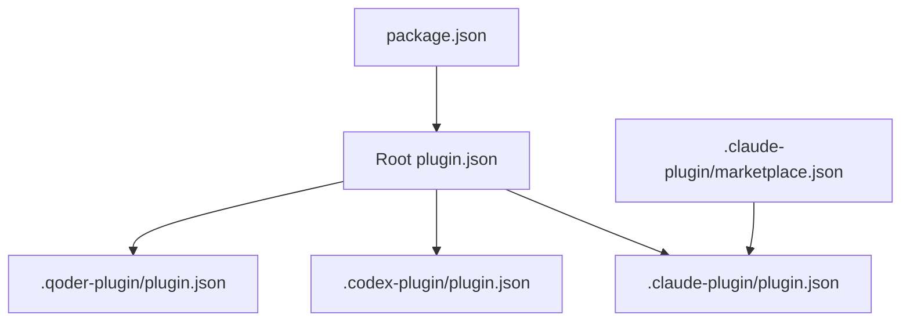
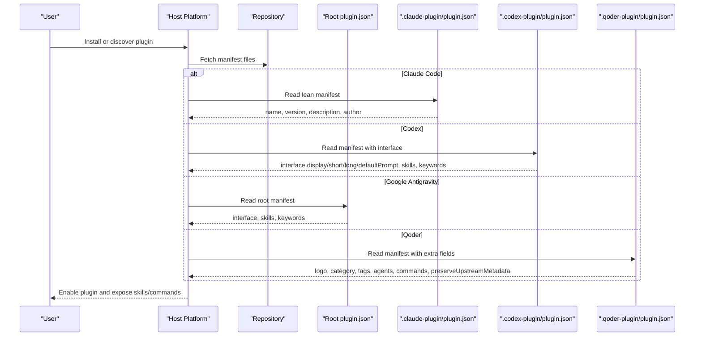
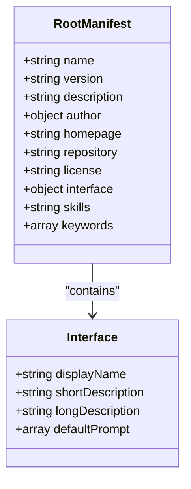
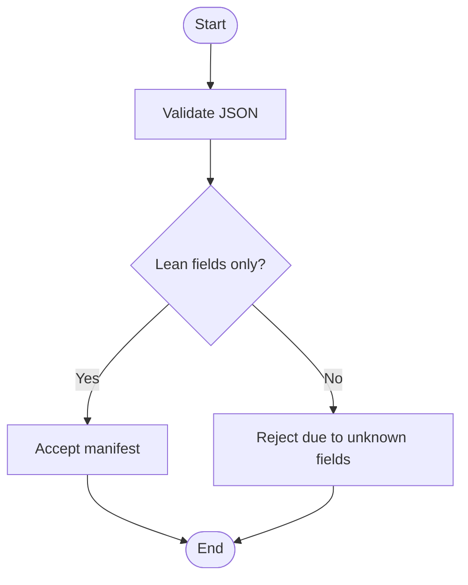
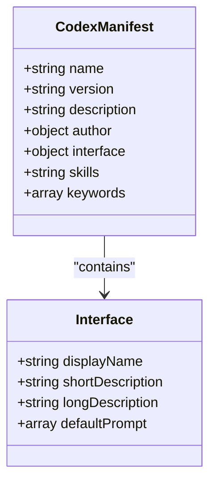
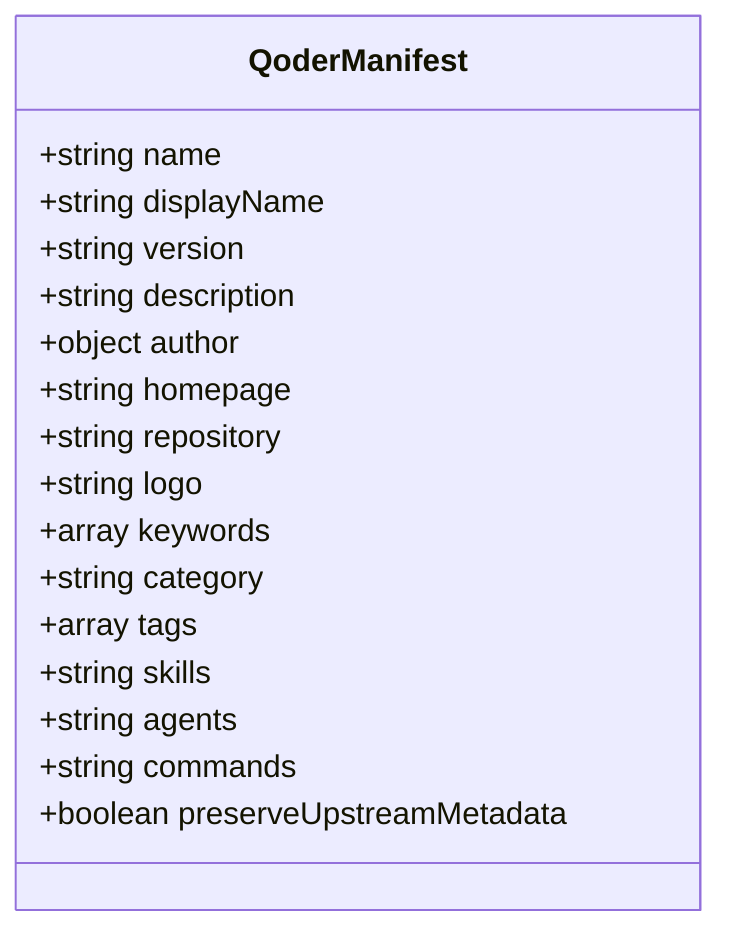
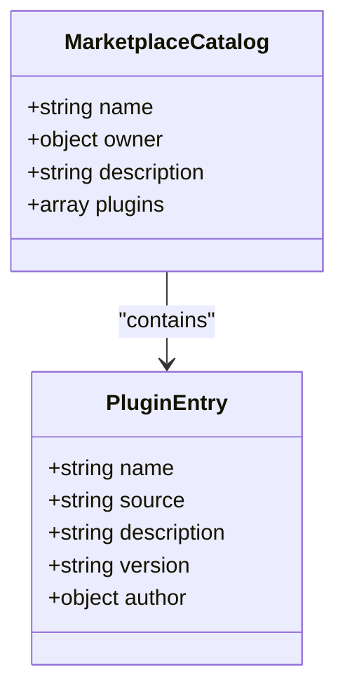
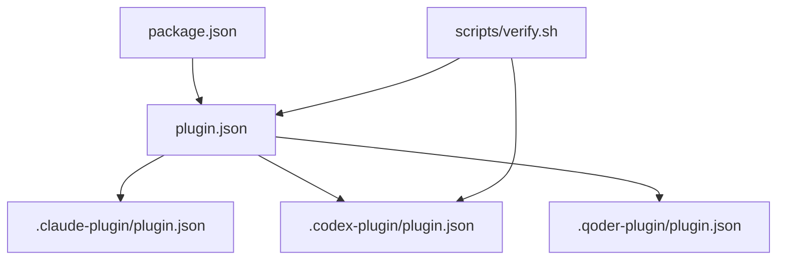

<cite>
**Referenced Files in This Document**
- `fractal-agentic/plugin.json`
- `fractal-agentic/.claude-plugin/plugin.json`
- `fractal-agentic/.codex-plugin/plugin.json`
- `fractal-agentic-qoder-plugin/.qoder-plugin/plugin.json`
- `fractal-agentic/.claude-plugin/PLUGIN_SCHEMA_NOTES.md`
- `fractal-agentic/.claude-plugin/marketplace.json`
- `fractal-agentic/package.json`
- `fractal-agentic/scripts/verify.sh`
</cite>

## Table of Contents
1. Introduction
2. Project Structure
3. Core Components
4. Architecture Overview
5. Detailed Component Analysis
6. Dependency Analysis
7. Performance Considerations
8. Troubleshooting Guide
9. Conclusion

## Introduction
This document specifies the plugin manifest structure and metadata used across multiple host platforms (Claude Code, Codex, Google Antigravity, and Qoder). It defines the JSON schema for plugin manifests, including required and optional fields, interface objects, skills configuration, keywords, versioning strategies, compatibility matrices, and dependency declarations. Examples are provided from the repository to illustrate complete configurations per host.

## Project Structure
The plugin package includes a root manifest and host-specific manifests:
- Root manifest: plugin.json (used by Google Antigravity and as a shared source of truth)
- Claude Code manifest: .claude-plugin/plugin.json (lean, validator-friendly)
- Codex manifest: .codex-plugin/plugin.json (includes interface object and skills path)
- Qoder manifest: .qoder-plugin/plugin.json (includes additional host-specific fields)
- Marketplace catalog (Claude): .claude-plugin/marketplace.json
- Package metadata: package.json (points to plugin.json as main entry)

**Diagram sources**
- `fractal-agentic/plugin.json`
- `fractal-agentic/.claude-plugin/plugin.json`
- `fractal-agentic/.codex-plugin/plugin.json`
- `fractal-agentic-qoder-plugin/.qoder-plugin/plugin.json`
- `fractal-agentic/.claude-plugin/marketplace.json`
- `fractal-agentic/package.json`

**Section sources**
- `fractal-agentic/plugin.json`
- `fractal-agentic/.claude-plugin/plugin.json`
- `fractal-agentic/.codex-plugin/plugin.json`
- `fractal-agentic-qoder-plugin/.qoder-plugin/plugin.json`
- `fractal-agentic/.claude-plugin/marketplace.json`
- `fractal-agentic/package.json`

## Core Components
- Name: Unique identifier for the plugin.
- Version: Semantic version string; must be present and consistent across manifests.
- Description: Human-readable summary of the plugin’s purpose.
- Author: Object containing author details (e.g., name, email where applicable).
- Homepage and Repository: URLs for documentation and source code.
- License: SPDX license identifier.
- Interface: Host-specific UI strings and default prompts (Codex and root manifest include this).
- Skills: Path(s) to skill directories for discovery and marketplace categorization.
- Keywords: Array of tags for search and categorization.
- Additional host-specific fields: logo, category, tags, agents, commands, preserveUpstreamMetadata (Qoder).

Validation rules and requirements:
- Required fields: name, version, description, author.name.
- Optional fields: homepage, repository, license, interface, skills, keywords, and host-specific properties.
- Keep Claude Code manifest lean to avoid unknown-field rejections.
- Ensure JSON validity across all manifests.

Examples of complete configurations:
- Claude Code: minimal safe pattern with name, version, description, author.
- Codex: includes interface object with displayName, shortDescription, longDescription, defaultPrompt arrays; skills path; keywords.
- Google Antigravity: uses root plugin.json with interface and skills path.
- Qoder: includes additional fields like logo, category, tags, agents, commands, preserveUpstreamMetadata.

**Section sources**
- `fractal-agentic/plugin.json`
- `fractal-agentic/.claude-plugin/plugin.json`
- `fractal-agentic/.codex-plugin/plugin.json`
- `fractal-agentic-qoder-plugin/.qoder-plugin/plugin.json`
- `fractal-agentic/.claude-plugin/PLUGIN_SCHEMA_NOTES.md`

## Architecture Overview
The manifest architecture supports multi-host distribution while maintaining a single source of truth at the root. Host-specific manifests adapt to platform constraints and capabilities.

**Diagram sources**
- `fractal-agentic/plugin.json`
- `fractal-agentic/.claude-plugin/plugin.json`
- `fractal-agentic/.codex-plugin/plugin.json`
- `fractal-agentic-qoder-plugin/.qoder-plugin/plugin.json`

## Detailed Component Analysis

### Root Manifest (Google Antigravity)
- Fields: name, version, description, author, homepage, repository, license, interface, skills, keywords.
- Interface object: displayName, shortDescription, longDescription, defaultPrompt array.
- Skills path: points to ./skills/ for skill discovery.
- Keywords: orchestration, bosses, svelte, multi-agent, multi-host, hooks.

**Diagram sources**
- `fractal-agentic/plugin.json`

**Section sources**
- `fractal-agentic/plugin.json`

### Claude Code Manifest
- Safe pattern: name, version, description, author.
- Guidance: keep lean; avoid undocumented fields that validators may reject.
- Hooks: not auto-merged; separate hook configuration exists.

**Diagram sources**
- `fractal-agentic/.claude-plugin/plugin.json`
- `fractal-agentic/.claude-plugin/PLUGIN_SCHEMA_NOTES.md`

**Section sources**
- `fractal-agentic/.claude-plugin/plugin.json`
- `fractal-agentic/.claude-plugin/PLUGIN_SCHEMA_NOTES.md`

### Codex Manifest
- Includes interface object with displayName, shortDescription, longDescription, defaultPrompt arrays.
- Skills path: ./skills/
- Keywords: orchestration, bosses, svelte, multi-agent, codex, hooks.

**Diagram sources**
- `fractal-agentic/.codex-plugin/plugin.json`

**Section sources**
- `fractal-agentic/.codex-plugin/plugin.json`

### Qoder Manifest
- Additional fields: logo, category, tags, agents, commands, preserveUpstreamMetadata.
- Skills path: ./skills/
- Keywords: qoder-plugin, orchestration, bosses, svelte, multi-agent, multi-host, hooks.

**Diagram sources**
- `fractal-agentic-qoder-plugin/.qoder-plugin/plugin.json`

**Section sources**
- `fractal-agentic-qoder-plugin/.qoder-plugin/plugin.json`

### Marketplace Catalog (Claude)
- Contains owner info, description, and an array of plugins with name, source, description, version, author.

**Diagram sources**
- `fractal-agentic/.claude-plugin/marketplace.json`

**Section sources**
- `fractal-agentic/.claude-plugin/marketplace.json`

## Dependency Analysis
- package.json declares plugin.json as the main entry, enabling hosts to locate the root manifest.
- Verification script ensures JSON validity and checks presence of critical assets.

**Diagram sources**
- `fractal-agentic/package.json`
- `fractal-agentic/plugin.json`
- `fractal-agentic/.claude-plugin/plugin.json`
- `fractal-agentic/.codex-plugin/plugin.json`
- `fractal-agentic-qoder-plugin/.qoder-plugin/plugin.json`
- `fractal-agentic/scripts/verify.sh`

**Section sources**
- `fractal-agentic/package.json`
- `fractal-agentic/scripts/verify.sh`

## Performance Considerations
- Keep manifests minimal to reduce parsing overhead and avoid validation failures on strict hosts.
- Use relative paths for skills and assets to ensure portability across environments.
- Avoid large inline descriptions; prefer concise summaries and link to external docs when necessary.

[No sources needed since this section provides general guidance]

## Troubleshooting Guide
- JSON validity: verify.sh validates JSON using jq or Python fallback.
- Missing fields: ensure name, version, description, author.name are present.
- Unknown fields: Claude Code rejects unknown fields; keep .claude-plugin/plugin.json lean.
- Skills path: confirm skills directory exists and is referenced correctly.
- Marketplace registration: ensure marketplace.json entries match plugin names and versions.

**Section sources**
- `fractal-agentic/scripts/verify.sh`
- `fractal-agentic/.claude-plugin/PLUGIN_SCHEMA_NOTES.md`

## Conclusion
The plugin manifest system supports multi-host distribution through a root manifest and host-specific adaptations. By following the specified schema, validation rules, and examples, developers can create robust, portable plugin configurations for Claude Code, Codex, Google Antigravity, and Qoder. Consistent versioning, clear interface definitions, and accurate skills paths ensure reliable discovery and installation across platforms.

[No sources needed since this section summarizes without analyzing specific files]