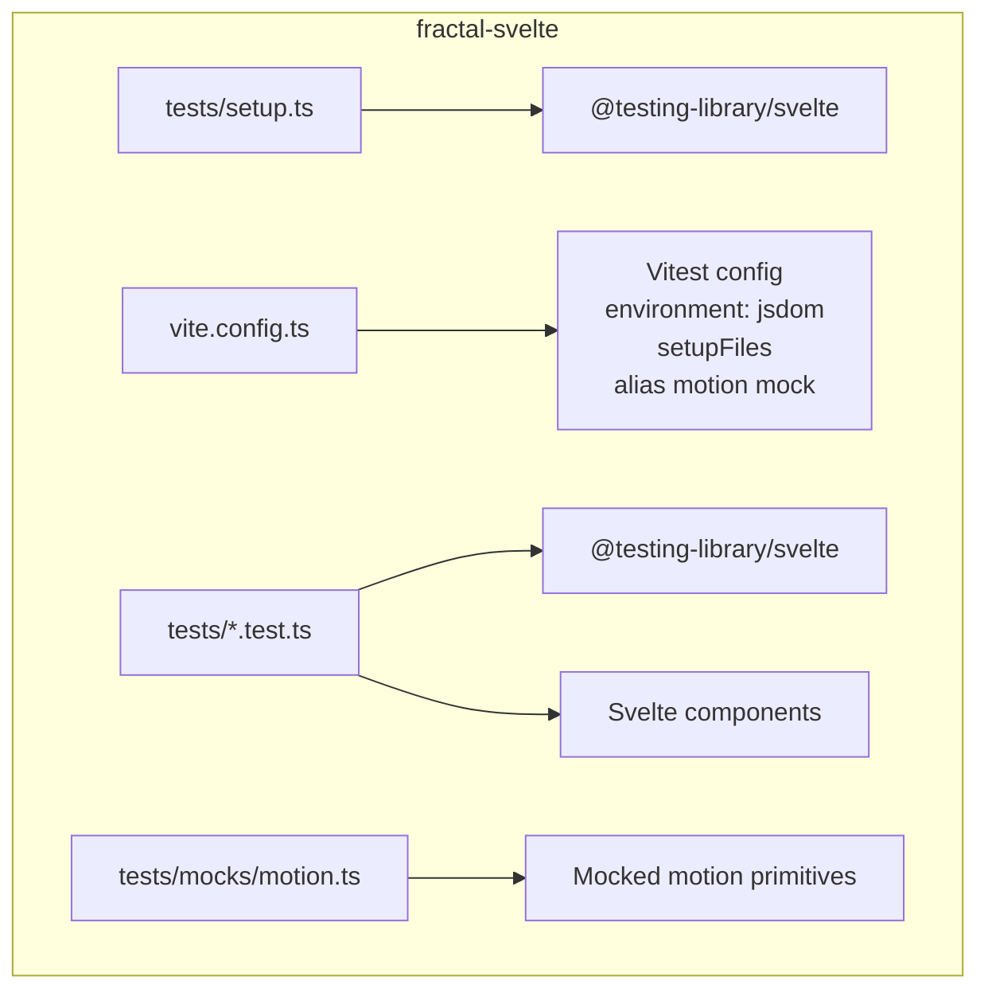
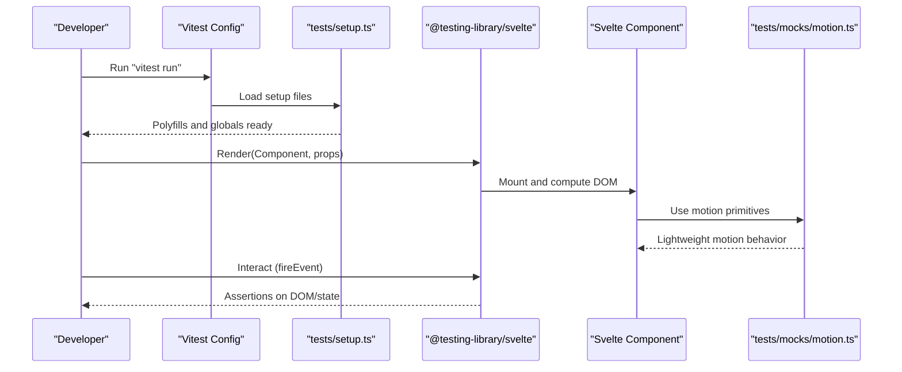
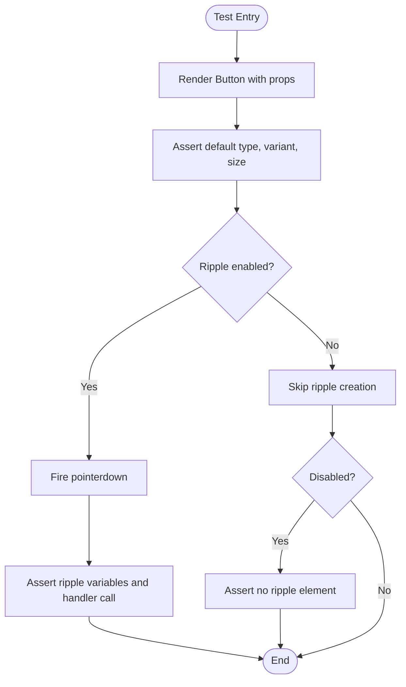
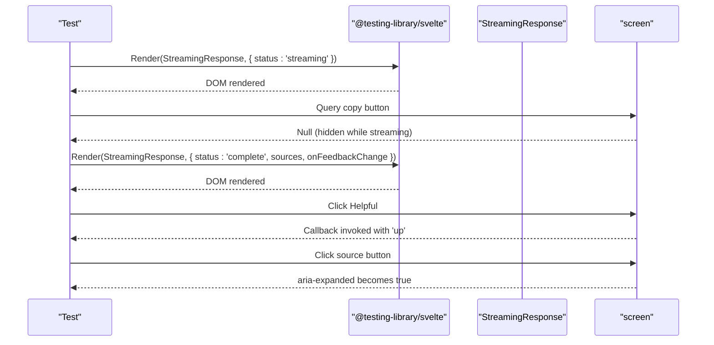
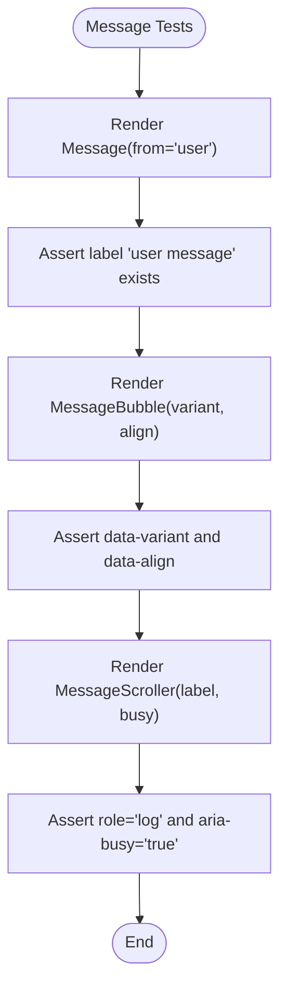
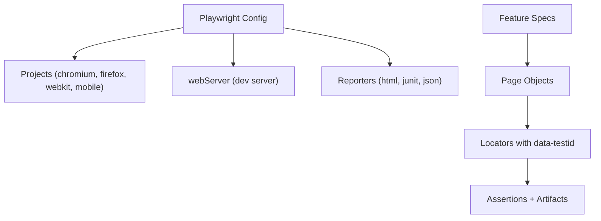
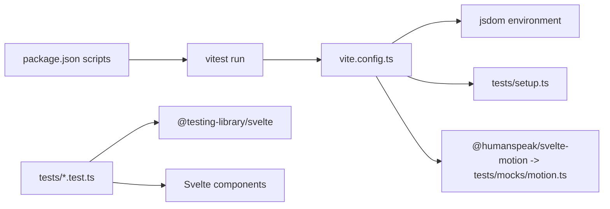

<cite>
**Referenced Files in This Document**
- `packages/fractal-svelte/package.json`
- `packages/fractal-svelte/vite.config.ts`
- `packages/fractal-svelte/tests/setup.ts`
- `packages/fractal-svelte/tests/mocks/motion.ts`
- `packages/fractal-svelte/tests/button.test.ts`
- `packages/fractal-svelte/tests/streaming-response.test.ts`
- `packages/fractal-svelte/tests/message-components.test.ts`
- `packages/fractal-agentic/skills/e2e-testing/SKILL.md`
- `packages/fractal-agentic/commands/test-coverage.md`
- `packages/fractal-agentic/skills/benchmark/SKILL.md`
</cite>

## Table of Contents
1. [Introduction](#introduction)
2. [Project Structure](#project-structure)
3. [Core Components](#core-components)
4. [Architecture Overview](#architecture-overview)
5. [Detailed Component Analysis](#detailed-component-analysis)
6. [Dependency Analysis](#dependency-analysis)
7. [Performance Considerations](#performance-considerations)
8. [Troubleshooting Guide](#troubleshooting-guide)
9. [Conclusion](#conclusion)
10. [Appendices](#appendices)

## Introduction
This document explains the testing strategies and frameworks used across the project, focusing on:
- Unit testing with Vitest
- Component testing for Svelte components using @testing-library/svelte
- E2E testing patterns with Playwright
- Test organization, mocking strategies for AI agents and external services, and integration testing for CLI commands
- Guidance for testing animated components, real-time features, and agent orchestration logic
- Coverage reporting, performance testing, and visual regression testing
- Best practices for UI components and backend logic, debugging failed tests, and optimizing execution time

## Project Structure
The primary test suite lives under packages/fractal-svelte/tests with a clear separation between configuration, setup, mocks, and component tests. The package uses Vitest as the runner and jsdom as the environment. A minimal setup file initializes testing-library globals and polyfills browser APIs required by components.

**Diagram sources**
- `packages/fractal-svelte/vite.config.ts#L1-L32`
- `packages/fractal-svelte/tests/setup.ts#L1-L17`
- `packages/fractal-svelte/tests/mocks/motion.ts#L1-L11`

**Section sources**
- `packages/fractal-svelte/package.json#L24-L42`
- `packages/fractal-svelte/vite.config.ts#L1-L32`
- `packages/fractal-svelte/tests/setup.ts#L1-L17`

## Core Components
- Test runner and environment: Vitest configured via vite.config.ts with jsdom and a setup file.
- Component testing: @testing-library/svelte provides render, fireEvent, and screen utilities.
- Mocking: Motion library is aliased to a lightweight mock that exposes useReducedMotion, AnimatePresence, and motion tags.
- Browser API polyfills: matchMedia is mocked in setup.ts to support hover-capable logic.

Key implementation highlights:
- Tests import components directly from source paths and assert DOM attributes, events, and side effects.
- Real-time behavior is tested by asserting state changes based on props and user interactions.
- Accessibility assertions are included for labels and roles.

**Section sources**
- `packages/fractal-svelte/vite.config.ts#L22-L31`
- `packages/fractal-svelte/tests/setup.ts#L1-L17`
- `packages/fractal-svelte/tests/mocks/motion.ts#L1-L11`
- `packages/fractal-svelte/tests/button.test.ts#L1-L32`
- `packages/fractal-svelte/tests/streaming-response.test.ts#L1-L28`
- `packages/fractal-svelte/tests/message-components.test.ts#L1-L23`

## Architecture Overview
The testing architecture centers around Vitest orchestrating unit and component tests against Svelte components. External dependencies like motion libraries are stubbed to ensure deterministic tests. For E2E, Playwright patterns are documented as a skill for stable, maintainable suites.

**Diagram sources**
- `packages/fractal-svelte/vite.config.ts#L22-L31`
- `packages/fractal-svelte/tests/setup.ts#L1-L17`
- `packages/fractal-svelte/tests/mocks/motion.ts#L1-L11`

## Detailed Component Analysis

### Button Component Tests
Tests verify default rendering, event forwarding, and ripple behavior. They also assert disabled-state behavior.

**Diagram sources**
- `packages/fractal-svelte/tests/button.test.ts#L1-L32`

**Section sources**
- `packages/fractal-svelte/tests/button.test.ts#L1-L32`

### Streaming Response Component Tests
Tests cover visibility of actions during streaming, feedback toggles, and source disclosure.

**Diagram sources**
- `packages/fractal-svelte/tests/streaming-response.test.ts#L1-L28`

**Section sources**
- `packages/fractal-svelte/tests/streaming-response.test.ts#L1-L28`

### Message Primitives Tests
Tests validate accessible labeling, bubble variants/alignment, and live transcript roles.

**Diagram sources**
- `packages/fractal-svelte/tests/message-components.test.ts#L1-L23`

**Section sources**
- `packages/fractal-svelte/tests/message-components.test.ts#L1-L23`

### Conceptual Overview
For E2E testing, follow the Page Object Model and robust waiting strategies to avoid flakiness. Use screenshots, videos, and traces on failures. Organize tests by feature and keep fixtures isolated.

[No sources needed since this diagram shows conceptual workflow, not actual code structure]

## Dependency Analysis
Testing dependencies are declared in the package manifest and configured in the Vitest config. The motion library is aliased to a local mock to avoid heavy animation logic in tests.

**Diagram sources**
- `packages/fractal-svelte/package.json#L24-L42`
- `packages/fractal-svelte/vite.config.ts#L22-L31`
- `packages/fractal-svelte/tests/mocks/motion.ts#L1-L11`

**Section sources**
- `packages/fractal-svelte/package.json#L24-L42`
- `packages/fractal-svelte/vite.config.ts#L22-L31`

## Performance Considerations
- Keep tests fast by mocking expensive modules (e.g., motion).
- Use jsdom for unit/component tests; reserve heavier browsers for E2E.
- Parallelize where possible; isolate shared state.
- For performance baselines, adopt benchmarking patterns to measure Core Web Vitals and build times.

[No sources needed since this section provides general guidance]

## Troubleshooting Guide
Common issues and remedies:
- Missing browser APIs: Ensure setup.ts polyfills matchMedia and other APIs used by components.
- Animation timing: Prefer stability checks over fixed timeouts; wait for networkidle or specific locators.
- Flaky tests: Use retries, auto-wait locators, and capture artifacts (screenshots, videos, traces).
- Coverage gaps: Analyze reports and generate missing tests prioritizing happy paths, error handling, and edge cases.

**Section sources**
- `packages/fractal-svelte/tests/setup.ts#L1-L17`
- `packages/fractal-agentic/skills/e2e-testing/SKILL.md#L140-L196`
- `packages/fractal-agentic/commands/test-coverage.md#L1-L37`

## Conclusion
The project’s testing strategy combines Vitest-driven unit and component tests with robust mocking and environment setup, complemented by Playwright-based E2E patterns. By following the outlined organization, mocking, and best practices, teams can maintain reliable, fast, and accessible tests across UI and backend logic.

[No sources needed since this section summarizes without analyzing specific files]

## Appendices

### How to Write Tests for Animated Components
- Mock motion primitives to control animations deterministically.
- Assert CSS custom properties and class names that drive visuals.
- Use reduced motion settings when appropriate.

**Section sources**
- `packages/fractal-svelte/tests/mocks/motion.ts#L1-L11`
- `packages/fractal-svelte/vite.config.ts#L27-L30`

### How to Test Real-Time Features
- Simulate streaming states via props and assert UI transitions.
- Verify callbacks and accessibility updates (e.g., aria-busy).
- Avoid arbitrary waits; rely on explicit events and state changes.

**Section sources**
- `packages/fractal-svelte/tests/streaming-response.test.ts#L1-L28`

### How to Test Agent Orchestration Logic
- Isolate orchestration functions behind interfaces.
- Mock external LLM calls and tool outputs.
- Validate decision trees and state transitions with parameterized tests.

[No sources needed since this section provides general guidance]

### Integration Testing for CLI Commands
- Use shell wrappers or spawn processes to invoke CLI binaries.
- Assert exit codes, stdout/stderr, and generated artifacts.
- Seed fixtures and clean up after each test.

[No sources needed since this section provides general guidance]

### Test Coverage Reporting
- Detect framework automatically and run coverage accordingly.
- Generate JSON summaries and HTML reports.
- Enforce thresholds and prioritize missing tests.

**Section sources**
- `packages/fractal-agentic/commands/test-coverage.md#L1-L37`

### Performance Testing and Visual Regression
- Measure Core Web Vitals and bundle sizes; compare baselines before/after changes.
- Capture screenshots and diffs for visual regressions.
- Integrate into CI with artifact uploads.

**Section sources**
- `packages/fractal-agentic/skills/benchmark/SKILL.md#L1-L96`
- `packages/fractal-agentic/skills/e2e-testing/SKILL.md#L197-L255`