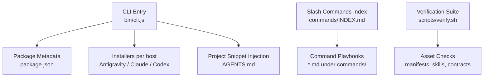
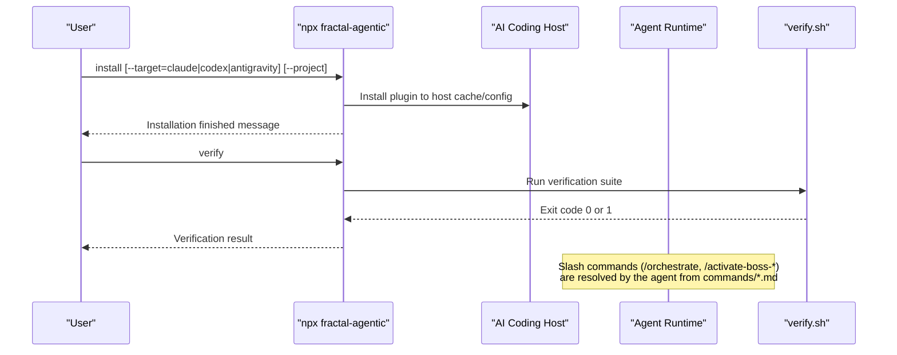
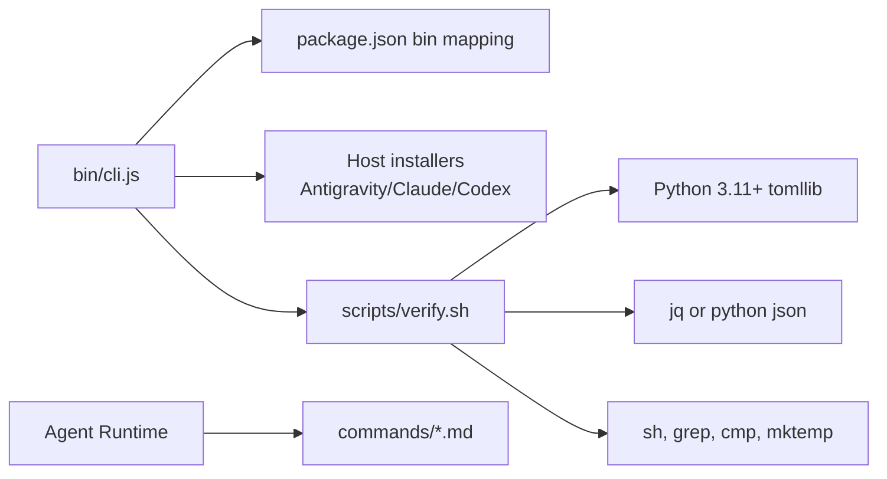

<cite>
**Referenced Files in This Document**
- `fractal-agentic/bin/cli.js`
- `fractal-agentic/package.json`
- `fractal-agentic/commands/INDEX.md`
- `fractal-agentic/commands/orchestrate.md`
- `fractal-agentic/commands/activate-boss-agent.md`
- `fractal-agentic/commands/activate-boss-code.md`
- `fractal-agentic/commands/auto-update.md`
- `fractal-agentic/commands/hookify.md`
- `fractal-agentic/commands/wiki-init.md`
- `fractal-agentic/commands/pr.md`
- `fractal-agentic/commands/skill-create.md`
- `fractal-agentic/commands/project-init.md`
- `fractal-agentic/scripts/verify.sh`
- `fractal-agentic/docs/02-install.md`
- `fractal-agentic/README.md`
</cite>

## Table of Contents
1. [Introduction](#introduction)
2. [Project Structure](#project-structure)
3. [Core Components](#core-components)
4. [Architecture Overview](#architecture-overview)
5. [Detailed Component Analysis](#detailed-component-analysis)
6. [Dependency Analysis](#dependency-analysis)
7. [Performance Considerations](#performance-considerations)
8. [Troubleshooting Guide](#troubleshooting-guide)
9. [Conclusion](#conclusion)
10. [Appendices](#appendices)

## Introduction
This document is the authoritative reference for Fractal Agentic’s command-line interface and slash commands used inside AI coding agents. It covers:
- The installer CLI (install, verify, help) with flags like --target and --project
- Slash commands available to agents (e.g., /orchestrate, /activate-boss-*, /pr, /wiki-init, /skill-create, /auto-update, /hookify, /project-init)
- Command options, parameters, usage examples, error handling, exit codes, logging behavior
- Integration with Claude Code, Codex, and Google Antigravity
- Command chaining, automation scripts, and guidance for custom command development

## Project Structure
Fractal Agentic exposes a Node executable via npm and a rich set of slash commands implemented as markdown playbooks consumed by agents.

- Executable entry point: bin/cli.js
- Package metadata and bin mapping: package.json
- Slash command inventory: commands/INDEX.md
- Host installation docs: docs/02-install.md
- Verification suite: scripts/verify.sh

**Diagram sources**
- `fractal-agentic/bin/cli.js#L1-L148`
- `fractal-agentic/package.json#L1-L59`
- `fractal-agentic/commands/INDEX.md#L1-L68`
- `fractal-agentic/scripts/verify.sh#L1-L274`

**Section sources**
- `fractal-agentic/bin/cli.js#L1-L148`
- `fractal-agentic/package.json#L1-L59`
- `fractal-agentic/commands/INDEX.md#L1-L68`
- `fractal-agentic/docs/02-install.md#L1-L198`

## Core Components
- Installer CLI: npx fractal-agentic
  - Commands: install, verify, help
  - Flags: --target=<host>, --project
  - Behavior: installs plugin into host-specific directories; optionally injects AGENTS snippet into current project
- Slash commands: agent-facing commands prefixed with /
  - Examples: /orchestrate, /activate-boss-*, /pr, /wiki-init, /skill-create, /auto-update, /hookify, /project-init
  - Each command is defined as a markdown playbook that instructs the agent how to execute safely and deterministically

Key behaviors:
- Non-blocking policy: missing optional features do not block product work
- Deterministic verification: scripts/verify.sh validates assets, TOML pins, installer idempotency, and runtime inspector safety
- Host integration: separate install paths for Antigravity, Claude Code, and Codex

**Section sources**
- `fractal-agentic/bin/cli.js#L27-L145`
- `fractal-agentic/scripts/verify.sh#L1-L274`
- `fractal-agentic/docs/02-install.md#L72-L171`

## Architecture Overview
The CLI orchestrates installation and invokes verification. Slash commands are executed by agents using their internal routing to load the appropriate playbook.

**Diagram sources**
- `fractal-agentic/bin/cli.js#L106-L145`
- `fractal-agentic/scripts/verify.sh#L1-L274`

## Detailed Component Analysis

### Installer CLI: npx fractal-agentic
- Purpose: One-command multi-host installation and project integration
- Commands:
  - install: Detects hosts and installs plugin to appropriate locations
  - verify: Runs the full verification suite
  - help: Prints usage and options
- Options:
  - --target=<host>: Restrict installation to antigravity, claude, codex, or all (default)
  - --project: Inject AGENTS snippet into the current project’s AGENTS.md
- Exit codes:
  - verify exits 1 on failure; otherwise 0
- Logging:
  - Console logs per host installation steps and final success message
- Error handling:
  - Per-host try/catch blocks print errors without aborting other targets
  - Project snippet injection avoids duplicate insertion

Usage examples:
- Install for all detected hosts: npx fractal-agentic install
- Target only Antigravity: npx fractal-agentic install --target=antigravity
- Install and configure current project: npx fractal-agentic install --project
- Verify local installation: npx fractal-agentic verify

Integration notes:
- Claude Code: Attempts marketplace add/install; falls back to cache directory copy
- Codex: Copies plugin to ~/.codex/plugins/cache/fractal-agentic
- Antigravity: Copies plugin to ~/.gemini/config/plugins/fractal-agentic

**Section sources**
- `fractal-agentic/bin/cli.js#L27-L145`
- `fractal-agentic/docs/02-install.md#L72-L171`

### Slash Commands Overview
All slash commands are documented under commands/INDEX.md. Each command file contains frontmatter and instructions for safe execution.

Common categories:
- Orchestration: /orchestrate, /activate-boss-*
- Development workflows: /pr, /code-review, /react-build, /svelte-build, /rust-build, /test-coverage
- Quality and security: /quality-gate, /security-scan, /review-fanout
- Learning and wiki: /wiki-init, /wiki-ingest, /wiki-lint, /wiki-query, /wiki-status
- Hooks and automation: /hookify, /hookify-configure, /hookify-list, /hooks-init, /hooks-status
- Self-improvement: /improve-init, /improve-status, /learn, /learn-eval, /instinct-*
- Maintenance: /auto-update, /prune, /promote, /skill-health, /cost-report

**Section sources**
- `fractal-agentic/commands/INDEX.md#L1-L68`

### /orchestrate
- Purpose: Enter the delivery runtime; select one boss, choose lanes, verify evidence, and obtain a ship | fix-first | rethink verdict
- Required reading order: startup router, active boss playbook, runtime skill and references
- Invariants: capability_mode once, receipts required, non-blocking policy enforced
- Relationship to activation: /activate-boss-* loads a domain playbook; /orchestrate executes the runtime

Usage example:
- /orchestrate

Health check:
- sh <plugin>/scripts/check-armory.sh

**Section sources**
- `fractal-agentic/commands/orchestrate.md#L1-L63`

### /activate-boss-*
- Purpose: Activate a specific boss (agent, code, creator, design, meta, svelte, workflow) by loading the startup router and its authoritative playbook
- Usage:
  - /activate-boss-agent
  - /activate-boss-code
  - Others follow the same pattern

After activation, run /orchestrate for non-trivial delivery work.

**Section sources**
- `fractal-agentic/commands/activate-boss-agent.md#L1-L22`
- `fractal-agentic/commands/activate-boss-code.md#L1-L22`

### /pr (Create Pull Request)
- Purpose: Create a GitHub PR from the current branch with unpushed commits, discover templates, analyze changes, push, and verify checks
- Arguments: $ARGUMENTS may include base branch name and flags like --draft
- Phases: Validate → Discover → Push → Create → Verify → Output
- Edge cases: Requires gh CLI, authentication, divergence handling, large PR warnings

Usage examples:
- /pr main
- /pr --draft

**Section sources**
- `fractal-agentic/commands/pr.md#L1-L189`

### /wiki-init
- Purpose: Interactive setup for the continuous LLM wiki vault; scaffold raw/wiki/output, write config and AGENTS schema
- Steps: Ask questions, scaffold, write AGENTS.md schema, export env variable, next steps

Usage example:
- /wiki-init

**Section sources**
- `fractal-agentic/commands/wiki-init.md#L1-L47`

### /skill-create
- Purpose: Analyze local git history to extract patterns and generate SKILL.md files; optionally produce instincts for continuous-learning-v2
- Usage:
  - /skill-create
  - /skill-create --commits 100
  - /skill-create --output ./skills
  - /skill-create --instincts

Related commands:
- /instinct-import, /instinct-status, /evolve

**Section sources**
- `fractal-agentic/commands/skill-create.md#L1-L126`

### /auto-update
- Purpose: Pull latest ECC repo changes and reinstall managed targets using recorded install-state request
- Usage:
  - Preview with --dry-run
  - Target specific host (e.g., cursor)
  - Override repo root explicitly

Notes:
- Reinstall handles upstream renames/deletions safely
- Always use --dry-run first when unsure

**Section sources**
- `fractal-agentic/commands/auto-update.md#L1-L29`

### /hookify
- Purpose: Create hooks to prevent unwanted behaviors based on conversation analysis or explicit instructions
- Workflow: Gather behavior info → Present findings → Generate rule files (.claude/hookify.{name}.local.md) → Confirm
- Management: Use /hookify-list and /hookify-configure

Usage example:
- /hookify "prevent console.log in staged changes"

**Section sources**
- `fractal-agentic/commands/hookify.md#L1-L51`

### /project-init
- Purpose: Detect project stack and produce a dry-run ECC onboarding plan using manifests and stack mappings
- Safety: Default to dry-run; preserve existing configs; report exact changes before applying
- Detection inputs: package managers, language manifests, framework files, ECC config
- Planning flow: Identify harness, detect stacks, resolve smallest useful plan, dry-run apply, summarize, ask approval

Usage examples:
- /project-init
- /project-init --dry-run
- /project-init --target claude
- /project-init --skills continuous-learning-v2,security-review
- /project-init --config ecc-install.json

**Section sources**
- `fractal-agentic/commands/project-init.md#L1-L67`

## Dependency Analysis
The installer depends on Node.js and shell utilities. Slash commands depend on agent runtime resolution of commands/*.md. Verification depends on Python 3.11+ (tomllib), jq or python JSON parsing, and standard Unix tools.

**Diagram sources**
- `fractal-agentic/bin/cli.js#L1-L148`
- `fractal-agentic/package.json#L1-L59`
- `fractal-agentic/scripts/verify.sh#L1-L274`

**Section sources**
- `fractal-agentic/bin/cli.js#L1-L148`
- `fractal-agentic/scripts/verify.sh#L1-L274`

## Performance Considerations
- Installer operations are lightweight file copies and minimal shell calls; they avoid heavy computations
- Verification suite performs deterministic checks and byte-exact comparisons; it is safe to run frequently
- Slash commands delegate execution to agents; performance depends on underlying model and tool availability
- Non-blocking policy ensures productivity even when optional capabilities are missing

[No sources needed since this section provides general guidance]

## Troubleshooting Guide
Common issues and resolutions:
- Missing jq: Verification skips runtime inspector tests but continues; install jq for full checks
- Invalid thread IDs: Runtime inspector refuses invalid or zero-match IDs
- Conflicts during install: Installer refuses differing destination files without partial mutation
- CODEX_HOME behavior: Installer honors pre-existing CODEX_HOME without editing config.toml
- Idempotency: Re-running installer does not alter installed templates if unchanged

Verification outcomes:
- PASS lines indicate successful checks
- FAIL lines indicate failures and exit code 1
- Safe allowlisted extraction ensures no secrets leak from session data

**Section sources**
- `fractal-agentic/scripts/verify.sh#L228-L274`

## Conclusion
Fractal Agentic provides a robust installer CLI and a comprehensive set of slash commands designed for safe, deterministic, and non-blocking agent workflows. Use the installer for multi-host setup, verify for health checks, and slash commands to orchestrate delivery, quality, learning, and maintenance tasks across Claude Code, Codex, and Google Antigravity.

[No sources needed since this section summarizes without analyzing specific files]

## Appendices

### Command Chaining and Automation
- Chain CLI commands in scripts:
  - npx fractal-agentic install --target=antigravity && npx fractal-agentic verify
- Use agent non-interactive mode to build pipelines:
  - claude -p "..." sequentially for implement → cleanup → verify → commit
- System schedulers:
  - macOS LaunchAgent, Linux systemd timers, pm2 ecosystem for recurring tasks

**Section sources**
- `fractal-agentic/README.md#L173-L201`

### Custom Command Development
- Add a new slash command by creating a markdown file under commands/ with YAML frontmatter including description
- Ensure consistency with existing command structure and safety rules
- Update commands/INDEX.md to reflect the new command
- Test via agent invocation and verify behavior with /verify

**Section sources**
- `fractal-agentic/commands/INDEX.md#L1-L68`
- `fractal-agentic/scripts/verify.sh#L163-L171`