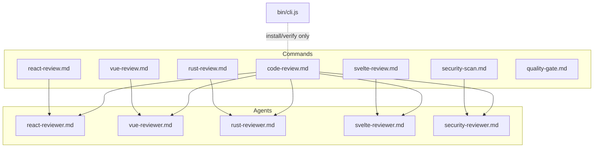
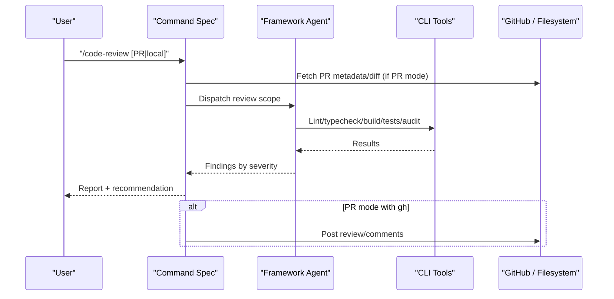
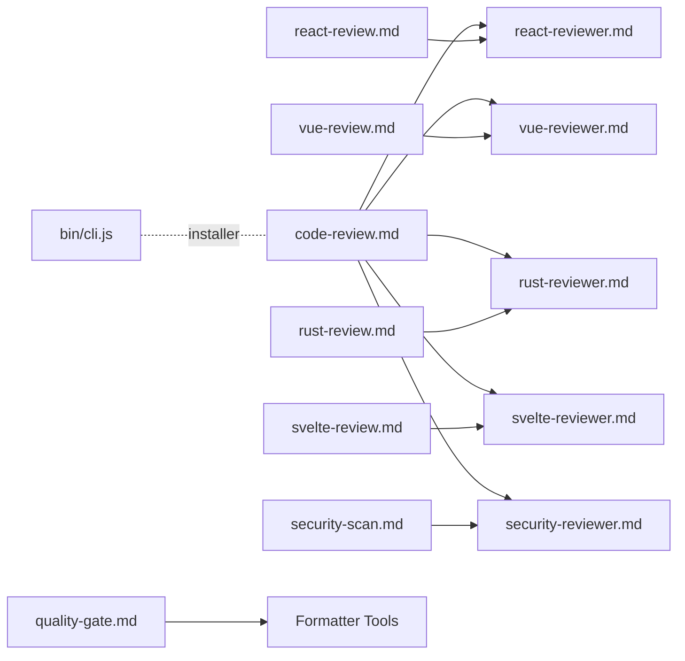

<cite>
**Referenced Files in This Document**
- `fractal-agentic/commands/code-review.md`
- `fractal-agentic/commands/react-review.md`
- `fractal-agentic/commands/vue-review.md`
- `fractal-agentic/commands/rust-review.md`
- `fractal-agentic/commands/svelte-review.md`
- `fractal-agentic/commands/security-scan.md`
- `fractal-agentic/commands/quality-gate.md`
- `fractal-agentic/agents/react-reviewer.md`
- `fractal-agentic/agents/vue-reviewer.md`
- `fractal-agentic/agents/rust-reviewer.md`
- `fractal-agentic/agents/svelte-reviewer.md`
- `fractal-agentic/agents/security-reviewer.md`
- `fractal-agentic/bin/cli.js`
</cite>

## Table of Contents
1. [Introduction](#introduction)
2. [Project Structure](#project-structure)
3. [Core Components](#core-components)
4. [Architecture Overview](#architecture-overview)
5. [Detailed Component Analysis](#detailed-component-analysis)
6. [Dependency Analysis](#dependency-analysis)
7. [Performance Considerations](#performance-considerations)
8. [Troubleshooting Guide](#troubleshooting-guide)
9. [Conclusion](#conclusion)

## Introduction
This document explains the code review and quality assurance commands available in Fractal Agentic. It covers:
- The general code-review command for local uncommitted changes and GitHub PR analysis
- Framework-specific reviewers: react-review, vue-review, rust-review, svelte-review
- Security scanning with AgentShield via security-scan
- Formatter compliance via quality-gate

You will find usage examples, common flags, output interpretation, and guidance on how these commands integrate with agents and tooling.

## Project Structure
The commands are defined as Markdown specifications under the commands directory. Each command references one or more agents that implement the actual logic. The CLI entry point is provided for installation and verification but does not directly execute review commands; instead, commands are invoked by the host environment (e.g., Claude, Codex).

**Diagram sources**
- `fractal-agentic/commands/code-review.md`
- `fractal-agentic/commands/react-review.md`
- `fractal-agentic/commands/vue-review.md`
- `fractal-agentic/commands/rust-review.md`
- `fractal-agentic/commands/svelte-review.md`
- `fractal-agentic/commands/security-scan.md`
- `fractal-agentic/commands/quality-gate.md`
- `fractal-agentic/agents/react-reviewer.md`
- `fractal-agentic/agents/vue-reviewer.md`
- `fractal-agentic/agents/rust-reviewer.md`
- `fractal-agentic/agents/svelte-reviewer.md`
- `fractal-agentic/agents/security-reviewer.md`
- `fractal-agentic/bin/cli.js`

**Section sources**
- `fractal-agentic/bin/cli.js`

## Core Components
- General code-review: Supports local uncommitted changes and GitHub PR review modes. Detects project type, runs validation, categorizes findings, and posts reviews when possible.
- react-review: Focuses on React/JSX hook correctness, render performance, server/client boundaries, accessibility, and React-specific security.
- vue-review: Focuses on Vue Composition API reactivity, composable patterns, template security, accessibility, and Vue-specific performance.
- rust-review: Focuses on ownership, lifetimes, error handling, unsafe usage, and idiomatic Rust patterns.
- svelte-review: Focuses on Svelte 5 runes usage, SvelteKit data flow, snippet templates, and indented SASS discipline.
- security-scan: Runs AgentShield to scan agent, hook, MCP, permission, and secret surfaces; produces a prioritized remediation plan.
- quality-gate: Runs formatter checks per file using Biome/Prettier/gofmt/ruff based on file type; supports fix and strict modes via environment variables.

**Section sources**
- `fractal-agentic/commands/code-review.md`
- `fractal-agentic/commands/react-review.md`
- `fractal-agentic/commands/vue-review.md`
- `fractal-agentic/commands/rust-review.md`
- `fractal-agentic/commands/svelte-review.md`
- `fractal-agentic/commands/security-scan.md`
- `fractal-agentic/commands/quality-gate.md`

## Architecture Overview
The commands act as orchestrators that:
- Identify relevant files from diffs or PR metadata
- Invoke language/framework-specific agents
- Run automated checks (lint, typecheck, build, tests, audits)
- Produce severity-ranked reports and recommendations
- Optionally publish results to GitHub or CI artifacts

**Diagram sources**
- `fractal-agentic/commands/code-review.md`
- `fractal-agentic/agents/react-reviewer.md`
- `fractal-agentic/agents/vue-reviewer.md`
- `fractal-agentic/agents/rust-reviewer.md`
- `fractal-agentic/agents/svelte-reviewer.md`

## Detailed Component Analysis

### General Code Review (/code-review)
- Modes:
  - Local review: Gathers changed files, reads full content, applies security and quality checks, generates report, blocks commit if critical/high issues found.
  - PR review: Parses PR number/URL/branch, fetches diff and full files at head revision, builds context (project rules, planning artifacts), runs validation per project type, decides APPROVE/REQUEST_CHANGES/BLOCK, publishes review to GitHub, outputs summary.
- Validation detection:
  - Node/TypeScript: typecheck, lint, test, build
  - Rust: clippy, test, build
  - Go: vet, test, build
  - Python: pytest
- Output: Severity-ranked findings with file/line, description, suggested fix; decision and next steps.

Usage examples:
- Local: `/code-review`
- PR by number: `/code-review 42`
- PR by URL: `/code-review https://github.com/org/repo/pull/42`
- PR by branch: `/code-review feature/my-branch`

Output interpretation:
- Decision: APPROVE | REQUEST_CHANGES | BLOCK
- Counts by severity: CRITICAL/HIGH/MEDIUM/LOW
- Validation results: Pass/Fail/Skipped per check
- Artifacts: Review markdown path and GitHub link

Edge cases:
- No `gh` CLI: Fallback to local-only review with warnings
- Diverged branches: Suggest fetch/rebase before review
- Large PRs: Warn about scope and focus order

**Section sources**
- `fractal-agentic/commands/code-review.md`

### React Review (/react-review)
- Scope: Hook correctness, render performance, server/client boundaries, accessibility, React-specific security.
- Automated checks: eslint with react-hooks/jsx-a11y, tsc typecheck, npm audit.
- Categories: CRITICAL/HIGH/MEDIUM with concrete examples and fixes.
- Approval criteria: Approve if no CRITICAL/HIGH; Warning if MEDIUM only; Block otherwise.

Usage example:
- `/react-review`

Output interpretation:
- Files reviewed, lint/typecheck status, issues by severity, recommendation.

Integration:
- Run `/react-build` first if needed, then `/react-test`, then `/react-review`.
- For TSX/JSX PRs, also run typescript-reviewer alongside.

**Section sources**
- `fractal-agentic/commands/react-review.md`
- `fractal-agentic/agents/react-reviewer.md`

### Vue Review (/vue-review)
- Scope: Composition API correctness, reactivity pitfalls, composable patterns, template security, accessibility, Vue performance.
- Automated checks: eslint with eslint-plugin-vue, vue-tsc, npm audit.
- Categories: CRITICAL/HIGH/MEDIUM with concrete examples and fixes.
- Approval criteria: Approve if no CRITICAL/HIGH; Warning if MEDIUM only; Block otherwise.

Usage example:
- `/vue-review`

Output interpretation:
- Files reviewed, lint/typecheck status, issues by severity, recommendation.

Integration:
- Ensure build passes, run tests, then `/vue-review`.
- For `.vue`/Vue-related PRs, also run typescript-reviewer alongside.

**Section sources**
- `fractal-agentic/commands/vue-review.md`
- `fractal-agentic/agents/vue-reviewer.md`

### Rust Review (/rust-review)
- Scope: Ownership, lifetimes, error handling, unsafe usage, idiomatic patterns.
- Automated checks: cargo check, clippy -- -D warnings, cargo fmt --check, cargo test, optional cargo audit.
- Categories: CRITICAL/HIGH/MEDIUM with concrete examples and fixes.
- Approval criteria: Approve if no CRITICAL/HIGH; Warning if MEDIUM only; Block otherwise.

Usage example:
- `/rust-review`

Output interpretation:
- Static analysis results, issues by severity, recommendation.

Integration:
- Use `/rust-test` and `/rust-build` as needed before `/rust-review`.

**Section sources**
- `fractal-agentic/commands/rust-review.md`
- `fractal-agentic/agents/rust-reviewer.md`

### Svelte Review (/svelte-review)
- Scope: Svelte 5 runes ($state, $derived, $effect, $props, $bindable), snippets, SvelteKit data flow (+page.server.ts, load/actions), indented SASS discipline, component reactivity boundaries.
- Output: Severity-ranked report with actionable diffs.

Usage example:
- `/svelte-review [file-path or diff-target]`

Output interpretation:
- Executive summary, runes audit, SvelteKit architecture, styling compliance, concrete diffs.

**Section sources**
- `fractal-agentic/commands/svelte-review.md`
- `fractal-agentic/agents/svelte-reviewer.md`

### Security Scan (/security-scan)
- Purpose: Run AgentShield against agent, hook, MCP, permission, and secret surfaces; produce prioritized remediation plan.
- Usage: `/security-scan [path] [--format text|json|markdown|html] [--min-severity low|medium|high|critical] [--fix]`
- Deterministic engine: Uses packaged scanner; do not invent findings—use AgentShield output as source of truth.
- Review checklist: Identify active runtime findings, separate lower-confidence inventory, return exact paths/severity/confidence/remediation/auto-fixability, re-run after fixes.
- Output contract: Security grade/score, counts by severity/confidence, critical/high findings, lower-confidence group, remediation order, commands run.

CI pattern:
- Use AgentShield action with fail-on-findings for enforced gates.

**Section sources**
- `fractal-agentic/commands/security-scan.md`
- `fractal-agentic/agents/security-reviewer.md`

### Quality Gate (/quality-gate)
- Purpose: Single-file formatter quality gate driven by hook input, not CLI flags.
- How it works: Reads target from stdin JSON (`tool_input.file_path`; toggles via env vars:
  - `ECC_QUALITY_GATE_FIX=true` to apply formatting fixes
  - `ECC_QUALITY_GATE_STRICT=true` to log failures as gate failures
- Coverage by file type:
  - `.ts/.tsx/.js/.jsx/.json/.md`: Biome check or Prettier --check (Biome skipped for JS/TS due to post-edit-format)
  - `.go`: gofmt
  - `.py`: ruff format
- Usage: Pipe hook-style JSON into the script; optionally set env toggles; report findings and remediation steps.

Example:
- echo '{"tool_input":{"file_path":"src/example.ts"}}' | ECC_QUALITY_GATE_FIX=true node scripts/hooks/quality-gate.js

Notes:
- Lint and type checks are not part of this gate; use verification-loop skill or language verification skills.

**Section sources**
- `fractal-agentic/commands/quality-gate.md`

## Dependency Analysis
- Commands depend on agents for domain expertise and on external tools for validation (eslint, tsc, vue-tsc, cargo, go, pytest, npm audit, gh CLI).
- The CLI installer does not execute review commands; it installs plugin resources for hosts.

**Diagram sources**
- `fractal-agentic/commands/code-review.md`
- `fractal-agentic/commands/react-review.md`
- `fractal-agentic/commands/vue-review.md`
- `fractal-agentic/commands/rust-review.md`
- `fractal-agentic/commands/svelte-review.md`
- `fractal-agentic/commands/security-scan.md`
- `fractal-agentic/commands/quality-gate.md`
- `fractal-agentic/agents/react-reviewer.md`
- `fractal-agentic/agents/vue-reviewer.md`
- `fractal-agentic/agents/rust-reviewer.md`
- `fractal-agentic/agents/svelte-reviewer.md`
- `fractal-agentic/agents/security-reviewer.md`
- `fractal-agentic/bin/cli.js`

**Section sources**
- `fractal-agentic/bin/cli.js`

## Performance Considerations
- Prefer targeted diffs to limit scope (e.g., *.tsx/*.jsx for React, *.vue for Vue, *.rs for Rust).
- Skip heavy checks when unnecessary (e.g., typecheck for JS-only projects).
- Use incremental validation where possible (e.g., cargo check vs full build).
- For large PRs, prioritize source changes over tests/config/docs to keep feedback fast.

[No sources needed since this section provides general guidance]

## Troubleshooting Guide
- Missing `gh` CLI:
  - PR mode falls back to local-only review; install `gh` to enable publishing inline comments and PR reviews.
- Build/Test Failures:
  - Fix underlying issues before reviewing; many commands stop early on failed validations.
- Diverged Branches:
  - Rebase onto base branch before review to avoid stale diffs.
- Large PRs:
  - Expect longer review times; consider splitting changes into smaller PRs.
- Formatter Gate:
  - Ensure correct stdin JSON shape and env toggles; verify formatter availability (Biome/Prettier/gofmt/ruff).

**Section sources**
- `fractal-agentic/commands/code-review.md`
- `fractal-agentic/commands/quality-gate.md`

## Conclusion
Fractal Agentic’s code review and quality commands provide a consistent, extensible framework for enforcing correctness, security, and style across multiple languages and frameworks. By combining command specs with specialized agents and robust tooling, teams can automate high-quality reviews locally and on GitHub, while maintaining clear, actionable feedback.

[No sources needed since this section summarizes without analyzing specific files]