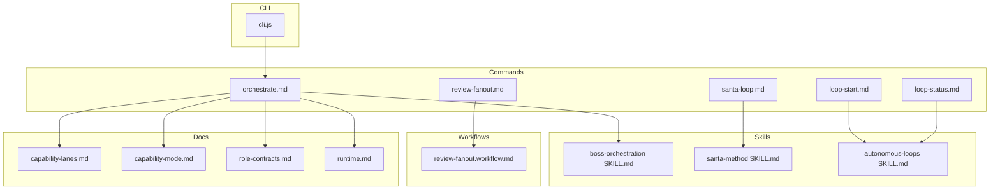
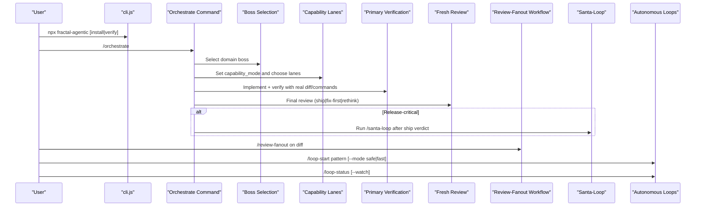
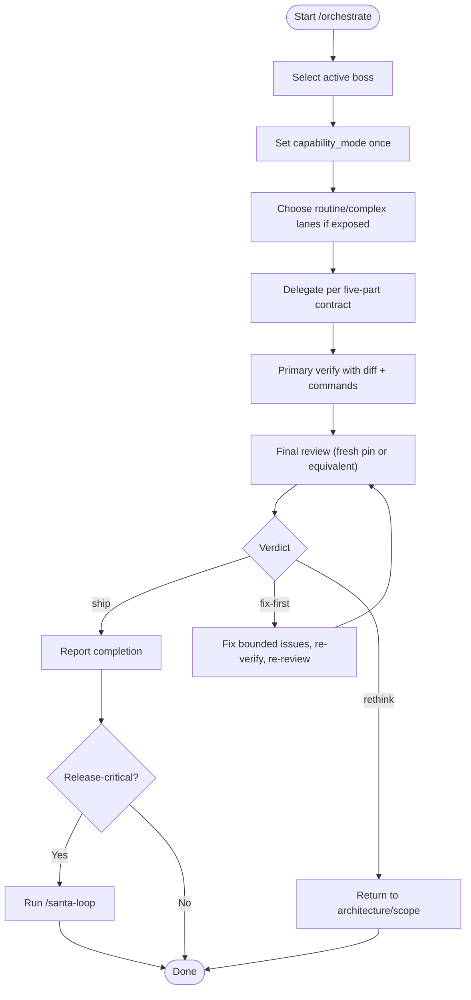
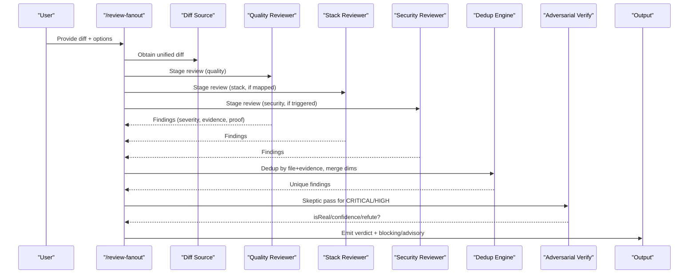
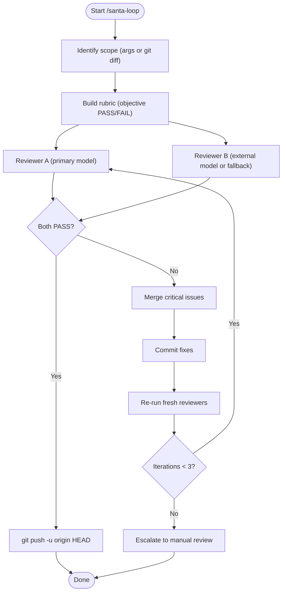
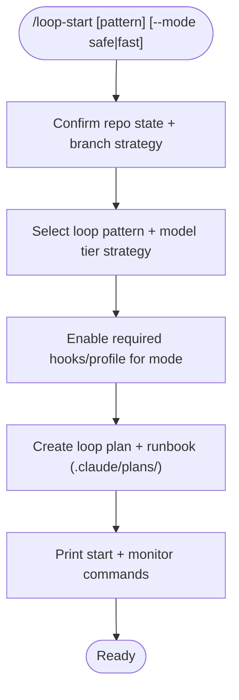
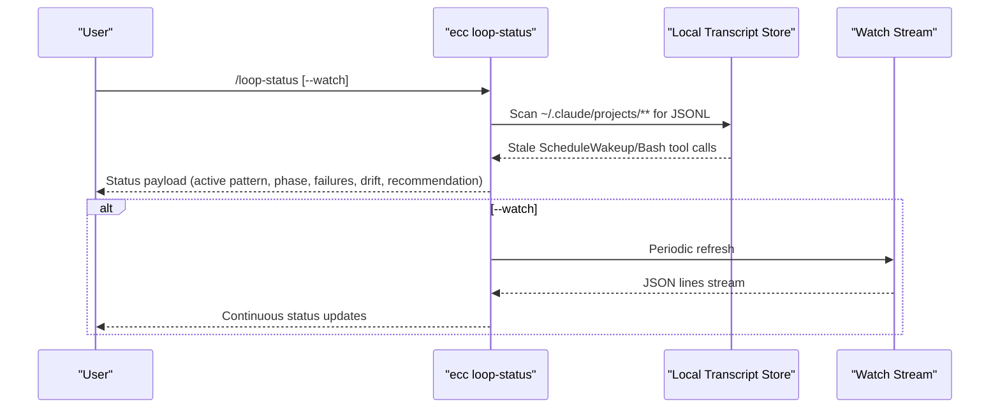
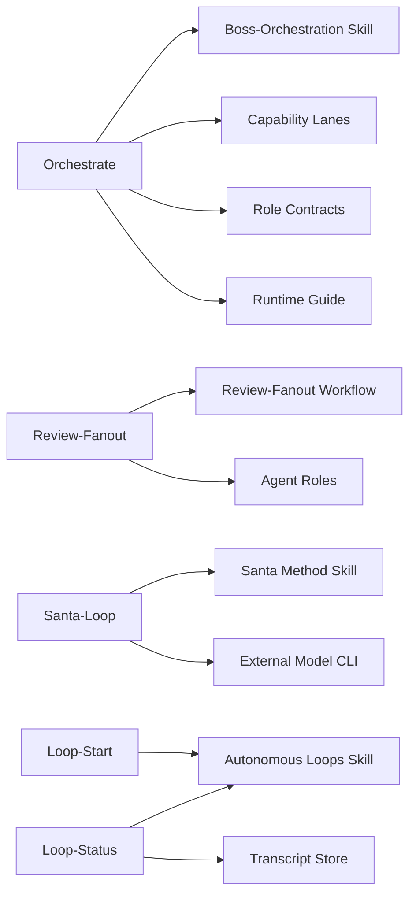

<cite>
**Referenced Files in This Document**
- `commands/orchestrate.md`
- `commands/review-fanout.md`
- `commands/santa-loop.md`
- `commands/loop-start.md`
- `commands/loop-status.md`
- `skills/boss-orchestration/SKILL.md`
- `docs/orchestration/capability-lanes.md`
- `skills/boss-orchestration/references/capability-mode.md`
- `skills/boss-orchestration/references/role-contracts.md`
- `docs/orchestration/runtime.md`
- `workflows/review-fanout.workflow.md`
- `skills/santa-method/SKILL.md`
- `skills/autonomous-loops/SKILL.md`
- `bin/cli.js`
</cite>

## Table of Contents
1. Introduction
2. Project Structure
3. Core Components
4. Architecture Overview
5. Detailed Component Analysis
6. Dependency Analysis
7. Performance Considerations
8. Troubleshooting Guide
9. Conclusion

## Introduction
This document explains Fractal Agentic’s orchestration and workflow commands that govern the delivery runtime, multi-dimension review, adversarial dual-review convergence, and autonomous loop management. It covers:
- The main orchestrate command for entering the delivery runtime with domain boss selection, capability lanes, verification, and mandatory fresh review.
- Review-fanout for multi-dimension review with adversarial verification of critical/high findings.
- Santa-loop for adversarial dual-review convergence before shipping release-critical changes.
- Loop-start and loop-status for managing autonomous loops with safety defaults and progress monitoring.
- Practical examples of workflow sequences, error handling, and integration patterns.

## Project Structure
The orchestration surface is defined by command documentation files under commands/, supporting skills under skills/, and workflow contracts under workflows/. The CLI entrypoint handles installation and project integration but delegates execution to host agents and scripts.

**Diagram sources**
- `commands/orchestrate.md`
- `commands/review-fanout.md`
- `commands/santa-loop.md`
- `commands/loop-start.md`
- `commands/loop-status.md`
- `skills/boss-orchestration/SKILL.md`
- `skills/santa-method/SKILL.md`
- `skills/autonomous-loops/SKILL.md`
- `docs/orchestration/capability-lanes.md`
- `skills/boss-orchestration/references/capability-mode.md`
- `skills/boss-orchestration/references/role-contracts.md`
- `docs/orchestration/runtime.md`
- `workflows/review-fanout.workflow.md`
- `bin/cli.js`

**Section sources**
- `commands/orchestrate.md`
- `commands/review-fanout.md`
- `commands/santa-loop.md`
- `commands/loop-start.md`
- `commands/loop-status.md`
- `skills/boss-orchestration/SKILL.md`
- `docs/orchestration/capability-lanes.md`
- `skills/boss-orchestration/references/capability-mode.md`
- `skills/boss-orchestration/references/role-contracts.md`
- `docs/orchestration/runtime.md`
- `workflows/review-fanout.workflow.md`
- `bin/cli.js`

## Core Components
- Orchestrate: Enters the executable delivery runtime; selects a domain boss; sets capability mode; chooses routine/complex/fresh-review lanes when available; verifies evidence; obtains a final review with exactly one verdict (ship | fix-first | rethink).
- Review-fanout: Multi-dimension review on a diff across quality, stack, and security dimensions with adversarial verification of CRITICAL/HIGH findings.
- Santa-loop: Adversarial dual-review convergence using two independent reviewers; both must approve before pushing; supports up to three fix rounds.
- Loop-start: Starts a managed autonomous loop pattern with safety defaults and explicit stop conditions.
- Loop-status: Inspects active loop state, progress, failure signals, and recommended intervention; supports watch mode and JSON output.

**Section sources**
- `commands/orchestrate.md`
- `commands/review-fanout.md`
- `commands/santa-loop.md`
- `commands/loop-start.md`
- `commands/loop-status.md`

## Architecture Overview
The orchestration system composes a runtime kernel (boss-orchestration skill), capability lanes (routine/complex implementer and fresh reviewer), and specialized workflows (review-fanout, santa-loop). Autonomous loops are governed by loop-start and monitored via loop-status.

**Diagram sources**
- `bin/cli.js`
- `commands/orchestrate.md`
- `skills/boss-orchestration/SKILL.md`
- `docs/orchestration/capability-lanes.md`
- `skills/boss-orchestration/references/role-contracts.md`
- `commands/review-fanout.md`
- `workflows/review-fanout.workflow.md`
- `commands/santa-loop.md`
- `commands/loop-start.md`
- `commands/loop-status.md`

## Detailed Component Analysis

### Orchestrate Command
Purpose: Enter the delivery runtime, select a domain boss, set capability mode, delegate implementation through lanes, verify outcomes, and obtain a final review with a single verdict.

Key behaviors:
- Non-blocking policy: missing plugin support or pins never block product work; degrade gracefully and continue.
- Capability lanes: routine vs complex implementer and fresh reviewer; use exposed types only; otherwise degrade.
- Five-part contract: objective, ownership, interfaces, constraints (including boss prompts), verification steps, and return receipt.
- Final review: prefer fresh reviewer pin; otherwise domain specialist or structured self-review; verdict must be exactly one of ship | fix-first | rethink.
- Post-ship: for release-critical work, run /santa-loop after a ship verdict when applicable.

**Diagram sources**
- `commands/orchestrate.md`
- `skills/boss-orchestration/SKILL.md`
- `docs/orchestration/capability-lanes.md`
- `skills/boss-orchestration/references/capability-mode.md`
- `skills/boss-orchestration/references/role-contracts.md`
- `docs/orchestration/runtime.md`

**Section sources**
- `commands/orchestrate.md`
- `skills/boss-orchestration/SKILL.md`
- `docs/orchestration/capability-lanes.md`
- `skills/boss-orchestration/references/capability-mode.md`
- `skills/boss-orchestration/references/role-contracts.md`
- `docs/orchestration/runtime.md`

### Review-Fanout Command
Purpose: Run a multi-dimension review on a unified diff with adversarial verification of CRITICAL/HIGH findings. Works on any host without requiring native Workflow API.

Workflow highlights:
- Inputs: unified diff (git diff HEAD/--cached or PR/range), optional language detection, changedFiles for security triggers.
- Dimensions: Quality (code-reviewer), Stack (e.g., svelte-reviewer, rust-reviewer), Security (security-reviewer when triggered).
- Deduplication: by file + normalized evidence; keep strictest severity; record dimensions.
- Adversarial verify: independent skeptic pass for each unique CRITICAL/HIGH; refute only if isReal=false and confidence ≥ 0.8; unverifiable stays blocking.
- Output: APPROVE or CHANGES_REQUESTED with blocking/advisory lists; map to ship candidate or fix-first.

**Diagram sources**
- `commands/review-fanout.md`
- `workflows/review-fanout.workflow.md`

**Section sources**
- `commands/review-fanout.md`
- `workflows/review-fanout.workflow.md`

### Santa-Loop Command
Purpose: Adversarial dual-review convergence loop where two independent reviewers must both approve before code ships. Supports up to three fix rounds.

Key behaviors:
- Identify scope from arguments or uncommitted changes.
- Build rubric appropriate to file types with objective PASS/FAIL criteria.
- Launch two reviewers in parallel (primary agent model + external model when available); context isolation enforced.
- Verdict gate: both PASS → NICE (push); either FAIL → NAUGHTY (merge critical issues, commit fixes, re-run fresh reviewers).
- Max iterations: 3; beyond that, escalate to manual review.
- Push only after NICE; never mid-loop.

**Diagram sources**
- `commands/santa-loop.md`
- `skills/santa-method/SKILL.md`

**Section sources**
- `commands/santa-loop.md`
- `skills/santa-method/SKILL.md`

### Loop-Start Command
Purpose: Start a managed autonomous loop pattern with safety defaults and explicit stop conditions.

Supported patterns: sequential, continuous-pr, rfc-dag, infinite.
Modes: safe (strict quality gates/checkpoints), fast (reduced gates).
Safety checks: tests pass before first iteration, ECC_HOOK_PROFILE not disabled globally, explicit stop condition present.

**Diagram sources**
- `commands/loop-start.md`
- `skills/autonomous-loops/SKILL.md`

**Section sources**
- `commands/loop-start.md`
- `skills/autonomous-loops/SKILL.md`

### Loop-Status Command
Purpose: Inspect active loop state, progress, failure signals, and recommended intervention. Supports cross-session CLI scanning of local transcripts and watch mode.

Usage:
- /loop-status [--watch]
- CLI: ecc loop-status --json, --home, --transcript, --bash-timeout-seconds, --exit-code, --watch, --write-dir.

Outputs:
- Active loop pattern, current phase, last successful checkpoint.
- Failing checks, estimated time/cost drift.
- Recommended intervention (continue/pause/stop).

**Diagram sources**
- `commands/loop-status.md`
- `skills/autonomous-loops/SKILL.md`

**Section sources**
- `commands/loop-status.md`
- `skills/autonomous-loops/SKILL.md`

## Dependency Analysis
- Orchestrate depends on boss-orchestration skill, capability lanes, role contracts, and runtime guidance.
- Review-fanout depends on the review-fanout workflow contract and agent roles.
- Santa-loop depends on the santa-method skill and external model availability.
- Loop-start and loop-status depend on the autonomous-loops skill and transcript storage.

**Diagram sources**
- `skills/boss-orchestration/SKILL.md`
- `docs/orchestration/capability-lanes.md`
- `skills/boss-orchestration/references/role-contracts.md`
- `docs/orchestration/runtime.md`
- `commands/review-fanout.md`
- `workflows/review-fanout.workflow.md`
- `commands/santa-loop.md`
- `skills/santa-method/SKILL.md`
- `commands/loop-start.md`
- `commands/loop-status.md`
- `skills/autonomous-loops/SKILL.md`

**Section sources**
- `skills/boss-orchestration/SKILL.md`
- `docs/orchestration/capability-lanes.md`
- `skills/boss-orchestration/references/role-contracts.md`
- `docs/orchestration/runtime.md`
- `commands/review-fanout.md`
- `workflows/review-fanout.workflow.md`
- `commands/santa-loop.md`
- `skills/santa-method/SKILL.md`
- `commands/loop-start.md`
- `commands/loop-status.md`
- `skills/autonomous-loops/SKILL.md`

## Performance Considerations
- Orchestrate degrades gracefully when pins are unavailable; avoid unnecessary preflight checks on every micro-edit.
- Review-fanout runs dimensions in parallel when possible; dedup reduces redundant work; adversarial verify targets only CRITICAL/HIGH.
- Santa-loop limits iterations to three; external models preferred for independence; sandbox flags reduce mutation risk during review.
- Loop-start enforces safety defaults; loop-status provides efficient monitoring via JSON streams and snapshots.

[No sources needed since this section provides general guidance]

## Troubleshooting Guide
Common issues and resolutions:
- Missing capability pins: capability_mode will be degraded or pinned_partial; proceed with primary/general agents and note pins: unverified|partial.
- Empty diff in review-fanout: stop with “nothing to review”; ensure correct diff source.
- Santa-loop escalation: after three rounds, manual review required; do not push unresolved issues.
- Loop wedging: use loop-status with --watch and JSON output; inspect stale ScheduleWakeup or Bash tool calls; adjust bash timeout if needed.

**Section sources**
- `skills/boss-orchestration/references/capability-mode.md`
- `commands/review-fanout.md`
- `commands/santa-loop.md`
- `commands/loop-status.md`

## Conclusion
Fractal Agentic’s orchestration commands provide a robust, non-blocking delivery runtime with clear separation of concerns: boss selection, capability lanes, verification, and final review. Review-fanout adds multi-dimension adversarial verification, while santa-loop ensures high-stakes releases converge through independent dual reviews. Autonomous loops are manageable via loop-start and observable via loop-status, enabling safe, scalable automation. Together, these components form a cohesive framework for reliable, auditable, and high-quality software delivery.

[No sources needed since this section summarizes without analyzing specific files]