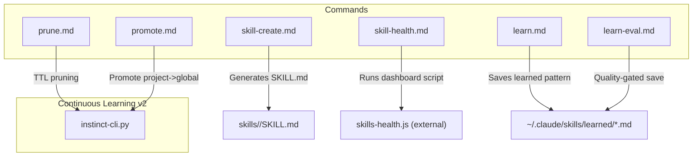
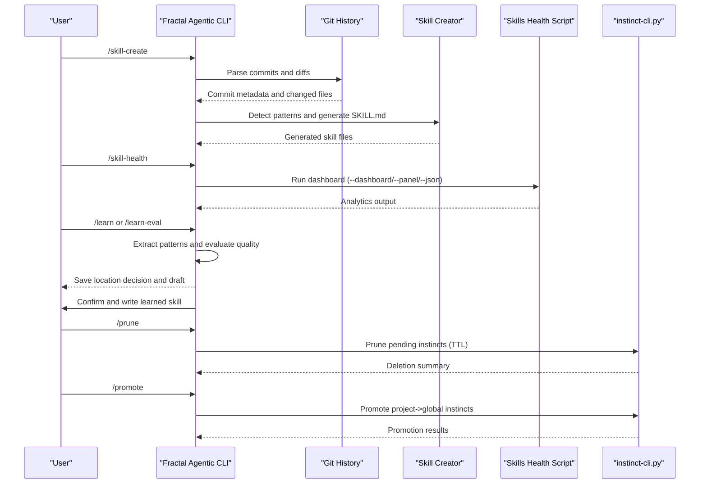
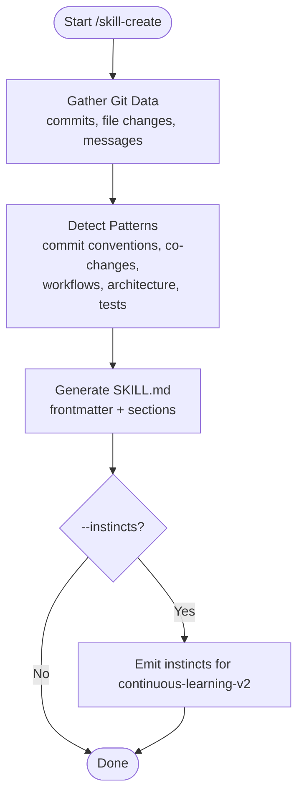
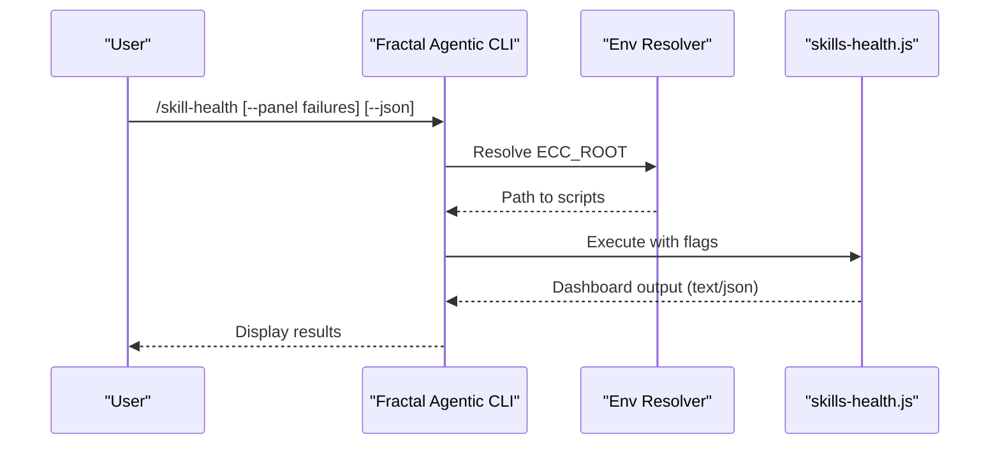
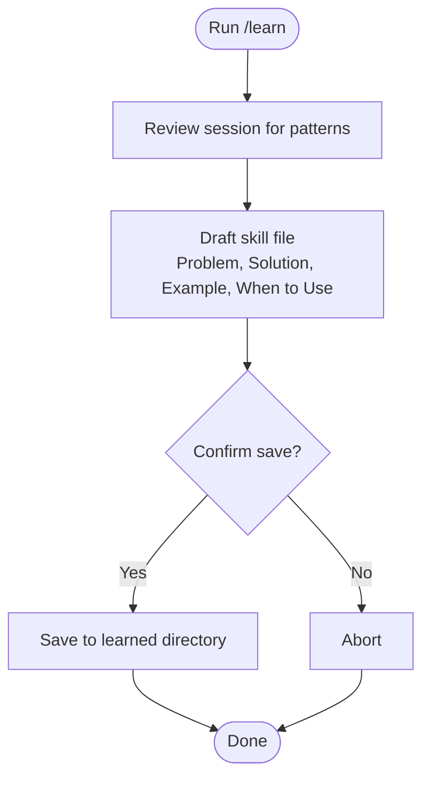
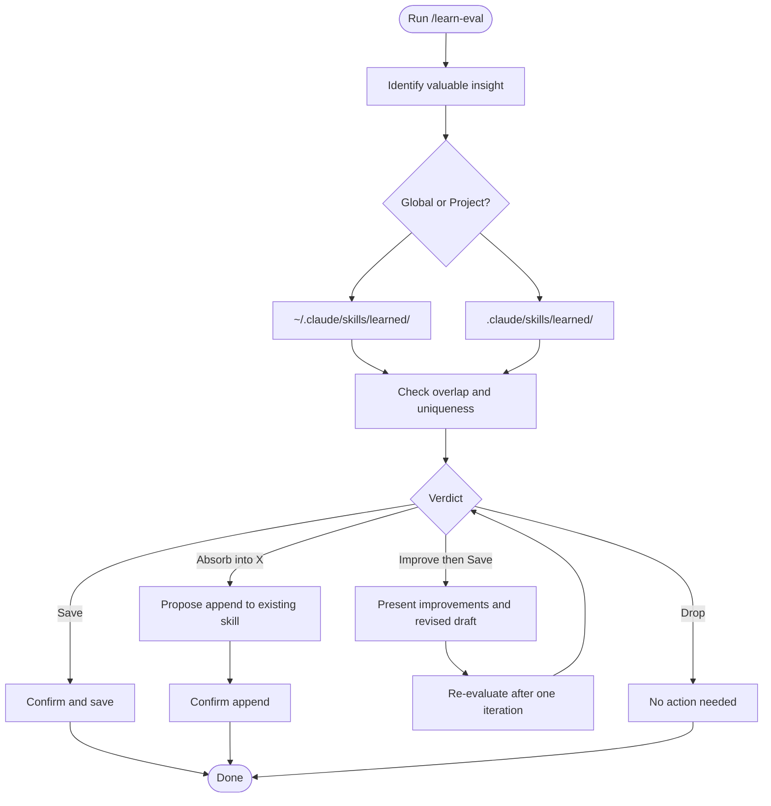
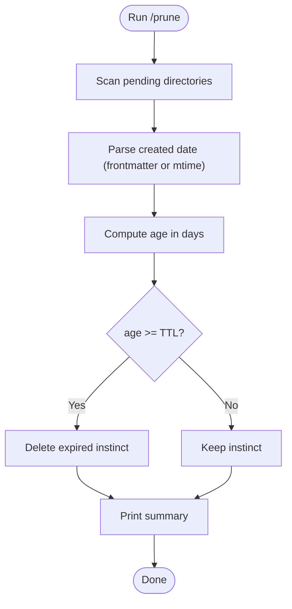
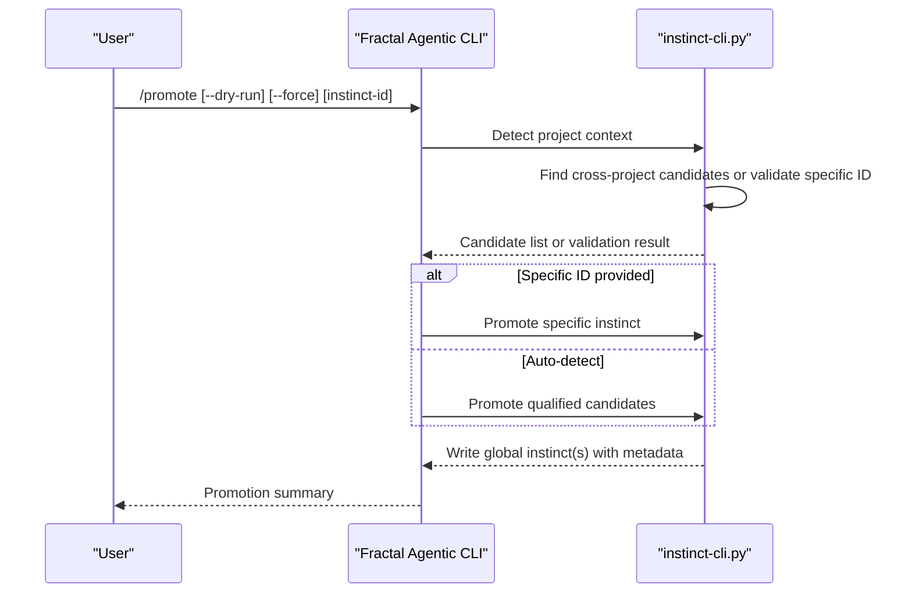
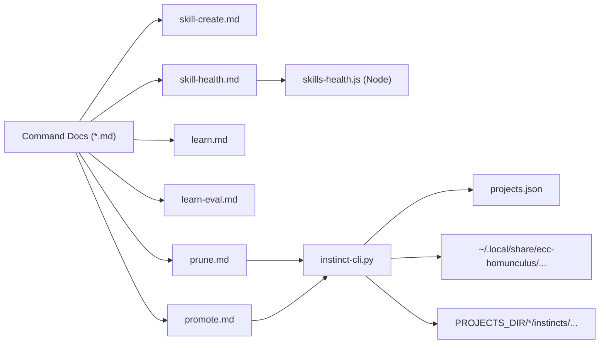

<cite>
**Referenced Files in This Document**
- `fractal-agentic/commands/skill-create.md`
- `fractal-agentic/commands/skill-health.md`
- `fractal-agentic/commands/learn.md`
- `fractal-agentic/commands/learn-eval.md`
- `fractal-agentic/commands/prune.md`
- `fractal-agentic/commands/promote.md`
- `fractal-agentic/skills/continuous-learning-v2/scripts/instinct-cli.py`
</cite>

## Table of Contents
1. [Introduction](#introduction)
2. [Project Structure](#project-structure)
3. [Core Components](#core-components)
4. [Architecture Overview](#architecture-overview)
5. [Detailed Component Analysis](#detailed-component-analysis)
6. [Dependency Analysis](#dependency-analysis)
7. [Performance Considerations](#performance-considerations)
8. [Troubleshooting Guide](#troubleshooting-guide)
9. [Conclusion](#conclusion)
10. [Appendices](#appendices)

## Introduction
This document explains the skill management commands in Fractal Agentic that help you create, evaluate, and maintain skills and instincts across projects. It covers:
- skill-create: Analyze local git history to extract coding patterns and generate SKILL.md files.
- skill-health: Show a skill portfolio health dashboard with analytics.
- learn and learn-eval: Extract reusable patterns from sessions with self-evaluation before saving.
- prune: Delete pending instincts older than 30 days (configurable).
- promote: Move project-scoped instincts to global scope.

These commands enable a practical skill lifecycle: discover patterns, capture them as skills or instincts, evaluate quality, manage scope, and keep your knowledge base healthy over time.

## Project Structure
The relevant command definitions are Markdown-based instructions under the commands directory. The continuous learning subsystem is implemented by a Python CLI for managing instincts across projects and globally.

**Diagram sources**
- `fractal-agentic/commands/skill-create.md#L1-L126`
- `fractal-agentic/commands/skill-health.md#L1-L55`
- `fractal-agentic/commands/learn.md#L1-L79`
- `fractal-agentic/commands/learn-eval.md#L1-L120`
- `fractal-agentic/commands/prune.md#L1-L32`
- `fractal-agentic/commands/promote.md#L1-L42`
- `fractal-agentic/skills/continuous-learning-v2/scripts/instinct-cli.py#L1-L2044`

**Section sources**
- `fractal-agentic/commands/skill-create.md#L1-L126`
- `fractal-agentic/commands/skill-health.md#L1-L55`
- `fractal-agentic/commands/learn.md#L1-L79`
- `fractal-agentic/commands/learn-eval.md#L1-L120`
- `fractal-agentic/commands/prune.md#L1-L32`
- `fractal-agentic/commands/promote.md#L1-L42`
- `fractal-agentic/skills/continuous-learning-v2/scripts/instinct-cli.py#L1-L2044`

## Core Components
- skill-create: Parses git history, detects patterns, and generates SKILL.md files. Optionally produces instincts for continuous-learning-v2.
- skill-health: Executes a dashboard script to visualize success rates, failure clustering, pending amendments, and version history.
- learn: Captures session insights into a structured markdown file under a learned directory.
- learn-eval: Adds a quality gate and save-location decision (Global vs Project) before writing any skill file.
- prune: Removes pending instincts older than a TTL threshold (default 30 days).
- promote: Moves project-scoped instincts to global scope based on cross-project usage and confidence thresholds.

**Section sources**
- `fractal-agentic/commands/skill-create.md#L1-L126`
- `fractal-agentic/commands/skill-health.md#L1-L55`
- `fractal-agentic/commands/learn.md#L1-L79`
- `fractal-agentic/commands/learn-eval.md#L1-L120`
- `fractal-agentic/commands/prune.md#L1-L32`
- `fractal-agentic/commands/promote.md#L1-L42`
- `fractal-agentic/skills/continuous-learning-v2/scripts/instinct-cli.py#L1-L2044`

## Architecture Overview
The skill management system combines Markdown-driven command specifications with a Python-backed instinct lifecycle manager.

**Diagram sources**
- `fractal-agentic/commands/skill-create.md#L1-L126`
- `fractal-agentic/commands/skill-health.md#L1-L55`
- `fractal-agentic/commands/learn.md#L1-L79`
- `fractal-agentic/commands/learn-eval.md#L1-L120`
- `fractal-agentic/commands/prune.md#L1-L32`
- `fractal-agentic/commands/promote.md#L1-L42`
- `fractal-agentic/skills/continuous-learning-v2/scripts/instinct-cli.py#L1-L2044`

## Detailed Component Analysis

### skill-create: Local Git Pattern Extraction and SKILL.md Generation
- Purpose: Analyze repository history to detect commit conventions, co-changed files, workflow sequences, architecture, and testing patterns; then produce SKILL.md files suitable for agents.
- Inputs: Git repository root; optional flags like commit count, output directory, and whether to also generate instincts.
- Outputs: One or more SKILL.md files capturing detected patterns; optionally instincts for continuous-learning-v2.
- Key steps:
  - Gather recent commits and file changes.
  - Identify recurring patterns via heuristics and regex on commit messages and file paths.
  - Generate valid SKILL.md frontmatter and content sections.
  - Optionally emit YAML-like instincts with triggers and confidence.

**Diagram sources**
- `fractal-agentic/commands/skill-create.md#L1-L126`

**Section sources**
- `fractal-agentic/commands/skill-create.md#L1-L126`

### skill-health: Portfolio Health Dashboard
- Purpose: Provide a comprehensive view of skill performance and maintenance needs.
- Panels: Success rate sparklines (30d), failure pattern clustering, pending amendments, version history.
- Usage modes: Full dashboard, specific panel, machine-readable JSON.
- Implementation: Invokes an external Node script with environment resolution for ECC root.

**Diagram sources**
- `fractal-agentic/commands/skill-health.md#L1-L55`

**Section sources**
- `fractal-agentic/commands/skill-health.md#L1-L55`

### learn: Session Pattern Capture
- Purpose: Extract reusable patterns from the current session and save them as candidate skills or guidance.
- Focus areas: Error resolutions, debugging techniques, workarounds, project-specific patterns.
- Output: Structured markdown saved under a learned directory.

**Diagram sources**
- `fractal-agentic/commands/learn.md#L1-L79`

**Section sources**
- `fractal-agentic/commands/learn.md#L1-L79`

### learn-eval: Quality-Gated Pattern Capture
- Purpose: Extend /learn with a quality gate, save-location decision (Global vs Project), and awareness of existing knowledge before saving.
- Process highlights:
  - Determine save location based on reusability across projects.
  - Perform checklist verification against existing skills and memory files.
  - Produce a holistic verdict: Save, Improve then Save, Absorb into existing, or Drop.
  - Follow verdict-specific confirmation flow and save accordingly.

**Diagram sources**
- `fractal-agentic/commands/learn-eval.md#L1-L120`

**Section sources**
- `fractal-agentic/commands/learn-eval.md#L1-L120`

### prune: Pending Instinct TTL Cleanup
- Purpose: Remove pending instincts older than a configurable TTL (default 30 days) that were never promoted.
- Behavior: Scans pending directories (global and per-project), parses creation dates, and deletes expired entries. Supports dry-run and quiet modes.

**Diagram sources**
- `fractal-agentic/commands/prune.md#L1-L32`
- `fractal-agentic/skills/continuous-learning-v2/scripts/instinct-cli.py#L1783-L1827`

**Section sources**
- `fractal-agentic/commands/prune.md#L1-L32`
- `fractal-agentic/skills/continuous-learning-v2/scripts/instinct-cli.py#L1783-L1827`

### promote: Project-to-Global Instinct Promotion
- Purpose: Promote project-scoped instincts to global scope when they appear across multiple projects and meet confidence thresholds.
- Modes: Auto-detect candidates or promote a specific instinct ID; supports dry-run and force options.
- Outcome: Writes promoted instincts to global personal directory with metadata indicating promotion source and timestamp.

**Diagram sources**
- `fractal-agentic/commands/promote.md#L1-L42`
- `fractal-agentic/skills/continuous-learning-v2/scripts/instinct-cli.py#L1275-L1413`

**Section sources**
- `fractal-agentic/commands/promote.md#L1-L42`
- `fractal-agentic/skills/continuous-learning-v2/scripts/instinct-cli.py#L1275-L1413`

## Dependency Analysis
- Command definitions are Markdown documents that instruct how to run underlying tools.
- skill-health depends on an external Node script resolved via environment variables.
- prune and promote depend on the Python instinct CLI which manages project-scoped and global instincts.
- The instinct CLI handles project detection, registry updates, and file operations with safeguards (path validation, URL validation, locking where available).

**Diagram sources**
- `fractal-agentic/commands/skill-health.md#L1-L55`
- `fractal-agentic/commands/prune.md#L1-L32`
- `fractal-agentic/commands/promote.md#L1-L42`
- `fractal-agentic/skills/continuous-learning-v2/scripts/instinct-cli.py#L1-L2044`

**Section sources**
- `fractal-agentic/commands/skill-health.md#L1-L55`
- `fractal-agentic/commands/prune.md#L1-L32`
- `fractal-agentic/commands/promote.md#L1-L42`
- `fractal-agentic/skills/continuous-learning-v2/scripts/instinct-cli.py#L1-L2044`

## Performance Considerations
- skill-create: Large repositories may require limiting commit counts to avoid long analysis times. Prefer targeted ranges for faster feedback.
- skill-health: Dashboard execution depends on the external script’s efficiency; use --panel to focus on specific metrics when possible.
- learn/learn-eval: Quality checks involve scanning existing skills and memory files; keep these directories organized to reduce search overhead.
- prune: TTL scanning is linear over pending files; batch runs periodically to avoid large sweeps.
- promote: Cross-project scanning reads registries and instinct files; ensure project registry is up to date to minimize redundant scans.

[No sources needed since this section provides general guidance]

## Troubleshooting Guide
- Environment resolution for skill-health: Ensure CLAUDE_PLUGIN_ROOT or ECC root is resolvable; verify the Node script path exists.
- Permission issues: Confirm read/write access to learned directories and homunculus storage paths.
- Invalid instinct IDs: Validate IDs conform to allowed characters and length constraints; avoid path traversal.
- Remote imports: Only HTTPS URLs are permitted; host must resolve to a public address.
- Conflicts during import/promotion: Deduplication rules apply; higher-confidence versions win, and stale files are cleaned up within the same scope.

**Section sources**
- `fractal-agentic/commands/skill-health.md#L1-L55`
- `fractal-agentic/skills/continuous-learning-v2/scripts/instinct-cli.py#L187-L233`
- `fractal-agentic/skills/continuous-learning-v2/scripts/instinct-cli.py#L147-L171`
- `fractal-agentic/skills/continuous-learning-v2/scripts/instinct-cli.py#L174-L184`

## Conclusion
Fractal Agentic’s skill management commands provide a cohesive workflow for turning session insights and repository patterns into durable, reusable knowledge. By combining skill generation, health monitoring, quality-gated capture, and instinct lifecycle management, teams can maintain a high-quality, evolving skill portfolio that scales across projects.

[No sources needed since this section summarizes without analyzing specific files]

## Appendices

### Practical Examples and Best Practices
- Create skills from git history:
  - Run the skill creator in the repository root; limit commits if necessary; choose an output directory; optionally generate instincts for continuous learning.
- Monitor skill health:
  - Use the full dashboard initially; drill into failure clustering to identify problem areas; export JSON for automation.
- Capture lessons:
  - After solving non-trivial problems, run the basic learn command; for higher fidelity, use learn-eval to decide scope and ensure uniqueness.
- Maintain instincts:
  - Periodically run prune to remove stale pending instincts; use promote to elevate widely applicable instincts to global scope.

[No sources needed since this section provides general guidance]