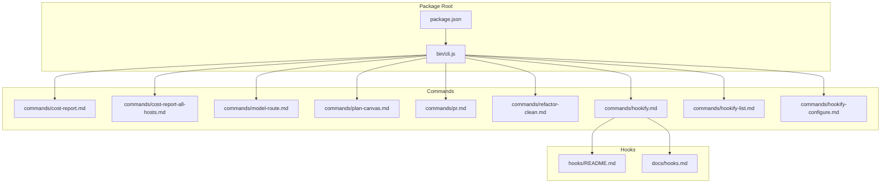
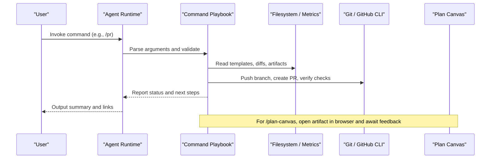
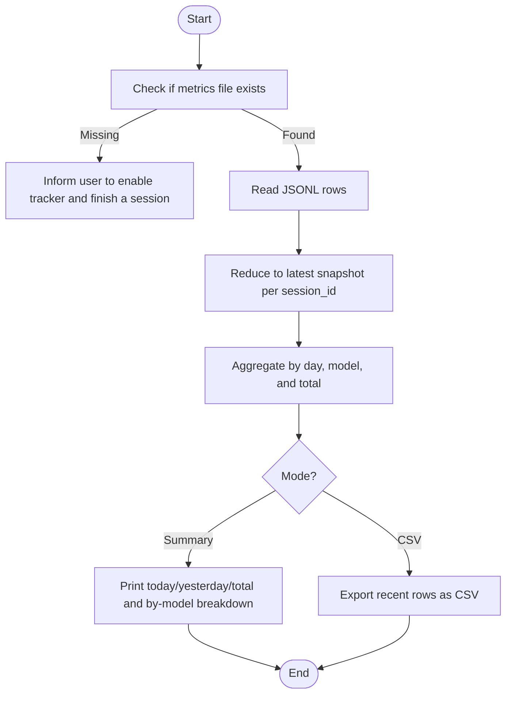
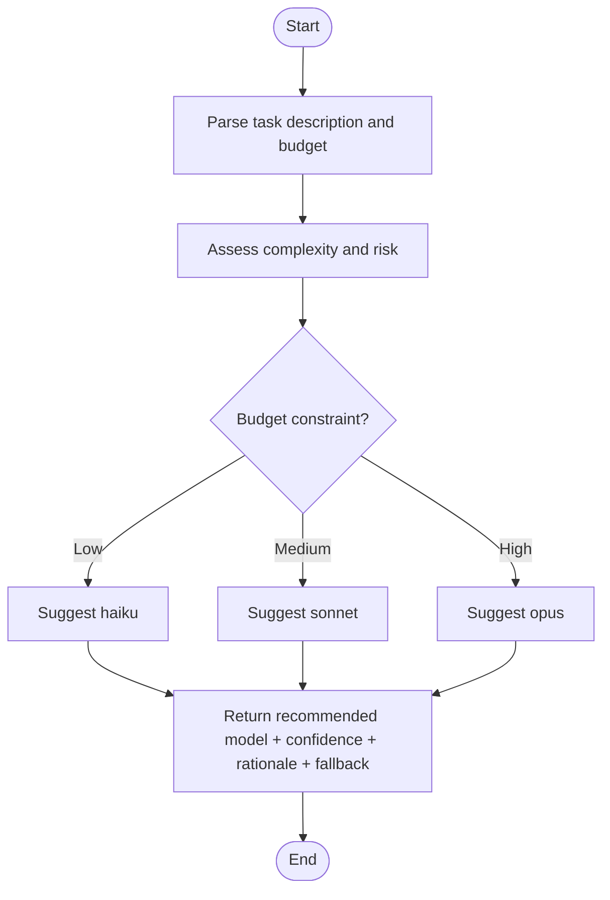
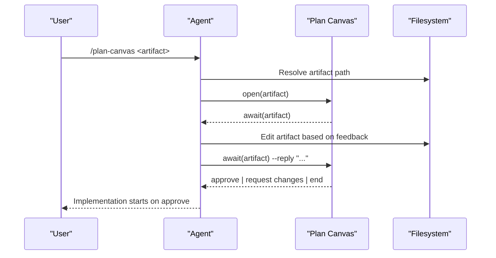
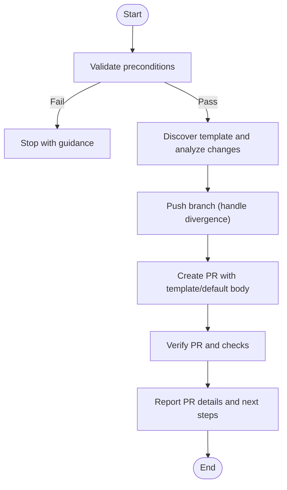
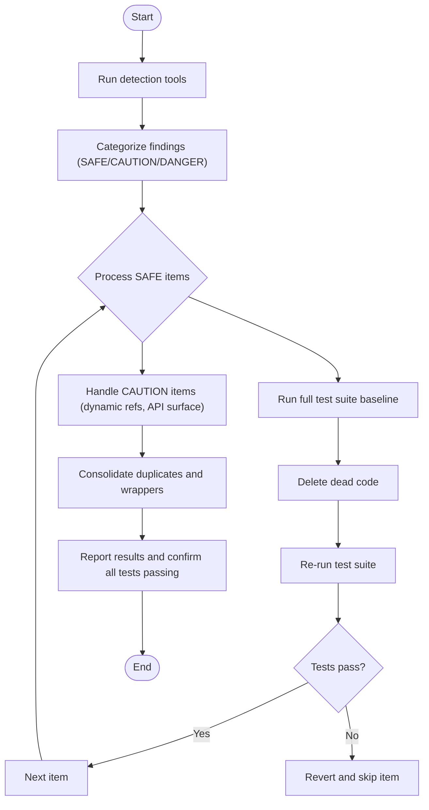
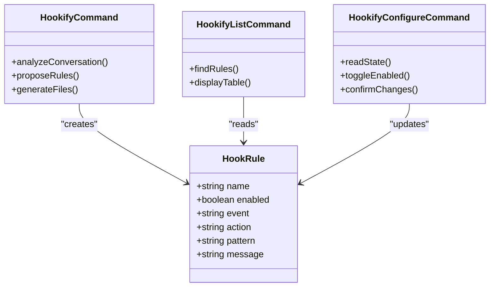

<cite>
**Referenced Files in This Document**
- `fractal-agentic/commands/cost-report.md`
- `fractal-agentic/commands/cost-report-all-hosts.md`
- `fractal-agentic/commands/model-route.md`
- `fractal-agentic/commands/plan-canvas.md`
- `fractal-agentic/commands/pr.md`
- `fractal-agentic/commands/refactor-clean.md`
- `fractal-agentic/commands/hookify.md`
- `fractal-agentic/commands/hookify-list.md`
- `fractal-agentic/commands/hookify-configure.md`
- `fractal-agentic/hooks/README.md`
- `fractal-agentic/docs/hooks.md`
- `fractal-agentic/bin/cli.js`
- `fractal-agentic/package.json`
</cite>

## Table of Contents
1. [Introduction](#introduction)
2. [Project Structure](#project-structure)
3. [Core Components](#core-components)
4. [Architecture Overview](#architecture-overview)
5. [Detailed Component Analysis](#detailed-component-analysis)
6. [Dependency Analysis](#dependency-analysis)
7. [Performance Considerations](#performance-considerations)
8. [Troubleshooting Guide](#troubleshooting-guide)
9. [Conclusion](#conclusion)
10. [Appendices](#appendices)

## Introduction
This document explains the utility and system commands in Fractal Agentic that help you monitor costs, choose models, review plans, create pull requests, clean dead code, and manage hooks to prevent unwanted behaviors. Each command is described with purpose, inputs, processing logic, outputs, examples, and integration patterns. The goal is to make these tools approachable for both new and experienced users while providing enough technical depth for reliable integration.

## Project Structure
Fractal Agentic exposes its capabilities through a set of command definitions under the commands directory. These are invoked by the agent runtime or CLI entry points. The package metadata and CLI installer live at the repository root and bin directory.

**Diagram sources**
- `fractal-agentic/package.json#L1-L59`
- `fractal-agentic/bin/cli.js#L1-L148`
- `fractal-agentic/commands/cost-report.md#L1-L82`
- `fractal-agentic/commands/cost-report-all-hosts.md#L1-L57`
- `fractal-agentic/commands/model-route.md#L1-L32`
- `fractal-agentic/commands/plan-canvas.md#L1-L46`
- `fractal-agentic/commands/pr.md#L1-L189`
- `fractal-agentic/commands/refactor-clean.md#L1-L88`
- `fractal-agentic/commands/hookify.md#L1-L51`
- `fractal-agentic/commands/hookify-list.md#L1-L22`
- `fractal-agentic/commands/hookify-configure.md#L1-L15`
- `fractal-agentic/hooks/README.md#L1-L124`
- `fractal-agentic/docs/hooks.md#L1-L128`

**Section sources**
- `fractal-agentic/package.json#L1-L59`
- `fractal-agentic/bin/cli.js#L1-L148`

## Core Components
- cost-report: Summarizes coding agent spend from metrics logs produced by the stop:cost-tracker hook. Supports console summary and CSV export.
- model-route: Recommends an optimal model tier based on task complexity, risk, and budget constraints.
- plan-canvas: Opens plan artifacts or HTML files in a browser-based Plan Canvas for annotation and approval workflows.
- pr: Creates GitHub PRs from the current branch with template discovery, change analysis, push, creation, verification, and reporting.
- refactor-clean: Identifies and removes dead code safely with test verification at each step.
- hookify suite (hookify, hookify-list, hookify-configure): Manages user-authored rules to prevent unwanted agent behaviors via event-driven hooks.

**Section sources**
- `fractal-agentic/commands/cost-report.md#L1-L82`
- `fractal-agentic/commands/model-route.md#L1-L32`
- `fractal-agentic/commands/plan-canvas.md#L1-L46`
- `fractal-agentic/commands/pr.md#L1-L189`
- `fractal-agentic/commands/refactor-clean.md#L1-L88`
- `fractal-agentic/commands/hookify.md#L1-L51`
- `fractal-agentic/commands/hookify-list.md#L1-L22`
- `fractal-agentic/commands/hookify-configure.md#L1-L15`

## Architecture Overview
The commands operate as declarative playbooks executed by the agent runtime. They interact with local filesystems, git, and optional external tooling (e.g., gh CLI). Hooks provide lifecycle automation across hosts.

[No sources needed since this diagram shows conceptual workflow, not actual code structure]

## Detailed Component Analysis

### Cost Report (/cost-report)
Purpose: Generate a local cost report from ECC’s stop:cost-tracker metrics log. It reads cumulative session snapshots, reduces to the latest per session, and aggregates totals by day, model, and last seven days. It also supports CSV export.

Key behavior:
- Data source: JSONL file under the user’s home metrics directory.
- Processing: Deduplicate by latest snapshot per session; sum estimated_cost_usd.
- Outputs: Console summary and CSV when requested.

**Diagram sources**
- `fractal-agentic/commands/cost-report.md#L1-L82`

Practical example:
- Run the command to get a quick summary of spending.
- Append csv argument to export recent sessions for spreadsheet analysis.

Integration pattern:
- Use after sessions complete with the stop:cost-tracker hook enabled.
- Combine with /cost-report --all-hosts for cross-host aggregation.

**Section sources**
- `fractal-agentic/commands/cost-report.md#L1-L82`
- `fractal-agentic/commands/cost-report-all-hosts.md#L1-L57`

### Model Route (/model-route)
Purpose: Recommend the best model tier for the current task based on complexity, risk, and budget.

Routing heuristic:
- haiku: deterministic, low-risk mechanical changes
- sonnet: default for implementation and refactors
- opus: architecture, deep review, ambiguous requirements

Required output:
- Recommended model
- Confidence level
- Rationale
- Fallback model

Usage:
- Provide an optional task description and an optional budget flag (low|med|high).

**Diagram sources**
- `fractal-agentic/commands/model-route.md#L1-L32`

Practical example:
- Use before starting complex tasks to align model choice with budget and risk.

Integration pattern:
- Embed into planning flows to auto-select model tiers based on task type.

**Section sources**
- `fractal-agentic/commands/model-route.md#L1-L32`

### Plan Canvas (/plan-canvas)
Purpose: Open a plan or HTML artifact in the browser Plan Canvas for annotate-and-approve review.

Workflow:
- Resolve artifact path (explicit, most recent .claude/plans/*.plan.md, or prompt).
- Open the artifact in the browser using the plan-canvas tool.
- Await feedback until approve, request changes, or session end.
- Apply feedback iteratively until approval.

**Diagram sources**
- `fractal-agentic/commands/plan-canvas.md#L1-L46`

Practical example:
- Review a generated plan in the canvas, annotate issues, and iterate until approved.

Integration pattern:
- Pair with /plan to produce artifacts, then use /plan-canvas to drive approvals.

**Section sources**
- `fractal-agentic/commands/plan-canvas.md#L1-L46`

### Create Pull Request (/pr)
Purpose: Create a GitHub PR from the current branch with unpushed commits. Discovers templates, analyzes changes, pushes, creates PR, verifies checks, and reports results.

Phases:
- Validate: Ensure correct branch, clean state, commits ahead, no existing PR.
- Discover: Find PR template, analyze commits and files, reference related artifacts.
- Push: Push branch; handle divergence with rebase.
- Create: Build PR body from template or default format; call gh pr create.
- Verify: View PR details and CI checks.
- Output: Summarize PR info, CI status, artifacts referenced, and next steps.

**Diagram sources**
- `fractal-agentic/commands/pr.md#L1-L189`

Practical example:
- Run /pr main to create a PR against main with draft mode if desired.

Integration pattern:
- Use after completing feature work; combine with /code-review to trigger reviews.

Edge cases:
- Missing gh CLI, authentication, divergence requiring force-with-lease, large PR warnings.

**Section sources**
- `fractal-agentic/commands/pr.md#L1-L189`

### Refactor Clean (/refactor-clean)
Purpose: Safely identify and remove dead code with verification at every step.

Steps:
- Detect dead code using project-specific tools (knip, depcheck, ts-prune, vulture, deadcode, cargo-udeps) or grep fallback.
- Categorize findings into SAFE, CAUTION, DANGER tiers.
- Delete SAFE items one-by-one with full test suite runs before and after deletion.
- Investigate CAUTION items for dynamic imports, string references, public APIs, external consumers.
- Consolidate duplicates and redundant wrappers.
- Summarize results and ensure tests pass.

**Diagram sources**
- `fractal-agentic/commands/refactor-clean.md#L1-L88`

Practical example:
- Run cleanup before major releases to reduce maintenance burden.

Integration pattern:
- Integrate into CI quality gates to catch dead code early.

**Section sources**
- `fractal-agentic/commands/refactor-clean.md#L1-L88`

### Hookify Suite (/hookify, /hookify-list, /hookify-configure)
Purpose: Manage user-authored hook rules to prevent unwanted agent behaviors. Rules are stored as markdown frontmatter files and can be listed and toggled.

Workflows:
- /hookify: Analyze conversation or parse description to propose rules (event, action, pattern, message), then generate rule files.
- /hookify-list: Display all configured rules in a table with name, enabled status, event, pattern, and file.
- /hookify-configure: Interactively toggle enabled/disabled for existing rules.

**Diagram sources**
- `fractal-agentic/commands/hookify.md#L1-L51`
- `fractal-agentic/commands/hookify-list.md#L1-L22`
- `fractal-agentic/commands/hookify-configure.md#L1-L15`

Practical example:
- Prevent accidental secret exposure by adding a bash safety rule.
- List and toggle rules to refine protection without editing files manually.

Integration pattern:
- Combine with optional hooks profiles to enforce minimal/standard/strict policies.

**Section sources**
- `fractal-agentic/commands/hookify.md#L1-L51`
- `fractal-agentic/commands/hookify-list.md#L1-L22`
- `fractal-agentic/commands/hookify-configure.md#L1-L15`
- `fractal-agentic/hooks/README.md#L1-L124`
- `fractal-agentic/docs/hooks.md#L1-L128`

## Dependency Analysis
Commands rely on:
- Filesystem access for reading/writing artifacts and metrics.
- Git operations for branch validation, diffing, pushing, and rebasing.
- Optional external tools like gh CLI for PR creation and checks.
- Host-specific hook configurations for lifecycle automation.

```mermaid
graph TB
Cmd["Commands"] --> FS["Filesystem"]
Cmd --> Git["Git"]
Cmd --> GH["GitHub CLI (gh)"]
Cmd --> Hooks["Hook Profiles & Scripts"]
Hooks --> Env["Environment Variables"]
```

[No sources needed since this diagram shows conceptual dependencies, not specific code mappings]

**Section sources**
- `fractal-agentic/commands/pr.md#L1-L189`
- `fractal-agentic/hooks/README.md#L1-L124`
- `fractal-agentic/docs/hooks.md#L1-L128`

## Performance Considerations
- Cost report: Uses Node for cross-platform compatibility; avoid heavy parsing by relying on precomputed estimated_cost_usd values.
- PR creation: Large PRs (>20 files) may slow down diff analysis; consider splitting changes.
- Refactor clean: Running full test suites repeatedly can be costly; batch deletions only after confirming stability.
- Hooks: Keep scripts lightweight and non-blocking to avoid slowing sessions.

[No sources needed since this section provides general guidance]

## Troubleshooting Guide
Common issues and resolutions:
- Cost report missing data: Enable stop:cost-tracker hook and complete a session to populate metrics.
- PR creation fails due to missing gh CLI: Install GitHub CLI and authenticate.
- Divergence during push: Fetch and rebase; use force-with-lease if necessary.
- Hook configuration not applied: Ensure environment variables are set and agent host restarted.

**Section sources**
- `fractal-agentic/commands/cost-report.md#L1-L82`
- `fractal-agentic/commands/pr.md#L1-L189`
- `fractal-agentic/hooks/README.md#L1-L124`
- `fractal-agentic/docs/hooks.md#L1-L128`

## Conclusion
These utility and system commands streamline development workflows by providing cost visibility, model selection guidance, interactive plan approvals, automated PR creation, safe dead code removal, and robust hook management. Integrating them into your daily routine enhances productivity, reliability, and governance across AI-assisted coding sessions.

[No sources needed since this section summarizes without analyzing specific files]

## Appendices
- Installation and setup: Use the CLI installer to deploy plugin components and inject project snippets.
- Hook profiles: Configure minimal/standard/strict policies via environment variables and install scripts.

**Section sources**
- `fractal-agentic/bin/cli.js#L1-L148`
- `fractal-agentic/package.json#L1-L59`
- `fractal-agentic/hooks/README.md#L1-L124`
- `fractal-agentic/docs/hooks.md#L1-L128`