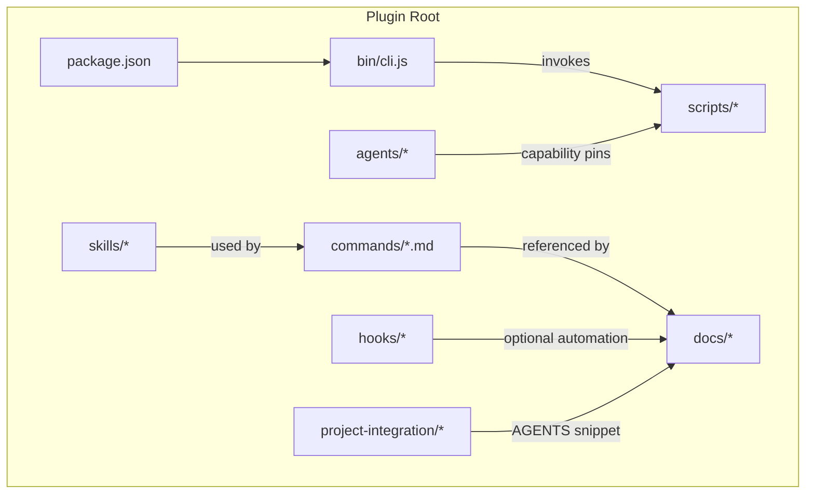
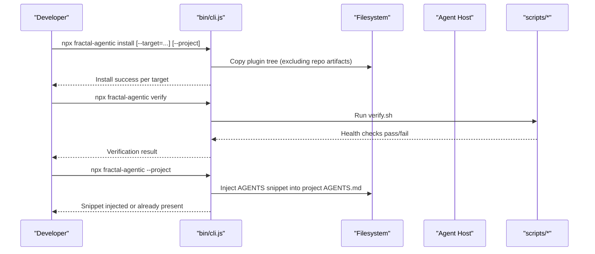
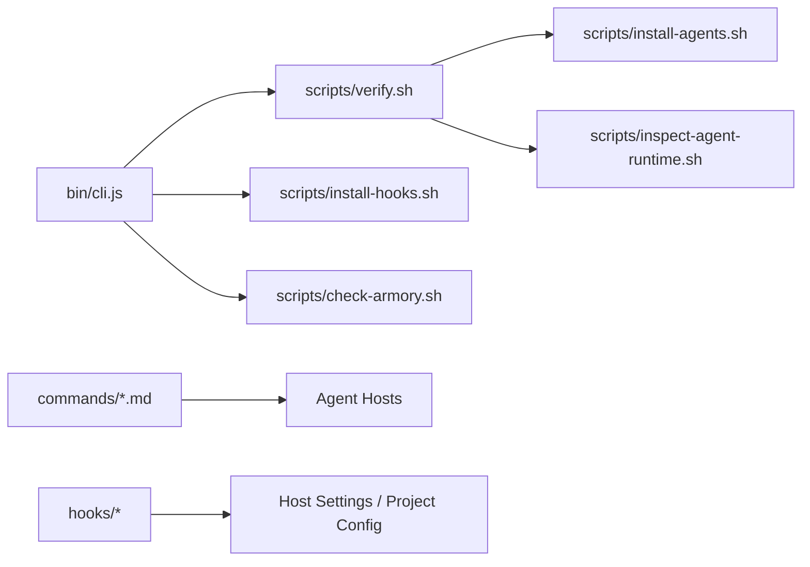

<cite>
**Referenced Files in This Document**
- `fractal-agentic/package.json`
- `fractal-agentic/bin/cli.js`
- `fractal-agentic/README.md`
- `fractal-agentic/commands/INDEX.md`
- `fractal-agentic/docs/hooks.md`
- `fractal-agentic/hooks/README.md`
- `fractal-agentic/scripts/install-hooks.sh`
- `fractal-agentic/scripts/verify.sh`
- `fractal-agentic/scripts/check-armory.sh`
- `fractal-agentic/scripts/install-agents.sh`
- `fractal-agentic/CUSTOMIZE.md`
- `fractal-agentic/docs/troubleshooting.md`
</cite>

## Table of Contents
1. [Introduction](#introduction)
2. [Project Structure](#project-structure)
3. [Core Components](#core-components)
4. [Architecture Overview](#architecture-overview)
5. [Detailed Component Analysis](#detailed-component-analysis)
6. [Dependency Analysis](#dependency-analysis)
7. [Performance Considerations](#performance-considerations)
8. [Troubleshooting Guide](#troubleshooting-guide)
9. [Conclusion](#conclusion)
10. [Appendices](#appendices)

## Introduction
This document explains the development workflow and tooling for Fractal Agentic, focusing on CLI usage, Git lifecycle hooks, automation scripts, build/test procedures, deployment strategies, local setup, debugging, performance profiling, CI/CD integration, code quality tools, contribution guidelines, and troubleshooting. It is designed to be accessible to both new contributors and experienced maintainers.

## Project Structure
Fractal Agentic is a plugin package that ships agents, skills, commands, hooks, and scripts. The repository root contains multiple packages; this guide focuses on the fractal-agentic package which provides the orchestrator runtime, command surface, and optional hooks.

Key directories:
- bin: CLI entrypoint
- commands: Slash-command definitions (Markdown-based)
- skills: Vendored skill playbooks and references
- agents: Domain specialist prompts and capability TOML pins
- hooks: Optional lifecycle hook scripts and host mappings
- scripts: Installation, verification, and health-check utilities
- docs: User-facing guides and troubleshooting
- project-integration: AGENTS snippet for auto-use

**Diagram sources**
- `fractal-agentic/package.json#L1-L59`
- `fractal-agentic/bin/cli.js#L1-L148`
- `fractal-agentic/commands/INDEX.md#L1-L68`
- `fractal-agentic/hooks/README.md#L1-L124`
- `fractal-agentic/scripts/install-hooks.sh#L1-L380`
- `fractal-agentic/scripts/verify.sh#L1-L274`
- `fractal-agentic/scripts/check-armory.sh#L1-L143`
- `fractal-agentic/scripts/install-agents.sh#L1-L180`

**Section sources**
- `fractal-agentic/package.json#L1-L59`
- `fractal-agentic/README.md#L1-L440`

## Core Components
- CLI installer: A Node script that installs the plugin into supported hosts and can inject an AGENTS snippet into a project.
- Commands: Markdown-defined slash commands with frontmatter metadata.
- Hooks: Optional lifecycle automations for hosts supporting PreToolUse/Stop/SessionStart-style events.
- Scripts: Deterministic installers and verification suites ensuring non-blocking behavior and exact template copies.

Key responsibilities:
- CLI: Host installation, environment preparation, and project snippet injection.
- Commands: Provide user-facing operations like orchestration, reviews, builds, tests, and wiki management.
- Hooks: Safety gates and session automation without blocking product work.
- Scripts: Ensure correctness, idempotency, and safety across environments.

**Section sources**
- `fractal-agentic/bin/cli.js#L1-L148`
- `fractal-agentic/commands/INDEX.md#L1-L68`
- `fractal-agentic/hooks/README.md#L1-L124`
- `fractal-agentic/scripts/install-hooks.sh#L1-L380`
- `fractal-agentic/scripts/verify.sh#L1-L274`
- `fractal-agentic/scripts/check-armory.sh#L1-L143`
- `fractal-agentic/scripts/install-agents.sh#L1-L180`

## Architecture Overview
The development workflow centers around a small CLI that bootstraps the plugin into one or more coding-agent hosts, followed by optional hooks and scripts for safety and verification. Commands are declarative Markdown files consumed by agent hosts.

**Diagram sources**
- `fractal-agentic/bin/cli.js#L1-L148`
- `fractal-agentic/scripts/verify.sh#L1-L274`

## Detailed Component Analysis

### CLI Installer (bin/cli.js)
- Purpose: Install plugin into Antigravity, Claude Code, and Codex; optionally inject AGENTS snippet into a project.
- Options:
  - --target=<host>: antigravity | claude | codex | all (default: all)
  - --project: prepend AGENTS snippet into current project’s AGENTS.md
- Behavior:
  - Copies plugin root excluding repo packaging files.
  - Attempts marketplace registration for Claude when available; falls back to cache directory.
  - Writes project snippet if not already present.

Usage examples:
- Install for all hosts: npx fractal-agentic install
- Target specific host: npx fractal-agentic install --target=claude
- Inject AGENTS snippet: npx fractal-agentic install --project
- Verify installation: npx fractal-agentic verify

**Section sources**
- `fractal-agentic/bin/cli.js#L1-L148`
- `fractal-agentic/package.json#L1-L59`

### Commands Surface (commands/*.md)
- All commands are Markdown files with YAML frontmatter including description.
- Index maintained at commands/INDEX.md.
- Examples include orchestration, code review, build/test helpers, wiki, and hooks management.

Typical usage patterns:
- Orchestrate delivery: /orchestrate
- Activate domain boss: /activate-boss-*
- Review and security: /code-review, /security-scan
- Build/test: /svelte-build, /svelte-test, /react-build, /rust-build, /rust-test
- Wiki and learning: /wiki-init, /wiki-capture, /learn, /learn-eval
- Hooks and status: /hooks-init, /hooks-status

**Section sources**
- `fractal-agentic/commands/INDEX.md#L1-L68`
- `fractal-agentic/README.md#L1-L440`

### Hooks System (hooks/*)
- Optional lifecycle automation for hosts that support event hooks.
- Profiles: minimal (default), standard, strict.
- Targets: config, claude, cursor, project, all.
- Installation via shell script or agent command /hooks-init.

Key options for install-hooks.sh:
- --target <name>: claude | cursor | project | config | all
- --project-dir <path>: project root for project/cursor/all targets
- --profile <name>: minimal | standard | strict
- --check: verify expected files/config without writing
- --force: overwrite managed Fractal hook block when merging settings

What gets installed:
- config: ~/.config/fractal-agentic/hooks.json + env.sh
- claude: merge into ~/.claude/settings.json or side file fractal-hooks.json
- cursor: <project>/.cursor/hooks.json
- project: <project>/.fractal-agentic/hooks.claude.json (absolute paths)

Hook IDs and profiles:
- pre:bash:safety (minimal+, blocking)
- pre:bash:no-verify (minimal+, blocking)
- pre:edit:config-protection (minimal+, blocking)
- session:start (minimal+)
- periodic:essay-due (minimal+)
- stop:quality-batch (standard+)
- stop:console-warn (standard+)
- pre:edit:gateguard (strict)

Environment variables:
- FRACTAL_HOOK_PROFILE=minimal|standard|strict
- FRACTAL_DISABLED_HOOKS=id,id,...
- FRACTAL_GATEGUARD=off (disable first-edit gate)
- FRACTAL_SESSION_START_MAX_CHARS, FRACTAL_SESSION_START_CONTEXT

**Section sources**
- `fractal-agentic/hooks/README.md#L1-L124`
- `fractal-agentic/docs/hooks.md#L1-L128`
- `fractal-agentic/scripts/install-hooks.sh#L1-L380`

### Automation Scripts
- install-agents.sh: Installs three capability TOML templates byte-for-byte into target directory; never overwrites differing files; supports --check.
- verify.sh: Comprehensive verification suite validating manifests, armory, non-blocking policy, TOML pins, contracts, command structure, installer behavior, and runtime inspector safety.
- check-armory.sh: Non-mutating health check for critical files and skills; warns on missing critical skills; validates openai.yaml shape.

Common usage:
- sh scripts/install-agents.sh [--target-dir <path>] [--check]
- sh scripts/verify.sh
- sh scripts/check-armory.sh

**Section sources**
- `fractal-agentic/scripts/install-agents.sh#L1-L180`
- `fractal-agentic/scripts/verify.sh#L1-L274`
- `fractal-agentic/scripts/check-armory.sh#L1-L143`

### Build, Test, and Quality Procedures
- Build: Use framework-specific commands under commands/ (e.g., /svelte-build, /react-build, /rust-build). These invoke specialized agents to fix compiler errors incrementally.
- Test: Use /svelte-test, /rust-test, and other test commands to run unit/E2E suites.
- Coverage: /test-coverage analyzes gaps and suggests missing tests toward thresholds.
- Quality gates: /quality-gate runs formatter checks; /security-scan runs AgentShield across surfaces.

Verification and health:
- sh scripts/verify.sh ensures core integrity and non-blocking policy.
- sh scripts/check-armory.sh confirms required assets and critical skills.

**Section sources**
- `fractal-agentic/commands/INDEX.md#L1-L68`
- `fractal-agentic/scripts/verify.sh#L1-L274`
- `fractal-agentic/scripts/check-armory.sh#L1-L143`

### Deployment Strategies
- Marketplace install: Use Claude/Codex marketplace flows or universal NPX installer.
- Local checkout: Clone sparse and set FRACTAL_AGENTIC_ROOT; resolve plugin root via scripts.
- Post-install steps: Paste AGENTS snippet, initialize optional features (/hooks-init, /improve-init, /wiki-init), run health checks.

**Section sources**
- `fractal-agentic/README.md#L1-L440`

### Local Development Setup
- Set FRACTAL_AGENTIC_ROOT to the plugin directory containing plugin.json, AGENTS.md, docs/bosses/, and skills/boss-orchestration.
- Resolve plugin root: sh "$FRACTAL_AGENTIC_ROOT/scripts/resolve-plugin-root.sh"
- Install capability agents: sh scripts/install-agents.sh
- Verify installation: sh scripts/verify.sh

**Section sources**
- `fractal-agentic/README.md#L1-L440`
- `fractal-agentic/scripts/install-agents.sh#L1-L180`

### Debugging Techniques
- Runtime inspector: inspect-agent-runtime.sh extracts safe allowlisted routing data from session rollout logs.
- Hook diagnostics: /hooks-status and install-hooks.sh --check reveal profile and installation state.
- Armory health: check-armory.sh highlights missing or broken assets.

**Section sources**
- `fractal-agentic/scripts/verify.sh#L1-L274`
- `fractal-agentic/hooks/README.md#L1-L124`
- `fractal-agentic/scripts/check-armory.sh#L1-L143`

### Performance Profiling
- Use /model-route to recommend model tier based on complexity, risk, and budget.
- For latency checks and load simulation, see evaluation_scripts/ (outside scope of this document but referenced in README).

**Section sources**
- `fractal-agentic/commands/INDEX.md#L1-L68`
- `fractal-agentic/README.md#L1-L440`

### CI/CD Integration
- Use verify.sh as a CI step to ensure plugin integrity and non-blocking policy.
- Use check-armory.sh to validate critical assets before publishing.
- For Codex, ensure marketplace manifest includes required sparse paths; upgrade plugins and restart tasks as needed.

**Section sources**
- `fractal-agentic/scripts/verify.sh#L1-L274`
- `fractal-agentic/scripts/check-armory.sh#L1-L143`
- `fractal-agentic/README.md#L1-L440`

### Contribution Guidelines
- Add skills under skills/<id>/ and map them in owning boss INDEX.md; regenerate indexes.
- Add commands under commands/<id>.md with frontmatter; update commands/INDEX.md.
- Capability lane changes require updates across TOMLs, role-contracts, SKILL.md, installer, and verify.sh.
- Always run check-armory.sh and verify.sh after edits.

**Section sources**
- `fractal-agentic/CUSTOMIZE.md#L1-L579`

## Dependency Analysis
The CLI depends on filesystem operations and invokes scripts for verification. Commands are declarative and consumed by hosts. Hooks integrate with host settings and project configs. Scripts enforce non-blocking policies and exact template copies.

**Diagram sources**
- `fractal-agentic/bin/cli.js#L1-L148`
- `fractal-agentic/scripts/verify.sh#L1-L274`
- `fractal-agentic/scripts/install-hooks.sh#L1-L380`
- `fractal-agentic/scripts/check-armory.sh#L1-L143`
- `fractal-agentic/scripts/install-agents.sh#L1-L180`

**Section sources**
- `fractal-agentic/bin/cli.js#L1-L148`
- `fractal-agentic/scripts/verify.sh#L1-L274`
- `fractal-agentic/scripts/install-hooks.sh#L1-L380`
- `fractal-agentic/scripts/check-armory.sh#L1-L143`
- `fractal-agentic/scripts/install-agents.sh#L1-L180`

## Performance Considerations
- Prefer minimal hook profile in CI to reduce overhead.
- Use /model-route to select appropriate model tiers for tasks.
- Avoid heavy Stop hooks in tight loops; standard+ hooks are warn-only and best-effort.
- Keep armory healthy to prevent unnecessary retries or degraded fallbacks.

[No sources needed since this section provides general guidance]

## Troubleshooting Guide
Quick health:
- export FRACTAL_AGENTIC_ROOT=/absolute/path/to/plugin
- sh "$FRACTAL_AGENTIC_ROOT/scripts/resolve-plugin-root.sh"
- sh "$FRACTAL_AGENTIC_ROOT/scripts/check-armory.sh"
- sh "$FRACTAL_AGENTIC_ROOT/scripts/check-nonblocking-policy.sh"

Common issues:
- “Fractal Agentic not found”: Ensure FRACTAL_AGENTIC_ROOT points to plugin directory with required entries.
- Marketplace manifest missing (Codex): Include .agents/plugins and plugin in sparse checkout.
- Pins/types not exposed mid-session: Start a new task; disk install is layer B, session discovery is layer C.
- Hooks too restrictive: Lower profile or disable specific hook IDs via FRACTAL_DISABLED_HOOKS.
- Wiki commands no-op: Initialize wiki vault or set FRACTAL_WIKI_ROOT.

For detailed runbooks, consult docs/troubleshooting.md.

**Section sources**
- `fractal-agentic/docs/troubleshooting.md#L1-L143`
- `fractal-agentic/TROUBLESHOOTING.md#L1-L27`

## Conclusion
Fractal Agentic provides a robust, non-blocking development workflow centered around a small CLI, declarative commands, optional hooks, and deterministic scripts. By following the installation, verification, and customization guidelines, teams can maintain consistent quality and productivity across diverse coding-agent hosts while preserving the ability to ship without hard stops.

[No sources needed since this section summarizes without analyzing specific files]

## Appendices

### CLI Commands Summary
- Install: npx fractal-agentic install [--target=<host>] [--project]
- Verify: npx fractal-agentic verify
- Help: npx fractal-agentic help

**Section sources**
- `fractal-agentic/bin/cli.js#L1-L148`
- `fractal-agentic/package.json#L1-L59`

### Hooks Installation Commands
- Shell: sh "$FRACTAL_AGENTIC_ROOT/scripts/install-hooks.sh" --target <name> --project-dir <path> --profile <name> [--check] [--force]
- Agent: /hooks-init

**Section sources**
- `fractal-agentic/docs/hooks.md#L1-L128`
- `fractal-agentic/hooks/README.md#L1-L124`
- `fractal-agentic/scripts/install-hooks.sh#L1-L380`

### Scripts Usage
- Capability agents: sh scripts/install-agents.sh [--target-dir <path>] [--check]
- Full verification: sh scripts/verify.sh
- Armory health: sh scripts/check-armory.sh

**Section sources**
- `fractal-agentic/scripts/install-agents.sh#L1-L180`
- `fractal-agentic/scripts/verify.sh#L1-L274`
- `fractal-agentic/scripts/check-armory.sh#L1-L143`