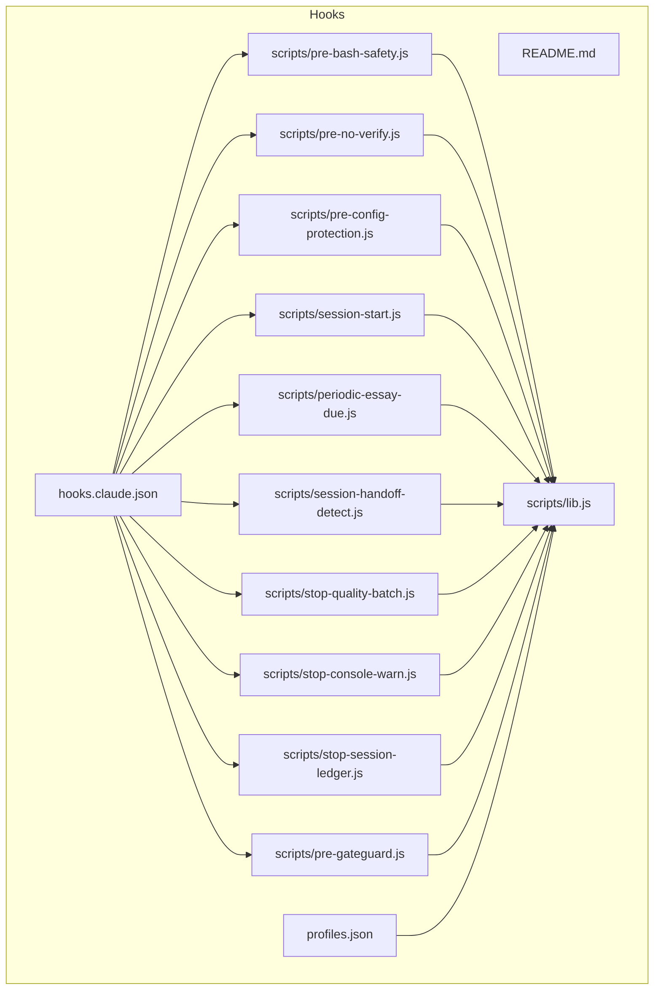
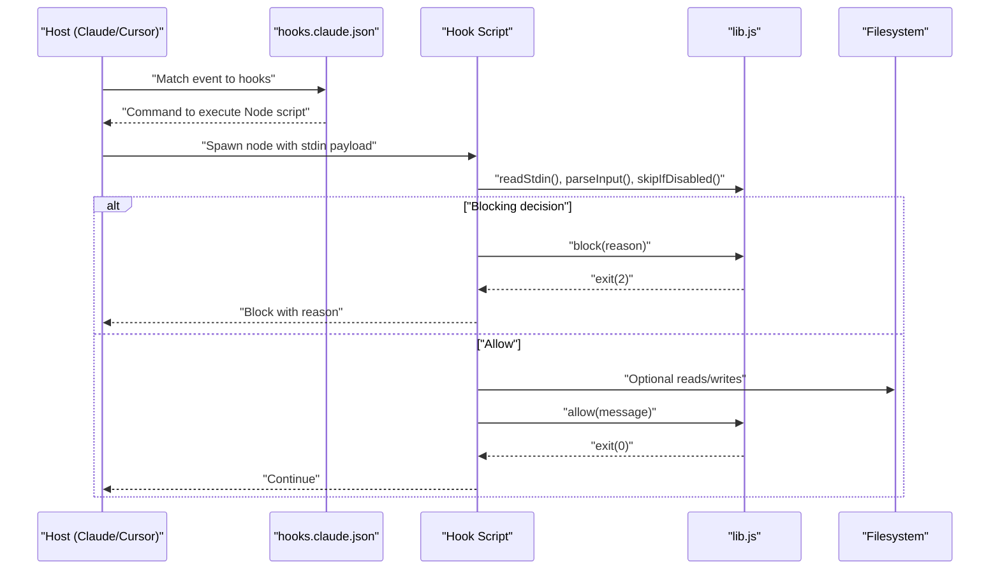
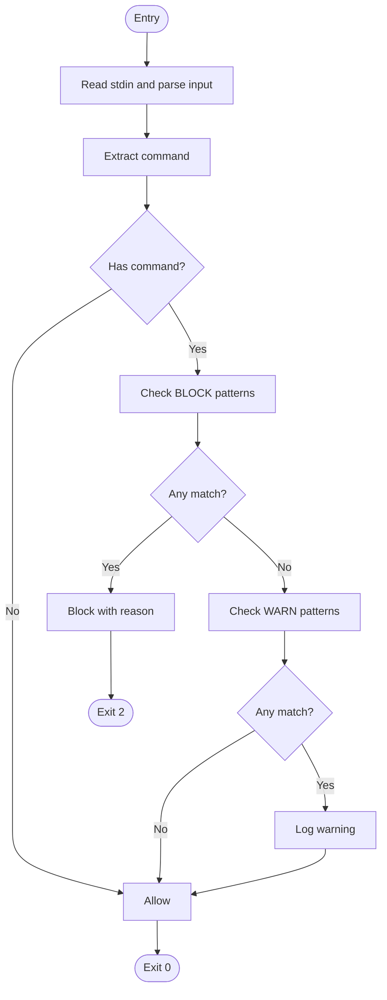
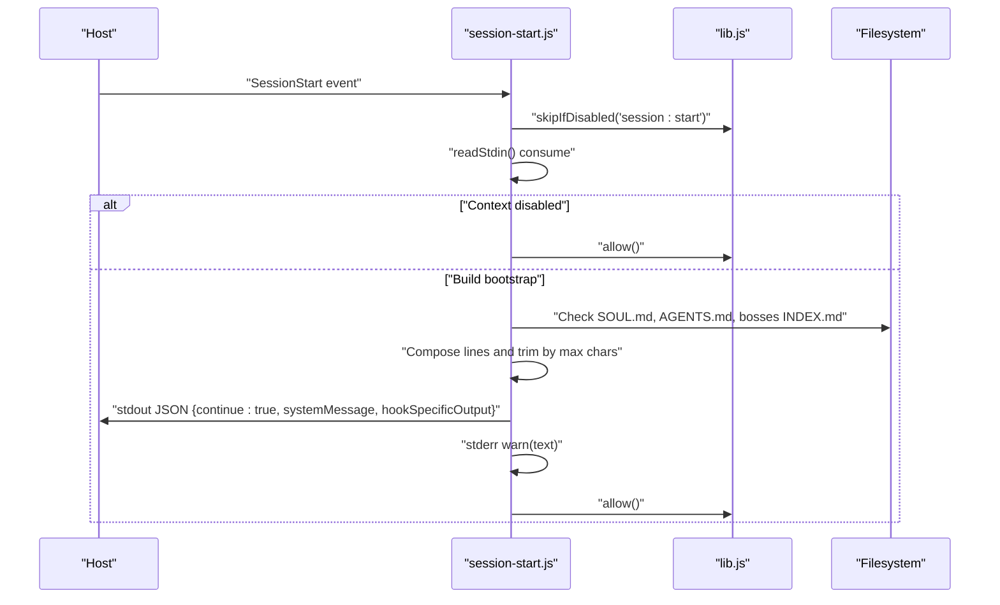
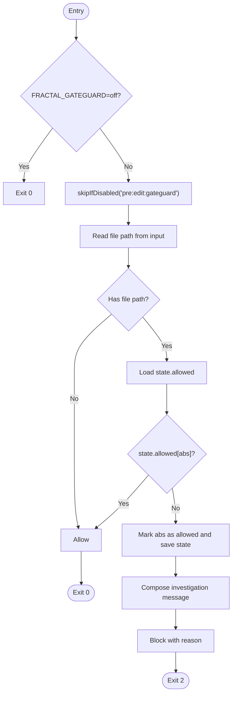
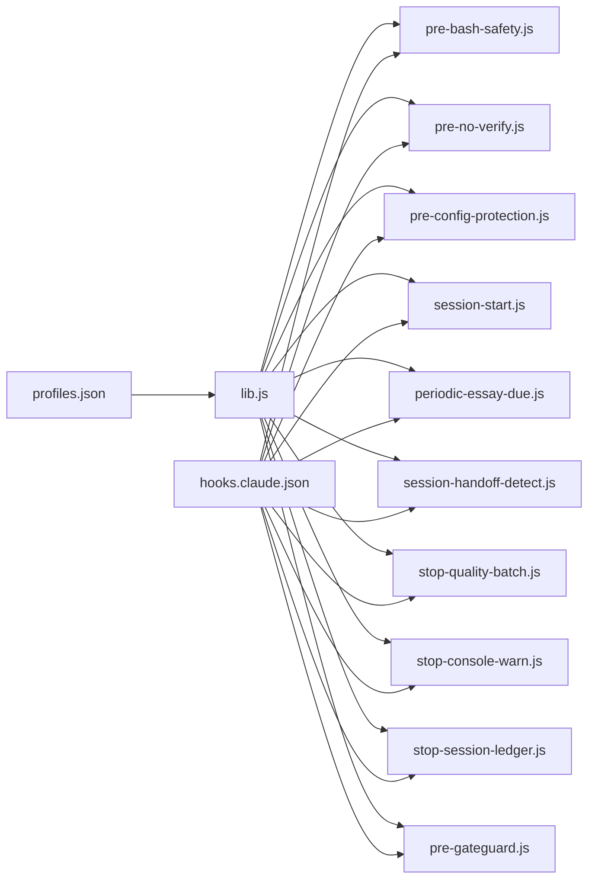

<cite>
**Referenced Files in This Document**
- `fractal-agentic/hooks/README.md`
- `fractal-agentic/hooks/profiles.json`
- `fractal-agentic/hooks/hooks.claude.json`
- `fractal-agentic/hooks/scripts/lib.js`
- `fractal-agentic/hooks/scripts/pre-bash-safety.js`
- `fractal-agentic/hooks/scripts/pre-no-verify.js`
- `fractal-agentic/hooks/scripts/pre-config-protection.js`
- `fractal-agentic/hooks/scripts/session-start.js`
- `fractal-agentic/hooks/scripts/periodic-essay-due.js`
- `fractal-agentic/hooks/scripts/session-handoff-detect.js`
- `fractal-agentic/hooks/scripts/stop-quality-batch.js`
- `fractal-agentic/hooks/scripts/stop-console-warn.js`
- `fractal-agentic/hooks/scripts/stop-session-ledger.js`
- `fractal-agentic/hooks/scripts/pre-gateguard.js`
</cite>

## Table of Contents
1. Introduction
2. Project Structure
3. Core Components
4. Architecture Overview
5. Detailed Component Analysis
6. Dependency Analysis
7. Performance Considerations
8. Troubleshooting Guide
9. Conclusion

## Introduction
This document explains the hook scripts and their event handling mechanisms within the Fractal Agentic plugin. It focuses on:
- Pre-bash safety hooks that prevent destructive commands and secrets exfiltration patterns
- Session start hooks for bounded bootstrap operations
- Quality batch hooks for formatting/type-checking best-effort checks
- Config protection hooks to prevent linter/formatter sabotage
- Gateguard functionality enforcing first-edit fact checks
- Script structure, error handling, debugging techniques, performance optimization, and testing strategies for custom hook development

The design emphasizes optional, non-blocking behavior with strict blocking only for irreversible harm or explicit bypass attempts.

## Project Structure
Hooks are organized under a dedicated directory with:
- A README describing profiles, installation, and hook IDs
- A profiles configuration defining minimal/standard/strict sets
- Host-specific mappings (Claude-compatible JSON) wiring events to Node scripts
- A shared library for input parsing, profile resolution, and allow/block semantics
- Individual hook scripts implementing specific behaviors

**Diagram sources**
- `fractal-agentic/hooks/hooks.claude.json#L1-L87`
- `fractal-agentic/hooks/profiles.json#L1-L38`
- `fractal-agentic/hooks/scripts/lib.js#L1-L137`
- `fractal-agentic/hooks/scripts/pre-bash-safety.js#L1-L42`
- `fractal-agentic/hooks/scripts/pre-no-verify.js#L1-L30`
- `fractal-agentic/hooks/scripts/pre-config-protection.js#L1-L66`
- `fractal-agentic/hooks/scripts/session-start.js#L1-L65`
- `fractal-agentic/hooks/scripts/periodic-essay-due.js#L1-L32`
- `fractal-agentic/hooks/scripts/session-handoff-detect.js#L1-L157`
- `fractal-agentic/hooks/scripts/stop-quality-batch.js#L1-L50`
- `fractal-agentic/hooks/scripts/stop-console-warn.js#L1-L30`
- `fractal-agentic/hooks/scripts/stop-session-ledger.js#L1-L78`
- `fractal-agentic/hooks/scripts/pre-gateguard.js#L1-L79`

**Section sources**
- `fractal-agentic/hooks/README.md#L1-L124`
- `fractal-agentic/hooks/profiles.json#L1-L38`
- `fractal-agentic/hooks/hooks.claude.json#L1-L87`

## Core Components
- Shared library (lib.js): Provides stdin reading, JSON parsing, root resolution, profile management, hook enablement checks, tool input extraction, and standardized allow/block/warn semantics.
- Profiles (profiles.json): Defines which hook IDs run per profile (minimal, standard, strict).
- Host mapping (hooks.claude.json): Maps host events (PreToolUse, SessionStart, Stop) to specific Node scripts with timeouts.
- Hook scripts: Implement event-specific logic using lib utilities and environment variables.

Key responsibilities:
- Non-blocking by default; block only for irreversible harm or explicit bypass attempts
- Consistent exit codes: 0 to continue, 2 to block (Claude-compatible)
- Environment-driven control via FRACTAL_HOOK_PROFILE, FRACTAL_DISABLED_HOOKS, and feature flags like FRACTAL_GATEGUARD

**Section sources**
- `fractal-agentic/hooks/scripts/lib.js#L1-L137`
- `fractal-agentic/hooks/profiles.json#L1-L38`
- `fractal-agentic/hooks/hooks.claude.json#L1-L87`

## Architecture Overview
Event flow from host to hook scripts:
- Host triggers an event (e.g., Bash tool use, file write/edit, session start, stop)
- The host executes configured Node scripts with stdin payload
- Each script parses input, checks profile enablement, performs checks, and either allows continuation or blocks with a reason

**Diagram sources**
- `fractal-agentic/hooks/hooks.claude.json#L1-L87`
- `fractal-agentic/hooks/scripts/lib.js#L1-L137`

## Detailed Component Analysis

### Pre-Bash Safety Hook
Purpose: Prevent destructive shell commands and secrets exfiltration patterns before execution.
Behavior:
- Parses command from stdin
- Matches against high-risk regex patterns (force-push, reset --hard, rm /, curl|sh, etc.)
- Warns on risky but allowed patterns (eval, chmod 777)
- Blocks when matched; otherwise allows

**Diagram sources**
- `fractal-agentic/hooks/scripts/pre-bash-safety.js#L1-L42`
- `fractal-agentic/hooks/scripts/lib.js#L1-L137`

**Section sources**
- `fractal-agentic/hooks/scripts/pre-bash-safety.js#L1-L42`

### No-Verify Bypass Prevention
Purpose: Block attempts to bypass git hooks via --no-verify or HUSKY=0.
Behavior:
- Detects git commit/push/am/rebase/merge with --no-verify or -n
- Blocks if found; otherwise allows

**Section sources**
- `fractal-agentic/hooks/scripts/pre-no-verify.js#L1-L30`

### Config Protection Hook
Purpose: Prevent accidental weakening of lint/format/type configurations.
Behavior:
- Inspects target file path
- Protects known config files (eslint, prettier, biome, tsconfig, editorconfig, ruff, golangci)
- Blocks edits to protected configs; otherwise allows

**Section sources**
- `fractal-agentic/hooks/scripts/pre-config-protection.js#L1-L66`

### Session Start Hook
Purpose: Provide bounded bootstrap context at session start without blocking work.
Behavior:
- Consumes stdin
- Optionally disabled via FRACTAL_SESSION_START_CONTEXT=off
- Reads SOUL.md, AGENTS.md, bosses INDEX.md to compose a concise system message
- Outputs structured JSON with additionalContext and stderr log
- Respects FRACTAL_SESSION_START_MAX_CHARS to bound output size

**Diagram sources**
- `fractal-agentic/hooks/scripts/session-start.js#L1-L65`
- `fractal-agentic/hooks/scripts/lib.js#L1-L137`

**Section sources**
- `fractal-agentic/hooks/scripts/session-start.js#L1-L65`

### Periodic Essay Due Hook
Purpose: Mark due scheduled essays without starting agents or blocking sessions.
Behavior:
- Invokes periodic-essay-runner.js with due --enqueue
- Ignores errors unless debug flag is set
- Always allows

**Section sources**
- `fractal-agentic/hooks/scripts/periodic-essay-due.js#L1-L32`

### Session Handoff Detection
Purpose: Detect and summarize previous handoff state to support smart continue across sessions.
Behavior:
- Checks for handoff.md and plan-state.json under active session dir
- Validates age threshold and cleans stale data
- Parses frontmatter and sections (Working on, Decisions, Remaining, Notes)
- Outputs structured systemMessage and stderr summary
- Allows after processing

**Section sources**
- `fractal-agentic/hooks/scripts/session-handoff-detect.js#L1-L157`

### Stop Quality Batch Hook
Purpose: Best-effort quality checks on Stop without blocking.
Behavior:
- Prefers package.json scripts; runs typecheck if available and pnpm exists
- Warns about check script presence without running heavy tasks
- Always allows

**Section sources**
- `fractal-agentic/hooks/scripts/stop-quality-batch.js#L1-L50`

### Stop Console Warn Hook
Purpose: Detect leftover console.log/debugger statements in diffs.
Behavior:
- Runs git diff HEAD and scans added lines for console.* or debugger
- Warns with sample hits; always allows

**Section sources**
- `fractal-agentic/hooks/scripts/stop-console-warn.js#L1-L30`

### Stop Session Ledger Hook
Purpose: Append a ledger entry summarizing session metadata on Stop.
Behavior:
- Collects host, timestamp, boss, capability mode, and summary
- Appends JSON line to ledger.jsonl
- Always allows

**Section sources**
- `fractal-agentic/hooks/scripts/stop-session-ledger.js#L1-L78`

### Gateguard First-Edit Enforcement
Purpose: Enforce fact-based investigation on first edit of a file (strict profile).
Behavior:
- Maintains per-cwd state in tmpdir to track allowed files
- On first touch, warns with required investigation steps and blocks
- Marks file as allowed so subsequent retries succeed
- Can be disabled via FRACTAL_GATEGUARD=off

**Diagram sources**
- `fractal-agentic/hooks/scripts/pre-gateguard.js#L1-L79`
- `fractal-agentic/hooks/scripts/lib.js#L1-L137`

**Section sources**
- `fractal-agentic/hooks/scripts/pre-gateguard.js#L1-L79`

## Dependency Analysis
- All hook scripts depend on lib.js for common I/O, profile resolution, and allow/block semantics
- Host mapping (hooks.claude.json) wires events to scripts with timeouts
- Profiles (profiles.json) determine whether a hook ID is enabled
- Some hooks interact with filesystem (handoff detection, ledger, gateguard state)

**Diagram sources**
- `fractal-agentic/hooks/scripts/lib.js#L1-L137`
- `fractal-agentic/hooks/profiles.json#L1-L38`
- `fractal-agentic/hooks/hooks.claude.json#L1-L87`

**Section sources**
- `fractal-agentic/hooks/scripts/lib.js#L1-L137`
- `fractal-agentic/hooks/profiles.json#L1-L38`
- `fractal-agentic/hooks/hooks.claude.json#L1-L87`

## Performance Considerations
- Keep hooks lightweight and fast; rely on timeouts defined in host mapping
- Prefer package scripts where available; avoid heavy CI-like checks in Stop hooks
- Bound output sizes (e.g., session start max chars) to reduce overhead
- Use best-effort patterns: never block unless necessary; warn instead of failing
- Minimize filesystem writes; cache state minimally and handle errors gracefully

[No sources needed since this section provides general guidance]

## Troubleshooting Guide
Common issues and remedies:
- Hooks not running: Ensure FRACTAL_AGENTIC_ROOT is set and host settings include the hooks mapping
- Profile misconfiguration: Verify FRACTAL_HOOK_PROFILE and FRACTAL_DISABLED_HOOKS
- Blocking unexpectedly: Review BLOCK/WARN patterns in pre-bash-safety and config protection; temporarily disable via FRACTAL_DISABLED_HOOKS
- Debugging: Enable FRACTAL_ESSAY_HOOK_DEBUG for essay due hook; inspect stderr logs prefixed with [fractal-hooks]
- State persistence: For gateguard and handoff, check tmpdir state and ~/.fractal/sessions paths

**Section sources**
- `fractal-agentic/hooks/scripts/pre-bash-safety.js#L1-L42`
- `fractal-agentic/hooks/scripts/pre-config-protection.js#L1-L66`
- `fractal-agentic/hooks/scripts/periodic-essay-due.js#L1-L32`
- `fractal-agentic/hooks/scripts/session-handoff-detect.js#L1-L157`
- `fractal-agentic/hooks/scripts/pre-gateguard.js#L1-L79`

## Conclusion
The hook system provides a robust, optional layer of safety and quality around agent workflows. By adhering to non-blocking principles and reserving blocking for irreversible harm or bypass attempts, it maintains productivity while protecting code integrity. Custom hooks should follow the established patterns: use lib.js utilities, respect profiles, handle errors gracefully, and keep execution fast and deterministic.

[No sources needed since this section summarizes without analyzing specific files]