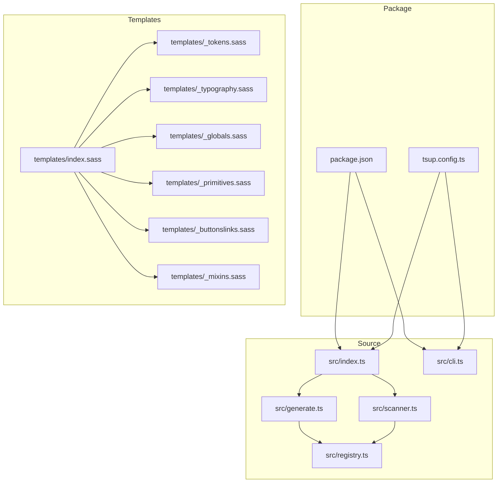
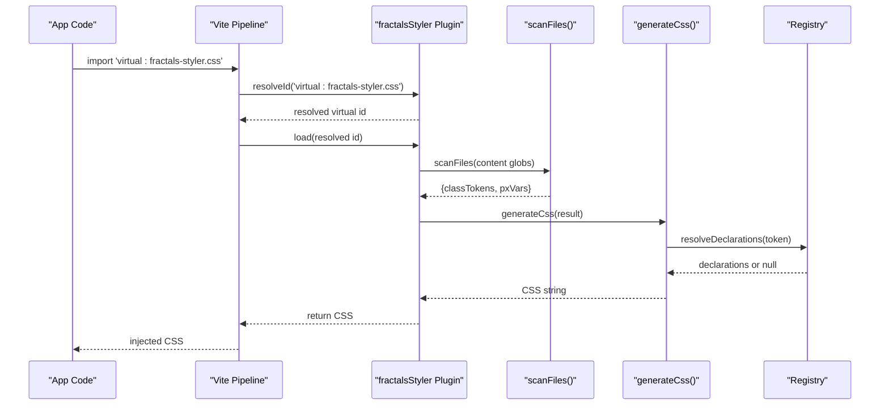
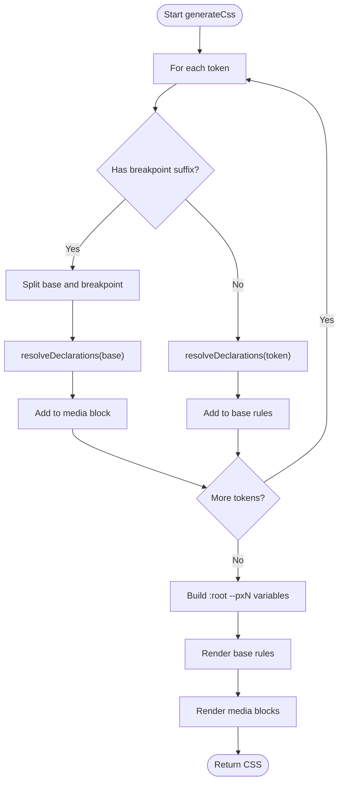
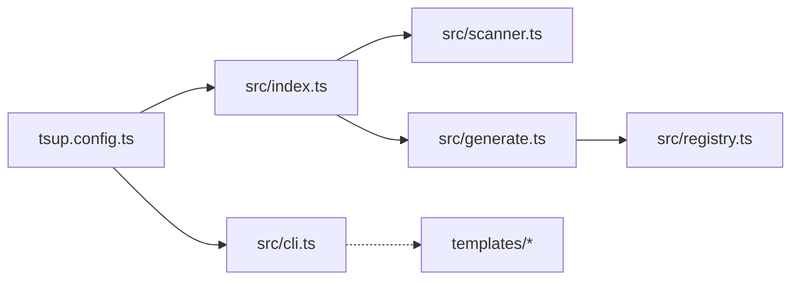

<cite>
**Referenced Files in This Document**
- `packages/fractals-styler/package.json`
- `packages/fractals-styler/README.md`
- `packages/fractals-styler/src/index.ts`
- `packages/fractals-styler/src/cli.ts`
- `packages/fractals-styler/src/generate.ts`
- `packages/fractals-styler/src/scanner.ts`
- `packages/fractals-styler/src/registry.ts`
- `packages/fractals-styler/templates/index.sass`
- `packages/fractals-styler/templates/_tokens.sass`
- `packages/fractals-styler/templates/_mixins.sass`
- `packages/fractals-styler/templates/_typography.sass`
- `packages/fractals-styler/templates/_globals.sass`
- `packages/fractals-styler/templates/_primitives.sass`
- `packages/fractals-styler/templates/_buttonslinks.sass`
- `packages/fractals-styler/tsup.config.ts`
</cite>

## Table of Contents
1. [Introduction](#introduction)
2. [Project Structure](#project-structure)
3. [Core Components](#core-components)
4. [Architecture Overview](#architecture-overview)
5. [Detailed Component Analysis](#detailed-component-analysis)
6. [Dependency Analysis](#dependency-analysis)
7. [Performance Considerations](#performance-considerations)
8. [Troubleshooting Guide](#troubleshooting-guide)
9. [Conclusion](#conclusion)
10. [Appendices](#appendices)

## Introduction
fractals-styler is a Vite plugin and CLI that provides:
- Just-in-time (JIT) numeric utility classes for spacing, sizing, and layout (e.g., gapN, padN, marginN, heightN, widthN).
- Breakpoint-suffixed variants for utilities and static classes (xs/sm/bs/lg/xl).
- A themeable SASS token system with CSS custom properties for colors, typography, and borders.
- A minimal template set to bootstrap global styles, primitives, and typography.

It integrates seamlessly into SvelteKit or any Vite + SASS project by generating only the CSS you actually use at dev/build time.

**Section sources**
- `packages/fractals-styler/README.md#L1-L124`
- `packages/fractals-styler/package.json#L1-L45`

## Project Structure
The package exposes:
- A Vite plugin entry point and re-exports for programmatic usage.
- A CLI for scaffolding static SASS templates.
- Core modules for scanning source files, resolving declarations, and generating CSS.
- A set of SASS templates that define tokens, typography, globals, primitives, and mixins.



**Diagram sources**
- `packages/fractals-styler/package.json#L1-L45`
- `packages/fractals-styler/tsup.config.ts#L1-L13`
- `packages/fractals-styler/src/index.ts#L1-L76`
- `packages/fractals-styler/src/cli.ts#L1-L64`
- `packages/fractals-styler/src/scanner.ts#L1-L46`
- `packages/fractals-styler/src/generate.ts#L1-L62`
- `packages/fractals-styler/src/registry.ts#L1-L94`
- `packages/fractals-styler/templates/index.sass#L1-L7`
- `packages/fractals-styler/templates/_tokens.sass#L1-L24`
- `packages/fractals-styler/templates/_mixins.sass#L1-L25`
- `packages/fractals-styler/templates/_typography.sass#L1-L59`
- `packages/fractals-styler/templates/_globals.sass#L1-L28`
- `packages/fractals-styler/templates/_primitives.sass#L1-L59`
- `packages/fractals-styler/templates/_buttonslinks.sass#L1-L12`

**Section sources**
- `packages/fractals-styler/package.json#L1-L45`
- `packages/fractals-styler/tsup.config.ts#L1-L13`

## Core Components
- Vite Plugin: Registers a virtual module virtual:fractals-styler.css, scans content globs, and generates CSS on demand. It also watches source changes and triggers full reloads in dev.
- Scanner: Reads all matching source files and extracts candidate class tokens and --pxN variable usages.
- Registry: Defines breakpoint media queries, dynamic prefix rules for numeric utilities, and static utility declarations.
- Generator: Builds plain CSS from scanned tokens, including :root variables and breakpoint-scoped rules.
- CLI: Copies SASS templates into your project for customization.

Key responsibilities:
- Content scanning and token extraction
- Declaration resolution (static vs dynamic)
- CSS generation with breakpoint suffixes
- Dev server integration and HMR-friendly behavior

**Section sources**
- `packages/fractals-styler/src/index.ts#L1-L76`
- `packages/fractals-styler/src/scanner.ts#L1-L46`
- `packages/fractals-styler/src/registry.ts#L1-L94`
- `packages/fractals-styler/src/generate.ts#L1-L62`
- `packages/fractals-styler/src/cli.ts#L1-L64`

## Architecture Overview
The plugin creates a virtual CSS module that emits only the CSS required by your codebase. The flow is:
- Vite resolves virtual:fractals-styler.css
- Plugin loads it, triggering scanFiles() over configured content globs
- generateCss() builds CSS using registry definitions
- In dev, file watchers invalidate the module and trigger a full reload



**Diagram sources**
- `packages/fractals-styler/src/index.ts#L1-L76`
- `packages/fractals-styler/src/scanner.ts#L1-L46`
- `packages/fractals-styler/src/generate.ts#L1-L62`
- `packages/fractals-styler/src/registry.ts#L1-L94`

## Detailed Component Analysis

### Vite Plugin (index.ts)
Responsibilities:
- Define virtual module IDs and default content globs
- Resolve virtual module IDs including query suffixes
- Load and build CSS on demand
- Watch source files and trigger full reloads when they change

Behavior highlights:
- Uses enforce: 'pre' to run before built-in CSS plugins
- Captures config.root during configResolved
- Watches extensions and invalidates the virtual module on changes

**Section sources**
- `packages/fractals-styler/src/index.ts#L1-L76`

### Scanner (scanner.ts)
Responsibilities:
- Glob files based on patterns
- Extract all identifier-like tokens and --pxN references
- Return a compact result with unique tokens and px values

Complexity:
- O(N) over total characters across matched files
- Memory proportional to number of unique tokens and px values

Edge cases:
- Ignores node_modules, dist, .svelte-kit, build directories
- Broad regex may produce false positives; harmless overhead

**Section sources**
- `packages/fractals-styler/src/scanner.ts#L1-L46`

### Registry (registry.ts)
Responsibilities:
- Define breakpoints and their media queries
- Map dynamic prefixes to CSS properties for JIT utilities
- Provide static utility declarations for known classes
- Resolve a base token to its declarations

Design notes:
- Dynamic prefixes are sorted longest-first to avoid ambiguity
- Static utilities include layout primitives and typography helpers

**Section sources**
- `packages/fractals-styler/src/registry.ts#L1-L94`

### Generator (generate.ts)
Responsibilities:
- Parse breakpoint suffixes from tokens
- Build base rules and per-breakpoint media blocks
- Emit :root variables for used --pxN values
- Sort selectors for deterministic output

Output characteristics:
- Plain CSS (no SASS)
- Minimal and deterministic

**Section sources**
- `packages/fractals-styler/src/generate.ts#L1-L62`

### CLI (cli.ts)
Responsibilities:
- Scaffold static SASS templates into a destination directory
- Support --force to overwrite existing files
- Print next steps for Vite plugin and imports

Usage:
- npx fractals-styler init [dest] [--force]

**Section sources**
- `packages/fractals-styler/src/cli.ts#L1-L64`

### SASS Templates
- index.sass: Orchestrates partials order
- _tokens.sass: Default CSS custom properties for colors, text, and borders
- _typography.sass: Text scale, transforms, weights, line-heights
- _globals.sass: Resets, defaults, and helper classes
- _primitives.sass: Flex/grid layout primitives with responsive modifiers
- _mixins.sass: Breakpoint mixins for custom scoping
- _buttonslinks.sass: Button/link resets

Customization approach:
- Copy templates via CLI
- Edit tokens and typography to match brand
- Use mixins to scope custom classes to breakpoints

**Section sources**
- `packages/fractals-styler/templates/index.sass#L1-L7`
- `packages/fractals-styler/templates/_tokens.sass#L1-L24`
- `packages/fractals-styler/templates/_typography.sass#L1-L59`
- `packages/fractals-styler/templates/_globals.sass#L1-L28`
- `packages/fractals-styler/templates/_primitives.sass#L1-L59`
- `packages/fractals-styler/templates/_mixins.sass#L1-L25`
- `packages/fractals-styler/templates/_buttonslinks.sass#L1-L12`

### Class Diagram: Core Types and Relationships
```mermaid
classDiagram
class FractalsStylerOptions {
+string[] content
}
class ScanResult {
+Set~string~ classTokens
+Set~number~ pxVars
}
class Declaration {
+string prop
+string value
}
class Registry {
+Record~Breakpoint,string~ BREAKPOINTS
+Breakpoint[] BREAKPOINT_ORDER
+{prefix : string,prop : string}[] DYNAMIC_PREFIXES
+Record~string,Declaration[]~ STATIC_UTILITIES
+resolveDeclarations(base) : Declaration[]|null
}
class Plugin {
+name : string
+configResolved(config)
+resolveId(id)
+load(id)
+configureServer(server)
}
class Scanner {
+scanFiles(patterns,cwd) : Promise~ScanResult~
}
class Generator {
+generateCss(result) : string
}
Plugin --> Scanner : "uses"
Plugin --> Generator : "uses"
Generator --> Registry : "uses"
Scanner --> Registry : "uses"
```

**Diagram sources**
- `packages/fractals-styler/src/index.ts#L1-L76`
- `packages/fractals-styler/src/scanner.ts#L1-L46`
- `packages/fractals-styler/src/generate.ts#L1-L62`
- `packages/fractals-styler/src/registry.ts#L1-L94`

### Flowchart: Token Resolution and CSS Generation


**Diagram sources**
- `packages/fractals-styler/src/generate.ts#L1-L62`
- `packages/fractals-styler/src/registry.ts#L1-L94`

## Dependency Analysis
Internal dependencies:
- index.ts depends on scanner.ts and generate.ts
- generate.ts depends on registry.ts
- cli.ts is standalone for scaffolding

External dependencies:
- fast-glob for file scanning
- Vite plugin interfaces for integration

Build configuration:
- tsup builds ESM outputs for index and cli with d.ts generation



**Diagram sources**
- `packages/fractals-styler/src/index.ts#L1-L76`
- `packages/fractals-styler/src/scanner.ts#L1-L46`
- `packages/fractals-styler/src/generate.ts#L1-L62`
- `packages/fractals-styler/src/registry.ts#L1-L94`
- `packages/fractals-styler/src/cli.ts#L1-L64`
- `packages/fractals-styler/tsup.config.ts#L1-L13`

**Section sources**
- `packages/fractals-styler/package.json#L1-L45`
- `packages/fractals-styler/tsup.config.ts#L1-L13`

## Performance Considerations
- JIT generation ensures only used classes are emitted, minimizing CSS size.
- Scanning uses fast-glob with sensible ignores to reduce I/O.
- Sorting and deduplication keep output deterministic and compact.
- Dev watcher triggers full reloads on relevant file changes; consider narrowing content globs if scan times grow large.
- Avoid excessive arbitrary integers in class names to limit generated CSS growth.

[No sources needed since this section provides general guidance]

## Troubleshooting Guide
Common issues and resolutions:
- Virtual module not found: Ensure you import 'virtual:fractals-styler.css' once globally.
- SSR crashes: The plugin enforces pre-order to avoid conflicts with built-in CSS pipeline; verify plugin registration order.
- Missing utilities: Confirm your content globs include all source types where classes appear.
- Breakpoint suffixes not applied: Only classes known statically by the registry support suffixes; for custom classes, use the provided mixins.
- Template overrides not taking effect: Re-run init with --force to refresh templates, then edit locally.

**Section sources**
- `packages/fractals-styler/README.md#L1-L124`
- `packages/fractals-styler/src/index.ts#L1-L76`
- `packages/fractals-styler/src/cli.ts#L1-L64`

## Conclusion
fractals-styler combines a lightweight JIT engine with a flexible SASS token system to deliver predictable, themeable styling for modern Vite-based projects. Its design emphasizes minimal runtime overhead, clear extension points, and developer ergonomics through scaffolding and breakpoint suffixes. Teams can adopt it incrementally, customize tokens and templates, and extend utilities while keeping bundles lean.

[No sources needed since this section summarizes without analyzing specific files]

## Appendices

### Installation and Setup
- Install the package and scaffold templates using the CLI.
- Register the plugin in Vite config and import the virtual module once.
- Import the generated SASS index globally.

**Section sources**
- `packages/fractals-styler/README.md#L1-L124`
- `packages/fractals-styler/package.json#L1-L45`

### Utility Classes and Breakpoints
- Numeric utilities follow the pattern {prefix}{N} for spacing, sizing, and layout.
- Breakpoint suffixes xs/sm/bs/lg/xl apply media queries to supported classes.
- Custom classes can be scoped using mixins from _mixins.sass.

**Section sources**
- `packages/fractals-styler/README.md#L1-L124`
- `packages/fractals-styler/src/registry.ts#L1-L94`
- `packages/fractals-styler/templates/_mixins.sass#L1-L25`

### Theme Creation and Token Overrides
- Override CSS custom properties under :root for global themes or under scoped classes for component-level themes.
- Typography scaling and color tokens are defined in templates and can be customized freely.

**Section sources**
- `packages/fractals-styler/templates/_tokens.sass#L1-L24`
- `packages/fractals-styler/templates/_typography.sass#L1-L59`
- `packages/fractals-styler/README.md#L1-L124`

### Style Overrides and Extensibility
- Extend static utilities by adding entries to the registry’s static map.
- Introduce new dynamic prefixes to support additional numeric utilities.
- Use mixins to create breakpoint-aware custom classes.

**Section sources**
- `packages/fractals-styler/src/registry.ts#L1-L94`
- `packages/fractals-styler/templates/_mixins.sass#L1-L25`

### Build Process and Deployment
- Build produces ESM outputs for both plugin and CLI.
- Source maps are enabled for debugging.
- Peer dependency on Vite ensures compatibility across major versions.

**Section sources**
- `packages/fractals-styler/tsup.config.ts#L1-L13`
- `packages/fractals-styler/package.json#L1-L45`