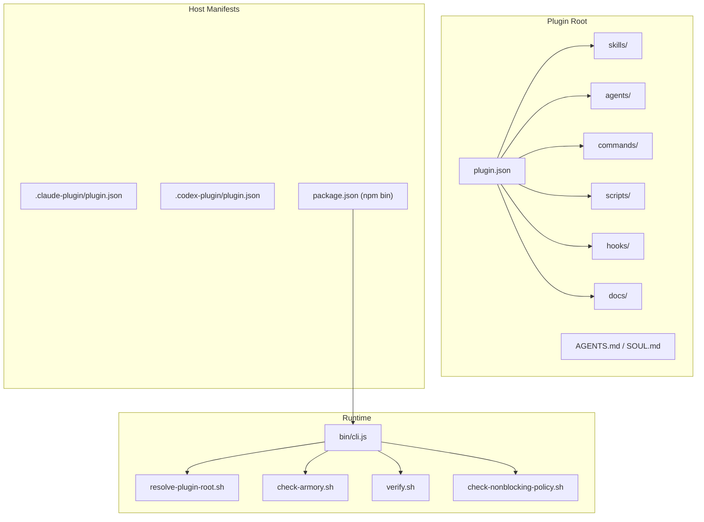
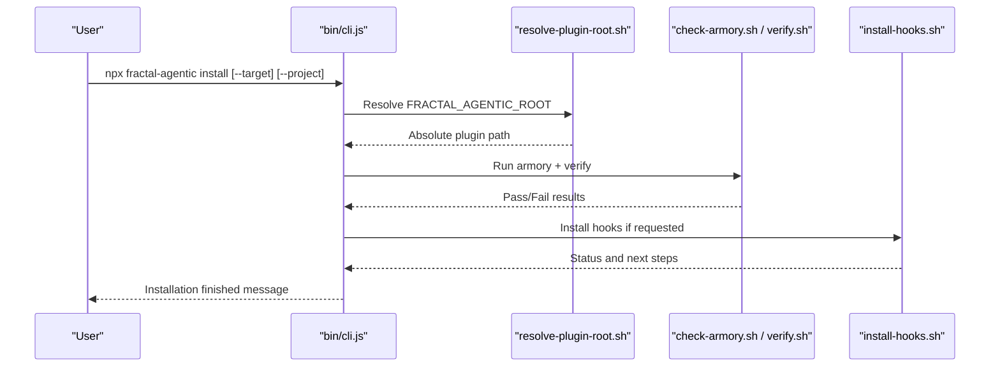
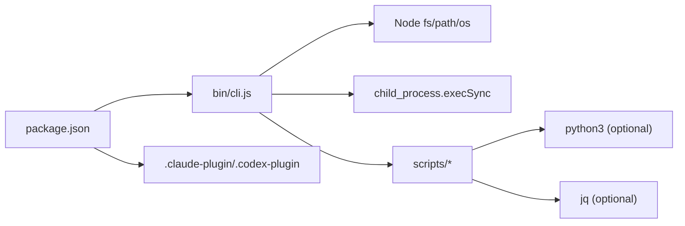

<cite>
**Referenced Files in This Document**
- `fractal-agentic/TROUBLESHOOTING.md`
- `fractal-agentic/docs/troubleshooting.md`
- `fractal-agentic/docs/02-install.md`
- `fractal-agentic/README.md`
- `fractal-agentic/package.json`
- `fractal-agentic/bin/cli.js`
- `fractal-agentic/scripts/check-armory.sh`
- `fractal-agentic/scripts/verify.sh`
- `fractal-agentic/scripts/resolve-plugin-root.sh`
- `fractal-agentic/scripts/check-nonblocking-policy.sh`
- `fractal-agentic/scripts/install-hooks.sh`
- `fractal-agentic/hooks/README.md`
</cite>

## Table of Contents
1. Introduction
2. Project Structure
3. Core Components
4. Architecture Overview
5. Detailed Component Analysis
6. Dependency Analysis
7. Performance Considerations
8. Troubleshooting Guide
9. Conclusion
10. Appendices

## Introduction
This document consolidates troubleshooting and frequently asked questions for Fractal Agentic across installation, configuration, permissions, dependencies, orchestration, rendering/styling, performance, memory, bundle size, diagnostics, logging, and error tracking. It is designed to be accessible to both new users and experienced operators.

## Project Structure
Fractal Agentic ships as a multi-host plugin with a clear separation between the plugin root (the installable unit), host manifests, scripts, skills, agents, commands, and documentation. The plugin root is referenced by the environment variable FRACTAL_AGENTIC_ROOT and validated by helper scripts.

**Diagram sources**
- `fractal-agentic/package.json#L1-L59`
- `fractal-agentic/bin/cli.js#L1-L148`
- `fractal-agentic/scripts/resolve-plugin-root.sh#L1-L140`
- `fractal-agentic/scripts/check-armory.sh#L1-L143`
- `fractal-agentic/scripts/verify.sh#L1-L274`
- `fractal-agentic/scripts/check-nonblocking-policy.sh#L1-L109`

**Section sources**
- `fractal-agentic/README.md#L1-L440`
- `fractal-agentic/docs/02-install.md#L1-L198`

## Core Components
- CLI installer: Detects hosts and installs or injects project integration.
- Root resolver: Validates and resolves FRACTAL_AGENTIC_ROOT from env, cwd walk-up, or script location.
- Health checks: Armory check, non-blocking policy validation, full verification suite.
- Hooks installer: Optional safety hooks per host profile; non-blocking by design.

Key responsibilities:
- Non-mutating discovery and validation.
- Safe, idempotent installations.
- Strict conflict handling without partial mutations.
- Enforcing non-blocking doctrine across docs and runtime surfaces.

**Section sources**
- `fractal-agentic/bin/cli.js#L1-L148`
- `fractal-agentic/scripts/resolve-plugin-root.sh#L1-L140`
- `fractal-agentic/scripts/check-armory.sh#L1-L143`
- `fractal-agentic/scripts/verify.sh#L1-L274`
- `fractal-agentic/scripts/check-nonblocking-policy.sh#L1-L109`
- `fractal-agentic/scripts/install-hooks.sh#L1-L380`

## Architecture Overview
The installer orchestrates host-specific setup and project integration. The root resolver ensures the correct plugin directory is used. Health checks validate assets and policies. Hooks are optional and profiled.

**Diagram sources**
- `fractal-agentic/bin/cli.js#L1-L148`
- `fractal-agentic/scripts/resolve-plugin-root.sh#L1-L140`
- `fractal-agentic/scripts/check-armory.sh#L1-L143`
- `fractal-agentic/scripts/verify.sh#L1-L274`
- `fractal-agentic/scripts/install-hooks.sh#L1-L380`

## Detailed Component Analysis

### CLI Installer (bin/cli.js)
- Supports targets: antigravity, claude, codex, all.
- Injects AGENTS snippet into current project when requested.
- Falls back to local cache directories when marketplace tools are unavailable.

Common issues and fixes:
- Missing marketplace tool: Installer falls back to copying plugin files to cache directories.
- Permission denied on write: Ensure target directories exist and are writable.
- Wrong target: Use --target to specify a single host.

**Section sources**
- `fractal-agentic/bin/cli.js#L1-L148`

### Root Resolver (resolve-plugin-root.sh)
- Resolves plugin root from FRACTAL_AGENTIC_ROOT, cwd walk-up, or script location.
- Validates presence of required files and plugin name.

Common issues and fixes:
- “Fractal Agentic not found”: Set FRACTAL_AGENTIC_ROOT to the plugin directory containing plugin.json, AGENTS.md, docs/bosses/, and skills/boss-orchestration.
- Env points at monorepo root: Point to …/plugin instead.
- Missing boss playbook: Refresh plugin install; resolver rejects incomplete trees.

**Section sources**
- `fractal-agentic/scripts/resolve-plugin-root.sh#L1-L140`

### Armory Check (check-armory.sh)
- Verifies critical files, skill paths, openai.yaml shape, and broken symlinks.

Common issues and fixes:
- Missing critical skill SKILL.md: Re-run installer or ensure vendored skills are present.
- Broken symlink under skills/: Fix or remove broken links.
- openai.yaml missing keys: Restore expected keys and references.

**Section sources**
- `fractal-agentic/scripts/check-armory.sh#L1-L143`

### Verification Suite (verify.sh)
- Validates JSON manifests, TOML templates, role contracts, command frontmatter, installer behavior, and runtime inspector output.

Common issues and fixes:
- TOML validation fails: Ensure Python 3.11+ with tomllib is available.
- Conflicting destination files: Installer refuses to overwrite differing files; resolve conflicts manually.
- Runtime inspector tests skipped: Install jq to enable inspector tests.

**Section sources**
- `fractal-agentic/scripts/verify.sh#L1-L274`

### Non-blocking Policy (check-nonblocking-policy.sh)
- Ensures orchestration core docs do not reintroduce hard-gate preflight language.

Common issues and fixes:
- Violation detected: Remove hard-gate phrases from specified files; add required positive signals.

**Section sources**
- `fractal-agentic/scripts/check-nonblocking-policy.sh#L1-L109`

### Hooks Installer (install-hooks.sh)
- Installs optional hooks into config, Claude, Cursor, or project materialization.
- Profiles: minimal, standard, strict.
- Non-blocking: missing node or host dirs print warnings and continue.

Common issues and fixes:
- Hooks do nothing: Ensure host registers hooks and FRACTAL_AGENTIC_ROOT is set.
- Every edit blocked (strict GateGuard): Set FRACTAL_GATEGUARD=off or lower profile.
- Config edits blocked: Intentional; disable specific hook via FRACTAL_DISABLED_HOOKS only if user explicitly changed config.
- SessionStart too noisy: Lower FRACTAL_SESSION_START_MAX_CHARS or set FRACTAL_SESSION_START_CONTEXT=off.

**Section sources**
- `fractal-agentic/scripts/install-hooks.sh#L1-L380`
- `fractal-agentic/hooks/README.md#L1-L124`

## Dependency Analysis
- package.json defines npm bin mapping for npx usage.
- cli.js depends on Node fs/path/os and child_process execSync.
- Shell scripts depend on POSIX utilities and optionally python3/jq.
- Host manifests (.claude-plugin, .codex-plugin) point to plugin source.

**Diagram sources**
- `fractal-agentic/package.json#L1-L59`
- `fractal-agentic/bin/cli.js#L1-L148`
- `fractal-agentic/scripts/verify.sh#L1-L274`

**Section sources**
- `fractal-agentic/package.json#L1-L59`
- `fractal-agentic/bin/cli.js#L1-L148`
- `fractal-agentic/scripts/verify.sh#L1-L274`

## Performance Considerations
- Prefer minimal hook profile for faster sessions; standard adds quality checks; strict enforces first-edit facts.
- Avoid heavy console logging in production code; use stop-console-warn hook to detect debug leftovers.
- Keep skills vendored locally to avoid network/symlink overhead.
- Use inspect-agent-runtime.sh to review routing metadata safely without leaking secrets.

[No sources needed since this section provides general guidance]

## Troubleshooting Guide

### Installation Problems Across Platforms
- NPX one-liner: Use npx fractal-agentic install [--target=<host>] [--project].
- Claude Code: Add marketplace and install; restart after enabling plugins.
- Codex: Use sparse checkout flags for .agents/plugins and plugin; upgrade via marketplace command; new task required.
- Antigravity/Gemini: Copy plugin to ~/.gemini/config/plugins/fractal-agentic or run installer target.
- Manual Git clone: Export FRACTAL_AGENTIC_ROOT and run resolve + health checks.

Quick health:
- export FRACTAL_AGENTIC_ROOT=/absolute/path/to/plugin
- sh "$FRACTAL_AGENTIC_ROOT/scripts/resolve-plugin-root.sh"
- sh "$FRACTAL_AGENTIC_ROOT/scripts/check-armory.sh"
- sh "$FRACTAL_AGENTIC_ROOT/scripts/check-nonblocking-policy.sh"

**Section sources**
- `fractal-agentic/docs/02-install.md#L1-L198`
- `fractal-agentic/TROUBLESHOOTING.md#L1-L27`
- `fractal-agentic/docs/troubleshooting.md#L1-L143`

### Configuration Errors
- FRACTAL_AGENTIC_ROOT mis-set: Ensure it points to the plugin directory (not monorepo root).
- Missing boss playbook: Refresh plugin install; resolver rejects incomplete trees.
- Wrong files or old armory: Confirm resolve prints expected install (cache vs git checkout).

**Section sources**
- `fractal-agentic/docs/troubleshooting.md#L24-L36`

### Permission Issues
- Write failures during install: Verify target directories exist and are writable.
- Hooks merge conflicts: Use --force to replace managed blocks; otherwise side-by-side file is written.

**Section sources**
- `fractal-agentic/scripts/install-hooks.sh#L194-L277`

### Dependency Conflicts
- TOML validation requires Python 3.11+ with tomllib.
- Runtime inspector tests require jq; otherwise tests are skipped.
- Missing marketplace tool: Installer falls back to cache copy.

**Section sources**
- `fractal-agentic/scripts/verify.sh#L99-L143`
- `fractal-agentic/scripts/verify.sh#L228-L232`
- `fractal-agentic/bin/cli.js#L56-L73`

### Agent Orchestration Problems
- Pins “not exposed” but install passed: Disk OK; start a new session/task; keep coding degraded.
- Agent refuses work without pins: Upgrade plugin docs; non-blocking policy forbids freezes.
- Preflight checks fail: Run install-agents.sh --check; ensure spawn types present.

**Section sources**
- `fractal-agentic/docs/troubleshooting.md#L62-L75`
- `fractal-agentic/README.md#L317-L329`

### Component Rendering Issues
- Skills never load: Ensure host skill discovery includes plugin/skills; check frontmatter description.
- Wrong boss selected: Re-read startup router and boss hub; Creator can commandeer mid-build.
- Subagent type unknown: Only use types listed in the session’s spawn catalog; degrade otherwise.

**Section sources**
- `fractal-agentic/docs/troubleshooting.md#L117-L124`

### Styling Conflicts
- If styles appear overridden, confirm vendored skills are present and not symlinked incorrectly.
- Validate openai.yaml shape and references to orchestration.

**Section sources**
- `fractal-agentic/scripts/check-armory.sh#L121-L140`

### Performance Problems, Memory Leaks, Bundle Size
- Reduce hook profile to minimal for faster sessions.
- Remove debug statements; use stop-console-warn hook to catch console.log/debugger leftovers.
- Inspect agent runtime safely using inspect-agent-runtime.sh to review model/effort/sandbox/permissions without leaking secrets.

**Section sources**
- `fractal-agentic/hooks/README.md#L1-L124`
- `fractal-agentic/scripts/verify.sh#L234-L274`

### Diagnostic Tools and Logging
- Health scripts: check-armory.sh, check-nonblocking-policy.sh, verify.sh.
- Root resolution: resolve-plugin-root.sh.
- Hooks status: /hooks-status or install-hooks.sh --check.
- Self-improvement plane: /improve-status; data_root defaults to XDG_DATA_HOME.

**Section sources**
- `fractal-agentic/docs/troubleshooting.md#L127-L133`
- `fractal-agentic/docs/troubleshooting.md#L77-L86`

### Error Tracking Approaches
- Use /quality-gate and /security-scan commands to capture evidence before ship.
- Implement implementation receipts and verification steps as defined in role contracts.
- Capture diffs and command results as evidence; reports alone are not sufficient.

**Section sources**
- `fractal-agentic/scripts/verify.sh#L145-L171`

### Frequently Asked Questions (FAQ)
- Why does my session freeze on missing pins?
  - Pins are non-blocking; product work proceeds even with unverified pins. Start a new session/task to refresh capabilities.
- How do I fix “Fractal Agentic not found”?
  - Set FRACTAL_AGENTIC_ROOT to the plugin directory containing plugin.json, AGENTS.md, docs/bosses/, and skills/boss-orchestration.
- What should I do if hooks block every edit?
  - Set FRACTAL_GATEGUARD=off or lower profile to minimal/standard.
- How do I verify my installation?
  - Run check-armory.sh, check-nonblocking-policy.sh, and verify.sh.
- How do I handle conflicting custom-agent templates?
  - Installer refuses to overwrite differing files; resolve conflicts manually and rerun --check.

**Section sources**
- `fractal-agentic/docs/troubleshooting.md#L24-L36`
- `fractal-agentic/docs/troubleshooting.md#L62-L75`
- `fractal-agentic/hooks/README.md#L1-L124`
- `fractal-agentic/scripts/verify.sh#L218-L226`

## Conclusion
Use the provided diagnostic scripts and non-blocking doctrine to quickly identify and resolve installation, configuration, permission, dependency, orchestration, rendering, styling, performance, and memory issues. When in doubt, run the health checks, verify root resolution, and consult the troubleshooting guide and hooks documentation.

## Appendices

### Quick Health Commands
- export FRACTAL_AGENTIC_ROOT=/absolute/path/to/plugin
- sh "$FRACTAL_AGENTIC_ROOT/scripts/resolve-plugin-root.sh"
- sh "$FRACTAL_AGENTIC_ROOT/scripts/check-armory.sh"
- sh "$FRACTAL_AGENTIC_ROOT/scripts/check-nonblocking-policy.sh"

**Section sources**
- `fractal-agentic/TROUBLESHOOTING.md#L17-L27`
- `fractal-agentic/docs/troubleshooting.md#L13-L21`