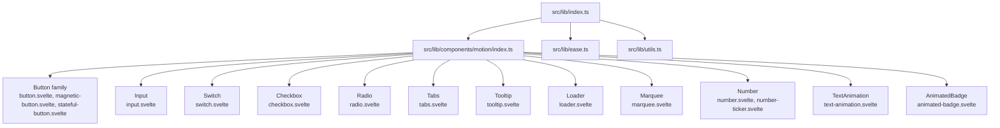
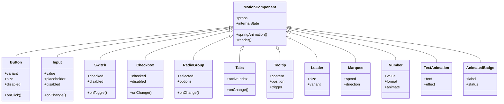
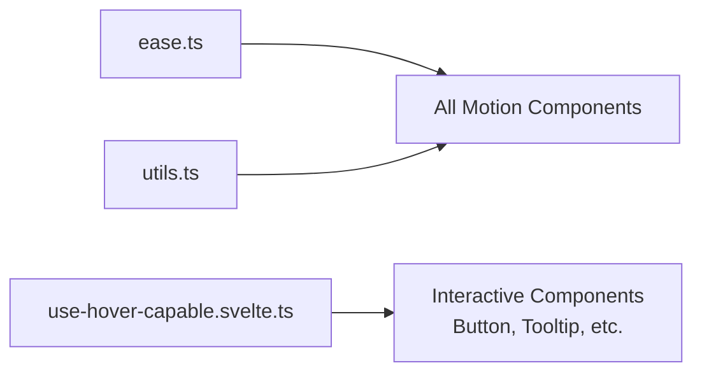

<cite>
**Referenced Files in This Document**
- `src/lib/index.ts`
- `src/lib/components/motion/index.ts`
- `src/lib/components/motion/button/button.svelte`
- `src/lib/components/motion/button/magnetic-button.svelte`
- `src/lib/components/motion/button/stateful-button.svelte`
- `src/lib/components/motion/input/input.svelte`
- `src/lib/components/motion/switch/switch.svelte`
- `src/lib/components/motion/checkbox/checkbox.svelte`
- `src/lib/components/motion/radio/radio.svelte`
- `src/lib/components/motion/tabs/tabs.svelte`
- `src/lib/components/motion/tooltip/tooltip.svelte`
- `src/lib/components/motion/loader/loader.svelte`
- `src/lib/components/motion/marquee/marquee.svelte`
- `src/lib/components/motion/number/number.svelte`
- `src/lib/components/motion/number/number-ticker.svelte`
- `src/lib/components/motion/text-animation/text-animation.svelte`
- `src/lib/components/motion/animated-badge/animated-badge.svelte`
- `src/lib/ease.ts`
- `src/lib/utils.ts`
- `src/lib/motion/use-hover-capable.svelte.ts`
</cite>

## Table of Contents
1. [Introduction](#introduction)
2. [Project Structure](#project-structure)
3. [Core Components](#core-components)
4. [Architecture Overview](#architecture-overview)
5. [Detailed Component Analysis](#detailed-component-analysis)
6. [Dependency Analysis](#dependency-analysis)
7. [Performance Considerations](#performance-considerations)
8. [Troubleshooting Guide](#troubleshooting-guide)
9. [Conclusion](#conclusion)

## Introduction
This document describes the motion-first component system built with Svelte 5 runes and spring physics. It covers all interactive components: Button, Input, Switch, Checkbox, Radio, Tabs, Tooltip, Loader, Marquee, Number, TextAnimation, and AnimatedBadge. You will learn how the spring animation system works, timing configurations, performance optimizations, prop interfaces, event handling, accessibility features, customization options, practical examples, browser compatibility, touch interactions, and integration patterns.

## Project Structure
The motion components are organized under src/lib/components/motion, each component living in its own folder with a .svelte file, styles, documentation, and an index export. The library’s public API is re-exported from src/lib/index.ts, which aggregates ease utilities, shared utils, and all motion components.

**Diagram sources**
- `src/lib/index.ts#L1-L6`
- `src/lib/components/motion/index.ts#L1-L13`

**Section sources**
- `src/lib/index.ts#L1-L6`
- `src/lib/components/motion/index.ts#L1-L13`

## Core Components
The motion components share common characteristics:
- Spring-based animations driven by Svelte 5 runes for reactive state and effects.
- Consistent prop interfaces for theme, size, disabled states, and accessibility attributes.
- Event hooks for user interactions (click, change, focus, hover).
- Accessibility support including roles, aria-* attributes, keyboard navigation where applicable.
- Styling via scoped CSS/SASS with design tokens for consistent theming.

Key shared utilities:
- ease.ts: easing functions used to shape motion curves.
- utils.ts: helper functions for DOM measurements, event normalization, and animation helpers.
- use-hover-capable.svelte.ts: composable for hover-aware behavior across components.

**Section sources**
- `src/lib/ease.ts`
- `src/lib/utils.ts`
- `src/lib/motion/use-hover-capable.svelte.ts`

## Architecture Overview
At a high level, each component encapsulates:
- Reactive props and internal state using Svelte 5 runes.
- Animation logic that computes spring-driven transitions based on state changes.
- Rendered markup with semantic HTML and ARIA attributes.
- Styles that respond to theme tokens and component variants.

**Diagram sources**
- `src/lib/components/motion/index.ts#L1-L13`

## Detailed Component Analysis

### Button Family
- Button: Primary interactive element with variants, sizes, and spring-based press/hover feedback.
- MagneticButton: Adds subtle magnetic attraction toward cursor on hover.
- StatefulButton: Manages loading/disabled states with animated transitions.

Prop interface highlights:
- variant, size, disabled, color, label, icon, onClick.
- Accessibility: role="button", tabindex, aria-pressed where relevant.

Event handling:
- click, pointerdown/up, mouseenter/leave, focus/blur.

Spring configuration:
- Stiffness, damping, mass tuned per variant; responsive adjustments for mobile.

Accessibility:
- Keyboard activation, focus ring, screen reader labels.

Customization:
- Theme tokens for colors, spacing, typography; CSS classes for overrides.

Practical example scenarios:
- Toggle loading state during async actions.
- Combine with icons and tooltips for rich interactions.

**Section sources**
- `src/lib/components/motion/button/button.svelte`
- `src/lib/components/motion/button/magnetic-button.svelte`
- `src/lib/components/motion/button/stateful-button.svelte`

### Input
- Accessible text input with spring-based focus/invalid states and floating label behavior.

Prop interface highlights:
- value, placeholder, disabled, readonly, type, name, id, onChange, onBlur, onFocus.

Event handling:
- Input events, validation triggers, focus management.

Spring configuration:
- Smooth transitions for focus rings, border color shifts, and label movement.

Accessibility:
- Associated label, aria-invalid, aria-describedby for error messages.

Customization:
- Size variants, theme tokens, custom prefixes/suffixes.

Practical example scenarios:
- Real-time validation with animated feedback.
- Controlled/uncontrolled usage patterns.

**Section sources**
- `src/lib/components/motion/input/input.svelte`

### Switch
- Toggle switch with spring physics for smooth thumb movement and background transitions.

Prop interface highlights:
- checked, disabled, label, id, onChange.

Event handling:
- Change events, keyboard toggling, focus management.

Spring configuration:
- Thumb translation and background color interpolation.

Accessibility:
- role="switch", aria-checked, keyboard support.

Customization:
- Colors, sizes, label positioning.

Practical example scenarios:
- Settings toggles with immediate visual feedback.

**Section sources**
- `src/lib/components/motion/switch/switch.svelte`

### Checkbox
- Checkable control with spring-based check animation and indeterminate state support.

Prop interface highlights:
- checked, indeterminate, disabled, label, id, onChange.

Event handling:
- Change events, keyboard toggling.

Spring configuration:
- Scale and rotation for checkmark appearance.

Accessibility:
- role="checkbox", aria-checked, keyboard support.

Customization:
- Sizes, colors, label alignment.

Practical example scenarios:
- Form selections with animated confirmation.

**Section sources**
- `src/lib/components/motion/checkbox/checkbox.svelte`

### Radio Group
- Group of mutually exclusive options with spring-based selection indicators.

Prop interface highlights:
- selected, options, disabled, onChange, name, id.

Event handling:
- Selection changes, keyboard navigation between options.

Spring configuration:
- Indicator movement and highlight transitions.

Accessibility:
- role="radiogroup", radio roles, aria-selected, arrow key navigation.

Customization:
- Layout direction, sizes, colors.

Practical example scenarios:
- Preference selectors with smooth transitions.

**Section sources**
- `src/lib/components/motion/radio/radio.svelte`

### Tabs
- Tabbed interface with animated indicator and content transitions.

Prop interface highlights:
- activeIndex, tabs, onChange, orientation, lazyRender.

Event handling:
- Click to switch, keyboard navigation, focus management.

Spring configuration:
- Underline indicator slide and content fade/scale transitions.

Accessibility:
- role="tablist", tab roles, aria-selected, arrow key navigation.

Customization:
- Orientation (horizontal/vertical), sizes, colors.

Practical example scenarios:
- Dashboard panels with lazy-loaded content.

**Section sources**
- `src/lib/components/motion/tabs/tabs.svelte`

### Tooltip
- Contextual overlay triggered by hover or focus with spring-based entrance/exit.

Prop interface highlights:
- content, position, trigger, delay, disabled.

Event handling:
- Hover/focus triggers, pointer interactions, escape to close.

Spring configuration:
- Opacity and transform transitions for popover appearance.

Accessibility:
- aria-describedby, focus trapping when open.

Customization:
- Positioning, offsets, theme tokens.

Practical example scenarios:
- Help hints and action confirmations.

**Section sources**
- `src/lib/components/motion/tooltip/tooltip.svelte`

### Loader
- Visual feedback for asynchronous operations with spring-based spin/scale animations.

Prop interface highlights:
- size, variant, label, aria-busy.

Event handling:
- Lifecycle integration with async flows.

Spring configuration:
- Rotation speed and pulsing effects.

Accessibility:
- aria-live regions, screen reader announcements.

Customization:
- Sizes, colors, inline/block modes.

Practical example scenarios:
- Page loading, form submission, data fetching.

**Section sources**
- `src/lib/components/motion/loader/loader.svelte`

### Marquee
- Infinite scrolling content with configurable speed and direction.

Prop interface highlights:
- speed, direction, pauseOnHover, loopCount.

Event handling:
- Hover pause/resume, touch swipe gestures.

Spring configuration:
- Smooth continuous translation with seamless looping.

Accessibility:
- aria-label, reduced motion preferences.

Customization:
- Direction, speed, gap, overflow behavior.

Practical example scenarios:
- News tickers, promotional banners.

**Section sources**
- `src/lib/components/motion/marquee/marquee.svelte`

### Number
- Animated numeric display with optional ticker effect for counting transitions.

Prop interface highlights:
- value, format, animate, duration, decimals.

Event handling:
- Value updates trigger spring-driven count transitions.

Spring configuration:
- Interpolation curve and easing for smooth counting.

Accessibility:
- aria-live for dynamic updates.

Customization:
- Formatting options, colors, sizes.

Practical example scenarios:
- Stats counters, progress indicators.

**Section sources**
- `src/lib/components/motion/number/number.svelte`
- `src/lib/components/motion/number/number-ticker.svelte`

### TextAnimation
- Animated text effects such as typing, fading, or sliding characters.

Prop interface highlights:
- text, effect, delay, stagger, loop.

Event handling:
- Start/pause controls, lifecycle hooks.

Spring configuration:
- Per-character transforms and opacity transitions.

Accessibility:
- aria-label for dynamic content updates.

Customization:
- Effect types, timing, colors.

Practical example scenarios:
- Hero headlines, onboarding tips.

**Section sources**
- `src/lib/components/motion/text-animation/text-animation.svelte`

### AnimatedBadge
- Dynamic badge with status indicators and spring-based badge transitions.

Prop interface highlights:
- label, status, color, size, showIcon.

Event handling:
- Status changes trigger animated transitions.

Spring configuration:
- Badge scale and color interpolation.

Accessibility:
- aria-live for status updates.

Customization:
- Colors, sizes, iconography.

Practical example scenarios:
- Notification badges, feature flags.

**Section sources**
- `src/lib/components/motion/animated-badge/animated-badge.svelte`

## Dependency Analysis
Components depend on shared utilities and motion primitives:
- ease.ts provides easing functions.
- utils.ts offers helper functions for DOM and animation.
- use-hover-capable.svelte.ts supplies hover behavior composable.

**Diagram sources**
- `src/lib/ease.ts`
- `src/lib/utils.ts`
- `src/lib/motion/use-hover-capable.svelte.ts`

**Section sources**
- `src/lib/ease.ts`
- `src/lib/utils.ts`
- `src/lib/motion/use-hover-capable.svelte.ts`

## Performance Considerations
- Prefer requestAnimationFrame-driven animations for smooth 60fps transitions.
- Use spring physics with appropriate stiffness/damping to avoid over-oscillation.
- Debounce rapid state changes (e.g., input events) before triggering animations.
- Avoid heavy computations inside render loops; memoize derived values.
- Leverage CSS transforms and opacity for GPU-accelerated animations.
- Respect prefers-reduced-motion to disable or simplify animations for accessibility.
- Lazy-render complex content within Tabs and Tooltips to reduce initial load.

[No sources needed since this section provides general guidance]

## Troubleshooting Guide
Common issues and resolutions:
- Animations not playing: Ensure Svelte 5 runes are correctly imported and reactive state is updated.
- Poor performance on low-end devices: Reduce animation complexity, disable non-essential effects, and use reduced motion.
- Accessibility problems: Verify ARIA attributes and keyboard navigation are implemented.
- Touch interactions unresponsive: Confirm pointer events are normalized and touch gestures are handled.
- Browser compatibility: Test on target browsers; polyfill if necessary for older environments.

**Section sources**
- `src/lib/motion/use-hover-capable.svelte.ts`

## Conclusion
The motion-first component system delivers a cohesive set of interactive UI elements powered by Svelte 5 runes and spring physics. With consistent prop interfaces, robust accessibility, and performance-conscious design, these components enable rich, responsive user experiences across platforms. By following the guidelines and examples provided, developers can integrate and customize these components effectively while maintaining high quality and accessibility standards.

[No sources needed since this section summarizes without analyzing specific files]