<cite>
**Referenced Files in This Document**
- `fractal-svelte/src/lib/index.ts`
- `fractal-svelte/src/lib/components/blocks/index.ts`
- `fractal-svelte/src/lib/components/blocks/notification-stack/notification-stack.svelte`
- `fractal-svelte/src/lib/components/blocks/notification-stack/notification-stack.md`
- `fractal-svelte/src/lib/components/blocks/notification-stack/ports/notification-stack.json`
- `fractal-svelte/src/lib/components/blocks/theme-toggle/theme-toggle.svelte`
- `fractal-svelte/src/lib/components/blocks/theme-toggle/theme-toggle.md`
- `fractal-svelte/src/lib/components/blocks/theme-toggle/ports/theme-toggle.json`
- `fractal-svelte/src/lib/components/blocks/not-found/not-found.svelte`
- `fractal-svelte/src/lib/components/blocks/not-found/not-found-glitch.svelte`
- `fractal-svelte/src/lib/components/blocks/not-found/not-found-magnetic.svelte`
- `fractal-svelte/src/lib/components/blocks/not-found/not-found-spotlight.svelte`
- `fractal-svelte/src/lib/components/blocks/not-found/not-found-stacked.svelte`
- `fractal-svelte/src/lib/components/blocks/not-found/not-found-terminal.svelte`
- `fractal-svelte/src/lib/components/blocks/not-found/not-found.md`
- `fractal-svelte/src/lib/components/blocks/not-found/ports/not-found.json`
- `fractal-svelte/src/lib/components/blocks/action-swap/action-swap.svelte`
- `fractal-svelte/src/lib/components/blocks/action-swap/action-swap.md`
- `fractal-svelte/src/lib/components/blocks/action-swap/ports/action-swap.json`
- `fractal-svelte/src/lib/components/blocks/bouncy-accordion/bouncy-accordion.svelte`
- `fractal-svelte/src/lib/components/blocks/bouncy-accordion/bouncy-accordion.md`
- `fractal-svelte/src/lib/components/blocks/bouncy-accordion/ports/bouncy-accordion.json`
- `fractal-svelte/src/lib/components/blocks/expandable-action-bar/expandable-action-bar.svelte`
- `fractal-svelte/src/lib/components/blocks/expandable-action-bar/expandable-action-bar.md`
- `fractal-svelte/src/lib/components/blocks/expandable-action-bar/ports/expandable-action-bar.json`
- `fractal-svelte/src/lib/components/blocks/overflow-actions/overflow-actions.svelte`
- `fractal-svelte/src/lib/components/blocks/overflow-actions/overflow-actions.md`
- `fractal-svelte/src/lib/components/blocks/overflow-actions/ports/overflow-actions.json`
- `fractal-svelte/src/lib/components/blocks/feedback-widget/feedback-widget.svelte`
- `fractal-svelte/src/lib/components/blocks/feedback-widget/feedback-widget.md`
- `fractal-svelte/src/lib/components/blocks/feedback-widget/ports/feedback-widget.json`
</cite>

## Table of Contents
1. [Introduction](#introduction)
2. [Project Structure](#project-structure)
3. [Core Components](#core-components)
4. [Architecture Overview](#architecture-overview)
5. [Detailed Component Analysis](#detailed-component-analysis)
6. [Dependency Analysis](#dependency-analysis)
7. [Performance Considerations](#performance-considerations)
8. [Troubleshooting Guide](#troubleshooting-guide)
9. [Conclusion](#conclusion)
10. [Appendices](#appendices)

## Introduction
This document provides comprehensive documentation for the ready-to-use UI blocks and layout components that deliver product features out of the box. It covers NotificationStack, ThemeToggle, NotFound variants (Glitch, Magnetic, Spotlight, Stacked, Terminal), ActionSwap, BouncyAccordion, ExpandableActionBar, OverflowActions, and FeedbackWidget. You will learn how these components are composed, their port-based architecture, customization strategies, and integration patterns with application state. Practical examples and responsive design considerations are included to help you implement common UI patterns quickly and consistently.

## Project Structure
The blocks live under a dedicated directory and are re-exported through a central index for easy consumption. Each block is self-contained with its Svelte component, styles, documentation, and a JSON port definition describing its public interface.

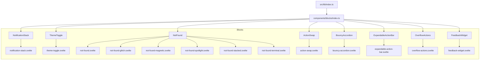

**Diagram sources**
- `fractal-svelte/src/lib/index.ts#L1-L6`
- `fractal-svelte/src/lib/components/blocks/index.ts#L1-L9`

**Section sources**
- `fractal-svelte/src/lib/index.ts#L1-L6`
- `fractal-svelte/src/lib/components/blocks/index.ts#L1-L9`

## Core Components
This section summarizes each block’s purpose, key props/events, composition model, and customization approach. For exact prop/event names and defaults, refer to the corresponding .md files and port JSONs.

- NotificationStack: Displays toast notifications with stacking behavior, auto-dismiss, and lifecycle hooks. Compose via slots or render functions; customize via CSS variables and theme tokens. Integrates with app-level notification state by dispatching events or updating a shared store.
- ThemeToggle: Switches between light/dark themes. Exposes current theme and toggle action. Works with global theme context or local state; supports persistence via storage.
- NotFound: Provides multiple visual variants (Glitch, Magnetic, Spotlight, Stacked, Terminal). Each variant is a separate component with distinct animations and interactions. Use as a route fallback or embedded page.
- ActionSwap: Dynamically swaps action buttons based on state or user interaction. Supports transitions and keyboard navigation. Ideal for contextual actions like edit/confirm/cancel flows.
- BouncyAccordion: Expandable content sections with spring-like animations. Manages open/close state internally or accepts controlled state from parent. Accessible by default.
- ExpandableActionBar: Contextual action bar that expands/collapses to reveal additional actions. Responds to viewport size and user gestures.
- OverflowActions: Menu management for limited space scenarios. Shows primary actions and hides secondary ones into an overflow menu. Keyboard accessible and screen-reader friendly.
- FeedbackWidget: Collects user input such as ratings, comments, or quick feedback. Emits validated events to parent; integrates with analytics or backend services.

**Section sources**
- `fractal-svelte/src/lib/components/blocks/notification-stack/notification-stack.md`
- `fractal-svelte/src/lib/components/blocks/theme-toggle/theme-toggle.md`
- `fractal-svelte/src/lib/components/blocks/not-found/not-found.md`
- `fractal-svelte/src/lib/components/blocks/action-swap/action-swap.md`
- `fractal-svelte/src/lib/components/blocks/bouncy-accordion/bouncy-accordion.md`
- `fractal-svelte/src/lib/components/blocks/expandable-action-bar/expandable-action-bar.md`
- `fractal-svelte/src/lib/components/blocks/overflow-actions/overflow-actions.md`
- `fractal-svelte/src/lib/components/blocks/feedback-widget/feedback-widget.md`

## Architecture Overview
All blocks follow a consistent port-based architecture:
- Port JSON defines the public API (props, events, slots).
- Svelte component implements behavior and styling.
- Documentation (.md) explains usage and examples.
- Centralized exports simplify imports across the app.

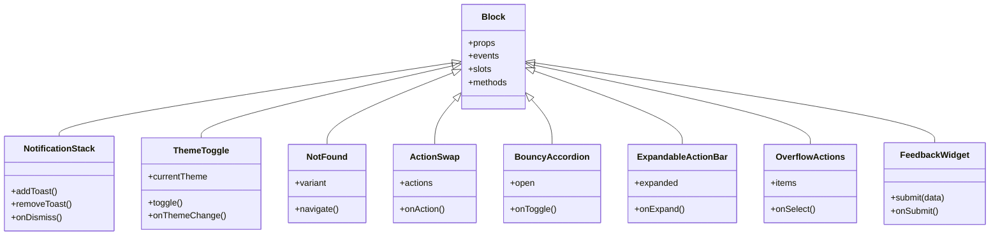

**Diagram sources**
- `fractal-svelte/src/lib/components/blocks/index.ts#L1-L9`
- `fractal-svelte/src/lib/components/blocks/notification-stack/ports/notification-stack.json`
- `fractal-svelte/src/lib/components/blocks/theme-toggle/ports/theme-toggle.json`
- `fractal-svelte/src/lib/components/blocks/not-found/ports/not-found.json`
- `fractal-svelte/src/lib/components/blocks/action-swap/ports/action-swap.json`
- `fractal-svelte/src/lib/components/blocks/bouncy-accordion/ports/bouncy-accordion.json`
- `fractal-svelte/src/lib/components/blocks/expandable-action-bar/ports/expandable-action-bar.json`
- `fractal-svelte/src/lib/components/blocks/overflow-actions/ports/overflow-actions.json`
- `fractal-svelte/src/lib/components/blocks/feedback-widget/ports/feedback-widget.json`

## Detailed Component Analysis

### NotificationStack
- Purpose: Manage and display toast notifications with stacking, auto-dismiss, and lifecycle control.
- Composition: Accepts a list of notifications and renders them in a stack. Supports custom renderers per type.
- State Integration: Dispatches add/remove events; can bind to a global notification store.
- Customization: Style via CSS variables and theme tokens; override animations and positioning.
- Accessibility: Focus management and ARIA attributes ensure screen reader compatibility.

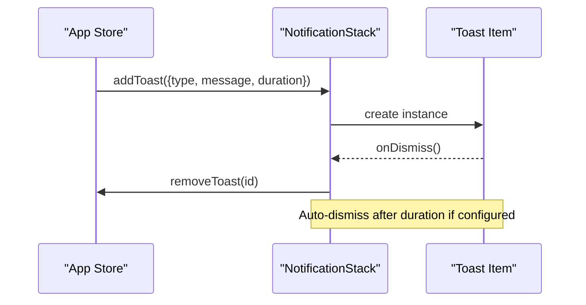

**Diagram sources**
- `fractal-svelte/src/lib/components/blocks/notification-stack/notification-stack.svelte`
- `fractal-svelte/src/lib/components/blocks/notification-stack/ports/notification-stack.json`

**Section sources**
- `fractal-svelte/src/lib/components/blocks/notification-stack/notification-stack.svelte`
- `fractal-svelte/src/lib/components/blocks/notification-stack/notification-stack.md`
- `fractal-svelte/src/lib/components/blocks/notification-stack/ports/notification-stack.json`

### ThemeToggle
- Purpose: Toggle between light and dark themes with smooth transitions.
- Composition: Renders a button or icon; exposes current theme and toggle method.
- State Integration: Can read/write a global theme context or local state; persists selection.
- Customization: Swap icons, adjust animation timing, and style via CSS variables.
- Accessibility: Proper labels and keyboard support.

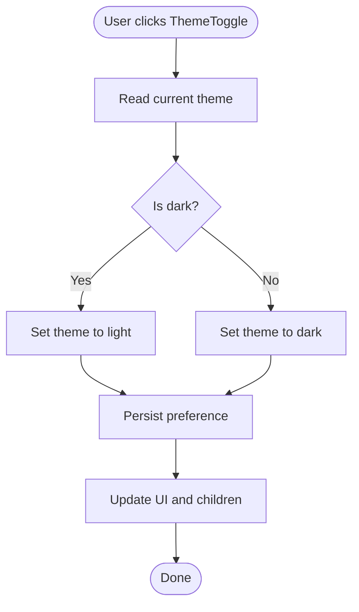

**Diagram sources**
- `fractal-svelte/src/lib/components/blocks/theme-toggle/theme-toggle.svelte`
- `fractal-svelte/src/lib/components/blocks/theme-toggle/ports/theme-toggle.json`

**Section sources**
- `fractal-svelte/src/lib/components/blocks/theme-toggle/theme-toggle.svelte`
- `fractal-svelte/src/lib/components/blocks/theme-toggle/theme-toggle.md`
- `fractal-svelte/src/lib/components/blocks/theme-toggle/ports/theme-toggle.json`

### NotFound Variants
- Purpose: Provide visually engaging 404 pages with distinct styles and interactions.
- Variants: Glitch, Magnetic, Spotlight, Stacked, Terminal.
- Composition: Each variant is a standalone component; the main NotFound selects the variant.
- Navigation: Expose methods to navigate back or to home.
- Customization: Adjust animations, colors, and copy per brand guidelines.

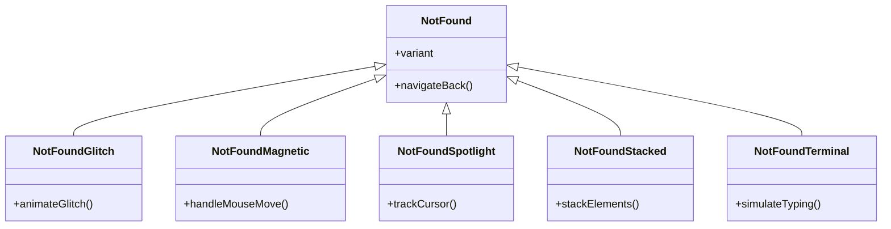

**Diagram sources**
- `fractal-svelte/src/lib/components/blocks/not-found/not-found.svelte`
- `fractal-svelte/src/lib/components/blocks/not-found/not-found-glitch.svelte`
- `fractal-svelte/src/lib/components/blocks/not-found/not-found-magnetic.svelte`
- `fractal-svelte/src/lib/components/blocks/not-found/not-found-spotlight.svelte`
- `fractal-svelte/src/lib/components/blocks/not-found/not-found-stacked.svelte`
- `fractal-svelte/src/lib/components/blocks/not-found/not-found-terminal.svelte`
- `fractal-svelte/src/lib/components/blocks/not-found/ports/not-found.json`

**Section sources**
- `fractal-svelte/src/lib/components/blocks/not-found/not-found.svelte`
- `fractal-svelte/src/lib/components/blocks/not-found/not-found.md`
- `fractal-svelte/src/lib/components/blocks/not-found/ports/not-found.json`

### ActionSwap
- Purpose: Dynamically swap action buttons based on state or user interactions.
- Composition: Accepts an array of actions; renders the active one with transitions.
- State Integration: Controlled or uncontrolled mode; emits events when actions change.
- Customization: Define action shapes, icons, and handlers; animate transitions.
- Accessibility: Keyboard navigation and focus management.

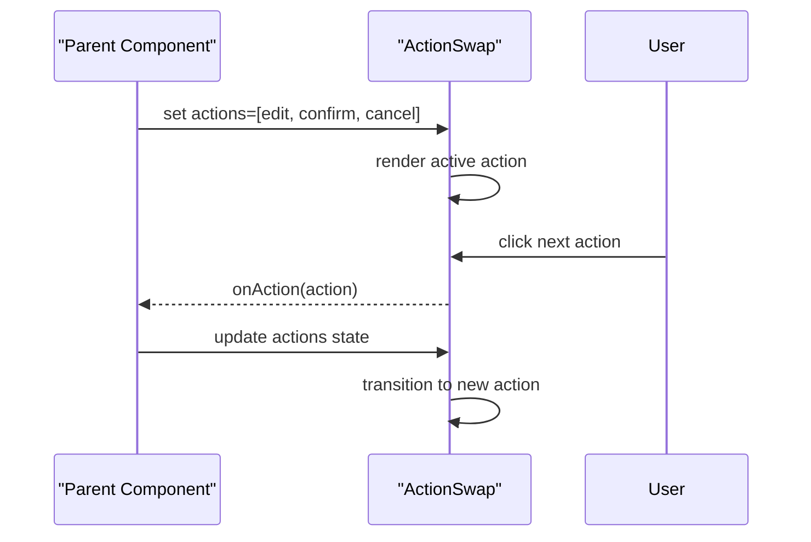

**Diagram sources**
- `fractal-svelte/src/lib/components/blocks/action-swap/action-swap.svelte`
- `fractal-svelte/src/lib/components/blocks/action-swap/ports/action-swap.json`

**Section sources**
- `fractal-svelte/src/lib/components/blocks/action-swap/action-swap.svelte`
- `fractal-svelte/src/lib/components/blocks/action-swap/action-swap.md`
- `fractal-svelte/src/lib/components/blocks/action-swap/ports/action-swap.json`

### BouncyAccordion
- Purpose: Expandable content sections with spring-like animations.
- Composition: Single or multiple accordions; manages internal state or accepts controlled open state.
- State Integration: Emits toggle events; can bind to external stores.
- Customization: Adjust easing, duration, and content rendering.
- Accessibility: ARIA attributes and keyboard support.

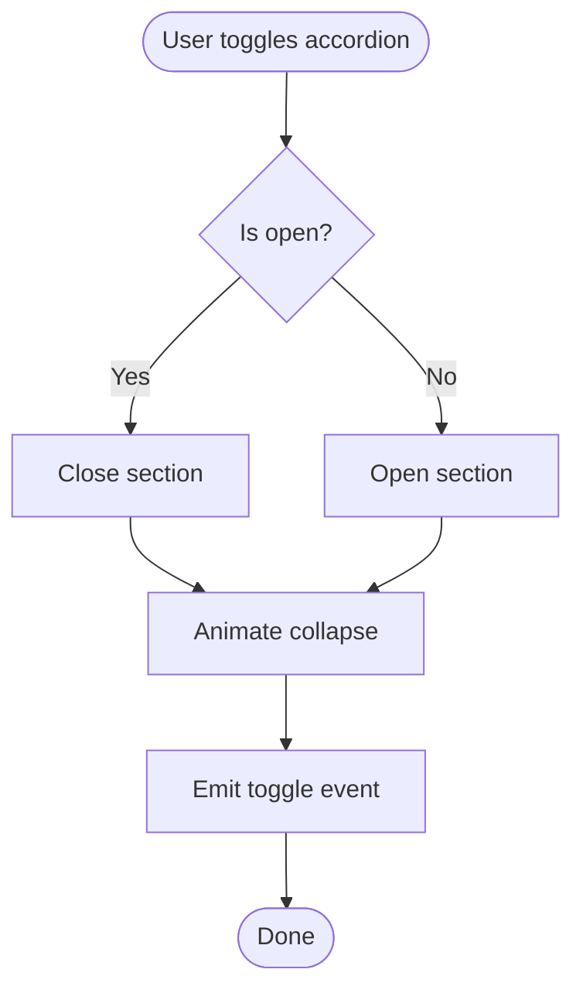

**Diagram sources**
- `fractal-svelte/src/lib/components/blocks/bouncy-accordion/bouncy-accordion.svelte`
- `fractal-svelte/src/lib/components/blocks/bouncy-accordion/ports/bouncy-accordion.json`

**Section sources**
- `fractal-svelte/src/lib/components/blocks/bouncy-accordion/bouncy-accordion.svelte`
- `fractal-svelte/src/lib/components/blocks/bouncy-accordion/bouncy-accordion.md`
- `fractal-svelte/src/lib/components/blocks/bouncy-accordion/ports/bouncy-accordion.json`

### ExpandableActionBar
- Purpose: Contextual action bar that expands/collapses to reveal additional actions.
- Composition: Primary actions visible by default; secondary actions hidden until expanded.
- State Integration: Controlled or uncontrolled expansion; emits expand/collapse events.
- Customization: Layout, spacing, and animation settings.
- Accessibility: Focus order and keyboard shortcuts.

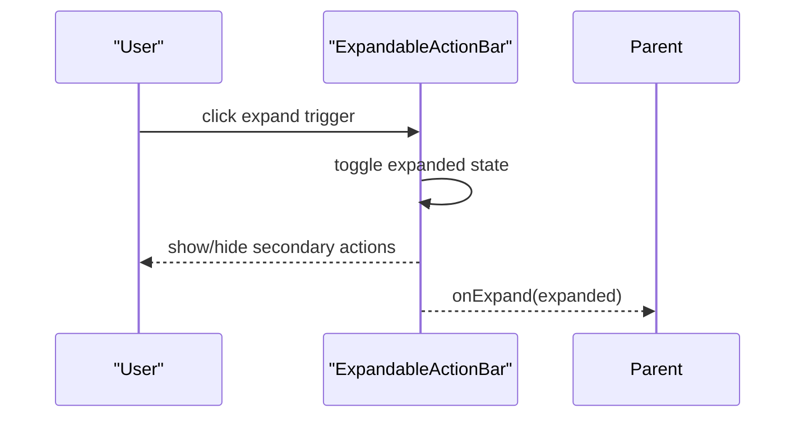

**Diagram sources**
- `fractal-svelte/src/lib/components/blocks/expandable-action-bar/expandable-action-bar.svelte`
- `fractal-svelte/src/lib/components/blocks/expandable-action-bar/ports/expandable-action-bar.json`

**Section sources**
- `fractal-svelte/src/lib/components/blocks/expandable-action-bar/expandable-action-bar.svelte`
- `fractal-svelte/src/lib/components/blocks/expandable-action-bar/expandable-action-bar.md`
- `fractal-svelte/src/lib/components/blocks/expandable-action-bar/ports/expandable-action-bar.json`

### OverflowActions
- Purpose: Manage menu items when space is limited; shows primary actions and hides others into an overflow menu.
- Composition: Accepts a list of actions; dynamically splits into visible and overflow groups.
- State Integration: Emits selection events; can integrate with routing or global commands.
- Customization: Thresholds for overflow, menu placement, and item rendering.
- Accessibility: Keyboard navigation and ARIA roles.

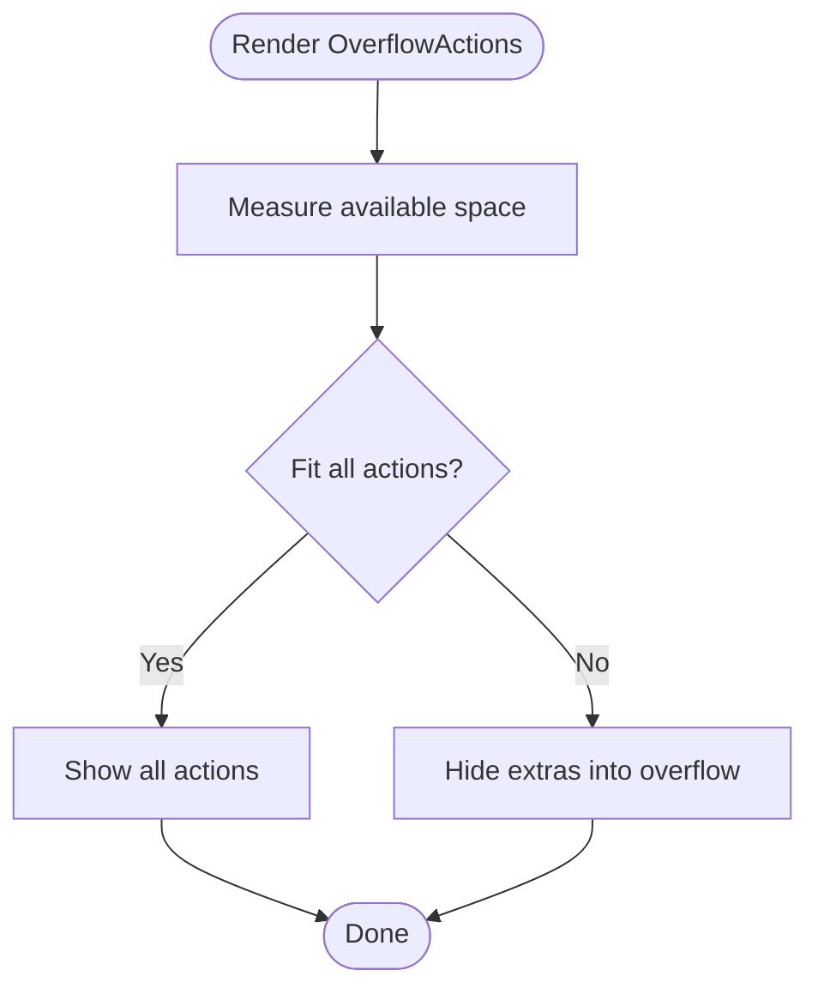

**Diagram sources**
- `fractal-svelte/src/lib/components/blocks/overflow-actions/overflow-actions.svelte`
- `fractal-svelte/src/lib/components/blocks/overflow-actions/ports/overflow-actions.json`

**Section sources**
- `fractal-svelte/src/lib/components/blocks/overflow-actions/overflow-actions.svelte`
- `fractal-svelte/src/lib/components/blocks/overflow-actions/overflow-actions.md`
- `fractal-svelte/src/lib/components/blocks/overflow-actions/ports/overflow-actions.json`

### FeedbackWidget
- Purpose: Collect user input such as ratings, comments, or quick feedback.
- Composition: Configurable fields and validation rules; emits submitted data.
- State Integration: Controlled or uncontrolled; integrates with analytics or backend APIs.
- Customization: Field types, labels, placeholders, and submission handlers.
- Accessibility: Labels, error messages, and keyboard support.

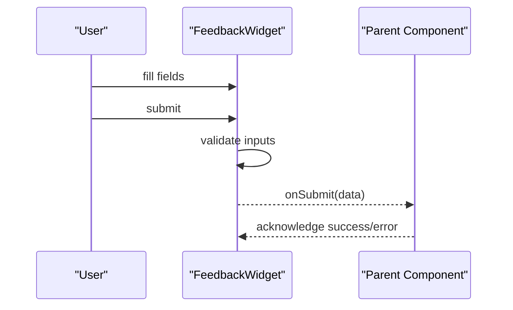

**Diagram sources**
- `fractal-svelte/src/lib/components/blocks/feedback-widget/feedback-widget.svelte`
- `fractal-svelte/src/lib/components/blocks/feedback-widget/ports/feedback-widget.json`

**Section sources**
- `fractal-svelte/src/lib/components/blocks/feedback-widget/feedback-widget.svelte`
- `fractal-svelte/src/lib/components/blocks/feedback-widget/feedback-widget.md`
- `fractal-svelte/src/lib/components/blocks/feedback-widget/ports/feedback-widget.json`

## Dependency Analysis
The blocks are exported centrally and depend on their respective port definitions and Svelte implementations. There are no circular dependencies among blocks; they remain decoupled and composable.

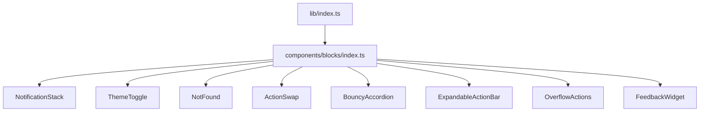

**Diagram sources**
- `fractal-svelte/src/lib/index.ts#L1-L6`
- `fractal-svelte/src/lib/components/blocks/index.ts#L1-L9`

**Section sources**
- `fractal-svelte/src/lib/index.ts#L1-L6`
- `fractal-svelte/src/lib/components/blocks/index.ts#L1-L9`

## Performance Considerations
- Minimize re-renders by using controlled state only when necessary; prefer internal state for simple interactions.
- Debounce expensive operations (e.g., measuring overflow) and use requestAnimationFrame where appropriate.
- Keep animations lightweight; prefer CSS transforms and opacity for smooth performance.
- Avoid heavy computations in render loops; memoize derived values.
- Use lazy loading for large NotFound variants if not immediately needed.

[No sources needed since this section provides general guidance]

## Troubleshooting Guide
- Notifications not appearing: Ensure the stack is mounted and addToast is called with valid payloads; check auto-dismiss durations.
- Theme not persisting: Verify storage access and theme context initialization; check for conflicting theme providers.
- NotFound variant mismatch: Confirm variant prop matches supported options; inspect console for missing assets.
- ActionSwap not transitioning: Validate action array structure and ensure unique keys; check event handlers.
- Accordion not animating: Inspect CSS variables and animation timings; ensure content height changes are allowed.
- ExpandableActionBar not expanding: Check viewport constraints and expansion triggers; verify event bindings.
- OverflowActions hiding too early: Adjust thresholds and container measurements; test on various screen sizes.
- FeedbackWidget validation errors: Review field schemas and error messages; ensure required fields are provided.

**Section sources**
- `fractal-svelte/src/lib/components/blocks/notification-stack/notification-stack.md`
- `fractal-svelte/src/lib/components/blocks/theme-toggle/theme-toggle.md`
- `fractal-svelte/src/lib/components/blocks/not-found/not-found.md`
- `fractal-svelte/src/lib/components/blocks/action-swap/action-swap.md`
- `fractal-svelte/src/lib/components/blocks/bouncy-accordion/bouncy-accordion.md`
- `fractal-svelte/src/lib/components/blocks/expandable-action-bar/expandable-action-bar.md`
- `fractal-svelte/src/lib/components/blocks/overflow-actions/overflow-actions.md`
- `fractal-svelte/src/lib/components/blocks/feedback-widget/feedback-widget.md`

## Conclusion
These product blocks provide a cohesive, customizable, and accessible foundation for building rich UI experiences. Their port-based architecture ensures clear contracts and easy integration with application state. By following the composition patterns and customization strategies outlined here, you can rapidly assemble responsive interfaces that align with your design system and user needs.

[No sources needed since this section summarizes without analyzing specific files]

## Appendices
- Practical Examples: Combine NotificationStack with form submissions to show success/error toasts. Use ThemeToggle at the app root to manage global theme state. Implement NotFound variants as route fallbacks with branded messaging.
- Responsive Design: Test OverflowActions and ExpandableActionBar across breakpoints; adjust thresholds and layouts accordingly.
- Accessibility: Ensure all interactive elements have proper labels, roles, and keyboard support; leverage built-in accessibility features of each block.

[No sources needed since this section provides general guidance]