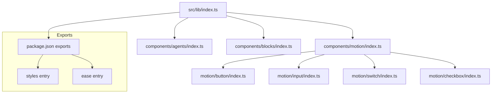
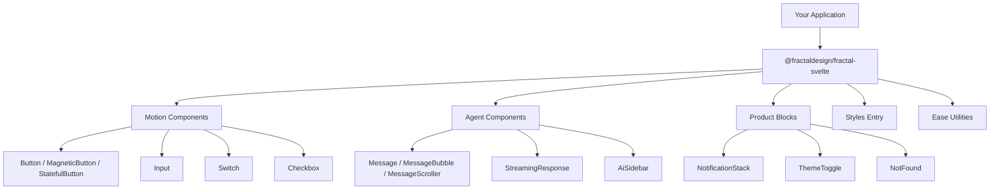
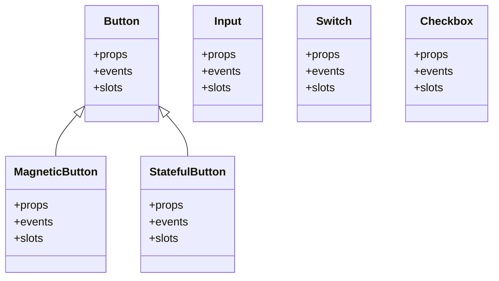
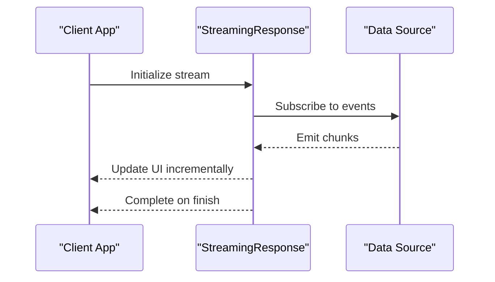
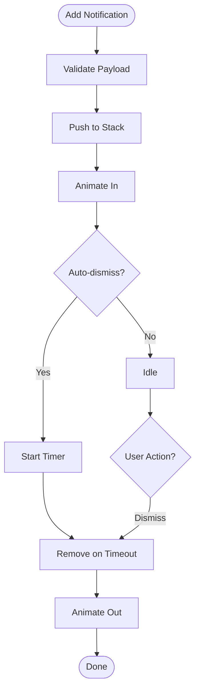
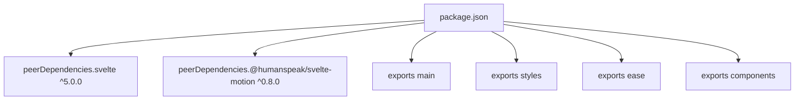

<cite>
**Referenced Files in This Document**
- `packages/fractal-svelte/package.json`
- `packages/fractal-svelte/src/lib/index.ts`
- `packages/fractal-svelte/src/lib/components/motion/index.ts`
- `packages/fractal-svelte/src/lib/components/agents/index.ts`
- `packages/fractal-svelte/src/lib/components/blocks/index.ts`
- `packages/fractal-svelte/src/lib/components/motion/button/index.ts`
- `packages/fractal-svelte/src/lib/components/motion/input/index.ts`
- `packages/fractal-svelte/src/lib/components/motion/switch/index.ts`
- `packages/fractal-svelte/src/lib/components/motion/checkbox/index.ts`
</cite>

## Table of Contents
1. Introduction
2. Project Structure
3. Core Components
4. Architecture Overview
5. Detailed Component Analysis
6. Dependency Analysis
7. Performance Considerations
8. Troubleshooting Guide
9. Conclusion

## Introduction
This document describes the Svelte 5 UI component library with a motion-first design philosophy. The library provides spring-animated primitives, agent-oriented components for AI-driven interfaces, and product blocks for common application surfaces. It emphasizes TypeScript-first APIs, consistent prop contracts, accessible interactions, and responsive behavior across devices.

Key characteristics:
- Motion-first animations powered by a dedicated motion runtime integrated via peer dependencies.
- Clear module boundaries per category: Motion Components, Agent Components, and Product Blocks.
- Strong typing through TypeScript declarations and explicit exports.
- Theming and styling via Sass-based stylesheets exposed as an importable entry.

## Project Structure
The library is organized into three primary component categories under src/lib/components, each with its own index barrel file that re-exports public symbols. A top-level index aggregates all exports for convenient imports. Package metadata defines export maps for individual components, styles, and utilities.

**Diagram sources**
- `packages/fractal-svelte/src/lib/index.ts#L1-L6`
- `packages/fractal-svelte/src/lib/components/motion/index.ts#L1-L13`
- `packages/fractal-svelte/src/lib/components/agents/index.ts#L1-L10`
- `packages/fractal-svelte/src/lib/components/blocks/index.ts#L1-L9`
- `packages/fractal-svelte/package.json#L54-L214`

**Section sources**
- `packages/fractal-svelte/package.json#L1-L245`
- `packages/fractal-svelte/src/lib/index.ts#L1-L6`

## Core Components
The library exposes three categories of components:

- Motion Components: Button variants (including magnetic and stateful), Input, Switch, Checkbox, Loader, Tabs, Tooltip, Marquee, Number, TextAnimation, AnimatedBadge, RadioGroup.
- Agent Components: Message, MessageBubble, MessageScroller, PromptInput, StreamingResponse, TodoList, ApprovalCard, FileDiff, AiSidebar.
- Product Blocks: NotificationStack, ThemeToggle, NotFound, FeedbackWidget, ExpandableActionBar, ActionSwap, BouncyAccordion, OverflowActions.

Each category is exported from its respective barrel file and individually addressable via package exports.

**Section sources**
- `packages/fractal-svelte/src/lib/components/motion/index.ts#L1-L13`
- `packages/fractal-svelte/src/lib/components/agents/index.ts#L1-L10`
- `packages/fractal-svelte/src/lib/components/blocks/index.ts#L1-L9`
- `packages/fractal-svelte/package.json#L54-L214`

## Architecture Overview
The architecture follows a layered approach:
- Entry point aggregates exports from motion, agents, and blocks.
- Each category barrel centralizes public API surface.
- Individual components encapsulate their logic, styles, and types.
- Package exports map to both runtime modules and type definitions.

**Diagram sources**
- `packages/fractal-svelte/src/lib/index.ts#L1-L6`
- `packages/fractal-svelte/src/lib/components/motion/index.ts#L1-L13`
- `packages/fractal-svelte/src/lib/components/agents/index.ts#L1-L10`
- `packages/fractal-svelte/src/lib/components/blocks/index.ts#L1-L9`
- `packages/fractal-svelte/package.json#L54-L214`

## Detailed Component Analysis

### Motion Components
Motion components provide spring-based animations and interactive feedback. Key examples include Button variants, Input, Switch, and Checkbox. They are designed to be composable, accessible, and themeable.

- Button family: Includes standard Button, MagneticButton, and StatefulButton. These expose props for state management, interaction effects, and accessibility attributes.
- Input: Provides controlled/uncontrolled patterns, validation hooks, and animated focus states.
- Switch: Offers toggle semantics with keyboard navigation and screen reader support.
- Checkbox: Supports indeterminate states, grouping, and accessible labels.

Usage pattern overview:
- Import from the category barrel or direct path.
- Bind values using Svelte 5 runes where applicable.
- Compose with icons and text slots.
- Customize via CSS variables and Sass tokens.

**Diagram sources**
- `packages/fractal-svelte/src/lib/components/motion/button/index.ts#L1-L4`
- `packages/fractal-svelte/src/lib/components/motion/input/index.ts#L1-L2`
- `packages/fractal-svelte/src/lib/components/motion/switch/index.ts#L1-L2`
- `packages/fractal-svelte/src/lib/components/motion/checkbox/index.ts#L1-L2`

**Section sources**
- `packages/fractal-svelte/src/lib/components/motion/button/index.ts#L1-L4`
- `packages/fractal-svelte/src/lib/components/motion/input/index.ts#L1-L2`
- `packages/fractal-svelte/src/lib/components/motion/switch/index.ts#L1-L2`
- `packages/fractal-svelte/src/lib/components/motion/checkbox/index.ts#L1-L2`

### Agent Components
Agent components facilitate AI-driven user experiences such as chat-like interfaces, streaming responses, and sidebars for agent interactions.

- Message and MessageBubble: Render conversational content with avatars, headers, footers, and typing indicators.
- MessageScroller: Manages scroll behavior for long conversations.
- PromptInput: Specialized input for prompts with action buttons and suggestions.
- StreamingResponse: Displays incremental updates with smooth transitions.
- TodoList, ApprovalCard, FileDiff: Structured views for tasks, approvals, and diffs within agent workflows.
- AiSidebar: Contextual panel for agent controls and status.

Sequence example for streaming response:

**Diagram sources**
- `packages/fractal-svelte/src/lib/components/agents/index.ts#L1-L10`

**Section sources**
- `packages/fractal-svelte/src/lib/components/agents/index.ts#L1-L10`

### Product Blocks
Product blocks deliver higher-level UI surfaces commonly used in applications.

- NotificationStack: Stacks notifications with enter/exit animations and auto-dismiss.
- ThemeToggle: Toggles theme state with smooth transitions and persistence.
- NotFound: Multiple themed variants for error pages with engaging animations.
- FeedbackWidget, ExpandableActionBar, ActionSwap, BouncyAccordion, OverflowActions: Interactive patterns for actions, feedback, and layout control.

Flowchart for notification stack lifecycle:

**Diagram sources**
- `packages/fractal-svelte/src/lib/components/blocks/index.ts#L1-L9`

**Section sources**
- `packages/fractal-svelte/src/lib/components/blocks/index.ts#L1-L9`

## Dependency Analysis
The library declares peer dependencies for Svelte 5 and the motion runtime, ensuring compatibility and allowing consumers to manage versions. Exports are defined for:
- Main entry (types and runtime)
- Styles entry (Sass)
- Ease utilities
- Individual components via named paths

**Diagram sources**
- `packages/fractal-svelte/package.json#L215-L218`
- `packages/fractal-svelte/package.json#L54-L214`

**Section sources**
- `packages/fractal-svelte/package.json#L215-L218`
- `packages/fractal-svelte/package.json#L54-L214`

## Performance Considerations
- Prefer importing only the components you use to minimize bundle size.
- Use lazy loading for heavy agent components like StreamingResponse when appropriate.
- Avoid excessive nested animations; leverage shared easing functions and motion presets.
- Debounce or throttle event handlers in high-frequency scenarios (e.g., scrolling message lists).
- Utilize CSS containment and will-change sparingly to prevent repaint overhead.
- Test on low-power devices and ensure animations respect reduced motion preferences.

[No sources needed since this section provides general guidance]

## Troubleshooting Guide
Common issues and resolutions:
- Missing peer dependency errors: Ensure Svelte 5 and @humanspeak/svelte-motion are installed at compatible versions.
- Style not applied: Verify the styles entry is imported and that Sass compilation is configured correctly.
- Type errors: Confirm TypeScript configuration includes the package’s types field and that your project uses the same Svelte version.
- Animation glitches: Check for conflicting CSS transforms and ensure motion context is available in the component tree.
- Accessibility warnings: Provide proper aria-labels, roles, and keyboard handlers for custom inputs and toggles.

**Section sources**
- `packages/fractal-svelte/package.json#L215-L218`
- `packages/fractal-svelte/package.json#L60-L68`

## Conclusion
This Svelte 5 UI component library offers a cohesive, motion-first system with strong TypeScript support and clear module boundaries. By organizing components into Motion, Agents, and Blocks, it enables scalable design systems and consistent user experiences. Adopt the provided exports, follow accessibility guidelines, and leverage theming and animation utilities to build performant, responsive interfaces.

[No sources needed since this section summarizes without analyzing specific files]