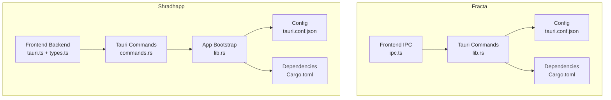
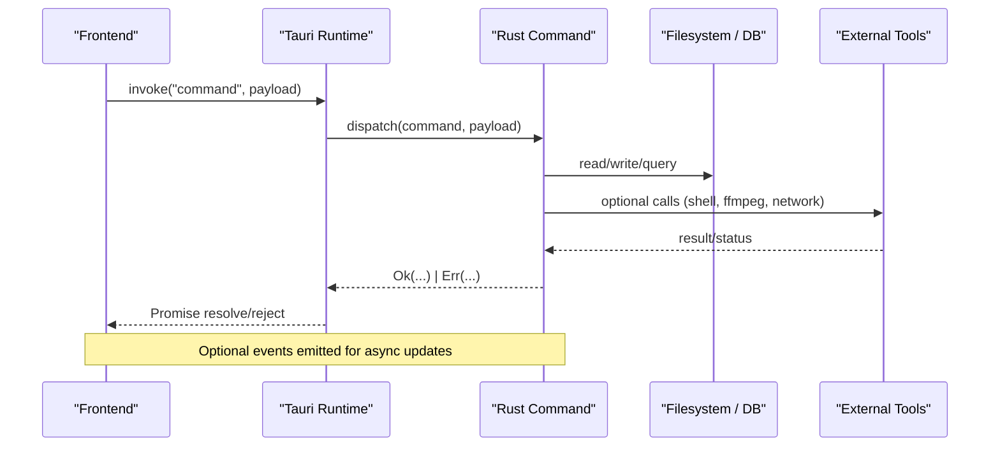
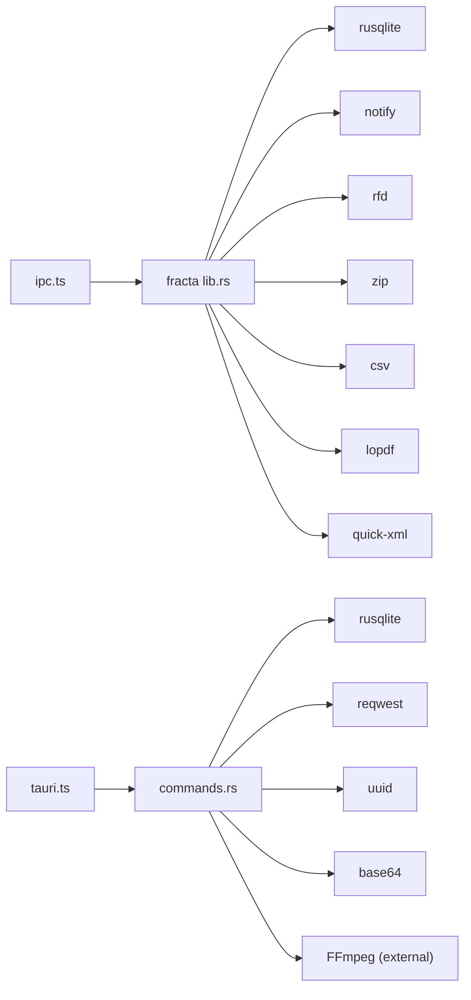

<cite>
**Referenced Files in This Document**
- [lib.rs](../../../apps/fracta/src-tauri/src/lib.rs)
- [Cargo.toml](../../../apps/fracta/src-tauri/Cargo.toml)
- [tauri.conf.json](../../../apps/fracta/src-tauri/tauri.conf.json)
- [ipc.ts](../../../apps/fracta/src/lib/ipc.ts)
- [commands.rs](../../../apps/shradhapp/src-tauri/src/commands.rs)
- [lib.rs](../../../apps/shradhapp/src-tauri/src/lib.rs)
- [Cargo.toml](../../../apps/shradhapp/src-tauri/Cargo.toml)
- [tauri.conf.json](../../../apps/shradhapp/src-tauri/tauri.conf.json)
- [tauri.ts](../../../apps/shradhapp/src/lib/backend/tauri.ts)
- [types.ts](../../../apps/shradhapp/src/lib/backend/types.ts)
- [index.ts](../../../apps/shradhapp/src/lib/backend/index.ts)
</cite>

## Table of Contents
1. Introduction
2. Project Structure
3. Core Components
4. Architecture Overview
5. Detailed Component Analysis
6. Dependency Analysis
7. Performance Considerations
8. Troubleshooting Guide
9. Conclusion
10. Appendices

## Introduction
This document provides a comprehensive API reference for the Tauri commands and public interfaces exposed by the two desktop applications in this monorepo: Fracta (knowledge vault and workspace tool) and Shradhapp (personal video assembly app). It covers command structures, data formats, error handling, security considerations, protocol-specific examples, client implementation guidelines, performance optimization tips, authentication methods, rate limiting strategies, versioning information, migration guides, and backwards compatibility notes.

## Project Structure
The repository contains two Tauri applications with Rust backends and SvelteKit frontends:
- Fracta: Vault management, recursive workspace operations, search, auto-tagging rules, and local GGUF model integration.
- Shradhapp: Media bank, voiceover recording, project management, timeline-based export, YouTube channel listing, and app settings.

**Diagram sources**
- [ipc.ts:1-237](../../../apps/fracta/src/lib/ipc.ts#L1-L237)
- [lib.rs:1-498](../../../apps/fracta/src-tauri/src/lib.rs#L1-L498)
- [tauri.conf.json:1-48](../../../apps/fracta/src-tauri/tauri.conf.json#L1-L48)
- [Cargo.toml:1-44](../../../apps/fracta/src-tauri/Cargo.toml#L1-L44)
- [tauri.ts:1-105](../../../apps/shradhapp/src/lib/backend/tauri.ts#L1-L105)
- [types.ts:1-173](../../../apps/shradhapp/src/lib/backend/types.ts#L1-L173)
- [commands.rs:1-1357](../../../apps/shradhapp/src-tauri/src/commands.rs#L1-L1357)
- [lib.rs:1-67](../../../apps/shradhapp/src-tauri/src/lib.rs#L1-L67)
- [tauri.conf.json:1-44](../../../apps/shradhapp/src-tauri/tauri.conf.json#L1-L44)
- [Cargo.toml:1-27](../../../apps/shradhapp/src-tauri/Cargo.toml#L1-L27)

**Section sources**
- [lib.rs:1-498](../../../apps/fracta/src-tauri/src/lib.rs#L1-L498)
- [Cargo.toml:1-44](../../../apps/fracta/src-tauri/Cargo.toml#L1-L44)
- [tauri.conf.json:1-48](../../../apps/fracta/src-tauri/tauri.conf.json#L1-L48)
- [ipc.ts:1-237](../../../apps/fracta/src/lib/ipc.ts#L1-L237)
- [commands.rs:1-1357](../../../apps/shradhapp/src-tauri/src/commands.rs#L1-L1357)
- [lib.rs:1-67](../../../apps/shradhapp/src-tauri/src/lib.rs#L1-L67)
- [Cargo.toml:1-27](../../../apps/shradhapp/src-tauri/Cargo.toml#L1-L27)
- [tauri.conf.json:1-44](../../../apps/shradhapp/src-tauri/tauri.conf.json#L1-L44)
- [tauri.ts:1-105](../../../apps/shradhapp/src/lib/backend/tauri.ts#L1-L105)
- [types.ts:1-173](../../../apps/shradhapp/src/lib/backend/types.ts#L1-L173)
- [index.ts:1-10](../../../apps/shradhapp/src/lib/backend/index.ts#L1-L10)

## Core Components
- Fracta Tauri commands expose vault CRUD, workspace file operations, search indexing, terminal execution, asset reading, auto-tagging rules, and GGUF engine control.
- Shradhapp Tauri commands expose media library management, voiceover recording, audio cleanup/repair, project CRUD, timeline export, YouTube channel listing, and app settings.

Key responsibilities:
- Fracta: Secure filesystem access, event-driven workspace watching, search index maintenance, safe shell execution with timeouts, and local LLM server lifecycle.
- Shradhapp: Robust media import pipeline, thumbnail/waveform generation, FFmpeg-backed export, cancellation support, and typed settings normalization.

**Section sources**
- [lib.rs:42-494](../../../apps/fracta/src-tauri/src/lib.rs#L42-L494)
- [commands.rs:178-216](../../../apps/shradhapp/src-tauri/src/commands.rs#L178-L216)

## Architecture Overview
Both apps follow a consistent pattern:
- Frontend invokes Tauri commands via @tauri-apps/api/core invoke.
- Rust backend implements commands, manages state, performs I/O, and returns typed results or errors.
- Events are emitted for long-running operations (workspace changes, export progress).

**Diagram sources**
- [ipc.ts:1-237](../../../apps/fracta/src/lib/ipc.ts#L1-L237)
- [lib.rs:454-494](../../../apps/fracta/src-tauri/src/lib.rs#L454-L494)
- [commands.rs:1016-1194](../../../apps/shradhapp/src-tauri/src/commands.rs#L1016-L1194)
- [tauri.ts:88-94](../../../apps/shradhapp/src/lib/backend/tauri.ts#L88-L94)

## Detailed Component Analysis

### Fracta: Vault Management API
Commands:
- vault_status: Returns configured status and path.
- pick_vault: Opens native folder picker and sets vault.
- list_entries: Lists entry summaries.
- read_entry: Reads full entry by id.
- create_entry: Creates a new entry and returns id.
- write_entry: Writes title, category, tags, body; returns updated entry.
- delete_entry: Deletes an entry by id.

Data formats:
- EntrySummary: id, title, category, tags, created_at, updated_at, excerpt.
- Entry: id, title, category, tags, body, timestamps.

Error handling:
- All commands return Result-like types; frontend receives either resolved values or error strings.

Security considerations:
- Vault path is persisted under app config directory; user-selected via native dialog.
- Filesystem operations are scoped to the selected vault root.

Client implementation:
- Use ipc.ts helpers to call commands; handle null responses from pick_vault.

Performance:
- Batch operations where possible; avoid frequent small writes.

Versioning:
- No explicit version field in vault entries; rely on timestamps.

Migration:
- Not applicable at this layer.

Backwards compatibility:
- Stable signatures; adding fields should be additive.

**Section sources**
- [lib.rs:42-96](../../../apps/fracta/src-tauri/src/lib.rs#L42-L96)
- [ipc.ts:7-50](../../../apps/fracta/src/lib/ipc.ts#L7-L50)

### Fracta: Workspace Operations API
Commands:
- list_workspace: Recursively lists items with kind, size, modified_at.
- read_workspace_file: Reads text content with encoding/newline metadata.
- read_workspace_pdf_bytes: Returns raw bytes for PDF rendering.
- read_workspace_image_asset / read_workspace_media_asset: Returns mime and byte array.
- read_workspace_docx_image: Extracts image from DOCX archive.
- watch_workspace: Starts OS watcher and emits "workspace://changed" with changed paths.
- run_workspace_terminal: Executes shell command with bounded runtime and output limits.
- print_workspace: Opens native print dialog.
- preview_workspace_document: Parses documents into blocks/text/pages.
- write_workspace_file: Saves content preserving encoding/newline.
- create_workspace_folder, move_workspace_path, delete_workspace_path, duplicate_workspace_path: Manage paths.
- reveal_workspace_path, open_workspace_externally: OS integrations.
- workspace_links: Forward/backlinks, dead links, suggestions.
- workspace_graph: Nodes, edges, hubs, orphans.
- rebuild_workspace_index: Rebuilds search index; returns item count.
- search_workspace: Returns hits with score and excerpts.
- convert_csv_to_json / convert_json_to_csv: Data conversion utilities.

Data formats:
- WorkspaceItem: path, name, kind, size, modified_at.
- WorkspaceFile: path, kind, content, read_only, size, modified_at, encoding, newline.
- LinkReport: path, forward, backlinks, dead, orphan, suggestions.
- GraphReport: nodes, edges, hubs, orphans.
- DocumentPreview: path, kind, text, pages, page_texts, docx_blocks, warning.
- TerminalResult: stdout, stderr, status, timed_out.

Error handling:
- Errors returned as strings; watch_workspace wraps watcher errors; terminal command enforces timeout and truncates output.

Security considerations:
- Terminal execution runs with vault working directory; commands are user-supplied and bounded.
- Output truncated to prevent memory issues.

Client implementation:
- Use ipc.ts functions; subscribe to "workspace://changed" for live updates.

Performance:
- Watcher events are advisory; frontend re-lists through commands for consistency.
- Search index updates are incremental on file changes.

Versioning:
- Index rebuild returns count; no schema versioning here.

Migration:
- Not applicable.

Backwards compatibility:
- Additive fields only.

**Section sources**
- [lib.rs:100-367](../../../apps/fracta/src-tauri/src/lib.rs#L100-L367)
- [ipc.ts:52-187](../../../apps/fracta/src/lib/ipc.ts#L52-L187)

### Fracta: Auto-Tag Rules API
Commands:
- list_app_rules: Lists rules keyed by bundleId.
- upsert_app_rule: Adds or updates a rule.
- delete_app_rule: Removes a rule by bundleId.
- current_clipboard_source: Detects source app of clipboard content.
- autotags_now: Computes tags for current clipboard based on active rules.

Data formats:
- AppRule: bundleId, appName, tags, active.
- ClipboardSource: bundleId, appName.

Error handling:
- Returns arrays/lists; errors not typically thrown.

Security considerations:
- macOS-only clipboard source detection; other platforms get no-op watcher.

Client implementation:
- Use ipc.ts helpers; apply tags on paste flows.

Performance:
- Lightweight rule evaluation; minimal overhead.

Versioning:
- Stable rule structure.

Migration:
- Not applicable.

Backwards compatibility:
- Additive fields.

**Section sources**
- [lib.rs:369-396](../../../apps/fracta/src-tauri/src/lib.rs#L369-L396)
- [ipc.ts:189-214](../../../apps/fracta/src/lib/ipc.ts#L189-L214)

### Fracta: Local GGUF Engine API
Commands:
- gguf_status: Status including loaded/loading/path/port/error/serverAvailable.
- pick_gguf: Native picker to select GGUF model.
- gguf_load: Loads model asynchronously; blocks until server ready.
- gguf_unload: Unloads model.

Data formats:
- GgufStatus: loaded, loading, path, fileName, baseUrl, port, error, serverAvailable, serverPath.

Error handling:
- Errors returned as strings; load task failures wrapped.

Security considerations:
- Model files are local; server URL derived from loaded model.

Client implementation:
- Poll gguf_status; use baseUrl for HTTP requests to local server.

Performance:
- Load runs on blocking thread; UI remains responsive.

Versioning:
- Stable status shape.

Migration:
- Not applicable.

Backwards compatibility:
- Additive fields.

**Section sources**
- [lib.rs:398-423](../../../apps/fracta/src-tauri/src/lib.rs#L398-L423)
- [ipc.ts:216-237](../../../apps/fracta/src/lib/ipc.ts#L216-L237)

### Shradhapp: Media Bank API
Commands:
- list_media: Lists all media rows.
- import_files: Imports multiple files; copies into library; generates thumbnails/waveforms; inserts into DB.
- rename_media: Renames media record.
- set_tags: Normalizes and persists tags.
- set_notes: Persists notes.
- delete_media: Deletes record and associated library copy/thumbnail.

Data formats:
- MediaRow: id, kind, filename, path, imported_at, duration, width, height, tags, notes, thumb_path.

Error handling:
- Errors include validation messages and IO failures; import aggregates failures when all fail.

Security considerations:
- Paths sanitized; unique filenames generated; originals outside library untouched.

Client implementation:
- Use tauri.ts to call commands; convertFileSrc for URLs.

Performance:
- Thumbnail/waveform generation offloaded to FFmpeg; background processing recommended.

Versioning:
- Stable row schema.

Migration:
- Not applicable.

Backwards compatibility:
- Additive fields.

**Section sources**
- [commands.rs:593-647](../../../apps/shradhapp/src-tauri/src/commands.rs#L593-L647)
- [tauri.ts:37-68](../../../apps/shradhapp/src/lib/backend/tauri.ts#L37-L68)
- [types.ts:1-17](../../../apps/shradhapp/src/lib/backend/types.ts#L1-L17)

### Shradhapp: Voiceover Recording and Audio Processing
Commands:
- save_recording: Decodes base64 blob, saves to library, probes duration, generates waveform thumbnail.
- cleanup_audio: Applies noise reduction; creates cleaned sibling file; records durations before/after.
- repair_audio_ticks: Detects impulsive noise; creates repaired sibling; adds tags and notes.

Data formats:
- CleanupResult: cleaned (MediaRow), before_duration, after_duration.

Error handling:
- Validates empty recordings; handles probe failures gracefully.

Security considerations:
- Base64 decoding validated; extensions sanitized.

Client implementation:
- Convert Blob to base64; pass extension and name; handle CleanupResult.

Performance:
- FFmpeg operations run synchronously within command; consider UI feedback.

Versioning:
- Stable shapes.

Migration:
- Not applicable.

Backwards compatibility:
- Additive fields.

**Section sources**
- [commands.rs:651-775](../../../apps/shradhapp/src-tauri/src/commands.rs#L651-L775)
- [tauri.ts:65-71](../../../apps/shradhapp/src/lib/backend/tauri.ts#L65-L71)

### Shradhapp: Projects and Timeline Export
Commands:
- list_projects: Returns project records with JSON data.
- create_project: Creates v1 project with empty clips and timestamps.
- update_project: Updates arbitrary JSON object; ensures version and timestamps.
- delete_project: Deletes project record.
- duplicate_project: Duplicates project with new id/name/timestamps.
- map_project_v1_to_v2: Converts v1 clip list to v2 timeline tracks.
- export_project: Exports v1 projects; validates segments; emits progress events.
- export_project_v2: Exports v2 timeline projects; resolves clips per track; emits progress events.
- cancel_export: Cancels running export by id.

Data formats:
- ProjectData (v1): version=1, name, clips[], voiceover_media_id|null, created_at, updated_at.
- Clip: media_id, trim_start, trim_end.
- ProjectDataV2 (v2): version=2, name, timeline.tracks[], created_at, updated_at.
- TimelineTrack: id, kind (video|audio), clips[].
- TimelineClip: id, media_id, start, trim_start, trim_end, volume?, muted?.
- ExportProgress: id, percent, stage.

Error handling:
- Validates media references; rejects invalid presets; checks output directory existence.

Security considerations:
- Output path validated; external tools invoked safely.

Client implementation:
- Use tauri.ts to call commands; listen to "export-progress" events; implement cancellation.

Performance:
- Long-running exports run on blocking threads; progress callbacks update UI.

Versioning:
- v1 and v2 project schemas supported; migration helper provided.

Migration:
- Use map_project_v1_to_v2 to upgrade existing projects.

Backwards compatibility:
- Both v1 and v2 export endpoints available.

**Section sources**
- [commands.rs:779-1259](../../../apps/shradhapp/src-tauri/src/commands.rs#L779-L1259)
- [tauri.ts:73-96](../../../apps/shradhapp/src/lib/backend/tauri.ts#L73-L96)
- [types.ts:19-44](../../../apps/shradhapp/src/lib/backend/types.ts#L19-L44)

### Shradhapp: YouTube Channel Listing
Commands:
- list_youtube_channel_videos: Fetches public channel videos; parses HTML; extracts metadata.

Data formats:
- YoutubeVideo: id, title, url, embed_url, thumbnail_url?, published_text?, duration_text?, view_count_text?.

Error handling:
- Network errors; malformed HTML; missing data.

Security considerations:
- Uses reqwest blocking client; custom user agent; no credentials required.

Client implementation:
- Call command; render list with embed URLs.

Performance:
- Blocking fetch; consider caching results.

Versioning:
- Stable response shape.

Migration:
- Not applicable.

Backwards compatibility:
- Additive fields.

**Section sources**
- [commands.rs:323-589](../../../apps/shradhapp/src-tauri/src/commands.rs#L323-L589)
- [tauri.ts:98-98](../../../apps/shradhapp/src/lib/backend/tauri.ts#L98-L98)

### Shradhapp: App Settings and Runtime Info
Commands:
- get_app_settings: Retrieves normalized settings; defaults applied if missing.
- update_app_settings: Persists normalized settings.
- reset_app_settings: Resets to defaults.
- get_runtime_info: Returns directories, ffmpeg availability, and message.

Data formats:
- AppSettings: appearance, workflow, audio, export, channel, advanced, version.
- RuntimeInfo: app_data_dir, library_dir, thumbnail_dir, ffmpeg_available, ffmpeg_message.

Error handling:
- Validation normalizes unknown values to defaults.

Security considerations:
- Settings stored in SQLite; no secrets.

Client implementation:
- Use tauri.ts to manage settings; display diagnostics using RuntimeInfo.

Performance:
- Minimal overhead; persistence via SQLite.

Versioning:
- version field enforced; normalization ensures valid enums.

Migration:
- Normalize unknown values automatically.

Backwards compatibility:
- Defaults applied for missing fields.

**Section sources**
- [commands.rs:178-216](../../../apps/shradhapp/src-tauri/src/commands.rs#L178-L216)
- [tauri.ts:100-103](../../../apps/shradhapp/src/lib/backend/tauri.ts#L100-L103)

## Dependency Analysis
- Fracta depends on Tauri, rusqlite, notify, rfd, zip, csv, lopdf, quick-xml, and platform-specific objc bindings for clipboard source detection.
- Shradhapp depends on Tauri, rusqlite, uuid, base64, reqwest (blocking), and uses FFmpeg externally.

**Diagram sources**
- [Cargo.toml:17-44](../../../apps/fracta/src-tauri/Cargo.toml#L17-L44)
- [Cargo.toml:15-27](../../../apps/shradhapp/src-tauri/Cargo.toml#L15-L27)
- [ipc.ts:1-237](../../../apps/fracta/src/lib/ipc.ts#L1-L237)
- [lib.rs:1-22](../../../apps/fracta/src-tauri/src/lib.rs#L1-L22)
- [commands.rs:1-18](../../../apps/shradhapp/src-tauri/src/commands.rs#L1-L18)
- [tauri.ts:1-17](../../../apps/shradhapp/src/lib/backend/tauri.ts#L1-L17)

**Section sources**
- [Cargo.toml:17-44](../../../apps/fracta/src-tauri/Cargo.toml#L17-L44)
- [Cargo.toml:15-27](../../../apps/shradhapp/src-tauri/Cargo.toml#L15-L27)

## Performance Considerations
- Fracta workspace watcher: Use event-driven updates; fallback to polling for reliability.
- Terminal execution: Bounded runtime (120s) and output truncation (200k chars) prevent hangs and memory spikes.
- Shradhapp exports: Run on blocking threads; emit progress events; allow cancellation.
- Thumbnails/waveforms: Generated via FFmpeg; cache results; avoid redundant regeneration.
- Search indexing: Incremental updates on file changes; rebuild on demand.

[No sources needed since this section provides general guidance]

## Troubleshooting Guide
Common issues and resolutions:
- Workspace watcher errors: Ensure permissions; fall back to polling; check OS restrictions.
- Terminal command timeouts: Increase timeout or optimize command; inspect stderr.
- Export failures: Validate media references; ensure FFmpeg installed; check output directory.
- YouTube listing failures: Network connectivity; site structure changes; retry with backoff.
- Settings normalization: Unknown enum values reset to defaults; verify input payloads.

**Section sources**
- [lib.rs:137-165](../../../apps/fracta/src-tauri/src/lib.rs#L137-L165)
- [commands.rs:1016-1194](../../../apps/shradhapp/src-tauri/src/commands.rs#L1016-L1194)

## Conclusion
This API reference outlines the complete Tauri command surface for Fracta and Shradhapp, emphasizing secure filesystem access, robust media workflows, and reliable async operations. Follow the client implementation guidelines, respect security constraints, and leverage performance optimizations for smooth user experiences.

[No sources needed since this section summarizes without analyzing specific files]

## Appendices

### Security and CSP Notes
- Fracta CSP allows self, unsafe-inline styles, data URIs for images/fonts, and IPC/localhost connections.
- Shradhapp enables asset protocol scoped to $APPDATA/** for library access.

**Section sources**
- [tauri.conf.json:32-34](../../../apps/fracta/src-tauri/tauri.conf.json#L32-L34)
- [tauri.conf.json:31-36](../../../apps/shradhapp/src-tauri/tauri.conf.json#L31-L36)

### Authentication Methods
- No built-in authentication; apps rely on OS-level sandboxing and user-selected vault/library paths.
- External services (YouTube) accessed anonymously.

[No sources needed since this section provides general guidance]

### Rate Limiting Strategies
- No explicit rate limiting implemented; consider client-side throttling for repeated searches or imports.
- For external network calls (YouTube), add retries with exponential backoff.

[No sources needed since this section provides general guidance]

### Versioning and Migration Guides
- Shradhapp supports v1 and v2 project schemas; use map_project_v1_to_v2 to migrate.
- Fracta vault entries lack explicit version; rely on timestamps and additive schema changes.

**Section sources**
- [commands.rs:887-890](../../../apps/shradhapp/src-tauri/src/commands.rs#L887-L890)

### Backwards Compatibility Notes
- Additive changes only; preserve existing fields and behaviors.
- Settings normalization ensures unknown values do not break older clients.

**Section sources**
- [commands.rs:134-165](../../../apps/shradhapp/src-tauri/src/commands.rs#L134-L165)
