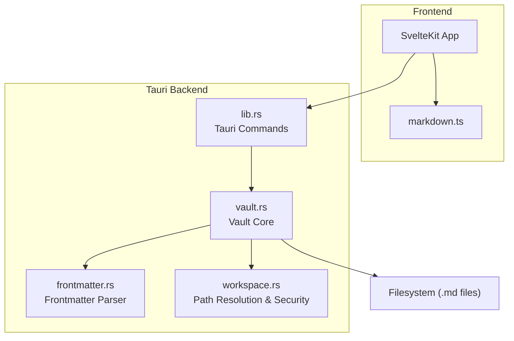
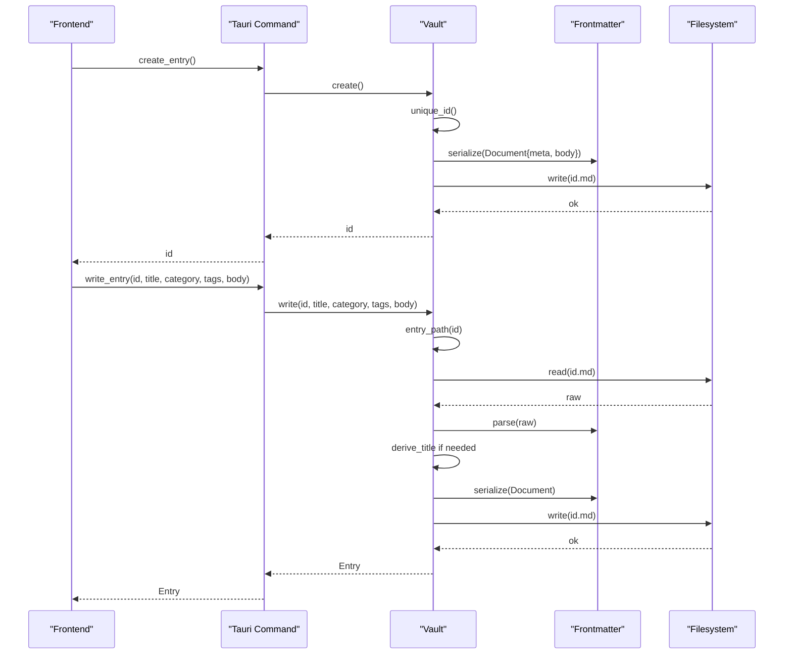
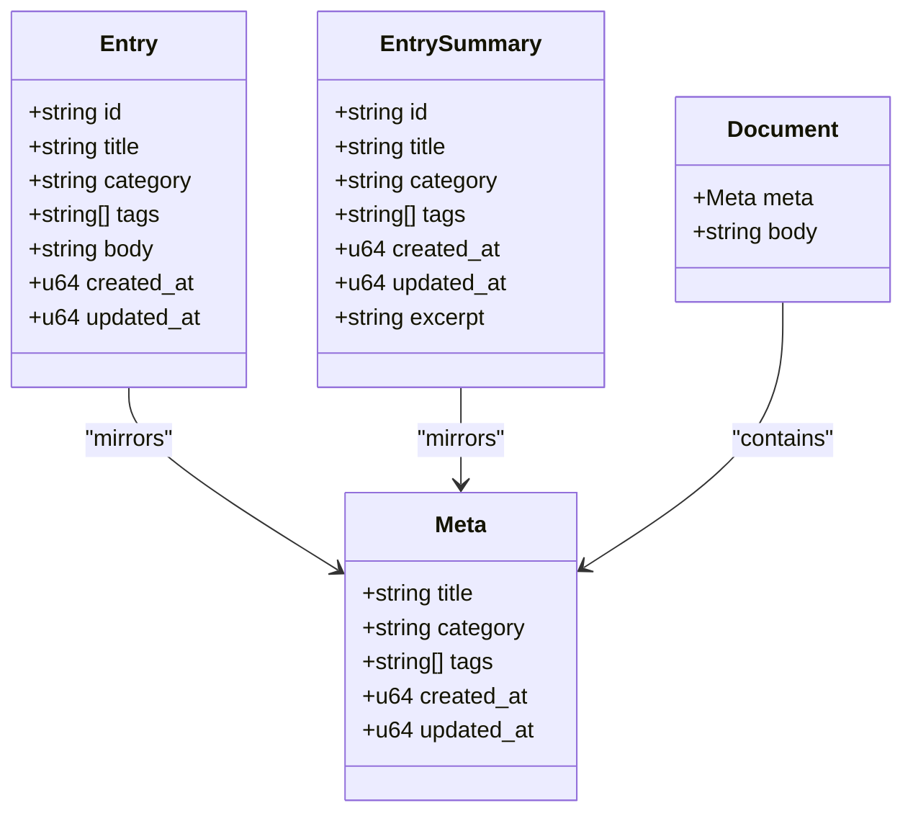
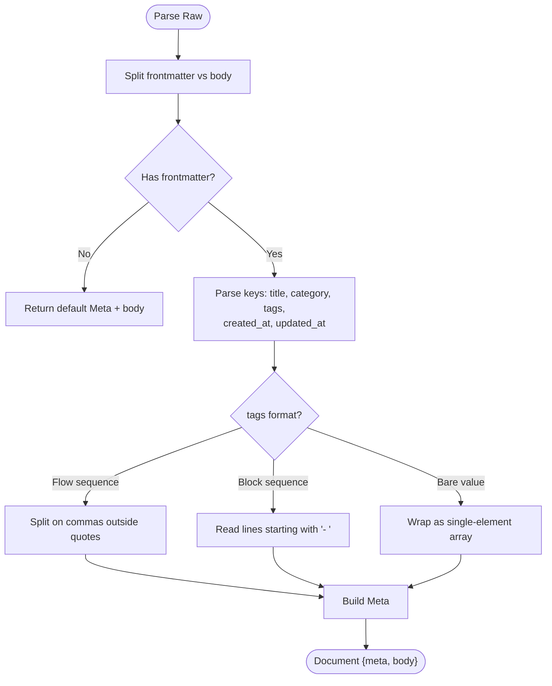
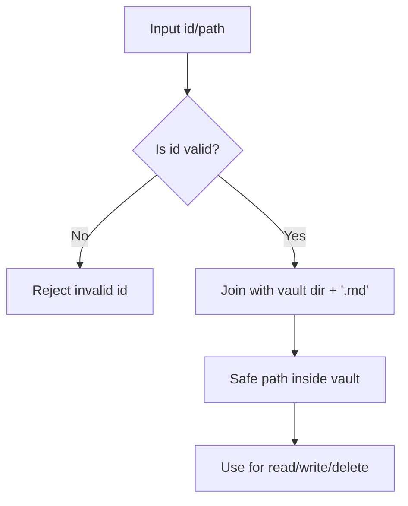
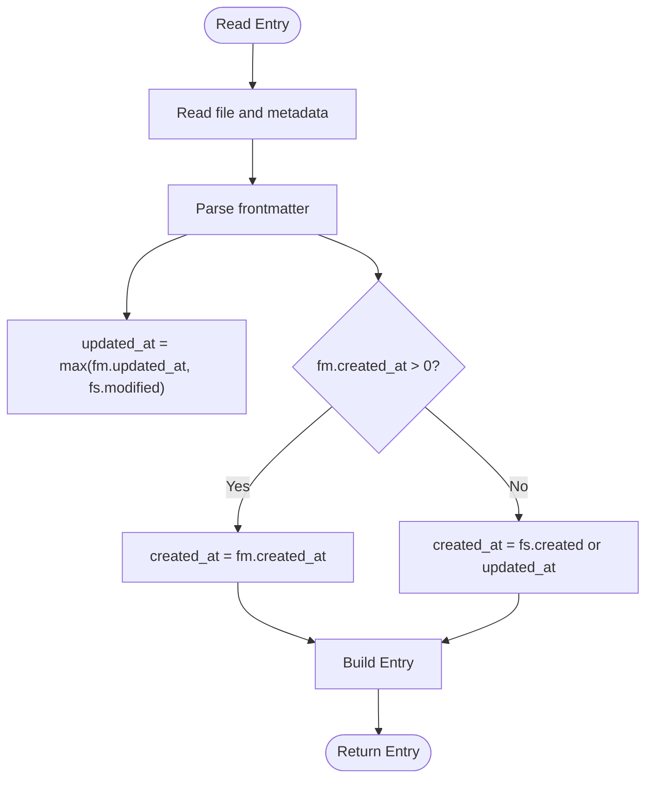
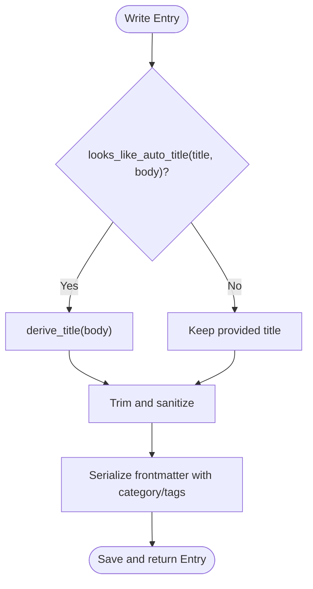
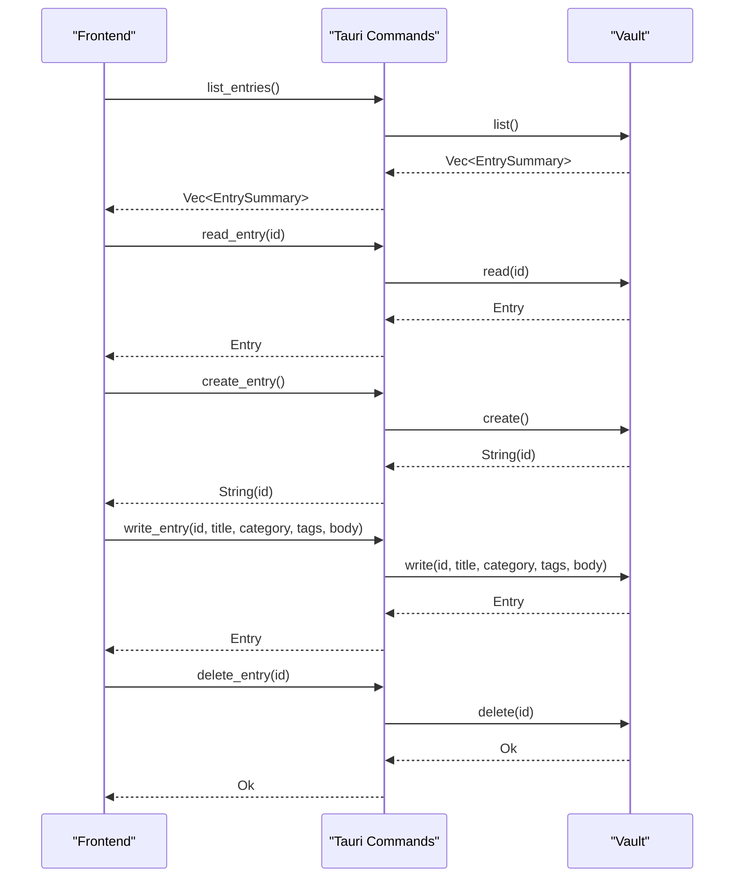
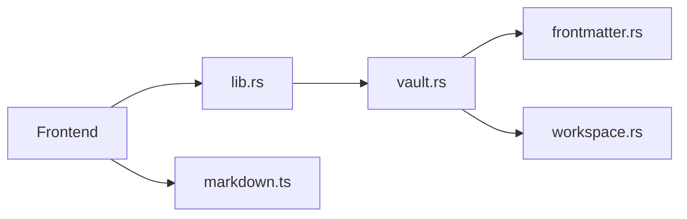

<cite>
**Referenced Files in This Document**
- `apps/fracta/src-tauri/src/vault.rs`
- `apps/fracta/src-tauri/src/frontmatter.rs`
- `apps/fracta/src-tauri/src/lib.rs`
- `apps/fracta/src-tauri/src/workspace.rs`
- `apps/fracta/src/lib/markdown.ts`
- `apps/fracta/src-tauri/tauri.conf.json`
</cite>

## Table of Contents
1. [Introduction](#introduction)
2. [Project Structure](#project-structure)
3. [Core Components](#core-components)
4. [Architecture Overview](#architecture-overview)
5. [Detailed Component Analysis](#detailed-component-analysis)
6. [Dependency Analysis](#dependency-analysis)
7. [Performance Considerations](#performance-considerations)
8. [Troubleshooting Guide](#troubleshooting-guide)
9. [Conclusion](#conclusion)
10. [Appendices](#appendices)

## Introduction
This document describes the Vault Management API for handling markdown entries in a Tauri-based desktop application. The vault is a user-selected folder containing .md files, each representing an entry with YAML frontmatter metadata. The API exposes CRUD operations (create, read, update, delete, list), robust frontmatter parsing, safe path resolution to prevent traversal, and timestamp management. It also includes utilities for title derivation and excerpt generation used by the UI.

## Project Structure
The vault subsystem is implemented in Rust within the Tauri backend and exposed via Tauri commands to the Svelte frontend. Key modules:
- Vault core: file I/O, persistence, id validation, timestamps, listing, and deletion.
- Frontmatter parser: lightweight YAML-like parser for metadata fields and body separation.
- Tauri command layer: binds frontend calls to backend functions.
- Workspace module: shared path resolution and security checks used across features.
- Markdown utilities: TypeScript helpers for frontmatter splitting and HTML conversion.

**Diagram sources**
- `apps/fracta/src-tauri/src/lib.rs#L42-L96`
- `apps/fracta/src-tauri/src/vault.rs#L1-L127`
- `apps/fracta/src-tauri/src/frontmatter.rs#L145-L178`
- `apps/fracta/src-tauri/src/workspace.rs#L143-L173`
- `apps/fracta/src/lib/markdown.ts#L30-L47`

**Section sources**
- `apps/fracta/src-tauri/src/lib.rs#L42-L96`
- `apps/fracta/src-tauri/src/vault.rs#L1-L127`
- `apps/fracta/src-tauri/src/frontmatter.rs#L145-L178`
- `apps/fracta/src-tauri/src/workspace.rs#L143-L173`
- `apps/fracta/src/lib/markdown.ts#L30-L47`

## Core Components
- Entry: Full representation of a single markdown entry including id, title, category, tags, body, created_at, updated_at.
- EntrySummary: Lightweight summary for listing without body content; includes an excerpt preview.
- Vault: Stateful handle managing the selected vault directory and all entry operations.
- Frontmatter: Parser and serializer for YAML-like metadata blocks at the top of .md files.
- Tauri Commands: Thin wrappers exposing Vault methods over IPC.

Key responsibilities:
- Path safety and traversal prevention for ids and workspace paths.
- Timestamps derived from filesystem and persisted in frontmatter when available.
- Title derivation from body when no explicit title is provided.
- Efficient listing by reading only necessary fields and generating excerpts.

**Section sources**
- `apps/fracta/src-tauri/src/vault.rs#L28-L52`
- `apps/fracta/src-tauri/src/frontmatter.rs#L10-L30`
- `apps/fracta/src-tauri/src/lib.rs#L66-L96`

## Architecture Overview
The API follows a layered architecture:
- Frontend invokes Tauri commands via IPC.
- Command handlers delegate to Vault methods.
- Vault validates inputs, resolves paths safely, reads/writes files, and uses the frontmatter module to parse or serialize documents.
- Workspace utilities enforce consistent path containment and security policies.

**Diagram sources**
- `apps/fracta/src-tauri/src/lib.rs#L77-L91`
- `apps/fracta/src-tauri/src/vault.rs#L193-L267`
- `apps/fracta/src-tauri/src/frontmatter.rs#L210-L238`

## Detailed Component Analysis

### Data Models
- Entry: Contains id, title, category, tags, body, created_at, updated_at. Used for full read/write responses.
- EntrySummary: Subset of Entry fields plus excerpt; used for efficient listing.
- Meta: Frontmatter metadata fields: title, category, tags, created_at, updated_at.
- Document: Combines Meta and body string.

**Diagram sources**
- `apps/fracta/src-tauri/src/vault.rs#L28-L52`
- `apps/fracta/src-tauri/src/frontmatter.rs#L10-L30`

**Section sources**
- `apps/fracta/src-tauri/src/vault.rs#L28-L52`
- `apps/fracta/src-tauri/src/frontmatter.rs#L10-L30`

### Frontmatter Parsing and Serialization
- Parser splits raw text into frontmatter block and body, tolerating BOM and CRLF.
- Supports scalar values with quotes, flow sequences for tags, and block sequences.
- Serializer writes minimal frontmatter, omitting empty optional fields and quoting scalars when required.
- Title derivation extracts the first meaningful line, strips heading markers and emphasis, and caps length with ellipsis.
- Auto-title detection recognizes legacy and current auto-generated titles to avoid overwriting custom titles.

**Diagram sources**
- `apps/fracta/src-tauri/src/frontmatter.rs#L38-L64`
- `apps/fracta/src-tauri/src/frontmatter.rs#L117-L139`
- `apps/fracta/src-tauri/src/frontmatter.rs#L145-L178`

**Section sources**
- `apps/fracta/src-tauri/src/frontmatter.rs#L38-L64`
- `apps/fracta/src-tauri/src/frontmatter.rs#L117-L139`
- `apps/fracta/src-tauri/src/frontmatter.rs#L145-L178`
- `apps/fracta/src-tauri/src/frontmatter.rs#L210-L238`
- `apps/fracta/src-tauri/src/frontmatter.rs#L258-L290`

### Path Validation and Security
- Entry ids are validated to be bare file stems without separators, parent references, NUL characters, or dot-prefixes.
- Workspace paths are resolved relative to the vault root, rejecting absolute paths, traversal components, and symlinks escaping the root.
- All operations remain confined to the chosen vault directory.

**Diagram sources**
- `apps/fracta/src-tauri/src/vault.rs#L115-L126`
- `apps/fracta/src-tauri/src/workspace.rs#L143-L173`

**Section sources**
- `apps/fracta/src-tauri/src/vault.rs#L115-L126`
- `apps/fracta/src-tauri/src/workspace.rs#L143-L173`

### Timestamp Management
- created_at and updated_at are stored in milliseconds since epoch.
- On read, updated_at is the maximum of frontmatter timestamp and filesystem modification time; created_at prefers frontmatter, else falls back to filesystem creation time or updated_at.
- On write, created_at is preserved from existing metadata or filesystem; updated_at is set to current time.

**Diagram sources**
- `apps/fracta/src-tauri/src/vault.rs#L159-L189`
- `apps/fracta/src-tauri/src/vault.rs#L313-L332`

**Section sources**
- `apps/fracta/src-tauri/src/vault.rs#L159-L189`
- `apps/fracta/src-tauri/src/vault.rs#L313-L332`

### Title Derivation and Metadata Handling
- If title appears auto-generated (empty or matches cleaned body or truncated version), it is replaced by a compact derived title.
- Category and tags are trimmed and filtered; empty tags are omitted from serialization.
- Excerpt is generated from the first non-empty line, stripping leading markdown heading markers and limiting length.

**Diagram sources**
- `apps/fracta/src-tauri/src/vault.rs#L212-L267`
- `apps/fracta/src-tauri/src/frontmatter.rs#L258-L290`
- `apps/fracta/src-tauri/src/vault.rs#L293-L301`

**Section sources**
- `apps/fracta/src-tauri/src/vault.rs#L212-L267`
- `apps/fracta/src-tauri/src/frontmatter.rs#L258-L290`
- `apps/fracta/src-tauri/src/vault.rs#L293-L301`

### Tauri Command API Surface
Exposed commands for vault operations:
- vault_status: Returns configured status and path.
- pick_vault: Opens native folder picker and persists selection.
- list_entries: Returns Vec<EntrySummary>.
- read_entry: Returns Entry by id.
- create_entry: Creates new entry and returns id.
- write_entry: Updates entry fields and returns Entry.
- delete_entry: Deletes entry by id.

**Diagram sources**
- `apps/fracta/src-tauri/src/lib.rs#L42-L96`
- `apps/fracta/src-tauri/src/vault.rs#L128-L278`

**Section sources**
- `apps/fracta/src-tauri/src/lib.rs#L42-L96`
- `apps/fracta/src-tauri/src/vault.rs#L128-L278`

### Frontend Markdown Utilities
- splitFrontmatter: Parses YAML-like frontmatter into fields and body for presentation.
- splitMarkdownDocument: Returns frontmatter fields, body, and original prefix for editor integration.
- htmlToMarkdown: Converts editor HTML back to portable markdown using Turndown.

These utilities ensure the editor preserves YAML structure and handles Fracta-specific syntax safely.

**Section sources**
- `apps/fracta/src/lib/markdown.ts#L30-L47`
- `apps/fracta/src/lib/markdown.ts#L203-L207`

## Dependency Analysis
- lib.rs registers Tauri commands and manages state (Vault, AutoTag, GgufEngine).
- vault.rs depends on frontmatter.rs for parsing/serialization and std::fs for I/O.
- workspace.rs provides reusable path resolution and security checks used by other features.
- markdown.ts is independent frontend utility for markdown ↔ HTML conversions.

**Diagram sources**
- `apps/fracta/src-tauri/src/lib.rs#L1-L22`
- `apps/fracta/src-tauri/src/vault.rs#L1-L12`
- `apps/fracta/src-tauri/src/workspace.rs#L1-L18`

**Section sources**
- `apps/fracta/src-tauri/src/lib.rs#L1-L22`
- `apps/fracta/src-tauri/src/vault.rs#L1-L12`
- `apps/fracta/src-tauri/src/workspace.rs#L1-L18`

## Performance Considerations
- Listing entries avoids loading full bodies; only metadata and short excerpts are computed.
- Sorting by updated_at ensures newest-first ordering efficiently.
- Unique id generation uses base36 encoding of epoch millis with collision suffixing to minimize collisions.
- Filesystem operations are synchronous but bounded by small per-entry payloads; large vaults benefit from incremental updates and caching on the frontend.

[No sources needed since this section provides general guidance]

## Troubleshooting Guide
Common issues and resolutions:
- Invalid entry id errors: Ensure ids contain no path separators, parent references, NUL characters, or dot-prefixes.
- Could not read/save entry: Verify vault folder is set and accessible; check permissions.
- JSON/CSV validation failures: For workspace writes, ensure JSON is valid and CSV has balanced quotes and consistent headers.
- Symlink traversal blocked: Paths must resolve within the vault root; remove or adjust symlinks that escape the root.
- Encoding issues: Only UTF-8, UTF-8 BOM, and UTF-16 encodings are supported for editing; other encodings are read-only.

**Section sources**
- `apps/fracta/src-tauri/src/vault.rs#L115-L126`
- `apps/fracta/src-tauri/src/workspace.rs#L143-L173`
- `apps/fracta/src-tauri/src/workspace.rs#L470-L512`

## Conclusion
The Vault Management API provides a secure, efficient, and developer-friendly interface for managing markdown entries with rich metadata. It enforces strict path safety, robust frontmatter parsing, and sensible defaults for titles and timestamps. The Tauri command layer cleanly exposes functionality to the frontend while maintaining strong isolation and control over filesystem access.

[No sources needed since this section summarizes without analyzing specific files]

## Appendices

### API Reference Summary
- Create Entry
  - Input: None
  - Output: id (string)
  - Behavior: Generates unique id, writes initial frontmatter with timestamps, returns id.
- Read Entry
  - Input: id (string)
  - Output: Entry
  - Behavior: Reads file, parses frontmatter, computes timestamps, derives title if needed.
- Update Entry
  - Input: id, title, category, tags[], body
  - Output: Entry
  - Behavior: Validates id, preserves created_at, updates updated_at, serializes frontmatter.
- Delete Entry
  - Input: id (string)
  - Output: Ok
  - Behavior: Moves to OS trash or hard deletes if unavailable.
- List Entries
  - Input: None
  - Output: Vec<EntrySummary>
  - Behavior: Scans vault for .md files, parses frontmatter, generates excerpts, sorts by updated_at.

**Section sources**
- `apps/fracta/src-tauri/src/lib.rs#L66-L96`
- `apps/fracta/src-tauri/src/vault.rs#L128-L278`

### Security Measures
- Path traversal prevention for ids and workspace paths.
- Symlink containment checks to prevent escaping the vault root.
- CSP configuration restricts script and object sources.
- Input sanitization for tags and categories; trimming and filtering empty values.

**Section sources**
- `apps/fracta/src-tauri/src/vault.rs#L115-L126`
- `apps/fracta/src-tauri/src/workspace.rs#L143-L173`
- `apps/fracta/src-tauri/tauri.conf.json#L32-L34`