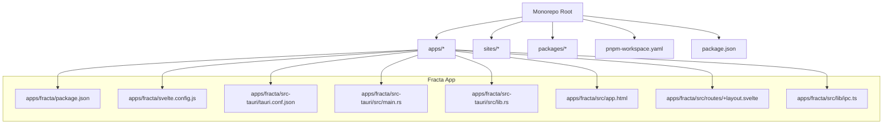
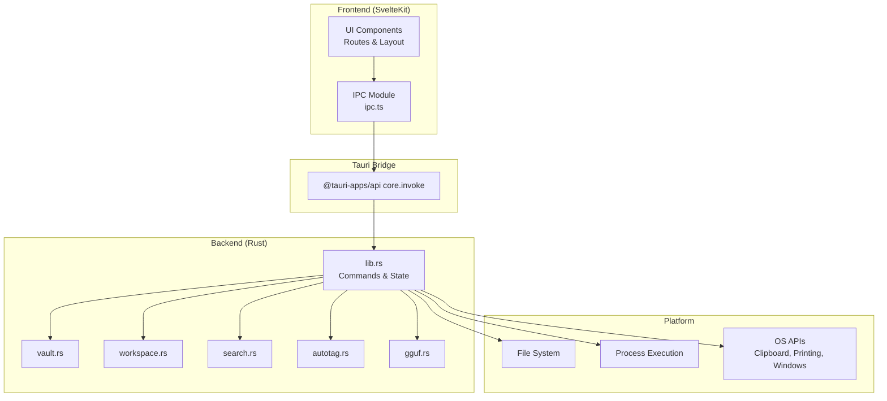
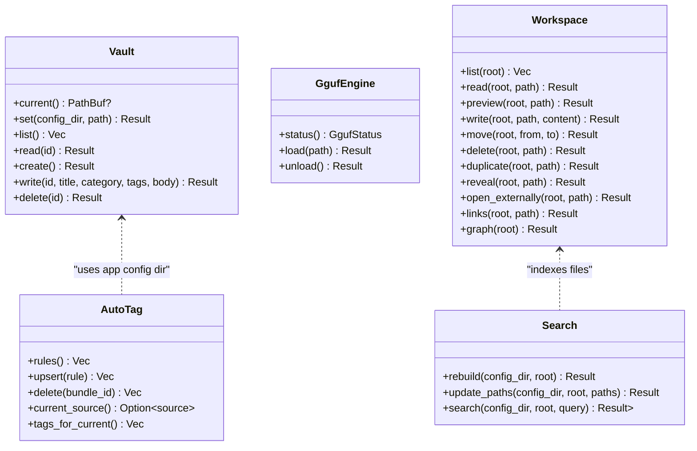
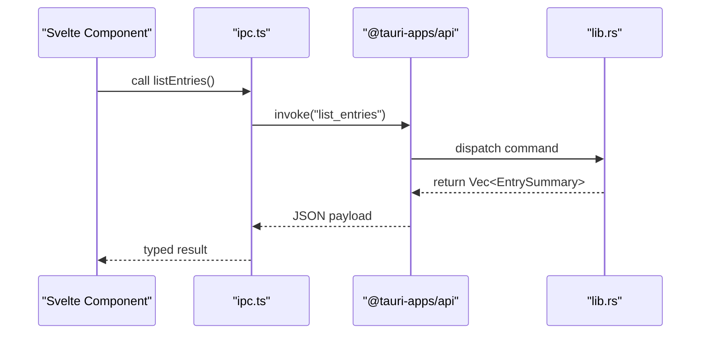
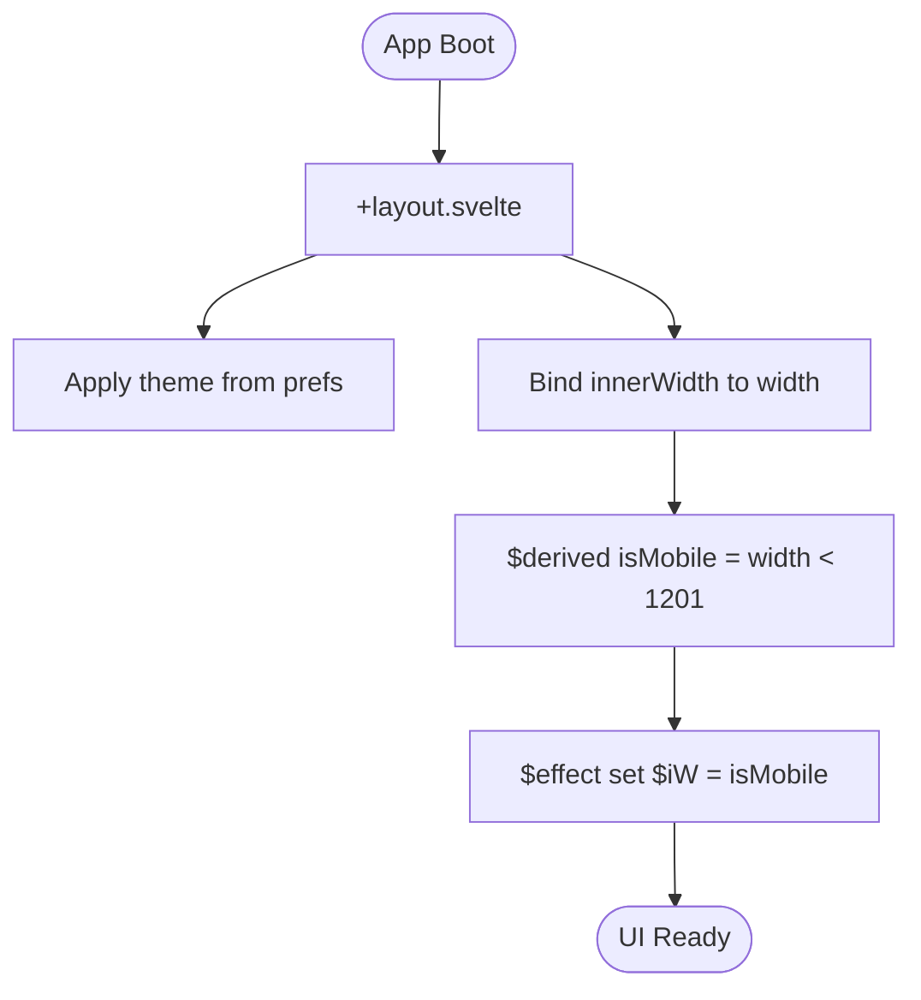
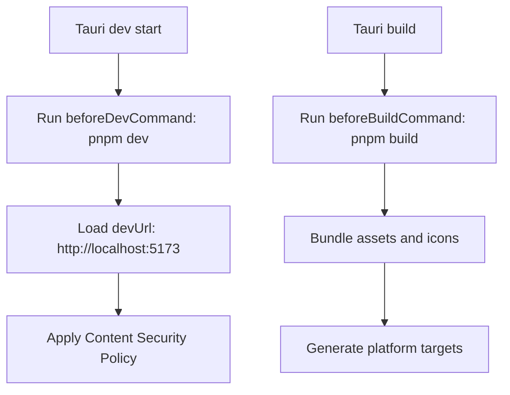
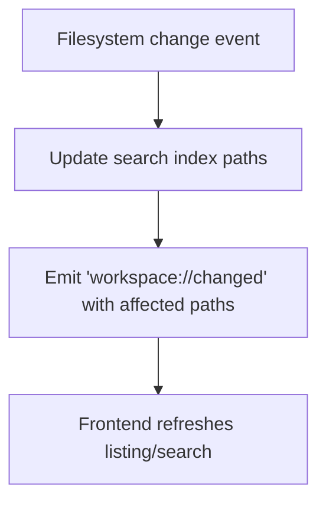
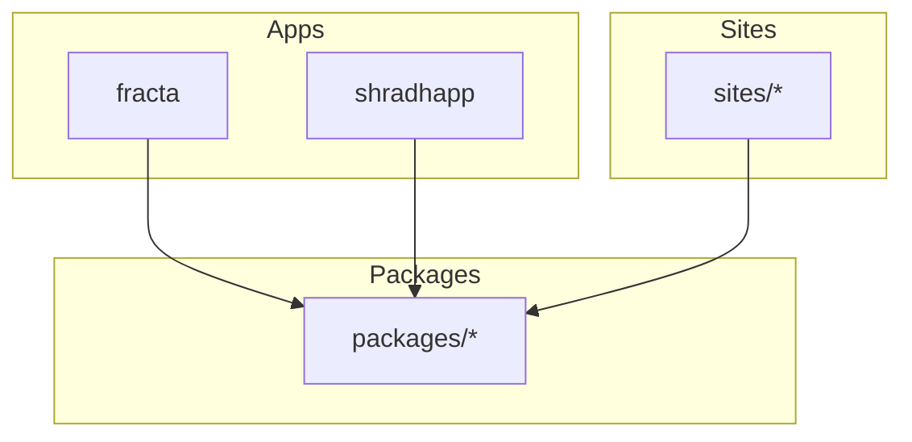
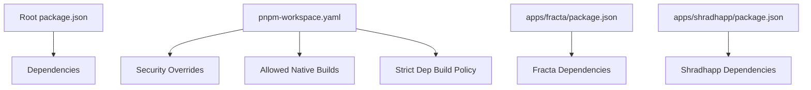

<cite>
**Referenced Files in This Document**
- [package.json](../../../package.json)
- [pnpm-workspace.yaml](../../../pnpm-workspace.yaml)
- [README.md](../../../README.md)
- [apps/fracta/package.json](../../../apps/fracta/package.json)
- [apps/fracta/svelte.config.js](../../../apps/fracta/svelte.config.js)
- [apps/fracta/src-tauri/Cargo.toml](../../../apps/fracta/src-tauri/Cargo.toml)
- [apps/fracta/src-tauri/tauri.conf.json](../../../apps/fracta/src-tauri/tauri.conf.json)
- [apps/fracta/src-tauri/src/main.rs](../../../apps/fracta/src-tauri/src/main.rs)
- [apps/fracta/src-tauri/src/lib.rs](../../../apps/fracta/src-tauri/src/lib.rs)
- [apps/fracta/src/app.html](../../../apps/fracta/src/app.html)
- [apps/fracta/src/routes/+layout.svelte](../../../apps/fracta/src/routes/+layout.svelte)
- [apps/fracta/src/lib/ipc.ts](../../../apps/fracta/src/lib/ipc.ts)
- [apps/shradhapp/package.json](../../../apps/shradhapp/package.json)
</cite>

## Table of Contents
1. [Introduction](#introduction)
2. [Project Structure](#project-structure)
3. [Core Components](#core-components)
4. [Architecture Overview](#architecture-overview)
5. [Detailed Component Analysis](#detailed-component-analysis)
6. [Dependency Analysis](#dependency-analysis)
7. [Performance Considerations](#performance-considerations)
8. [Troubleshooting Guide](#troubleshooting-guide)
9. [Conclusion](#conclusion)
10. [Appendices](#appendices)

## Introduction
This document describes the architecture and design of the Fractals monorepo, focusing on:
- Tauri-based desktop applications (Rust backend + SvelteKit frontend)
- Svelte 5 runes-driven component architecture
- Monorepo organization with pnpm workspaces
- Cross-cutting concerns: security, file system operations, IPC patterns
- Infrastructure requirements, scalability considerations, and deployment topology

The stack is SvelteKit + Svelte 5 + Tauri + TypeScript, with exclusive single-tab indented SASS styling. The monorepo hosts multiple apps, sites, and packages under a unified workspace.

**Section sources**
- [README.md:1-50](../../../README.md#L1-L50)
- [package.json:1-36](../../../package.json#L1-L36)

## Project Structure
The repository is a pnpm monorepo containing:
- apps/: Desktop applications built with Tauri and SvelteKit (e.g., fracta, shradhapp)
- sites/: Documentation and content sites using SvelteKit
- packages/: Shared libraries and UI components
- Root configuration for workspace, scripts, and dependency overrides

**Diagram sources**
- [pnpm-workspace.yaml:1-29](../../../pnpm-workspace.yaml#L1-L29)
- [package.json:1-36](../../../package.json#L1-L36)
- [apps/fracta/package.json:1-60](../../../apps/fracta/package.json#L1-L60)
- [apps/fracta/svelte.config.js:1-23](../../../apps/fracta/svelte.config.js#L1-L23)
- [apps/fracta/src-tauri/tauri.conf.json:1-48](../../../apps/fracta/src-tauri/tauri.conf.json#L1-L48)
- [apps/fracta/src-tauri/src/main.rs:1-7](../../../apps/fracta/src-tauri/src/main.rs#L1-L7)
- [apps/fracta/src-tauri/src/lib.rs:1-498](../../../apps/fracta/src-tauri/src/lib.rs#L1-L498)
- [apps/fracta/src/app.html:1-14](../../../apps/fracta/src/app.html#L1-L14)
- [apps/fracta/src/routes/+layout.svelte:1-29](../../../apps/fracta/src/routes/+layout.svelte#L1-L29)
- [apps/fracta/src/lib/ipc.ts:1-237](../../../apps/fracta/src/lib/ipc.ts#L1-L237)

**Section sources**
- [pnpm-workspace.yaml:1-29](../../../pnpm-workspace.yaml#L1-L29)
- [package.json:1-36](../../../package.json#L1-L36)
- [README.md:1-50](../../../README.md#L1-L50)

## Core Components
- Tauri Backend (Rust): Native capabilities including file system access, process execution, clipboard monitoring, and local model server management. Exposed via typed commands to the frontend.
- SvelteKit Frontend: SPA rendered by Tauri’s webview; uses Svelte 5 runes for reactive state and effects.
- IPC Layer: A thin TypeScript module wrapping @tauri-apps/api invoke calls to Rust commands with strongly-typed interfaces.
- Configuration: Tauri config defines windowing, CSP, and build hooks; Svelte config enables runes globally except node_modules.

Key responsibilities:
- Vault and workspace CRUD operations
- File watching and search indexing
- Terminal command execution with bounded runtime and output size
- Auto-tagging rules based on clipboard source
- Local GGUF engine lifecycle management

**Section sources**
- [apps/fracta/src-tauri/src/lib.rs:1-498](../../../apps/fracta/src-tauri/src/lib.rs#L1-L498)
- [apps/fracta/src/lib/ipc.ts:1-237](../../../apps/fracta/src/lib/ipc.ts#L1-L237)
- [apps/fracta/svelte.config.js:1-23](../../../apps/fracta/svelte.config.js#L1-L23)
- [apps/fracta/src-tauri/tauri.conf.json:1-48](../../../apps/fracta/src-tauri/tauri.conf.json#L1-L48)

## Architecture Overview
The system follows a layered architecture:
- Presentation layer: SvelteKit routes and components render UI within Tauri’s webview.
- Application layer: IPC module translates UI actions into Tauri commands.
- Domain layer: Rust modules implement vault, workspace, search, auto-tagging, and GGUF engine logic.
- Platform layer: Tauri provides OS integrations (file dialogs, printing, window state).

**Diagram sources**
- [apps/fracta/src/routes/+layout.svelte:1-29](../../../apps/fracta/src/routes/+layout.svelte#L1-L29)
- [apps/fracta/src/lib/ipc.ts:1-237](../../../apps/fracta/src/lib/ipc.ts#L1-L237)
- [apps/fracta/src-tauri/src/lib.rs:1-498](../../../apps/fracta/src-tauri/src/lib.rs#L1-L498)

## Detailed Component Analysis

### Tauri Backend (Rust)
- Entry point initializes Tauri builder, manages global state (Vault, AutoTag, GgufEngine), registers commands, and starts watchers.
- Commands expose:
  - Vault operations: status, pick, list, read, create, write, delete
  - Workspace operations: list, read, preview, write, move, delete, duplicate, reveal, open externally, links, graph, index rebuild, search
  - Utilities: CSV/JSON conversion, terminal execution, print
  - Auto-tagging: rule management and clipboard source detection
  - GGUF engine: load/unload and status

**Diagram sources**
- [apps/fracta/src-tauri/src/lib.rs:1-498](../../../apps/fracta/src-tauri/src/lib.rs#L1-L498)

**Section sources**
- [apps/fracta/src-tauri/src/main.rs:1-7](../../../apps/fracta/src-tauri/src/main.rs#L1-L7)
- [apps/fracta/src-tauri/src/lib.rs:1-498](../../../apps/fracta/src-tauri/src/lib.rs#L1-L498)

### IPC Layer (TypeScript)
- Provides type-safe wrappers around Tauri commands.
- Detects runtime environment (Tauri vs browser dev).
- Defines interfaces for all payloads and responses used across the app.

**Diagram sources**
- [apps/fracta/src/lib/ipc.ts:1-237](../../../apps/fracta/src/lib/ipc.ts#L1-L237)
- [apps/fracta/src-tauri/src/lib.rs:1-498](../../../apps/fracta/src-tauri/src/lib.rs#L1-L498)

**Section sources**
- [apps/fracta/src/lib/ipc.ts:1-237](../../../apps/fracta/src/lib/ipc.ts#L1-L237)

### SvelteKit Frontend
- Uses Svelte 5 runes ($state, $derived, $effect) for reactive state and side effects.
- Global layout sets theme and responsive width signals.
- Static adapter configured to avoid overwriting prerendered index during builds.

**Diagram sources**
- [apps/fracta/src/routes/+layout.svelte:1-29](../../../apps/fracta/src/routes/+layout.svelte#L1-L29)
- [apps/fracta/svelte.config.js:1-23](../../../apps/fracta/svelte.config.js#L1-L23)

**Section sources**
- [apps/fracta/src/routes/+layout.svelte:1-29](../../../apps/fracta/src/routes/+layout.svelte#L1-L29)
- [apps/fracta/svelte.config.js:1-23](../../../apps/fracta/svelte.config.js#L1-L23)

### Tauri Configuration and Security
- Window settings define default size, minimization constraints, and overlay title bar.
- CSP restricts script/style/image/connect sources to self and allowed domains.
- Build hooks integrate Vite dev/build with Tauri lifecycle.

**Diagram sources**
- [apps/fracta/src-tauri/tauri.conf.json:1-48](../../../apps/fracta/src-tauri/tauri.conf.json#L1-L48)

**Section sources**
- [apps/fracta/src-tauri/tauri.conf.json:1-48](../../../apps/fracta/src-tauri/tauri.conf.json#L1-L48)

### Data Persistence and File Operations
- SQLite via rusqlite is available in dependencies; current Rust code focuses on file-based vault/workspace operations and search indexing.
- File watching uses notify to emit events for incremental search updates.
- Process execution runs shell commands with bounded runtime and output truncation.

**Diagram sources**
- [apps/fracta/src-tauri/src/lib.rs:134-165](../../../apps/fracta/src-tauri/src/lib.rs#L134-L165)

**Section sources**
- [apps/fracta/src-tauri/Cargo.toml:1-44](../../../apps/fracta/src-tauri/Cargo.toml#L1-L44)
- [apps/fracta/src-tauri/src/lib.rs:134-165](../../../apps/fracta/src-tauri/src/lib.rs#L134-L165)

### Cross-App and Site Interactions
- Apps share common patterns: SvelteKit + Tauri, IPC via @tauri-apps/api, and package manager scripts.
- Sites are independent SvelteKit projects that can reuse shared packages from packages/.
- Example: shradhapp uses similar Tauri CLI integration and Svelte 5 ecosystem.

**Diagram sources**
- [apps/fracta/package.json:1-60](../../../apps/fracta/package.json#L1-L60)
- [apps/shradhapp/package.json:1-48](../../../apps/shradhapp/package.json#L1-L48)
- [pnpm-workspace.yaml:1-29](../../../pnpm-workspace.yaml#L1-L29)

**Section sources**
- [apps/fracta/package.json:1-60](../../../apps/fracta/package.json#L1-L60)
- [apps/shradhapp/package.json:1-48](../../../apps/shradhapp/package.json#L1-L48)
- [pnpm-workspace.yaml:1-29](../../../pnpm-workspace.yaml#L1-L29)

## Dependency Analysis
- Workspace-level dependency overrides enforce security patches (dompurify, esbuild, js-yaml).
- Sharp is blocked by policy; other native builds are explicitly allowed.
- Each app declares its own dependencies; shared packages are referenced via workspace resolution.

**Diagram sources**
- [package.json:1-36](../../../package.json#L1-L36)
- [pnpm-workspace.yaml:1-29](../../../pnpm-workspace.yaml#L1-L29)
- [apps/fracta/package.json:1-60](../../../apps/fracta/package.json#L1-L60)
- [apps/shradhapp/package.json:1-48](../../../apps/shradhapp/package.json#L1-L48)

**Section sources**
- [package.json:1-36](../../../package.json#L1-L36)
- [pnpm-workspace.yaml:1-29](../../../pnpm-workspace.yaml#L1-L29)

## Performance Considerations
- File watching avoids full rescans by updating indexes incrementally on filesystem events.
- Terminal output is bounded to prevent memory spikes; long-running processes are killed after timeout.
- Svelte 5 runes minimize unnecessary re-renders through fine-grained reactivity.
- Static adapter ensures minimal runtime overhead in production builds.

[No sources needed since this section provides general guidance]

## Troubleshooting Guide
- CSP errors: Verify allowed connect-src and style-src directives in Tauri config.
- IPC failures: Ensure commands are registered in lib.rs and invoked with correct names and parameters.
- File watcher issues: Confirm workspace root is valid and notify watcher has permissions.
- Terminal timeouts: Check MAX_RUNTIME and output size limits; inspect stderr for command errors.
- Theme application: Validate prefs store and dataset assignment in layout.

**Section sources**
- [apps/fracta/src-tauri/tauri.conf.json:32-34](../../../apps/fracta/src-tauri/tauri.conf.json#L32-L34)
- [apps/fracta/src-tauri/src/lib.rs:193-267](../../../apps/fracta/src-tauri/src/lib.rs#L193-L267)
- [apps/fracta/src/routes/+layout.svelte:16-20](../../../apps/fracta/src/routes/+layout.svelte#L16-L20)

## Conclusion
The Fractals monorepo adopts a robust Tauri + SvelteKit architecture with clear separation between UI, IPC, and native capabilities. Svelte 5 runes provide efficient state management, while Rust handles secure and performant file operations, search indexing, and OS integrations. The pnpm workspace enables consistent dependency management and shared packages across apps and sites. Security is enforced via CSP and dependency overrides, and performance is optimized through incremental updates and bounded resource usage.

[No sources needed since this section summarizes without analyzing specific files]

## Appendices
- Infrastructure Requirements: Node.js (via pnpm), Rust toolchain for Tauri builds, platform-specific SDKs for packaging.
- Deployment Topology: Tauri bundles static SvelteKit builds into native installers; sites deploy independently as static or SSR depending on needs.
- Scalability Considerations: Modular Rust crates allow scaling domain logic; IPC boundaries keep UI decoupled from heavy operations.

[No sources needed since this section provides general guidance]
